# Tutorial: Build your first Azure data factory by using the Azure portal
> [!div class="op_single_selector"]
> * [Overview and prerequisites](data-factory-build-your-first-pipeline.md)
> * [Azure portal](data-factory-build-your-first-pipeline-using-editor.md)
> * [Visual Studio](data-factory-build-your-first-pipeline-using-vs.md)
> * [PowerShell](data-factory-build-your-first-pipeline-using-powershell.md)
> * [Resource Manager Template](data-factory-build-your-first-pipeline-using-arm.md)
> * [REST API](data-factory-build-your-first-pipeline-using-rest-api.md)


> [!NOTE]
> This article applies to version 1 of Azure Data Factory, which is generally available. If you're using version 2 of the Data Factory service, which is in preview, see [Quickstart: Create a data factory by using Azure Data Factory version 2](../quickstart-create-data-factory-dot-net.md).

In this article, you learn how to use the [Azure portal](https://portal.azure.com/) to create your first Azure data factory. To do the tutorial by using other tools/SDKs, select one of the options from the drop-down list. 

The pipeline in this tutorial has one activity: HDInsight Hive activity. This activity runs a hive script on an Azure HDInsight cluster that transforms input data to produce output data. The pipeline is scheduled to run once a month between the specified start and end times. 

> [!NOTE]
> The data pipeline in this tutorial transforms input data to produce output data. For a tutorial on how to copy data by using Data Factory, see [Tutorial: Copy data from Azure Blob storage to Azure SQL Database](data-factory-copy-data-from-azure-blob-storage-to-sql-database.md).
> 
> A pipeline can have more than one activity. And, you can chain two activities (run one activity after another) by setting the output dataset of one activity as the input dataset of the other activity. For more information, see [Scheduling and execution in Data Factory](data-factory-scheduling-and-execution.md#multiple-activities-in-a-pipeline).

## Prerequisites
1. Read through the [Tutorial overview](data-factory-build-your-first-pipeline.md) article, and complete the **prerequisite** steps.

2. This article doesn't provide a conceptual overview of the Data Factory service. We recommend that you go through the [Introduction to Azure Data Factory](data-factory-introduction.md) article for a detailed overview of the service.  

## Create a data factory
A data factory can have one or more pipelines. A pipeline can have one or more activities in it. For example, a Copy Activity to copy data from a source to a destination data store and a HDInsight Hive activity to run a Hive script to transform input data to product output data. Let's start with creating the data factory in this step.

1. Log in to the [Azure portal](https://portal.azure.com/).

2. Select **New** > **Data + Analytics** > **Data Factory**.

   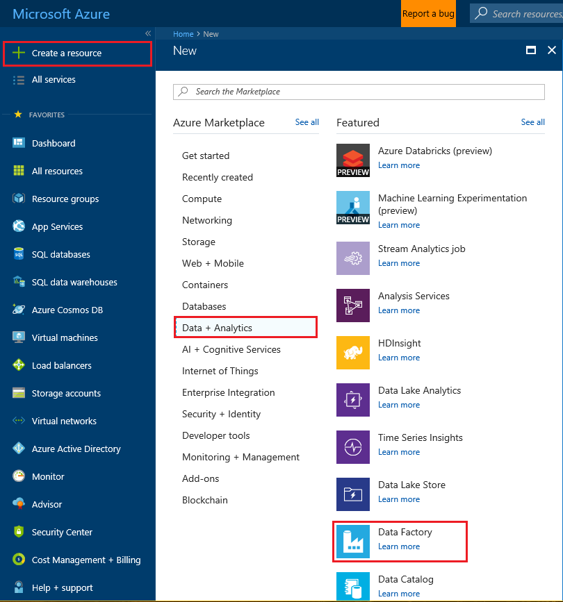

3. On **New data factory**, enter **GetStartedDF** for the name.

   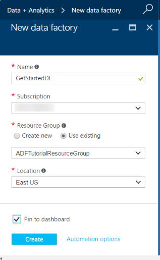

   > [!IMPORTANT]
   > The name of the Azure data factory must be globally unique. If you receive the error "Data factory name GetStartedDF is not available." Change the name of the data factory (for example, yournameGetStartedDF) and try creating again. For more information, see [Data Factory - Naming Rules](data-factory-naming-rules.md) for naming rules for Data Factory artifacts.
   >
   > The name of the data factory might be registered as a **DNS** name in the future, and it might become publically visible.
   >
   >
4. Select the **Azure subscription** where you want the data factory to be created.

5. Select an existing resource group or create a resource group. For the tutorial, create a resource group named **ADFGetStartedRG**.

6. Select the **location** for the data factory. Only regions supported by the Data Factory service are shown in the drop-down list.

7. Select **Pin to dashboard**.

8. On **New data factory**, select **Create**.

   > [!IMPORTANT]
   > To create Data Factory instances, you must be a member of the [Data Factory contributor](../../active-directory/role-based-access-built-in-roles.md#data-factory-contributor) role at the subscription/resource group level.
   >
   >
9. On the dashboard, you see the following tile with the status **Deploying Data Factory**:    

   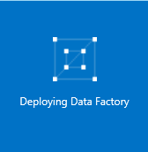

10. After the data factory is created, you see the data factory page, which shows you the contents of the data factory.     

    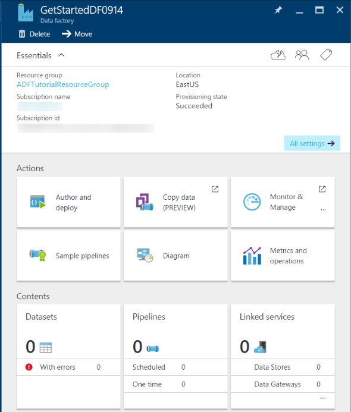

Before you create a pipeline in the data factory, you need to create a few Data Factory entities first. You first create linked services to link data stores/computes to your data store, define input and output datasets to represent input/output data in linked data stores, and then create the pipeline with an activity that uses these datasets.

## Create linked services
In this step, you link your Azure Storage account and an on-demand HDInsight cluster to your data factory. The Storage account holds the input and output data for the pipeline in this sample. The HDInsight linked service is used to run a Hive script specified in the activity of the pipeline in this sample. Identify what [data store](data-factory-data-movement-activities.md)/[compute services](data-factory-compute-linked-services.md) are used in your scenario and link those services to the data factory by creating linked services.  

### Create a Storage linked service
In this step, you link your Azure Storage account to your data factory. In this tutorial, you use the same Azure Storage account to store input/output data and the HQL script file.

1. On the **Data Factory** blade for **GetStartedDF**, select **Author and deploy**. You see the Data Factory Editor.

   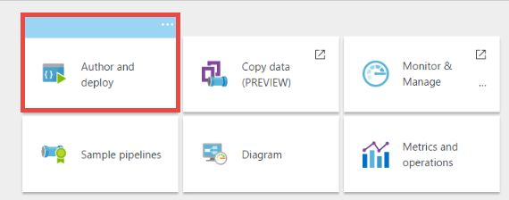

2. Select **New data store**, and choose **Azure storage**.

   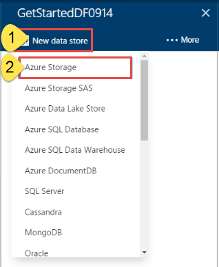

3. You see the JSON script for creating a Storage linked service in the editor.

   

4. Replace **account name** with the name of your Storage account and **account key** with the access key of the Storage account. To learn how to get your storage access key, see the information about how to view, copy, and regenerate storage access keys in [Manage your storage account](../../storage/common/storage-create-storage-account.md#manage-your-storage-account).

5. Select **Deploy** on the command bar to deploy the linked service.

    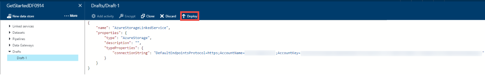

   After the linked service is deployed successfully, the **Draft-1** window disappears and you see **AzureStorageLinkedService** in the tree view on the left.

    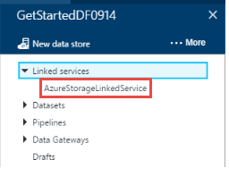    

### Create an HDInsight linked service
In this step, you link an on-demand HDInsight cluster to your data factory. The HDInsight cluster is automatically created at runtime and deleted after it is done processing and idle for the specified amount of time.

1. In the **Data Factory Editor**, select **More** > **New compute** > **On-demand HDInsight cluster**.

    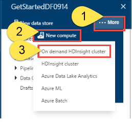

2. Copy and paste the following snippet to the **Draft-1** window. The JSON snippet describes the properties that are used to create the HDInsight cluster on demand.

	```JSON
    {
        "name": "HDInsightOnDemandLinkedService",
        "properties": {
            "type": "HDInsightOnDemand",
            "typeProperties": {
			    "version": "3.5",
                "clusterSize": 1,
			    "timeToLive": "00:05:00",
                "osType": "Linux",
			    "linkedServiceName": "AzureStorageLinkedService"
            }
        }
    }
	```

    The following table provides descriptions for the JSON properties used in the snippet.

   | Property | Description |
   |:--- |:--- |
   | ClusterSize |Specifies the size of the HDInsight cluster. |
   | TimeToLive | Specifies that the idle time for the HDInsight cluster, before it's deleted. |
   | linkedServiceName | Specifies the storage account that is used to store the logs that are generated by HDInsight. |

    Note the following points:

   * The data factory creates a Linux-based HDInsight cluster for you with the JSON. See [On-demand HDInsight Linked Service](data-factory-compute-linked-services.md#azure-hdinsight-on-demand-linked-service) for details.
   * You can use your own HDInsight cluster instead of using an on-demand HDInsight cluster. For more information, see [HDInsight Linked Service](data-factory-compute-linked-services.md#azure-hdinsight-linked-service).
   * The HDInsight cluster creates a default container in the blob storage you specified in the JSON (**linkedServiceName**). HDInsight doesn't delete this container when the cluster is deleted. This behavior is by design. With on-demand HDInsight linked service, a HDInsight cluster is created every time a slice is processed unless there is an existing live cluster (**timeToLive**). The cluster is automatically deleted when the processing is done.

       As more slices are processed, you see many containers in your Blob storage. If you don't need them for troubleshooting of the jobs, you might want to delete them to reduce the storage cost. The names of these containers follow a pattern: "adf**yourdatafactoryname**-**linkedservicename**-datetimestamp". Use tools such as [Microsoft Storage Explorer](http://storageexplorer.com/) to delete containers in your Blob storage.

     For more information, see [On-demand HDInsight Linked Service](data-factory-compute-linked-services.md#azure-hdinsight-on-demand-linked-service).

3. Select **Deploy** on the command bar to deploy the linked service.

    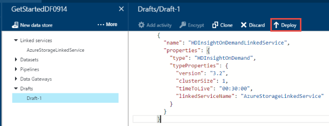

4. Confirm that you see both **AzureStorageLinkedService** and **HDInsightOnDemandLinkedService** in the tree view on the left.

    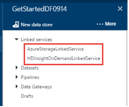

## Create datasets
In this step, you create datasets to represent the input and output data for Hive processing. These datasets refer to the **AzureStorageLinkedService** you created earlier in this tutorial. The linked service points to a Storage account and datasets specify container, folder, file name in the storage that holds input and output data.   

### Create an input dataset
1. In the **Data Factory Editor**, select **More** > **New dataset** > **Azure Blob storage**.

    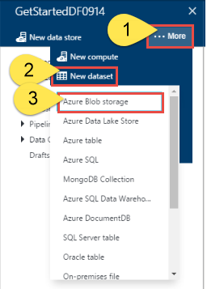

2. Copy and paste the following snippet to the Draft-1 window. In the JSON snippet, you create a dataset called **AzureBlobInput** that represents input data for an activity in the pipeline. In addition, you specify that the input data is located in the blob container called **adfgetstarted** and the folder called **inputdata**.

	```JSON
    {
        "name": "AzureBlobInput",
        "properties": {
            "type": "AzureBlob",
            "linkedServiceName": "AzureStorageLinkedService",
            "typeProperties": {
                "fileName": "input.log",
                "folderPath": "adfgetstarted/inputdata",
                "format": {
                    "type": "TextFormat",
                    "columnDelimiter": ","
                }
            },
            "availability": {
                "frequency": "Month",
                "interval": 1
            },
            "external": true,
            "policy": {}
        }
    }
	```
    The following table provides descriptions for the JSON properties used in the snippet.

   | Property | Description |
   |:--- |:--- |
   | type |The type property is set to **AzureBlob** because data resides in an Azure blob storage. |
   | linkedServiceName |Refers to the **AzureStorageLinkedService** you created earlier. |
   | folderPath | Specifies the blob **container** and the **folder** that contains input blobs. | 
   | fileName |This property is optional. If you omit this property, all the files from the folderPath are picked. In this tutorial, only the **input.log** is processed. |
   | type |The log files are in text format, so we use **TextFormat**. |
   | columnDelimiter |columns in the log files are delimited by **comma character (`,`)** |
   | frequency/interval |frequency set to **Month** and interval is **1**, which means that the input slices are available monthly. |
   | external | This property is set to **true** if the input data is not generated by this pipeline. In this tutorial, the input.log file is not generated by this pipeline, so we set the property to true. |

    For more information about these JSON properties, see [Azure Blob connector](data-factory-azure-blob-connector.md#dataset-properties).

3. Select **Deploy** on the command bar to deploy the newly created dataset. You see the dataset in the tree view on the left.

### Create an output dataset
Now, you create the output dataset to represent the output data stored in the Blob storage.

1. In the **Data Factory Editor**, select **More** > **New dataset** > **Azure Blob storage**.

2. Copy and paste the following snippet to the Draft-1 window. In the JSON snippet, you create a dataset called **AzureBlobOutput**, and specifying the structure of the data that is produced by the Hive script. In addition, you specify that the results are stored in the blob container called **adfgetstarted** and the folder called **partitioneddata**. The **availability** section specifies that the output dataset is produced on a monthly basis.

	```JSON
    {
      "name": "AzureBlobOutput",
      "properties": {
        "type": "AzureBlob",
        "linkedServiceName": "AzureStorageLinkedService",
        "typeProperties": {
          "folderPath": "adfgetstarted/partitioneddata",
          "format": {
            "type": "TextFormat",
            "columnDelimiter": ","
          }
        },
        "availability": {
          "frequency": "Month",
          "interval": 1
        }
      }
    }
	```
    See **Create the input dataset** section for descriptions of these properties. You do not set the external property on an output dataset as the dataset is produced by the Data Factory service.

3. Select **Deploy** on the command bar to deploy the newly created dataset.

4. Verify that the dataset is created successfully.

    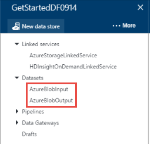

## Create a pipeline
In this step, you create your first pipeline with a **HDInsightHive** activity. Input slice is available monthly (frequency: Month, interval: 1), output slice is produced monthly, and the scheduler property for the activity is also set to monthly. The settings for the output dataset and the activity scheduler must match. Currently, output dataset is what drives the schedule, so you must create an output dataset even if the activity doesn't produce any output. If the activity doesn't take any input, you can skip creating the input dataset. The properties used in the following JSON are explained at the end of this section.

1. In the **Data Factory Editor**, select **More** > **New pipeline**.

    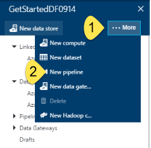
2. Copy and paste the following snippet to the Draft-1 window.

   > [!IMPORTANT]
   > Replace **storageaccountname** with the name of your storage account in the JSON.
   >
   >

	```JSON
	{
	    "name": "MyFirstPipeline",
	    "properties": {
	        "description": "My first Azure Data Factory pipeline",
	        "activities": [
	            {
	                "type": "HDInsightHive",
	                "typeProperties": {
	                    "scriptPath": "adfgetstarted/script/partitionweblogs.hql",
	                    "scriptLinkedService": "AzureStorageLinkedService",
	                    "defines": {
	                        "inputtable": "wasb://adfgetstarted@<storageaccountname>.blob.core.windows.net/inputdata",
	                        "partitionedtable": "wasb://adfgetstarted@<storageaccountname>.blob.core.windows.net/partitioneddata"
	                    }
	                },
	                "inputs": [
	                    {
	                        "name": "AzureBlobInput"
	                    }
	                ],
	                "outputs": [
	                    {
	                        "name": "AzureBlobOutput"
	                    }
	                ],
	                "policy": {
	                    "concurrency": 1,
	                    "retry": 3
	                },
	                "scheduler": {
	                    "frequency": "Month",
	                    "interval": 1
	                },
	                "name": "RunSampleHiveActivity",
	                "linkedServiceName": "HDInsightOnDemandLinkedService"
	            }
	        ],
	        "start": "2017-07-01T00:00:00Z",
	        "end": "2017-07-02T00:00:00Z",
	        "isPaused": false
	    }
	}
	```

    In the JSON snippet, you create a pipeline that consists of a single activity that uses Hive to process Data on an HDInsight cluster.

    The Hive script file, **partitionweblogs.hql**, is stored in the Storage account (specified by the scriptLinkedService, called **AzureStorageLinkedService**), and in **script** folder in the container **adfgetstarted**.

    The **defines** section is used to specify the runtime settings that are passed to the hive script as Hive configuration values (for example, ${hiveconf:inputtable}, ${hiveconf:partitionedtable}).

    The **start** and **end** properties of the pipeline specify the active period of the pipeline.

    In the activity JSON, you specify that the Hive script runs on the compute specified by the **linkedServiceName** – **HDInsightOnDemandLinkedService**.

   > [!NOTE]
   > See "Pipeline JSON" in [Pipelines and activities in Azure Data Factory](data-factory-create-pipelines.md) for details about JSON properties used in the example.
   >
   >
3. Confirm the following:

   a. The **input.log** file exists in the **inputdata** folder of the **adfgetstarted** container in the Blob storage.

   b. The **partitionweblogs.hql** file exists in the **script** folder of the **adfgetstarted** container in the Blob storage. If you don't see these files, complete the prerequisite steps in the [Tutorial overview](data-factory-build-your-first-pipeline.md).

   c. You replaced **storageaccountname** with the name of your storage account in the pipeline JSON.

4. Select **Deploy** on the command bar to deploy the pipeline. Because the **start** and **end** times are set in the past and **isPaused** is set to false, the pipeline (activity in the pipeline) runs immediately after you deploy it.

5. Confirm that you see the pipeline in the tree view.

    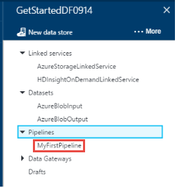


## Monitor a pipeline
### Monitor a pipeline by using the Diagram view
1. On the Data Factory blade, select **Diagram**.

    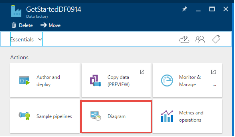

2. In the Diagram view, you see an overview of the pipelines and datasets used in this tutorial.

    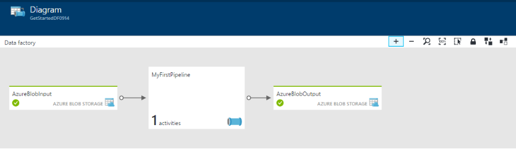

3. To view all activities in the pipeline, right-click the pipeline in the diagram, and select **Open pipeline**.

    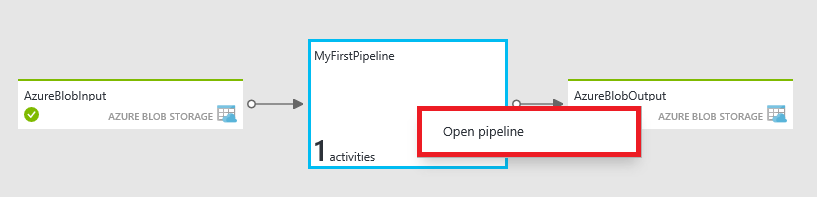

4. Confirm that you see the HDInsightHive activity in the pipeline.

    

    To go back to the previous view, select **Data factory** in the menu at the top.

5. In the Diagram view, double-click the dataset **AzureBlobInput**. Confirm that the slice is in the **Ready** state. It might take a couple of minutes for the slice to show up as **Ready**. If it doesn't appear after you wait for some time, see if you have the input file (input.log) placed in the right container (adfgetstarted) and folder (inputdata).

   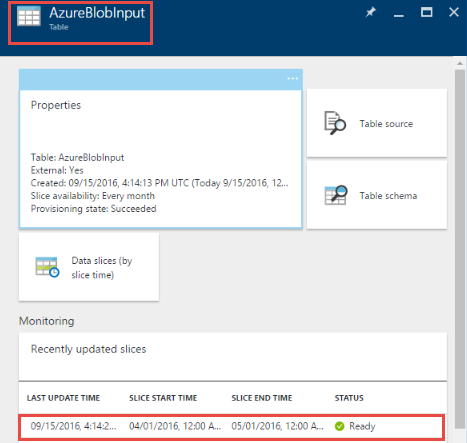

6. Close the **AzureBlobInput** blade.

7. In the Diagram view, double-click the dataset **AzureBlobOutput**. You see that the slice that is currently being processed.

   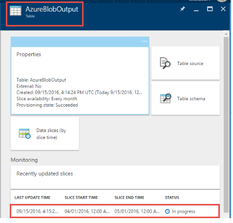

8. After the processing is finished, you see the slice in the **Ready** state.

   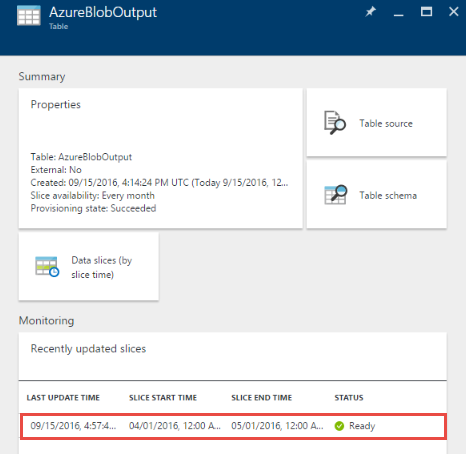  

   > [!IMPORTANT]
   > Creation of an on-demand HDInsight cluster usually takes some time (approximately 20 minutes). Expect the pipeline to take approximately 30 minutes to process the slice.
   >
   >

9. When the slice is in the **Ready** state, check the **partitioneddata** folder in the **adfgetstarted** container in your Blob storage for the output data.  

   

10. Select the slice to see more information about it in a **Data slice** blade.

    

11. Select an activity run in the **Activity runs list** to see more information about an activity run (Hive activity in our scenario) in an **Activity run details** window.   

    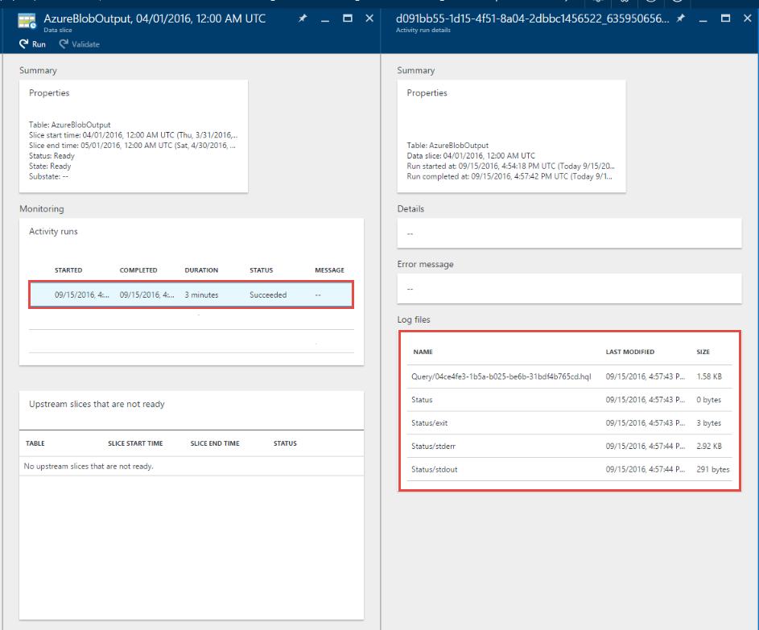    

   From the log files, you can see the Hive query that was executed and status information. These logs are useful for troubleshooting any issues.
   For more information, see [Monitor and manage pipelines by using Azure portal blades](data-factory-monitor-manage-pipelines.md).

> [!IMPORTANT]
> The input file gets deleted when the slice is processed successfully. Therefore, if you want to rerun the slice or do the tutorial again, upload the input file (input.log) to the inputdata folder of the adfgetstarted container.
>
>

### Monitor a pipeline by using the Monitor & Manage app
You also can use the Monitor & Manage application to monitor your pipelines. For more information about using this application, see [Monitor and manage Data Factory pipelines by using the Monitor & Manage app](data-factory-monitor-manage-app.md).

1. Select the **Monitor & Manage** tile on the home page for your data factory.

    

2. In the Monitor & Manage application, change the **Start time** and **End time** to match the start and end times of your pipeline. Select **Apply**.

    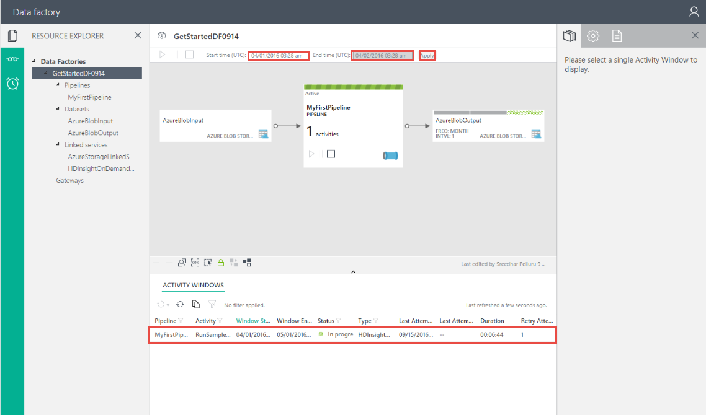

3. Select an activity window in the **Activity Window** list to see information about it.

    

## Summary
In this tutorial, you created an Azure data factory to process data by running Hive script on a HDInsight hadoop cluster. You used the Data Factory Editor in the Azure portal to do the following:  

* Create a data factory.
* Create two linked services:
   * Azure Storage linked service to link your Blob storage that holds input/output files to the data factory.
   * Azure HDInsight on-demand linked service to link an on-demand HDInsight Hadoop cluster to the data factory. Data Factory creates an HDInsight Hadoop cluster just in time to process input data and produce output data.
* Create two datasets, which describe input and output data for HDInsight Hive activity in the pipeline.
* Create a pipeline with an HDInsight Hive activity.

## Next steps
In this article, you created a pipeline with a transformation activity (HDInsight Activity) that runs a Hive script on an on-demand HDInsight cluster. To see how to use a Copy Activity to copy data from an Azure Blob to SQL Database, see [Tutorial: Copy data from an Azure blob to SQL Database](data-factory-copy-data-from-azure-blob-storage-to-sql-database.md).

## See also
| Topic | Description |
|:--- |:--- |
| [Pipelines](data-factory-create-pipelines.md) |This article helps you understand pipelines and activities in Data Factory and how to use them to construct end-to-end data-driven workflows for your scenario or business. |
| [Datasets](data-factory-create-datasets.md) |This article helps you understand datasets in Data Factory. |
| [Scheduling and execution](data-factory-scheduling-and-execution.md) |This article explains the scheduling and execution aspects of the Data Factory application model. |
| [Monitor and manage pipelines by using the Monitor & Manage app](data-factory-monitor-manage-app.md) |This article describes how to monitor, manage, and debug pipelines by using the Monitor & Manage app. |
