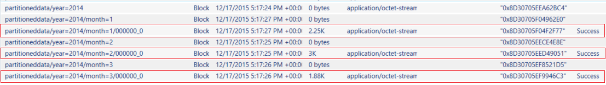

# Tutorial: Build your first Azure data factory using Data Factory REST API
> [!div class="op_single_selector"]
> * [Overview and prerequisites](data-factory-build-your-first-pipeline.md)
> * [Visual Studio](data-factory-build-your-first-pipeline-using-vs.md)
> * [PowerShell](data-factory-build-your-first-pipeline-using-powershell.md)
> * [Resource Manager Template](data-factory-build-your-first-pipeline-using-arm.md)
> * [REST API](data-factory-build-your-first-pipeline-using-rest-api.md)
>
>


> [!NOTE]
> This article applies to version 1 of Data Factory. If you are using the current version of the Data Factory service, see [Quickstart: Create a data factory using Azure Data Factory](../quickstart-create-data-factory-rest-api.md).

In this article, you use Data Factory REST API to create your first Azure data factory. To do the tutorial using other tools/SDKs, select one of the options from the drop-down list.

The pipeline in this tutorial has one activity: **HDInsight Hive activity**. This activity runs a hive script on an Azure HDInsight cluster that transforms input data to produce output data. The pipeline is scheduled to run once a month between the specified start and end times.

> [!NOTE]
> This article does not cover all the REST API. For comprehensive documentation on REST API, see [Data Factory REST API Reference](/rest/api/datafactory/).
> 
> A pipeline can have more than one activity. And, you can chain two activities (run one activity after another) by setting the output dataset of one activity as the input dataset of the other activity. For more information, see [scheduling and execution in Data Factory](data-factory-scheduling-and-execution.md#multiple-activities-in-a-pipeline).


## Prerequisites

[!INCLUDE [updated-for-az](../../../includes/updated-for-az.md)]

* Read through [Tutorial Overview](data-factory-build-your-first-pipeline.md) article and complete the **prerequisite** steps.
* Install [Curl](https://curl.haxx.se/dlwiz/) on your machine. You use the CURL tool with REST commands to create a data factory.
* Follow instructions from [this article](../../active-directory/develop/howto-create-service-principal-portal.md) to:
  1. Create a Web application named **ADFGetStartedApp** in Azure Active Directory.
  2. Get **client ID** and **secret key**.
  3. Get **tenant ID**.
  4. Assign the **ADFGetStartedApp** application to the **Data Factory Contributor** role.
* Install [Azure PowerShell](/powershell/azure/overview).
* Launch **PowerShell** and run the following command. Keep Azure PowerShell open until the end of this tutorial. If you close and reopen, you need to run the commands again.
  1. Run **Connect-AzAccount** and enter the user name and password that you use to sign in to the Azure portal.
  2. Run **Get-AzSubscription** to view all the subscriptions for this account.
  3. Run **Get-AzSubscription -SubscriptionName NameOfAzureSubscription | Set-AzContext** to select the subscription that you want to work with. Replace **NameOfAzureSubscription** with the name of your Azure subscription.
* Create an Azure resource group named **ADFTutorialResourceGroup** by running the following command in the PowerShell:

	```powershell
	New-AzResourceGroup -Name ADFTutorialResourceGroup  -Location "West US"
	```

   Some of the steps in this tutorial assume that you use the resource group named ADFTutorialResourceGroup. If you use a different resource group, you need to use the name of your resource group in place of ADFTutorialResourceGroup in this tutorial.

## Create JSON definitions
Create following JSON files in the folder where curl.exe is located.

### datafactory.json
> [!IMPORTANT]
> Name must be globally unique, so you may want to prefix/suffix ADFCopyTutorialDF to make it a unique name.
>
>

```JSON
{
    "name": "FirstDataFactoryREST",
    "location": "WestUS"
}
```

### azurestoragelinkedservice.json
> [!IMPORTANT]
> Replace **accountname** and **accountkey** with name and key of your Azure storage account. To learn how to get your storage access key, see the information about how to view, copy, and regenerate storage access keys in [Manage your storage account](../../storage/common/storage-account-manage.md#access-keys).
>
>

```JSON
{
    "name": "AzureStorageLinkedService",
    "properties": {
        "type": "AzureStorage",
        "typeProperties": {
            "connectionString": "DefaultEndpointsProtocol=https;AccountName=<accountname>;AccountKey=<accountkey>"
        }
    }
}
```

### hdinsightondemandlinkedservice.json

```JSON
{
    "name": "HDInsightOnDemandLinkedService",
    "properties": {
        "type": "HDInsightOnDemand",
        "typeProperties": {
            "version": "3.5",
            "clusterSize": 1,
            "timeToLive": "00:05:00",
            "osType": "Linux",
            "linkedServiceName": "AzureStorageLinkedService"
        }
    }
}
```

The following table provides descriptions for the JSON properties used in the snippet:

| Property | Description |
|:--- |:--- |
| clusterSize |Size of the HDInsight cluster. |
| timeToLive |Specifies that the idle time for the HDInsight cluster, before it is deleted. |
| linkedServiceName |Specifies the storage account that is used to store the logs that are generated by HDInsight |

Note the following points:

* The Data Factory creates a **Linux-based** HDInsight cluster for you with the above JSON. See [On-demand HDInsight Linked Service](data-factory-compute-linked-services.md#azure-hdinsight-on-demand-linked-service) for details.
* You could use **your own HDInsight cluster** instead of using an on-demand HDInsight cluster. See [HDInsight Linked Service](data-factory-compute-linked-services.md#azure-hdinsight-linked-service) for details.
* The HDInsight cluster creates a **default container** in the blob storage you specified in the JSON (**linkedServiceName**). HDInsight does not delete this container when the cluster is deleted. This behavior is by design. With on-demand HDInsight linked service, a HDInsight cluster is created every time a slice is processed unless there is an existing live cluster (**timeToLive**) and is deleted when the processing is done.

    As more slices are processed, you see many containers in your Azure blob storage. If you do not need them for troubleshooting of the jobs, you may want to delete them to reduce the storage cost. The names of these containers follow a pattern: "adf**yourdatafactoryname**-**linkedservicename**-datetimestamp". Use tools such as [Microsoft Storage Explorer](https://storageexplorer.com/) to delete containers in your Azure blob storage.

See [On-demand HDInsight Linked Service](data-factory-compute-linked-services.md#azure-hdinsight-on-demand-linked-service) for details.

### inputdataset.json

```JSON
{
    "name": "AzureBlobInput",
    "properties": {
        "type": "AzureBlob",
        "linkedServiceName": "AzureStorageLinkedService",
        "typeProperties": {
            "fileName": "input.log",
            "folderPath": "adfgetstarted/inputdata",
            "format": {
                "type": "TextFormat",
                "columnDelimiter": ","
            }
        },
        "availability": {
            "frequency": "Month",
            "interval": 1
        },
        "external": true,
        "policy": {}
    }
}
```

The JSON defines a dataset named **AzureBlobInput**, which represents input data for an activity in the pipeline. In addition, it specifies that the input data is located in the blob container called **adfgetstarted** and the folder called **inputdata**.

The following table provides descriptions for the JSON properties used in the snippet:

| Property | Description |
|:--- |:--- |
| type |The type property is set to AzureBlob because data resides in Azure blob storage. |
| linkedServiceName |refers to the StorageLinkedService you created earlier. |
| fileName |This property is optional. If you omit this property, all the files from the folderPath are picked. In this case, only the input.log is processed. |
| type |The log files are in text format, so we use TextFormat. |
| columnDelimiter |columns in the log files are delimited by a comma character (,) |
| frequency/interval |frequency set to Month and interval is 1, which means that the input slices are available monthly. |
| external |this property is set to true if the input data is not generated by the Data Factory service. |

### outputdataset.json

```JSON
{
    "name": "AzureBlobOutput",
    "properties": {
        "type": "AzureBlob",
        "linkedServiceName": "AzureStorageLinkedService",
        "typeProperties": {
            "folderPath": "adfgetstarted/partitioneddata",
            "format": {
                "type": "TextFormat",
                "columnDelimiter": ","
            }
        },
        "availability": {
            "frequency": "Month",
            "interval": 1
        }
    }
}
```

The JSON defines a dataset named **AzureBlobOutput**, which represents output data for an activity in the pipeline. In addition, it specifies that the results are stored in the blob container called **adfgetstarted** and the folder called **partitioneddata**. The **availability** section specifies that the output dataset is produced on a monthly basis.

### pipeline.json
> [!IMPORTANT]
> Replace **storageaccountname** with name of your Azure storage account.
>
>

```JSON
{
    "name": "MyFirstPipeline",
    "properties": {
        "description": "My first Azure Data Factory pipeline",
        "activities": [{
            "type": "HDInsightHive",
            "typeProperties": {
                "scriptPath": "adfgetstarted/script/partitionweblogs.hql",
                "scriptLinkedService": "AzureStorageLinkedService",
                "defines": {
                    "inputtable": "wasb://adfgetstarted@<storageaccountname>.blob.core.windows.net/inputdata",
                    "partitionedtable": "wasb://adfgetstarted@<storageaccountname>t.blob.core.windows.net/partitioneddata"
                }
            },
            "inputs": [{
                "name": "AzureBlobInput"
            }],
            "outputs": [{
                "name": "AzureBlobOutput"
            }],
            "policy": {
                "concurrency": 1,
                "retry": 3
            },
            "scheduler": {
                "frequency": "Month",
                "interval": 1
            },
            "name": "RunSampleHiveActivity",
            "linkedServiceName": "HDInsightOnDemandLinkedService"
        }],
        "start": "2017-07-10T00:00:00Z",
        "end": "2017-07-11T00:00:00Z",
        "isPaused": false
    }
}
```

In the JSON snippet, you are creating a pipeline that consists of a single activity that uses Hive to process data on a HDInsight cluster.

The Hive script file, **partitionweblogs.hql**, is stored in the Azure storage account (specified by the scriptLinkedService, called **StorageLinkedService**), and in **script** folder in the container **adfgetstarted**.

The **defines** section specifies runtime settings that are passed to the hive script as Hive configuration values (e.g ${hiveconf:inputtable}, ${hiveconf:partitionedtable}).

The **start** and **end** properties of the pipeline specifies the active period of the pipeline.

In the activity JSON, you specify that the Hive script runs on the compute specified by the **linkedServiceName** – **HDInsightOnDemandLinkedService**.

> [!NOTE]
> See "Pipeline JSON" in [Pipelines and activities in Azure Data Factory](data-factory-create-pipelines.md) for details about JSON properties used in the preceding example.
>
>

## Set global variables
In Azure PowerShell, execute the following commands after replacing the values with your own:

> [!IMPORTANT]
> See [Prerequisites](#prerequisites) section for instructions on getting client ID, client secret, tenant ID, and subscription ID.
>
>

```powershell
$client_id = "<client ID of application in AAD>"
$client_secret = "<client key of application in AAD>"
$tenant = "<Azure tenant ID>";
$subscription_id="<Azure subscription ID>";

$rg = "ADFTutorialResourceGroup"
$adf = "FirstDataFactoryREST"
```


## Authenticate with AAD

```powershell
$cmd = { .\curl.exe -X POST https://login.microsoftonline.com/$tenant/oauth2/token  -F grant_type=client_credentials  -F resource=https://management.core.windows.net/ -F client_id=$client_id -F client_secret=$client_secret };
$responseToken = Invoke-Command -scriptblock $cmd;
$accessToken = (ConvertFrom-Json $responseToken).access_token;

(ConvertFrom-Json $responseToken)
```


## Create data factory
In this step, you create an Azure Data Factory named **FirstDataFactoryREST**. A data factory can have one or more pipelines. A pipeline can have one or more activities in it. For example, a Copy Activity to copy data from a source to a destination data store and a HDInsight Hive activity to run a Hive script to transform data. Run the following commands to create the data factory:

1. Assign the command to variable named **cmd**.

    Confirm that the name of the data factory you specify here (ADFCopyTutorialDF) matches the name specified in the **datafactory.json**.

	```powershell
    $cmd = {.\curl.exe -X PUT -H "Authorization: Bearer $accessToken" -H "Content-Type: application/json" --data “@datafactory.json” https://management.azure.com/subscriptions/$subscription_id/resourcegroups/$rg/providers/Microsoft.DataFactory/datafactories/FirstDataFactoryREST?api-version=2015-10-01};
	```
2. Run the command by using **Invoke-Command**.

	```powershell
	$results = Invoke-Command -scriptblock $cmd;
	```
3. View the results. If the data factory has been successfully created, you see the JSON for the data factory in the **results**; otherwise, you see an error message.

	```powershell
	Write-Host $results
	```

Note the following points:

* The name of the Azure Data Factory must be globally unique. If you see the error in results: **Data factory name “FirstDataFactoryREST” is not available**, do the following steps:
  1. Change the name (for example, yournameFirstDataFactoryREST) in the **datafactory.json** file. See [Data Factory - Naming Rules](data-factory-naming-rules.md) topic for naming rules for Data Factory artifacts.
  2. In the first command where the **$cmd** variable is assigned a value, replace FirstDataFactoryREST with the new name and run the command.
  3. Run the next two commands to invoke the REST API to create the data factory and print the results of the operation.
* To create Data Factory instances, you need to be a contributor/administrator of the Azure subscription
* The name of the data factory may be registered as a DNS name in the future and hence become publicly visible.
* If you receive the error: "**This subscription is not registered to use namespace Microsoft.DataFactory**", do one of the following and try publishing again:

  * In Azure PowerShell, run the following command to register the Data Factory provider:

	```powershell
	Register-AzResourceProvider -ProviderNamespace Microsoft.DataFactory
	```

      You can run the following command to confirm that the Data Factory provider is registered:
	```powershell
	Get-AzResourceProvider
	```
  * Login using the Azure subscription into the [Azure portal](https://portal.azure.com) and navigate to a Data Factory blade (or) create a data factory in the Azure portal. This action automatically registers the provider for you.

Before creating a pipeline, you need to create a few Data Factory entities first. You first create linked services to link data stores/computes to your data store, define input and output datasets to represent data in linked data stores.

## Create linked services
In this step, you link your Azure Storage account and an on-demand Azure HDInsight cluster to your data factory. The Azure Storage account holds the input and output data for the pipeline in this sample. The HDInsight linked service is used to run a Hive script specified in the activity of the pipeline in this sample.

### Create Azure Storage linked service
In this step, you link your Azure Storage account to your data factory. With this tutorial, you use the same Azure Storage account to store input/output data and the HQL script file.

1. Assign the command to variable named **cmd**.

	```powershell
    $cmd = {.\curl.exe -X PUT -H "Authorization: Bearer $accessToken" -H "Content-Type: application/json" --data “@azurestoragelinkedservice.json” https://management.azure.com/subscriptions/$subscription_id/resourcegroups/$rg/providers/Microsoft.DataFactory/datafactories/$adf/linkedservices/AzureStorageLinkedService?api-version=2015-10-01};
	```
2. Run the command by using **Invoke-Command**.

	```powershell
	$results = Invoke-Command -scriptblock $cmd;
	```
3. View the results. If the linked service has been successfully created, you see the JSON for the linked service in the **results**; otherwise, you see an error message.

	```powershell
	Write-Host $results
	```

### Create Azure HDInsight linked service
In this step, you link an on-demand HDInsight cluster to your data factory. The HDInsight cluster is automatically created at runtime and deleted after it is done processing and idle for the specified amount of time. You could use your own HDInsight cluster instead of using an on-demand HDInsight cluster. See [Compute Linked Services](data-factory-compute-linked-services.md) for details.

1. Assign the command to variable named **cmd**.

	```powershell
	$cmd = {.\curl.exe -X PUT -H "Authorization: Bearer $accessToken" -H "Content-Type: application/json" --data "@hdinsightondemandlinkedservice.json" https://management.azure.com/subscriptions/$subscription_id/resourcegroups/$rg/providers/Microsoft.DataFactory/datafactories/$adf/linkedservices/hdinsightondemandlinkedservice?api-version=2015-10-01};
	```
2. Run the command by using **Invoke-Command**.

	```powershell
	$results = Invoke-Command -scriptblock $cmd;
	```
3. View the results. If the linked service has been successfully created, you see the JSON for the linked service in the **results**; otherwise, you see an error message.

	```powershell
	Write-Host $results
	```

## Create datasets
In this step, you create datasets to represent the input and output data for Hive processing. These datasets refer to the **StorageLinkedService** you have created earlier in this tutorial. The linked service points to an Azure Storage account and datasets specify container, folder, file name in the storage that holds input and output data.

### Create input dataset
In this step, you create the input dataset to represent input data stored in the Azure Blob storage.

1. Assign the command to variable named **cmd**.

	```powershell
	$cmd = {.\curl.exe -X PUT -H "Authorization: Bearer $accessToken" -H "Content-Type: application/json" --data "@inputdataset.json" https://management.azure.com/subscriptions/$subscription_id/resourcegroups/$rg/providers/Microsoft.DataFactory/datafactories/$adf/datasets/AzureBlobInput?api-version=2015-10-01};
	```
2. Run the command by using **Invoke-Command**.

	```powershell
	$results = Invoke-Command -scriptblock $cmd;
	```
3. View the results. If the dataset has been successfully created, you see the JSON for the dataset in the **results**; otherwise, you see an error message.

	```powershell
	Write-Host $results
	```

### Create output dataset
In this step, you create the output dataset to represent output data stored in the Azure Blob storage.

1. Assign the command to variable named **cmd**.

	```powershell
	$cmd = {.\curl.exe -X PUT -H "Authorization: Bearer $accessToken" -H "Content-Type: application/json" --data "@outputdataset.json" https://management.azure.com/subscriptions/$subscription_id/resourcegroups/$rg/providers/Microsoft.DataFactory/datafactories/$adf/datasets/AzureBlobOutput?api-version=2015-10-01};
	```
2. Run the command by using **Invoke-Command**.

	```powershell
	$results = Invoke-Command -scriptblock $cmd;
	```
3. View the results. If the dataset has been successfully created, you see the JSON for the dataset in the **results**; otherwise, you see an error message.

	```powershell
	Write-Host $results
	```

## Create pipeline
In this step, you create your first pipeline with a **HDInsightHive** activity. Input slice is available monthly (frequency: Month, interval: 1), output slice is produced monthly, and the scheduler property for the activity is also set to monthly. The settings for the output dataset and the activity scheduler must match. Currently, output dataset is what drives the schedule, so you must create an output dataset even if the activity does not produce any output. If the activity doesn't take any input, you can skip creating the input dataset.

Confirm that you see the **input.log** file in the **adfgetstarted/inputdata** folder in the Azure blob storage, and run the following command to deploy the pipeline. Since the **start** and **end** times are set in the past and **isPaused** is set to false, the pipeline (activity in the pipeline) runs immediately after you deploy.

1. Assign the command to variable named **cmd**.

	```powershell
	$cmd = {.\curl.exe -X PUT -H "Authorization: Bearer $accessToken" -H "Content-Type: application/json" --data "@pipeline.json" https://management.azure.com/subscriptions/$subscription_id/resourcegroups/$rg/providers/Microsoft.DataFactory/datafactories/$adf/datapipelines/MyFirstPipeline?api-version=2015-10-01};
	```
2. Run the command by using **Invoke-Command**.

	```powershell
	$results = Invoke-Command -scriptblock $cmd;
	```
3. View the results. If the dataset has been successfully created, you see the JSON for the dataset in the **results**; otherwise, you see an error message.

	```powershell
	Write-Host $results
	```
4. Congratulations, you have successfully created your first pipeline using Azure PowerShell!

## Monitor pipeline
In this step, you use Data Factory REST API to monitor slices being produced by the pipeline.

```powershell
$ds ="AzureBlobOutput"

$cmd = {.\curl.exe -X GET -H "Authorization: Bearer $accessToken" https://management.azure.com/subscriptions/$subscription_id/resourcegroups/$rg/providers/Microsoft.DataFactory/datafactories/$adf/datasets/$ds/slices?start=1970-01-01T00%3a00%3a00.0000000Z"&"end=2016-08-12T00%3a00%3a00.0000000Z"&"api-version=2015-10-01};

$results2 = Invoke-Command -scriptblock $cmd;

IF ((ConvertFrom-Json $results2).value -ne $NULL) {
    ConvertFrom-Json $results2 | Select-Object -Expand value | Format-Table
} else {
        (convertFrom-Json $results2).RemoteException
}
```

> [!IMPORTANT]
> Creation of an on-demand HDInsight cluster usually takes sometime (approximately 20 minutes). Therefore, expect the pipeline to take **approximately 30 minutes** to process the slice.
>
>

Run the Invoke-Command and the next one until you see the slice in **Ready** state or **Failed** state. When the slice is in Ready state, check the **partitioneddata** folder in the **adfgetstarted** container in your blob storage for the output data.  The creation of an on-demand HDInsight cluster usually takes some time.



> [!IMPORTANT]
> The input file gets deleted when the slice is processed successfully. Therefore, if you want to rerun the slice or do the tutorial again, upload the input file (input.log) to the inputdata folder of the adfgetstarted container.
>
>

You can also use Azure portal to monitor slices and troubleshoot any issues. See [Monitor pipelines using Azure portal](data-factory-monitor-manage-pipelines.md) details.

## Summary
In this tutorial, you created an Azure data factory to process data by running Hive script on a HDInsight hadoop cluster. You used the Data Factory Editor in the Azure portal to do the following steps:

1. Created an Azure **data factory**.
2. Created two **linked services**:
   1. **Azure Storage** linked service to link your Azure blob storage that holds input/output files to the data factory.
   2. **Azure HDInsight** on-demand linked service to link an on-demand HDInsight Hadoop cluster to the data factory. Azure Data Factory creates a HDInsight Hadoop cluster just-in-time to process input data and produce output data.
3. Created two **datasets**, which describe input and output data for HDInsight Hive activity in the pipeline.
4. Created a **pipeline** with a **HDInsight Hive** activity.

## Next steps
In this article, you have created a pipeline with a transformation activity (HDInsight Activity) that runs a Hive script on an on-demand Azure HDInsight cluster. To see how to use a Copy Activity to copy data from an Azure Blob to Azure SQL, see [Tutorial: Copy data from an Azure Blob to Azure SQL](data-factory-copy-data-from-azure-blob-storage-to-sql-database.md).

## See Also
| Topic | Description |
|:--- |:--- |
| [Data Factory REST API Reference](/rest/api/datafactory/) |See comprehensive documentation on Data Factory cmdlets |
| [Pipelines](data-factory-create-pipelines.md) |This article helps you understand pipelines and activities in Azure Data Factory and how to use them to construct end-to-end data-driven workflows for your scenario or business. |
| [Datasets](data-factory-create-datasets.md) |This article helps you understand datasets in Azure Data Factory. |
| [Scheduling and Execution](data-factory-scheduling-and-execution.md) |This article explains the scheduling and execution aspects of Azure Data Factory application model. |
| [Monitor and manage pipelines using Monitoring App](data-factory-monitor-manage-app.md) |This article describes how to monitor, manage, and debug pipelines using the Monitoring & Management App. |
