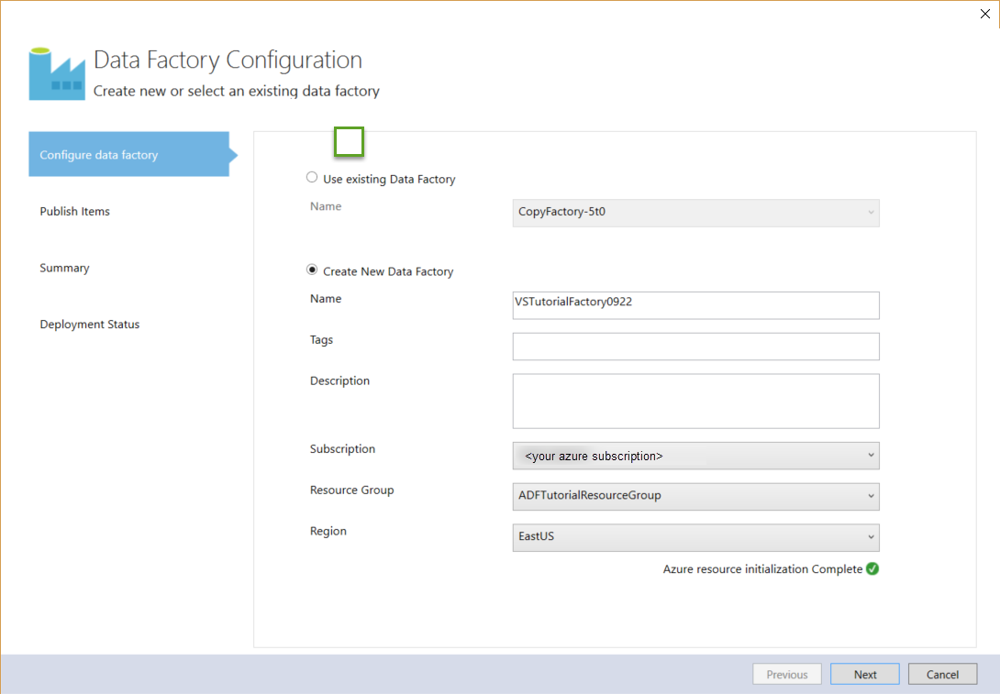
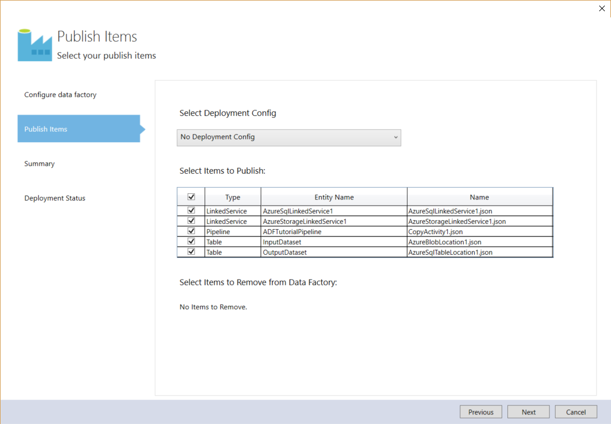
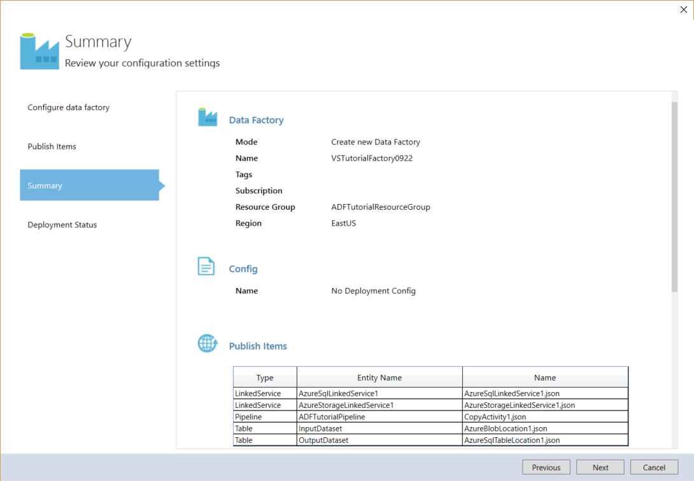
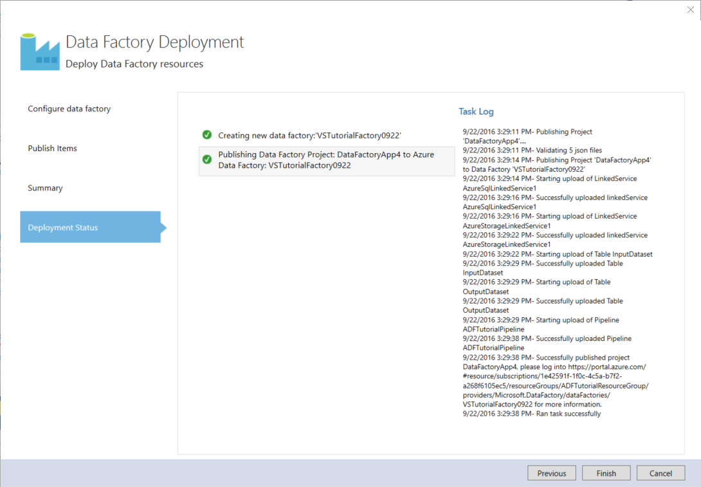
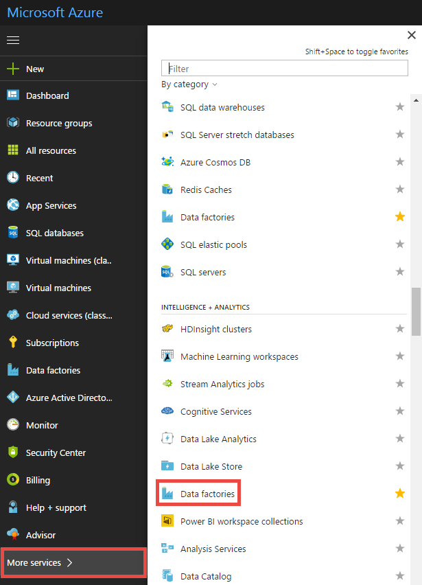
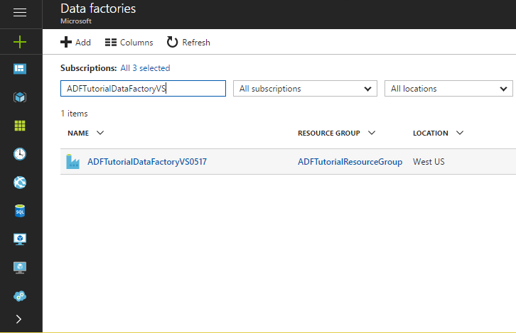

# Tutorial: Create a pipeline with Copy Activity using Visual Studio
> [!div class="op_single_selector"]
> * [Overview and prerequisites](data-factory-copy-data-from-azure-blob-storage-to-sql-database.md)
> * [Copy Wizard](data-factory-copy-data-wizard-tutorial.md)
> * [Visual Studio](data-factory-copy-activity-tutorial-using-visual-studio.md)
> * [PowerShell](data-factory-copy-activity-tutorial-using-powershell.md)
> * [Azure Resource Manager template](data-factory-copy-activity-tutorial-using-azure-resource-manager-template.md)
> * [REST API](data-factory-copy-activity-tutorial-using-rest-api.md)
> * [.NET API](data-factory-copy-activity-tutorial-using-dotnet-api.md)
> 
> 

> [!NOTE]
> This article applies to version 1 of Data Factory. If you are using the current version of the Data Factory service, see [copy activity tutorial](../quickstart-create-data-factory-dot-net.md). 

In this article, you learn how to use the Microsoft Visual Studio to create a data factory with a pipeline that copies data from an Azure blob storage to an Azure SQL database. If you are new to Azure Data Factory, read through the [Introduction to Azure Data Factory](data-factory-introduction.md) article before doing this tutorial.   

In this tutorial, you create a pipeline with one activity in it: Copy Activity. The copy activity copies data from a supported data store to a supported sink data store. For a list of data stores supported as sources and sinks, see [supported data stores](data-factory-data-movement-activities.md#supported-data-stores-and-formats). The activity is powered by a globally available service that can copy data between various data stores in a secure, reliable, and scalable way. For more information about the Copy Activity, see [Data Movement Activities](data-factory-data-movement-activities.md).

A pipeline can have more than one activity. And, you can chain two activities (run one activity after another) by setting the output dataset of one activity as the input dataset of the other activity. For more information, see [multiple activities in a pipeline](data-factory-scheduling-and-execution.md#multiple-activities-in-a-pipeline).

> [!NOTE] 
> The data pipeline in this tutorial copies data from a source data store to a destination data store. For a tutorial on how to transform data using Azure Data Factory, see [Tutorial: Build a pipeline to transform data using Hadoop cluster](data-factory-build-your-first-pipeline.md).

## Prerequisites

[!INCLUDE [updated-for-az](../../../includes/updated-for-az.md)]

1. Read through [Tutorial Overview](data-factory-copy-data-from-azure-blob-storage-to-sql-database.md) article and complete the **prerequisite** steps.       
2. To create Data Factory instances, you must be a member of the [Data Factory Contributor](../../role-based-access-control/built-in-roles.md#data-factory-contributor) role at the subscription/resource group level.
3. You must have the following installed on your computer: 
   * Visual Studio 2013 or Visual Studio 2015
   * Download Azure SDK for Visual Studio 2013 or Visual Studio 2015. Navigate to [Azure Download Page](https://azure.microsoft.com/downloads/) and click **VS 2013** or **VS 2015** in the **.NET** section.
   * Download the latest Azure Data Factory plugin for Visual Studio: [VS 2013](https://visualstudiogallery.msdn.microsoft.com/754d998c-8f92-4aa7-835b-e89c8c954aa5) or [VS 2015](https://visualstudiogallery.msdn.microsoft.com/371a4cf9-0093-40fa-b7dd-be3c74f49005). You can also update the plugin by doing the following steps: On the menu, click **Tools** -> **Extensions and Updates** -> **Online** -> **Visual Studio Gallery** -> **Microsoft Azure Data Factory Tools for Visual Studio** -> **Update**.

## Steps
Here are the steps you perform as part of this tutorial:

1. Create **linked services** in the data factory. In this step, you create two linked services of types: Azure Storage and Azure SQL Database. 
	
	The AzureStorageLinkedService links your Azure storage account to the data factory. You created a container and uploaded data to this storage account as part of [prerequisites](data-factory-copy-data-from-azure-blob-storage-to-sql-database.md).   

	AzureSqlLinkedService links your Azure SQL database to the data factory. The data that is copied from the blob storage is stored in this database. You created a SQL table in this database as part of [prerequisites](data-factory-copy-data-from-azure-blob-storage-to-sql-database.md).     
2. Create input and output **datasets** in the data factory.  
	
	The Azure storage linked service specifies the connection string that Data Factory service uses at run time to connect to your Azure storage account. And, the input blob dataset specifies the container and the folder that contains the input data.  

	Similarly, the Azure SQL Database linked service specifies the connection string that Data Factory service uses at run time to connect to your Azure SQL database. And, the output SQL table dataset specifies the table in the database to which the data from the blob storage is copied.
3. Create a **pipeline** in the data factory. In this step, you create a pipeline with a copy activity.   
	
	The copy activity copies data from a blob in the Azure blob storage to a table in the Azure SQL database. You can use a copy activity in a pipeline to copy data from any supported source to any supported destination. For a list of supported data stores, see [data movement activities](data-factory-data-movement-activities.md#supported-data-stores-and-formats) article. 
4. Create an Azure **data factory** when deploying Data Factory entities (linked services, datasets/tables, and pipelines). 

## Create Visual Studio project
1. Launch **Visual Studio 2015**. Click **File**, point to **New**, and click **Project**. You should see the **New Project** dialog box.  
2. In the **New Project** dialog, select the **DataFactory** template, and click **Empty Data Factory Project**.  
   
    
3. Specify the name of the project, location for the solution, and name of the solution, and then click **OK**.
   
        

## Create linked services
You create linked services in a data factory to link your data stores and compute services to the data factory. In this tutorial, you don't use any compute service such as Azure HDInsight or Azure Data Lake Analytics. You use two data stores of type Azure Storage (source) and Azure SQL Database (destination). 

Therefore, you create two linked services of types: AzureStorage and AzureSqlDatabase.  

The Azure Storage linked service links your Azure storage account to the data factory. This storage account is the one in which you created a container and uploaded the data as part of [prerequisites](data-factory-copy-data-from-azure-blob-storage-to-sql-database.md).   

Azure SQL linked service links your Azure SQL database to the data factory. The data that is copied from the blob storage is stored in this database. You created the emp table in this database as part of [prerequisites](data-factory-copy-data-from-azure-blob-storage-to-sql-database.md).

Linked services link data stores or compute services to an Azure data factory. See [supported data stores](data-factory-data-movement-activities.md#supported-data-stores-and-formats) for all the sources and sinks supported by the Copy Activity. See [compute linked services](data-factory-compute-linked-services.md) for the list of compute services supported by Data Factory. In this tutorial, you do not use any compute service. 

### Create the Azure Storage linked service
1. In **Solution Explorer**, right-click **Linked Services**, point to **Add**, and click **New Item**.      
2. In the **Add New Item** dialog box, select **Azure Storage Linked Service** from the list, and click **Add**. 
   
    
3. Replace `<accountname>` and `<accountkey>`* with the name of your Azure storage account and its key. 
   
    
4. Save the **AzureStorageLinkedService1.json** file.

	For more information about JSON properties in the linked service definition, see [Azure Blob Storage connector](data-factory-azure-blob-connector.md#linked-service-properties) article.

### Create the Azure SQL linked service
1. Right-click on **Linked Services** node in the **Solution Explorer** again, point to **Add**, and click **New Item**. 
2. This time, select **Azure SQL Linked Service**, and click **Add**. 
3. In the **AzureSqlLinkedService1.json file**, replace `<servername>`, `<databasename>`, `<username@servername>`, and `<password>` with names of your server, database, user account, and password.    
4. Save the **AzureSqlLinkedService1.json** file. 
	
	For more information about these JSON properties, see [Azure SQL Database connector](data-factory-azure-sql-connector.md#linked-service-properties).


## Create datasets
In the previous step, you created linked services to link your Azure Storage account and Azure SQL database to your data factory. In this step, you define two datasets named InputDataset and OutputDataset that represent input and output data that is stored in the data stores referred by AzureStorageLinkedService1 and AzureSqlLinkedService1 respectively.

The Azure storage linked service specifies the connection string that Data Factory service uses at run time to connect to your Azure storage account. And, the input blob dataset (InputDataset) specifies the container and the folder that contains the input data.  

Similarly, the Azure SQL Database linked service specifies the connection string that Data Factory service uses at run time to connect to your Azure SQL database. And, the output SQL table dataset (OututDataset) specifies the table in the database to which the data from the blob storage is copied. 

### Create input dataset
In this step, you create a dataset named InputDataset that points to a blob file (emp.txt) in the root folder of a blob container (adftutorial) in the Azure Storage represented by the AzureStorageLinkedService1 linked service. If you don't specify a value for the fileName (or skip it), data from all blobs in the input folder are copied to the destination. In this tutorial, you specify a value for the fileName. 

Here, you use the term "tables" rather than "datasets". A table is a rectangular dataset and is the only type of dataset supported right now. 

1. Right-click **Tables** in the **Solution Explorer**, point to **Add**, and click **New Item**.
2. In the **Add New Item** dialog box, select **Azure Blob**, and click **Add**.   
3. Replace the JSON text with the following text and save the **AzureBlobLocation1.json** file. 

   ```json   
   {
    "name": "InputDataset",
    "properties": {
      "structure": [
        {
          "name": "FirstName",
          "type": "String"
        },
        {
          "name": "LastName",
          "type": "String"
        }
      ],
      "type": "AzureBlob",
      "linkedServiceName": "AzureStorageLinkedService1",
      "typeProperties": {
        "folderPath": "adftutorial/",
        "format": {
          "type": "TextFormat",
          "columnDelimiter": ","
        }
      },
      "external": true,
      "availability": {
        "frequency": "Hour",
        "interval": 1
      }
    }
   }
   ``` 
    The following table provides descriptions for the JSON properties used in the snippet:

	| Property | Description |
	|:--- |:--- |
	| type | The type property is set to **AzureBlob** because data resides in an Azure blob storage. |
	| linkedServiceName | Refers to the **AzureStorageLinkedService** that you created earlier. |
	| folderPath | Specifies the blob **container** and the **folder** that contains input blobs. In this tutorial, adftutorial is the blob container and folder is the root folder. | 
	| fileName | This property is optional. If you omit this property, all files from the folderPath are picked. In this tutorial, **emp.txt** is specified for the fileName, so only that file is picked up for processing. |
	| format -> type |The input file is in the text format, so we use **TextFormat**. |
	| columnDelimiter | The columns in the input file are delimited by **comma character (`,`)**. |
	| frequency/interval | The frequency is set to **Hour** and interval is  set to **1**, which means that the input slices are available **hourly**. In other words, the Data Factory service looks for input data every hour in the root folder of blob container (**adftutorial**) you specified. It looks for the data within the pipeline start and end times, not before or after these times.  |
	| external | This property is set to **true** if the data is not generated by this pipeline. The input data in this tutorial is in the emp.txt file, which is not generated by this pipeline, so we set this property to true. |

    For more information about these JSON properties, see [Azure Blob connector article](data-factory-azure-blob-connector.md#dataset-properties).   

### Create output dataset
In this step, you create an output dataset named **OutputDataset**. This dataset points to a SQL table in the Azure SQL database represented by **AzureSqlLinkedService1**. 

1. Right-click **Tables** in the **Solution Explorer** again, point to **Add**, and click **New Item**.
2. In the **Add New Item** dialog box, select **Azure SQL**, and click **Add**. 
3. Replace the JSON text with the following JSON and save the **AzureSqlTableLocation1.json** file.

   ```json
	{
	 "name": "OutputDataset",
	 "properties": {
	   "structure": [
	     {
	       "name": "FirstName",
	       "type": "String"
	     },
	     {
	       "name": "LastName",
	       "type": "String"
	     }
	   ],
	   "type": "AzureSqlTable",
	   "linkedServiceName": "AzureSqlLinkedService1",
	   "typeProperties": {
	     "tableName": "emp"
	   },
	   "availability": {
	     "frequency": "Hour",
	     "interval": 1
	   }
	 }
	}
    ```
    The following table provides descriptions for the JSON properties used in the snippet:

	| Property | Description |
	|:--- |:--- |
	| type | The type property is set to **AzureSqlTable** because data is copied to a table in an Azure SQL database. |
	| linkedServiceName | Refers to the **AzureSqlLinkedService** that you created earlier. |
	| tableName | Specified the **table** to which the data is copied. | 
	| frequency/interval | The frequency is set to **Hour** and interval is **1**, which means that the output slices are produced **hourly** between the pipeline start and end times, not before or after these times.  |

	There are three columns – **ID**, **FirstName**, and **LastName** – in the emp table in the database. ID is an identity column, so you need to specify only **FirstName** and **LastName** here.

	For more information about these JSON properties, see [Azure SQL connector article](data-factory-azure-sql-connector.md#dataset-properties).

## Create pipeline
In this step, you create a pipeline with a **copy activity** that uses **InputDataset** as an input and **OutputDataset** as an output.

Currently, output dataset is what drives the schedule. In this tutorial, output dataset is configured to produce a slice once an hour. The pipeline has a start time and end time that are one day apart, which is 24 hours. Therefore, 24 slices of output dataset are produced by the pipeline. 

1. Right-click **Pipelines** in the **Solution Explorer**, point to **Add**, and click **New Item**.  
2. Select **Copy Data Pipeline** in the **Add New Item** dialog box and click **Add**. 
3. Replace the JSON with the following JSON and save the **CopyActivity1.json** file.

   ```json   
	{
	 "name": "ADFTutorialPipeline",
	 "properties": {
	   "description": "Copy data from a blob to Azure SQL table",
	   "activities": [
	     {
	       "name": "CopyFromBlobToSQL",
	       "type": "Copy",
	       "inputs": [
	         {
	           "name": "InputDataset"
	         }
	       ],
	       "outputs": [
	         {
	           "name": "OutputDataset"
	         }
	       ],
	       "typeProperties": {
	         "source": {
	           "type": "BlobSource"
	         },
	         "sink": {
	           "type": "SqlSink",
	           "writeBatchSize": 10000,
	           "writeBatchTimeout": "60:00:00"
	         }
	       },
	       "Policy": {
	         "concurrency": 1,
	         "executionPriorityOrder": "NewestFirst",
	         "style": "StartOfInterval",
	         "retry": 0,
	         "timeout": "01:00:00"
	       }
	     }
	   ],
	   "start": "2017-05-11T00:00:00Z",
	   "end": "2017-05-12T00:00:00Z",
	   "isPaused": false
	 }
	}
    ```   
   - In the activities section, there is only one activity whose **type** is set to **Copy**. For more information about the copy activity, see [data movement activities](data-factory-data-movement-activities.md). In Data Factory solutions, you can also use [data transformation activities](data-factory-data-transformation-activities.md).
   - Input for the activity is set to **InputDataset** and output for the activity is set to **OutputDataset**. 
   - In the **typeProperties** section, **BlobSource** is specified as the source type and **SqlSink** is specified as the sink type. For a complete list of data stores supported by the copy activity as sources and sinks, see [supported data stores](data-factory-data-movement-activities.md#supported-data-stores-and-formats). To learn how to use a specific supported data store as a source/sink, click the link in the table.  
     
     Replace the value of the **start** property with the current day and **end** value with the next day. You can specify only the date part and skip the time part of the date time. For example, "2016-02-03", which is equivalent to "2016-02-03T00:00:00Z"
     
     Both start and end datetimes must be in [ISO format](https://en.wikipedia.org/wiki/ISO_8601). For example: 2016-10-14T16:32:41Z. The **end** time is optional, but we use it in this tutorial. 
     
     If you do not specify value for the **end** property, it is calculated as "**start + 48 hours**". To run the pipeline indefinitely, specify **9999-09-09** as the value for the **end** property.
     
     In the preceding example, there are 24 data slices as each data slice is produced hourly.

     For descriptions of JSON properties in a pipeline definition, see [create pipelines](data-factory-create-pipelines.md) article. For descriptions of JSON properties in a copy activity definition, see [data movement activities](data-factory-data-movement-activities.md). For descriptions of JSON properties supported by BlobSource, see [Azure Blob connector article](data-factory-azure-blob-connector.md). For descriptions of JSON properties supported by SqlSink, see [Azure SQL Database connector article](data-factory-azure-sql-connector.md).

## Publish/deploy Data Factory entities
In this step, you publish Data Factory entities (linked services, datasets, and pipeline) you created earlier. You also specify the name of the new data factory to be created to hold these entities.  

1. Right-click project in the Solution Explorer, and click **Publish**. 
2. If you see **Sign in to your Microsoft account** dialog box, enter your credentials for the account that has Azure subscription, and click **sign in**.
3. You should see the following dialog box:
   
   
4. In the Configure data factory page, do the following steps: 
   
   1. select **Create New Data Factory** option.
   2. Enter **VSTutorialFactory** for **Name**.  
      
      > [!IMPORTANT]
      > The name of the Azure data factory must be globally unique. If you receive an error about the name of data factory when publishing, change the name of the data factory (for example, yournameVSTutorialFactory) and try publishing again. See [Data Factory - Naming Rules](data-factory-naming-rules.md) topic for naming rules for Data Factory artifacts.        
      > 
      > 
   3. Select your Azure subscription for the **Subscription** field.
      
      > [!IMPORTANT]
      > If you do not see any subscription, ensure that you logged in using an account that is an admin or co-admin of the subscription.  
      > 
      > 
   4. Select the **resource group** for the data factory to be created. 
   5. Select the **region** for the data factory. Only regions supported by the Data Factory service are shown in the drop-down list.
   6. Click **Next** to switch to the **Publish Items** page.
      
          
5. In the **Publish Items** page, ensure that all the Data Factories entities are selected, and click **Next** to switch to the **Summary** page.
   
        
6. Review the summary and click **Next** to start the deployment process and view the **Deployment Status**.
   
   
7. In the **Deployment Status** page, you should see the status of the deployment process. Click Finish after the deployment is done.
 
   

Note the following points: 

* If you receive the error: "This subscription is not registered to use namespace Microsoft.DataFactory", do one of the following and try publishing again: 
  
  * In Azure PowerShell, run the following command to register the Data Factory provider. 

	```powershell    
	Register-AzResourceProvider -ProviderNamespace Microsoft.DataFactory
    ```
	You can run the following command to confirm that the Data Factory provider is registered. 
    
	```powershell
	Get-AzResourceProvider
    ```
  * Login using the Azure subscription into the [Azure portal](https://portal.azure.com) and navigate to a Data Factory blade (or) create a data factory in the Azure portal. This action automatically registers the provider for you.
* The name of the data factory may be registered as a DNS name in the future and hence become publicly visible.

> [!IMPORTANT]
> To create Data Factory instances, you need to be an admin/co-admin of the Azure subscription

## Monitor pipeline
Navigate to the home page for your data factory:

1. Log in to [Azure portal](https://portal.azure.com).
2. Click **More services** on the left menu, and click **Data factories**.

	
3. Start typing the name of your data factory.

	 
4. Click your data factory in the results list to see the home page for your data factory.

	
5. Follow instructions from [Monitor datasets and pipeline](data-factory-monitor-manage-pipelines.md) to monitor the pipeline and datasets you have created in this tutorial. Currently, Visual Studio does not support monitoring Data Factory pipelines. 

## Summary
In this tutorial, you created an Azure data factory to copy data from an Azure blob to an Azure SQL database. You used Visual Studio to create the data factory, linked services, datasets, and a pipeline. Here are the high-level steps you performed in this tutorial:  

1. Created an Azure **data factory**.
2. Created **linked services**:
   1. An **Azure Storage** linked service to link your Azure Storage account that holds input data.     
   2. An **Azure SQL** linked service to link your Azure SQL database that holds the output data. 
3. Created **datasets**, which describe input data and output data for pipelines.
4. Created a **pipeline** with a **Copy Activity** with **BlobSource** as source and **SqlSink** as sink. 

To see how to use a HDInsight Hive Activity to transform data by using Azure HDInsight cluster, see [Tutorial: Build your first pipeline to transform data using Hadoop cluster](data-factory-build-your-first-pipeline.md).

You can chain two activities (run one activity after another) by setting the output dataset of one activity as the input dataset of the other activity. See [Scheduling and execution in Data Factory](data-factory-scheduling-and-execution.md) for detailed information. 

## View all data factories in Server Explorer
This section describes how to use the Server Explorer in Visual Studio to view all the data factories in your Azure subscription and create a Visual Studio project based on an existing data factory. 

1. In **Visual Studio**, click **View** on the menu, and click **Server Explorer**.
2. In the Server Explorer window, expand **Azure** and expand **Data Factory**. If you see **Sign in to Visual Studio**, enter the **account** associated with your Azure subscription and click **Continue**. Enter **password**, and click **Sign in**. Visual Studio tries to get information about all Azure data factories in your subscription. You see the status of this operation in the **Data Factory Task List** window.

    

## Create a Visual Studio project for an existing data factory

- Right-click a data factory in Server Explorer, and select **Export Data Factory to New Project** to create a Visual Studio project based on an existing data factory.

	  

## Update Data Factory tools for Visual Studio
To update Azure Data Factory tools for Visual Studio, do the following steps:

1. Click **Tools** on the menu and select **Extensions and Updates**. 
2. Select **Updates** in the left pane and then select **Visual Studio Gallery**.
3. Select **Azure Data Factory tools for Visual Studio** and click **Update**. If you do not see this entry, you already have the latest version of the tools. 

## Use configuration files
You can use configuration files in Visual Studio to configure properties for linked services/tables/pipelines differently for each environment.

Consider the following JSON definition for an Azure Storage linked service. To specify **connectionString** with different values for accountname and accountkey based on the environment (Dev/Test/Production) to which you are deploying Data Factory entities. You can achieve this behavior by using separate configuration file for each environment.

```json
{
    "name": "StorageLinkedService",
    "properties": {
        "type": "AzureStorage",
        "description": "",
        "typeProperties": {
            "connectionString": "DefaultEndpointsProtocol=https;AccountName=<accountname>;AccountKey=<accountkey>"
        }
    }
}
```

### Add a configuration file
Add a configuration file for each environment by performing the following steps:   

1. Right-click the Data Factory project in your Visual Studio solution, point to **Add**, and click **New item**.
2. Select **Config** from the list of installed templates on the left, select **Configuration File**, enter a **name** for the configuration file, and click **Add**.

    
3. Add configuration parameters and their values in the following format:

	```json
	{
	    "$schema": "http://datafactories.schema.management.azure.com/vsschemas/V1/Microsoft.DataFactory.Config.json",
	    "AzureStorageLinkedService1": [
	        {
	            "name": "$.properties.typeProperties.connectionString",
	            "value": "DefaultEndpointsProtocol=https;AccountName=<accountname>;AccountKey=<accountkey>"
	        }
	    ],
	    "AzureSqlLinkedService1": [
	        {
	            "name": "$.properties.typeProperties.connectionString",
	            "value":  "Server=tcp:<logical SQL server name>.database.windows.net,1433;Database=<Azure SQL datbase>;User ID=<Username>;Password=<Password>;Trusted_Connection=False;Encrypt=True;Connection Timeout=30"
	        }
	    ]
	}
    ```

    This example configures connectionString property of an Azure Storage linked service and an Azure SQL linked service. Notice that the syntax for specifying name is [JsonPath](https://goessner.net/articles/JsonPath/).   

    If JSON has a property that has an array of values as shown in the following code:  

	```json
    "structure": [
          {
              "name": "FirstName",
            "type": "String"
          },
          {
            "name": "LastName",
            "type": "String"
        }
    ],
    ```

    Configure properties as shown in the following configuration file (use zero-based indexing):

	```json
    {
        "name": "$.properties.structure[0].name",
        "value": "FirstName"
    }
    {
        "name": "$.properties.structure[0].type",
        "value": "String"
    }
    {
        "name": "$.properties.structure[1].name",
        "value": "LastName"
    }
    {
        "name": "$.properties.structure[1].type",
        "value": "String"
    }
    ```

### Property names with spaces
If a property name has spaces in it, use square brackets as shown in the following example (Database server name):

```json
 {
     "name": "$.properties.activities[1].typeProperties.webServiceParameters.['Database server name']",
     "value": "MyAsqlServer.database.windows.net"
 }
```

### Deploy solution using a configuration
When you are publishing Azure Data Factory entities in VS, you can specify the configuration that you want to use for that publishing operation.

To publish entities in an Azure Data Factory project using configuration file:   

1. Right-click Data Factory project and click **Publish** to see the **Publish Items** dialog box.
2. Select an existing data factory or specify values for creating a data factory on the **Configure data factory** page, and click **Next**.   
3. On the **Publish Items** page: you see a drop-down list with available configurations for the **Select Deployment Config** field.

    
4. Select the **configuration file** that you would like to use and click **Next**.
5. Confirm that you see the name of JSON file in the **Summary** page and click **Next**.
6. Click **Finish** after the deployment operation is finished.

When you deploy, the values from the configuration file are used to set values for properties in the JSON files before the entities are deployed to Azure Data Factory service.   

## Use Azure Key Vault
It is not advisable and often against security policy to commit sensitive data such as connection strings to the code repository. See [ADF Secure Publish](https://github.com/Azure/Azure-DataFactory/tree/master/SamplesV1/ADFSecurePublish) sample on GitHub to learn about storing sensitive information in Azure Key Vault and using it while publishing Data Factory entities. The Secure Publish extension for Visual Studio allows the secrets to be stored in Key Vault and only references to them are specified in linked services/ deployment configurations. These references are resolved when you publish Data Factory entities to Azure. These files can then be committed to source repository without exposing any secrets.


## Next steps
In this tutorial, you used Azure blob storage as a source data store and an Azure SQL database as a destination data store in a copy operation. The following table provides a list of data stores supported as sources and destinations by the copy activity: 

[!INCLUDE [data-factory-supported-data-stores](../../../includes/data-factory-supported-data-stores.md)]

To learn about how to copy data to/from a data store, click the link for the data store in the table.
