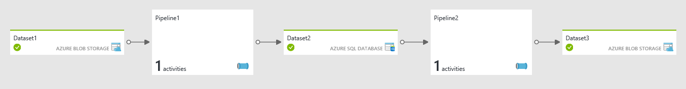

# Pipelines and Activities in Azure Data Factory
> [!div class="op_single_selector" title1="Select the version of Data Factory service you are using:"]
> * [Version 1](data-factory-create-pipelines.md)
> * [Version 2 (current version)](../concepts-pipelines-activities.md)

> [!NOTE]
> This article applies to version 1 of Data Factory. If you are using the current version of the Data Factory service, see [Pipelines in V2](../concepts-pipelines-activities.md).

This article helps you understand pipelines and activities in Azure Data Factory and use them to construct end-to-end data-driven workflows for your data movement and data processing scenarios.

> [!NOTE]
> This article assumes that you have gone through [Introduction to Azure Data Factory](data-factory-introduction.md). If you do not have hands-on-experience with creating data factories, going through [data transformation tutorial](data-factory-build-your-first-pipeline.md) and/or [data movement tutorial](data-factory-copy-data-from-azure-blob-storage-to-sql-database.md) would help you understand this article better.

[!INCLUDE [updated-for-az](../../../includes/updated-for-az.md)]

## Overview
A data factory can have one or more pipelines. A pipeline is a logical grouping of activities that together perform a task. The activities in a pipeline define actions to perform on your data. For example, you may use a copy activity to copy data from an on-premises SQL Server to an Azure Blob Storage. Then, use a Hive activity that runs a Hive script on an Azure HDInsight cluster to process/transform data from the blob storage to produce output data. Finally, use a second copy activity to copy the output data to an Azure SQL Data Warehouse on top of which business intelligence (BI) reporting solutions are built.

An activity can take zero or more input [datasets](data-factory-create-datasets.md) and produce one or more output [datasets](data-factory-create-datasets.md). The following diagram shows the relationship between pipeline, activity, and dataset in Data Factory:


A pipeline allows you to manage activities as a set instead of each one individually. For example, you can deploy, schedule, suspend, and resume a pipeline, instead of dealing with activities in the pipeline independently.

Data Factory supports two types of activities: data movement activities and data transformation activities. Each activity can have zero or more input [datasets](data-factory-create-datasets.md) and produce one or more output datasets.

An input dataset represents the input for an activity in the pipeline and an output dataset represents the output for the activity. Datasets identify data within different data stores, such as tables, files, folders, and documents. After you create a dataset, you can use it with activities in a pipeline. For example, a dataset can be an input/output dataset of a Copy Activity or an HDInsightHive Activity. For more information about datasets, see [Datasets in Azure Data Factory](data-factory-create-datasets.md) article.

### Data movement activities
Copy Activity in Data Factory copies data from a source data store to a sink data store. Data Factory supports the following data stores. Data from any source can be written to any sink. Click a data store to learn how to copy data to and from that store.

[!INCLUDE [data-factory-supported-data-stores](../../../includes/data-factory-supported-data-stores.md)]

> [!NOTE]
> Data stores with * can be on-premises or on Azure IaaS, and require you to install [Data Management Gateway](data-factory-data-management-gateway.md) on an on-premises/Azure IaaS machine.

For more information, see [Data Movement Activities](data-factory-data-movement-activities.md) article.

### Data transformation activities
[!INCLUDE [data-factory-transformation-activities](../../../includes/data-factory-transformation-activities.md)]

For more information, see [Data Transformation Activities](data-factory-data-transformation-activities.md) article.

### Custom .NET activities
If you need to move data to/from a data store that the Copy Activity doesn't support, or transform data using your own logic, create a **custom .NET activity**. For details on creating and using a custom activity, see [Use custom activities in an Azure Data Factory pipeline](data-factory-use-custom-activities.md).

## Schedule pipelines
A pipeline is active only between its **start** time and **end** time. It is not executed before the start time or after the end time. If the pipeline is paused, it does not get executed irrespective of its start and end time. For a pipeline to run, it should not be paused. See [Scheduling and Execution](data-factory-scheduling-and-execution.md) to understand how scheduling and execution works in Azure Data Factory.

## Pipeline JSON
Let us take a closer look on how a pipeline is defined in JSON format. The generic structure for a pipeline looks as follows:

```json
{
    "name": "PipelineName",
    "properties":
    {
        "description" : "pipeline description",
        "activities":
        [

        ],
        "start": "<start date-time>",
        "end": "<end date-time>",
        "isPaused": true/false,
        "pipelineMode": "scheduled/onetime",
        "expirationTime": "15.00:00:00",
        "datasets":
        [
        ]
    }
}
```

| Tag | Description | Required |
| --- | --- | --- |
| name |Name of the pipeline. Specify a name that represents the action that the pipeline performs. <br/><ul><li>Maximum number of characters: 260</li><li>Must start with a letter number, or an underscore (\_)</li><li>Following characters are not allowed: “.”, “+”, “?”, “/”, “<”,”>”,”\*”,”%”,”&”,”:”,”\\”</li></ul> |Yes |
| description | Specify the text describing what the pipeline is used for. |Yes |
| activities | The **activities** section can have one or more activities defined within it. See the next section for details about the activities JSON element. | Yes |
| start | Start date-time for the pipeline. Must be in [ISO format](https://en.wikipedia.org/wiki/ISO_8601). For example: `2016-10-14T16:32:41Z`. <br/><br/>It is possible to specify a local time, for example an EST time. Here is an example: `2016-02-27T06:00:00-05:00`", which is 6 AM EST.<br/><br/>The start and end properties together specify active period for the pipeline. Output slices are only produced with in this active period. |No<br/><br/>If you specify a value for the end property, you must specify value for the start property.<br/><br/>The start and end times can both be empty to create a pipeline. You must specify both values to set an active period for the pipeline to run. If you do not specify start and end times when creating a pipeline, you can set them using the Set-AzDataFactoryPipelineActivePeriod cmdlet later. |
| end | End date-time for the pipeline. If specified must be in ISO format. For example: `2016-10-14T17:32:41Z` <br/><br/>It is possible to specify a local time, for example an EST time. Here is an example: `2016-02-27T06:00:00-05:00`, which is 6 AM EST.<br/><br/>To run the pipeline indefinitely, specify 9999-09-09 as the value for the end property. <br/><br/> A pipeline is active only between its start time and end time. It is not executed before the start time or after the end time. If the pipeline is paused, it does not get executed irrespective of its start and end time. For a pipeline to run, it should not be paused. See [Scheduling and Execution](data-factory-scheduling-and-execution.md) to understand how scheduling and execution works in Azure Data Factory. |No <br/><br/>If you specify a value for the start property, you must specify value for the end property.<br/><br/>See notes for the **start** property. |
| isPaused | If set to true, the pipeline does not run. It's in the paused state. Default value = false. You can use this property to enable or disable a pipeline. |No |
| pipelineMode | The method for scheduling runs for the pipeline. Allowed values are: scheduled (default), onetime.<br/><br/>‘Scheduled’ indicates that the pipeline runs at a specified time interval according to its active period (start and end time). ‘Onetime’ indicates that the pipeline runs only once. Onetime pipelines once created cannot be modified/updated currently. See [Onetime pipeline](#onetime-pipeline) for details about onetime setting. |No |
| expirationTime | Duration of time after creation for which the [one-time pipeline](#onetime-pipeline) is valid and should remain provisioned. If it does not have any active, failed, or pending runs, the pipeline is automatically deleted once it reaches the expiration time. The default value: `"expirationTime": "3.00:00:00"`|No |
| datasets |List of datasets to be used by activities defined in the pipeline. This property can be used to define datasets that are specific to this pipeline and not defined within the data factory. Datasets defined within this pipeline can only be used by this pipeline and cannot be shared. See [Scoped datasets](data-factory-create-datasets.md#scoped-datasets) for details. |No |

## Activity JSON
The **activities** section can have one or more activities defined within it. Each activity has the following top-level structure:

```json
{
    "name": "ActivityName",
    "description": "description",
    "type": "<ActivityType>",
    "inputs": "[]",
    "outputs": "[]",
    "linkedServiceName": "MyLinkedService",
    "typeProperties":
    {

    },
    "policy":
    {
    },
    "scheduler":
    {
    }
}
```

Following table describes properties in the activity JSON definition:

| Tag | Description | Required |
| --- | --- | --- |
| name | Name of the activity. Specify a name that represents the action that the activity performs. <br/><ul><li>Maximum number of characters: 260</li><li>Must start with a letter number, or an underscore (\_)</li><li>Following characters are not allowed: “.”, “+”, “?”, “/”, “<”,”>”,”*”,”%”,”&”,”:”,”\\”</li></ul> |Yes |
| description | Text describing what the activity or is used for |Yes |
| type | Type of the activity. See the [Data Movement Activities](#data-movement-activities) and [Data Transformation Activities](#data-transformation-activities) sections for different types of activities. |Yes |
| inputs |Input tables used by the activity<br/><br/>`// one input table`<br/>`"inputs":  [ { "name": "inputtable1"  } ],`<br/><br/>`// two input tables` <br/>`"inputs":  [ { "name": "inputtable1"  }, { "name": "inputtable2"  } ],` |Yes |
| outputs |Output tables used by the activity.<br/><br/>`// one output table`<br/>`"outputs":  [ { "name": "outputtable1" } ],`<br/><br/>`//two output tables`<br/>`"outputs":  [ { "name": "outputtable1" }, { "name": "outputtable2" }  ],` |Yes |
| linkedServiceName |Name of the linked service used by the activity. <br/><br/>An activity may require that you specify the linked service that links to the required compute environment. |Yes for HDInsight Activity and Azure Machine Learning Batch Scoring Activity <br/><br/>No for all others |
| typeProperties |Properties in the **typeProperties** section depend on type of the activity. To see type properties for an activity, click links to the activity in the previous section. | No |
| policy |Policies that affect the run-time behavior of the activity. If it is not specified, default policies are used. |No |
| scheduler | “scheduler” property is used to define desired scheduling for the activity. Its subproperties are the same as the ones in the [availability property in a dataset](data-factory-create-datasets.md#dataset-availability). |No |

### Policies
Policies affect the run-time behavior of an activity, specifically when the slice of a table is processed. The following table provides the details.

| Property | Permitted values | Default Value | Description |
| --- | --- | --- | --- |
| concurrency |Integer <br/><br/>Max value: 10 |1 |Number of concurrent executions of the activity.<br/><br/>It determines the number of parallel activity executions that can happen on different slices. For example, if an activity needs to go through a large set of available data, having a larger concurrency value speeds up the data processing. |
| executionPriorityOrder |NewestFirst<br/><br/>OldestFirst |OldestFirst |Determines the ordering of data slices that are being processed.<br/><br/>For example, if you have 2 slices (one happening at 4pm, and another one at 5pm), and both are pending execution. If you set the executionPriorityOrder to be NewestFirst, the slice at 5 PM is processed first. Similarly if you set the executionPriorityORder to be OldestFIrst, then the slice at 4 PM is processed. |
| retry |Integer<br/><br/>Max value can be 10 |0 |Number of retries before the data processing for the slice is marked as Failure. Activity execution for a data slice is retried up to the specified retry count. The retry is done as soon as possible after the failure. |
| timeout |TimeSpan |00:00:00 |Timeout for the activity. Example: 00:10:00 (implies timeout 10 mins)<br/><br/>If a value is not specified or is 0, the timeout is infinite.<br/><br/>If the data processing time on a slice exceeds the timeout value, it is canceled, and the system attempts to retry the processing. The number of retries depends on the retry property. When timeout occurs, the status is set to TimedOut. |
| delay |TimeSpan |00:00:00 |Specify the delay before data processing of the slice starts.<br/><br/>The execution of activity for a data slice is started after the Delay is past the expected execution time.<br/><br/>Example: 00:10:00 (implies delay of 10 mins) |
| longRetry |Integer<br/><br/>Max value: 10 |1 |The number of long retry attempts before the slice execution is failed.<br/><br/>longRetry attempts are spaced by longRetryInterval. So if you need to specify a time between retry attempts, use longRetry. If both Retry and longRetry are specified, each longRetry attempt includes Retry attempts and the max number of attempts is Retry * longRetry.<br/><br/>For example, if we have the following settings in the activity policy:<br/>Retry: 3<br/>longRetry: 2<br/>longRetryInterval: 01:00:00<br/><br/>Assume there is only one slice to execute (status is Waiting) and the activity execution fails every time. Initially there would be 3 consecutive execution attempts. After each attempt, the slice status would be Retry. After first 3 attempts are over, the slice status would be LongRetry.<br/><br/>After an hour (that is, longRetryInteval’s value), there would be another set of 3 consecutive execution attempts. After that, the slice status would be Failed and no more retries would be attempted. Hence overall 6 attempts were made.<br/><br/>If any execution succeeds, the slice status would be Ready and no more retries are attempted.<br/><br/>longRetry may be used in situations where dependent data arrives at non-deterministic times or the overall environment is flaky under which data processing occurs. In such cases, doing retries one after another may not help and doing so after an interval of time results in the desired output.<br/><br/>Word of caution: do not set high values for longRetry or longRetryInterval. Typically, higher values imply other systemic issues. |
| longRetryInterval |TimeSpan |00:00:00 |The delay between long retry attempts |

## Sample copy pipeline
In the following sample pipeline, there is one activity of type **Copy** in the **activities** section. In this sample, the [copy activity](data-factory-data-movement-activities.md) copies data from an Azure Blob storage to an Azure SQL database.

```json
{
  "name": "CopyPipeline",
  "properties": {
    "description": "Copy data from a blob to Azure SQL table",
    "activities": [
      {
        "name": "CopyFromBlobToSQL",
        "type": "Copy",
        "inputs": [
          {
            "name": "InputDataset"
          }
        ],
        "outputs": [
          {
            "name": "OutputDataset"
          }
        ],
        "typeProperties": {
          "source": {
            "type": "BlobSource"
          },
          "sink": {
            "type": "SqlSink",
            "writeBatchSize": 10000,
            "writeBatchTimeout": "60:00:00"
          }
        },
        "Policy": {
          "concurrency": 1,
          "executionPriorityOrder": "NewestFirst",
          "retry": 0,
          "timeout": "01:00:00"
        }
      }
    ],
    "start": "2016-07-12T00:00:00Z",
    "end": "2016-07-13T00:00:00Z"
  }
}
```

Note the following points:

* In the activities section, there is only one activity whose **type** is set to **Copy**.
* Input for the activity is set to **InputDataset** and output for the activity is set to **OutputDataset**. See [Datasets](data-factory-create-datasets.md) article for defining datasets in JSON.
* In the **typeProperties** section, **BlobSource** is specified as the source type and **SqlSink** is specified as the sink type. In the [Data movement activities](#data-movement-activities) section, click the data store that you want to use as a source or a sink to learn more about moving data to/from that data store.

For a complete walkthrough of creating this pipeline, see [Tutorial: Copy data from Blob Storage to SQL Database](data-factory-copy-data-from-azure-blob-storage-to-sql-database.md).

## Sample transformation pipeline
In the following sample pipeline, there is one activity of type **HDInsightHive** in the **activities** section. In this sample, the [HDInsight Hive activity](data-factory-hive-activity.md) transforms data from an Azure Blob storage by running a Hive script file on an Azure HDInsight Hadoop cluster.

```json
{
    "name": "TransformPipeline",
    "properties": {
        "description": "My first Azure Data Factory pipeline",
        "activities": [
            {
                "type": "HDInsightHive",
                "typeProperties": {
                    "scriptPath": "adfgetstarted/script/partitionweblogs.hql",
                    "scriptLinkedService": "AzureStorageLinkedService",
                    "defines": {
                        "inputtable": "wasb://adfgetstarted@<storageaccountname>.blob.core.windows.net/inputdata",
                        "partitionedtable": "wasb://adfgetstarted@<storageaccountname>.blob.core.windows.net/partitioneddata"
                    }
                },
                "inputs": [
                    {
                        "name": "AzureBlobInput"
                    }
                ],
                "outputs": [
                    {
                        "name": "AzureBlobOutput"
                    }
                ],
                "policy": {
                    "concurrency": 1,
                    "retry": 3
                },
                "scheduler": {
                    "frequency": "Month",
                    "interval": 1
                },
                "name": "RunSampleHiveActivity",
                "linkedServiceName": "HDInsightOnDemandLinkedService"
            }
        ],
        "start": "2016-04-01T00:00:00Z",
        "end": "2016-04-02T00:00:00Z",
        "isPaused": false
    }
}
```

Note the following points:

* In the activities section, there is only one activity whose **type** is set to **HDInsightHive**.
* The Hive script file, **partitionweblogs.hql**, is stored in the Azure storage account (specified by the scriptLinkedService, called **AzureStorageLinkedService**), and in **script** folder in the container **adfgetstarted**.
* The `defines` section is used to specify the runtime settings that are passed to the hive script as Hive configuration values (e.g `${hiveconf:inputtable}`, `${hiveconf:partitionedtable}`).

The **typeProperties** section is different for each transformation activity. To learn about type properties supported for a transformation activity, click the transformation activity in the [Data transformation activities](#data-transformation-activities) table.

For a complete walkthrough of creating this pipeline, see [Tutorial: Build your first pipeline to process data using Hadoop cluster](data-factory-build-your-first-pipeline.md).

## Multiple activities in a pipeline
The previous two sample pipelines have only one activity in them. You can have more than one activity in a pipeline.

If you have multiple activities in a pipeline and output of an activity is not an input of another activity, the activities may run in parallel if input data slices for the activities are ready.

You can chain two activities by having the output dataset of one activity as the input dataset of the other activity. The second activity executes only when the first one completes successfully.


In this sample, the pipeline has two activities: Activity1 and Activity2. The Activity1 takes Dataset1 as an input and produces an output Dataset2. The Activity takes Dataset2 as an input and produces an output Dataset3. Since the output of Activity1 (Dataset2) is the input of Activity2, the Activity2 runs only after the Activity completes successfully and produces the Dataset2 slice. If the Activity1 fails for some reason and does not produce the Dataset2 slice, the Activity 2 does not run for that slice (for example: 9 AM to 10 AM).

You can also chain activities that are in different pipelines.



In this sample, Pipeline1 has only one activity that takes Dataset1 as an input and produces Dataset2 as an output. The Pipeline2 also has only one activity that takes Dataset2 as an input and Dataset3 as an output.

For more information, see [scheduling and execution](data-factory-scheduling-and-execution.md#multiple-activities-in-a-pipeline).
## Create and monitor pipelines
You can create pipelines by using one of these tools or SDKs.

- Copy Wizard
- Visual Studio
- Azure PowerShell
- Azure Resource Manager template
- REST API
- .NET API

See the following tutorials for step-by-step instructions for creating pipelines by using one of these tools or SDKs.

- [Build a pipeline with a data transformation activity](data-factory-build-your-first-pipeline.md)
- [Build a pipeline with a data movement activity](data-factory-copy-data-from-azure-blob-storage-to-sql-database.md)

Once a pipeline is created/deployed, you can manage and monitor your pipelines by using the Azure portal blades or Monitor and Manage App. See the following topics for step-by-step instructions.

- [Monitor and manage pipelines by using Azure portal blades](data-factory-monitor-manage-pipelines.md).
- [Monitor and manage pipelines by using Monitor and Manage App](data-factory-monitor-manage-app.md)

## Onetime pipeline
You can create and schedule a pipeline to run periodically (for example: hourly or daily) within the start and end times you specify in the pipeline definition. See Scheduling activities for details. You can also create a pipeline that runs only once. To do so, you set the **pipelineMode** property in the pipeline definition to **onetime** as shown in the following JSON sample. The default value for this property is **scheduled**.

```json
{
    "name": "CopyPipeline",
    "properties": {
        "activities": [
            {
                "type": "Copy",
                "typeProperties": {
                    "source": {
                        "type": "BlobSource",
                        "recursive": false
                    },
                    "sink": {
                        "type": "BlobSink",
                        "writeBatchSize": 0,
                        "writeBatchTimeout": "00:00:00"
                    }
                },
                "inputs": [
                    {
                        "name": "InputDataset"
                    }
                ],
                "outputs": [
                    {
                        "name": "OutputDataset"
                    }
                ],
                "name": "CopyActivity-0"
            }
        ],
        "pipelineMode": "OneTime"
    }
}
```

Note the following:

* **Start** and **end** times for the pipeline are not specified.
* **Availability** of input and output datasets is specified (**frequency** and **interval**), even though Data Factory does not use the values.
* Diagram view does not show one-time pipelines. This behavior is by design.
* One-time pipelines cannot be updated. You can clone a one-time pipeline, rename it, update properties, and deploy it to create another one.

## Next steps
- For more information about datasets, see [Create datasets](data-factory-create-datasets.md) article.
- For more information about how pipelines are scheduled and executed, see [Scheduling and execution in Azure Data Factory](data-factory-scheduling-and-execution.md) article.
