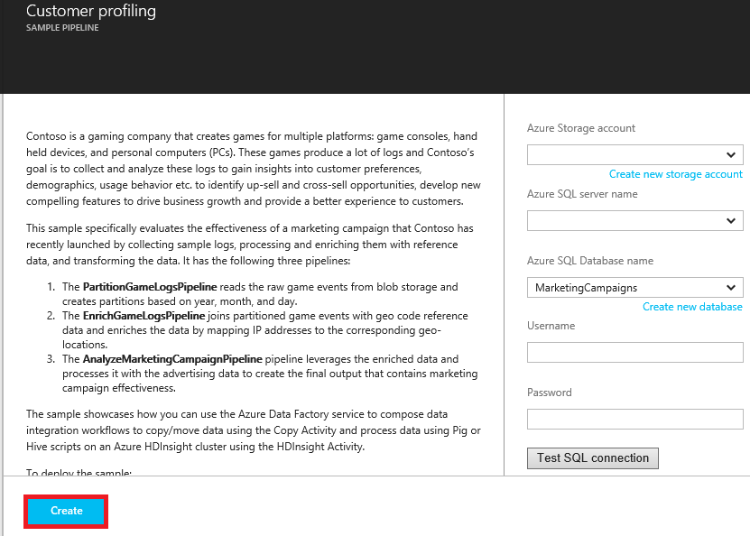

# Use Case - Customer Profiling
Azure Data Factory is one of many services used to implement the Cortana Intelligence Suite of solution accelerators.  For more information about Cortana Intelligence, visit [Cortana Intelligence Suite](https://www.microsoft.com/cortanaanalytics). In this document, we describe a simple use case to help you get started with understanding how Azure Data Factory can solve common analytics problems.

## Scenario
Contoso is a gaming company that creates games for multiple platforms: game consoles, hand held devices, and personal computers (PCs). As players play these games, large volume of log data is produced that tracks the usage patterns, gaming style, and preferences of the user.  When combined with demographic, regional, and product data, Contoso can perform analytics to guide them about how to enhance players’ experience and target them for upgrades and in-game purchases. 

Contoso’s goal is to identify up-sell/cross-sell opportunities based on the gaming history of its players and add compelling features to drive business growth and provide a better experience to customers. For this use case, we use a gaming company as an example of a business. The company wants to optimize its games based on players’ behavior. These principles apply to any business that wants to engage its customers around its goods and services and enhance their customers’ experience.

In this solution, Contoso wants to evaluate the effectiveness of a marketing campaign it has recently launched. We start with the raw gaming logs, process and enrich them with geolocation data, join it with advertising reference data, and lastly copy them into an Azure SQL Database to analyze the campaign’s impact.

## Deploy Solution
All you need to access and try out this simple use case is an [Azure subscription](https://azure.microsoft.com/pricing/free-trial/), an [Azure Blob storage account](../../storage/common/storage-quickstart-create-account.md), and an [Azure SQL Database](../../sql-database/sql-database-get-started.md). You deploy the customer profiling pipeline from the **Sample pipelines** tile on the home page of your data factory.

1. Create a data factory or open an existing data factory. See [Copy data from Blob Storage to SQL Database using Data Factory](data-factory-copy-data-from-azure-blob-storage-to-sql-database.md) for steps to create a data factory.
2. In the **DATA FACTORY** blade for the data factory, click the **Sample pipelines** tile.

    
3. In the **Sample pipelines** blade, click the **Customer profiling** that you want to deploy.

    
4. Specify configuration settings for the sample. For example, your Azure storage account name and key, Azure SQL server name, database, User ID, and password.

    
5. After you are done with specifying the configuration settings, click **Create** to create/deploy the sample pipelines and linked services/tables used by the pipelines.
6. You see the status of deployment on the sample tile you clicked earlier on the **Sample pipelines** blade.

    
7. When you see the **Deployment succeeded** message on the tile for the sample, close the **Sample pipelines** blade.  
8. On **DATA FACTORY** blade, you see that linked services, data sets, and pipelines are added to your data factory.  

    

## Solution Overview
This simple use case can be used as an example of how you can use Azure Data Factory to ingest, prepare, transform, analyze, and publish data.

This Figure depicts how the data pipelines appear in the Azure portal after they have been deployed.

1. The **PartitionGameLogsPipeline** reads the raw game events from blob storage and creates partitions based on year, month, and day.
2. The **EnrichGameLogsPipeline** joins partitioned game events with geo code reference data and enriches the data by mapping IP addresses to the corresponding geo-locations.
3. The **AnalyzeMarketingCampaignPipeline** pipeline uses the enriched data and processes it with the advertising data to create the final output that contains marketing campaign effectiveness.

In this example, Data Factory is used to orchestrate activities that copy input data, transform, and process the data, and output the final data to an Azure SQL Database.  You can also visualize the network of data pipelines, manage them, and monitor their status from the UI.

## Benefits
By optimizing their user profile analytics and aligning it with business goals, gaming company is able to quickly collect usage patterns, and analyze the effectiveness of its marketing campaigns.

