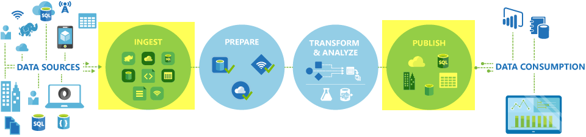
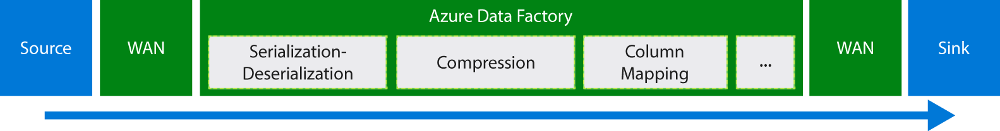
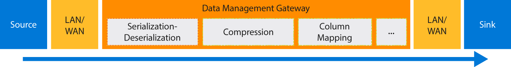

# Move data by using Copy Activity
> [!div class="op_single_selector" title1="Select the version of Data Factory service you are using:"]
> * [Version 1](data-factory-data-movement-activities.md)
> * [Version 2 (current version)](../copy-activity-overview.md)

> [!NOTE]
> This article applies to version 1 of Data Factory. If you are using the current version of the Data Factory service, see [Copy Activity in V2](../copy-activity-overview.md).

## Overview
In Azure Data Factory, you can use Copy Activity to copy data between on-premises and cloud data stores. After the data is copied, it can be further transformed and analyzed. You can also use Copy Activity to publish transformation and analysis results for business intelligence (BI) and application consumption.



Copy Activity is powered by a secure, reliable, scalable, and [globally available service](#global). This article provides details on data movement in Data Factory and Copy Activity.

First, let's see how data migration occurs between two cloud data stores, and between an on-premises data store and a cloud data store.

> [!NOTE]
> To learn about activities in general, see [Understanding pipelines and activities](data-factory-create-pipelines.md).
>
>

### Copy data between two cloud data stores
When both source and sink data stores are in the cloud, Copy Activity goes through the following stages to copy data from the source to the sink. The service that powers Copy Activity:

1. Reads data from the source data store.
2. Performs serialization/deserialization, compression/decompression, column mapping, and type conversion. It does these operations based on the configurations of the input dataset, output dataset, and Copy Activity.
3. Writes data to the destination data store.

The service automatically chooses the optimal region to perform the data movement. This region is usually the one closest to the sink data store.



### Copy data between an on-premises data store and a cloud data store
To securely move data between an on-premises data store and a cloud data store, install Data Management Gateway on your on-premises machine. Data Management Gateway is an agent that enables hybrid data movement and processing. You can install it on the same machine as the data store itself, or on a separate machine that has access to the data store.

In this scenario, Data Management Gateway performs the serialization/deserialization, compression/decompression, column mapping, and type conversion. Data does not flow through the Azure Data Factory service. Instead, Data Management Gateway directly writes the data to the destination store.



See [Move data between on-premises and cloud data stores](data-factory-move-data-between-onprem-and-cloud.md) for an introduction and walkthrough. See [Data Management Gateway](data-factory-data-management-gateway.md) for detailed information about this agent.

You can also move data from/to supported data stores that are hosted on Azure IaaS virtual machines (VMs) by using Data Management Gateway. In this case, you can install Data Management Gateway on the same VM as the data store itself, or on a separate VM that has access to the data store.

## Supported data stores and formats
Copy Activity in Data Factory copies data from a source data store to a sink data store. Data Factory supports the following data stores. Data from any source can be written to any sink. Click a data store to learn how to copy data to and from that store.

> [!NOTE] 
> If you need to move data to/from a data store that Copy Activity doesn't support, use a **custom activity** in Data Factory with your own logic for copying/moving data. For details on creating and using a custom activity, see [Use custom activities in an Azure Data Factory pipeline](data-factory-use-custom-activities.md).

[!INCLUDE [data-factory-supported-data-stores](../../../includes/data-factory-supported-data-stores.md)]

> [!NOTE]
> Data stores with * can be on-premises or on Azure IaaS, and require you to install [Data Management Gateway](data-factory-data-management-gateway.md) on an on-premises/Azure IaaS machine.

### Supported file formats
You can use Copy Activity to **copy files as-is** between two file-based data stores, you can skip the [format section](data-factory-create-datasets.md) in both the input and output dataset definitions. The data is copied efficiently without any serialization/deserialization.

Copy Activity also reads from and writes to files in specified formats: **Text, JSON, Avro, ORC, and Parquet**, and compression codec **GZip, Deflate, BZip2, and ZipDeflate** are supported. See [Supported file and compression formats](data-factory-supported-file-and-compression-formats.md) with details.

For example, you can do the following copy activities:

* Copy data in a SQL Server database and write to Azure Data Lake Store in ORC format.
* Copy files in text (CSV) format from on-premises File System and write to Azure Blob in Avro format.
* Copy zipped files from on-premises File System and decompress then land to Azure Data Lake Store.
* Copy data in GZip compressed text (CSV) format from Azure Blob and write to Azure SQL Database.

## <a name="global"></a>Globally available data movement
Azure Data Factory is available only in the West US, East US, and North Europe regions. However, the service that powers Copy Activity is available globally in the following regions and geographies. The globally available topology ensures efficient data movement that usually avoids cross-region hops. See [Services by region](https://azure.microsoft.com/regions/#services) for availability of Data Factory and Data Movement in a region.

### Copy data between cloud data stores
When both source and sink data stores are in the cloud, Data Factory uses a service deployment in the region that is closest to the sink in the same geography to move the data. Refer to the following table for mapping:

| Geography of the destination data stores | Region of the destination data store | Region used for data movement |
|:--- |:--- |:--- |
| United States | East US | East US |
| &nbsp; | East US 2 | East US 2 |
| &nbsp; | Central US | Central US |
| &nbsp; | North Central US | North Central US |
| &nbsp; | South Central US | South Central US |
| &nbsp; | West Central US | West Central US |
| &nbsp; | West US | West US |
| &nbsp; | West US 2 | West US 2 |
| Canada | Canada East | Canada Central |
| &nbsp; | Canada Central | Canada Central |
| Brazil | Brazil South | Brazil South |
| Europe | North Europe | North Europe |
| &nbsp; | West Europe | West Europe |
| United Kingdom | UK West | UK South |
| &nbsp; | UK South | UK South |
| Asia Pacific | Southeast Asia | Southeast Asia |
| &nbsp; | East Asia | Southeast Asia |
| Australia | Australia East | Australia East |
| &nbsp; | Australia Southeast | Australia Southeast |
| India | Central India | Central India |
| &nbsp; | West India | Central India |
| &nbsp; | South India | Central India |
| Japan | Japan East | Japan East |
| &nbsp; | Japan West | Japan East |
| Korea | Korea Central | Korea Central |
| &nbsp; | Korea South | Korea Central |

Alternatively, you can explicitly indicate the region of Data Factory service to be used to perform the copy by specifying `executionLocation` property under Copy Activity `typeProperties`. Supported values for this property are listed in above **Region used for data movement** column. Note your data goes through that region over the wire during copy. For example, to copy between Azure stores in Korea, you can specify `"executionLocation": "Japan East"` to route through Japan region (see [sample JSON](#by-using-json-scripts) as reference).

> [!NOTE]
> If the region of the destination data store is not in preceding list or undetectable, by default Copy Activity fails instead of going through an alternative region, unless `executionLocation` is specified. The supported region list will be expanded over time.
>

### Copy data between an on-premises data store and a cloud data store
When data is being copied between on-premises (or Azure virtual machines/IaaS) and cloud stores, [Data Management Gateway](data-factory-data-management-gateway.md) performs data movement on an on-premises machine or virtual machine. The data does not flow through the service in the cloud, unless you use the [staged copy](data-factory-copy-activity-performance.md#staged-copy) capability. In this case, data flows through the staging Azure Blob storage before it is written into the sink data store.

## Create a pipeline with Copy Activity
You can create a pipeline with Copy Activity in a couple of ways:

### By using the Copy Wizard
The Data Factory Copy Wizard helps you to create a pipeline with Copy Activity. This pipeline allows you to copy data from supported sources to destinations *without writing JSON* definitions for linked services, datasets, and pipelines. See [Data Factory Copy Wizard](data-factory-copy-wizard.md) for details about the wizard.  

### By using JSON scripts
You can use Data Factory Editor in Visual Studio, or Azure PowerShell to create a JSON definition for a pipeline (by using Copy Activity). Then, you can deploy it to create the pipeline in Data Factory. See [Tutorial: Use Copy Activity in an Azure Data Factory pipeline](data-factory-copy-data-from-azure-blob-storage-to-sql-database.md) for a tutorial with step-by-step instructions.    

JSON properties (such as name, description, input and output tables, and policies) are available for all types of activities. Properties that are available in the `typeProperties` section of the activity vary with each activity type.

For Copy Activity, the `typeProperties` section varies depending on the types of sources and sinks. Click a source/sink in the [Supported sources and sinks](#supported-data-stores-and-formats) section to learn about type properties that Copy Activity supports for that data store.

Here's a sample JSON definition:

```json
{
  "name": "ADFTutorialPipeline",
  "properties": {
    "description": "Copy data from Azure blob to Azure SQL table",
    "activities": [
      {
        "name": "CopyFromBlobToSQL",
        "type": "Copy",
        "inputs": [
          {
            "name": "InputBlobTable"
          }
        ],
        "outputs": [
          {
            "name": "OutputSQLTable"
          }
        ],
        "typeProperties": {
          "source": {
            "type": "BlobSource"
          },
          "sink": {
            "type": "SqlSink"
          },
          "executionLocation": "Japan East"          
        },
        "Policy": {
          "concurrency": 1,
          "executionPriorityOrder": "NewestFirst",
          "retry": 0,
          "timeout": "01:00:00"
        }
      }
    ],
    "start": "2016-07-12T00:00:00Z",
    "end": "2016-07-13T00:00:00Z"
  }
}
```
The schedule that is defined in the output dataset determines when the activity runs (for example: **daily**, frequency as **day**, and interval as **1**). The activity copies data from an input dataset (**source**) to an output dataset (**sink**).

You can specify more than one input dataset to Copy Activity. They are used to verify the dependencies before the activity is run. However, only the data from the first dataset is copied to the destination dataset. For more information, see [Scheduling and execution](data-factory-scheduling-and-execution.md).  

## Performance and tuning
See the [Copy Activity performance and tuning guide](data-factory-copy-activity-performance.md), which describes key factors that affect the performance of data movement (Copy Activity) in Azure Data Factory. It also lists the observed performance during internal testing and discusses various ways to optimize the performance of Copy Activity.

## Fault tolerance
By default, copy activity will stop copying data and return failure when encounter incompatible data between source and sink; while you can explicitly configure to skip and log the incompatible rows and only copy those compatible data to make the copy succeeded. See the [Copy Activity fault tolerance](data-factory-copy-activity-fault-tolerance.md) on more details.

## Security considerations
See the [Security considerations](data-factory-data-movement-security-considerations.md), which describes security infrastructure that data movement services in Azure Data Factory use to secure your data.

## Scheduling and sequential copy
See [Scheduling and execution](data-factory-scheduling-and-execution.md) for detailed information about how scheduling and execution works in Data Factory. It is possible to run multiple copy operations one after another in a sequential/ordered manner. See the [Copy sequentially](data-factory-scheduling-and-execution.md#multiple-activities-in-a-pipeline) section.

## Type conversions
Different data stores have different native type systems. Copy Activity performs automatic type conversions from source types to sink types with the following two-step approach:

1. Convert from native source types to a .NET type.
2. Convert from a .NET type to a native sink type.

The mapping from a native type system to a .NET type for a data store is in the respective data store article. (Click the specific link in the Supported data stores table). You can use these mappings to determine appropriate types while creating your tables, so that Copy Activity performs the right conversions.

## Next steps
* To learn about the Copy Activity more, see [Copy data from Azure Blob storage to Azure SQL Database](data-factory-copy-data-from-azure-blob-storage-to-sql-database.md).
* To learn about moving data from an on-premises data store to a cloud data store, see [Move data from on-premises to cloud data stores](data-factory-move-data-between-onprem-and-cloud.md).
