# Process large-scale datasets by using Data Factory and Batch
> [!NOTE]
> This article applies to version 1 of Azure Data Factory, which is generally available. If you use the current version of the Data Factory service, see [Custom activities in Data Factory](../transform-data-using-dotnet-custom-activity.md).

This article describes an architecture of a sample solution that moves and processes large-scale datasets in an automatic and scheduled manner. It also provides an end-to-end walkthrough to implement the solution by using Data Factory and Azure Batch.

[!INCLUDE [updated-for-az](../../../includes/updated-for-az.md)]

This article is longer than a typical article because it contains a walkthrough of an entire sample solution. If you're new to Batch and Data Factory, you can learn about these services and how they work together. If you know something about the services and are designing/architecting a solution, you can focus on the architecture section of the article. If you're developing a prototype or a solution, you might want to try out the step-by-step instructions in the walkthrough. We invite your comments about this content and how you use it.

First, let's look at how Data Factory and Batch services can help you process large datasets in the cloud.     


## Why Azure Batch?
 You can use Batch to run large-scale parallel and high-performance computing (HPC) applications efficiently in the cloud. It's a platform service that schedules compute-intensive work to run on a managed collection of virtual machines (VMs). It can automatically scale compute resources to meet the needs of your jobs.

With the Batch service, you define Azure compute resources to execute your applications in parallel, and at scale. You can run on-demand or scheduled jobs. You don't need to manually create, configure, and manage an HPC cluster, individual VMs, virtual networks, or a complex job and task-scheduling infrastructure.

 If you aren't familiar with Batch, the following articles help you understand the architecture/implementation of the solution described in this article:   

* [Basics of Batch](../../azure-sql/database/sql-database-paas-overview.md)
* [Batch feature overview](../../batch/batch-service-workflow-features.md)

Optionally, to learn more about Batch, see [the Batch documentation](https://docs.microsoft.com/azure/batch/).

## Why Azure Data Factory?
Data Factory is a cloud-based data integration service that orchestrates and automates the movement and transformation of data. You can use Data Factory to create managed data pipelines that move data from on-premises and cloud data stores to a centralized data store. An example is Azure Blob storage. You can use Data Factory to process/transform data by using services such as Azure HDInsight and Azure Machine Learning. You also can schedule data pipelines to run in a scheduled manner (for example, hourly, daily, and weekly). You can monitor and manage the pipelines at a glance to identify issues and take action.

  If you aren't familiar with Data Factory, the following articles help you understand the architecture/implementation of the solution described in this article:  

* [Introduction to Data Factory](data-factory-introduction.md)
* [Build your first data pipeline](data-factory-build-your-first-pipeline.md)   

Optionally, to learn more about Data Factory, see [the Data Factory documentation](https://docs.microsoft.com/rest/api/datafactory/v1/data-factory-data-factory).

## Data Factory and Batch together
Data Factory includes built-in activities. For example, the Copy activity is used to copy/move data from a source data store to a destination data store. The Hive activity is used to process data by using Hadoop clusters (HDInsight) on Azure. For a list of supported transformation activities, see [Data transformation activities](data-factory-data-transformation-activities.md).

You also can create custom .NET activities to move or process data with your own logic. You can run these activities on an HDInsight cluster or on a Batch pool of VMs. When you use Batch, you can configure the pool to autoscale (add or remove VMs based on the workload) based on a formula you provide.     

## Architecture of a sample solution
  The architecture described in this article is for a simple solution. It's also relevant to complex scenarios, such as risk modeling by financial services, image processing and rendering, and genomic analysis.

The diagram illustrates how Data Factory orchestrates data movement and processing. It also shows how Batch processes the data in a parallel manner. Download and print the diagram for easy reference (11 x 17 inches or A3 size). To access the diagram so that you can print it, see [HPC and data orchestration by using Batch and Data Factory](https://go.microsoft.com/fwlink/?LinkId=717686).

[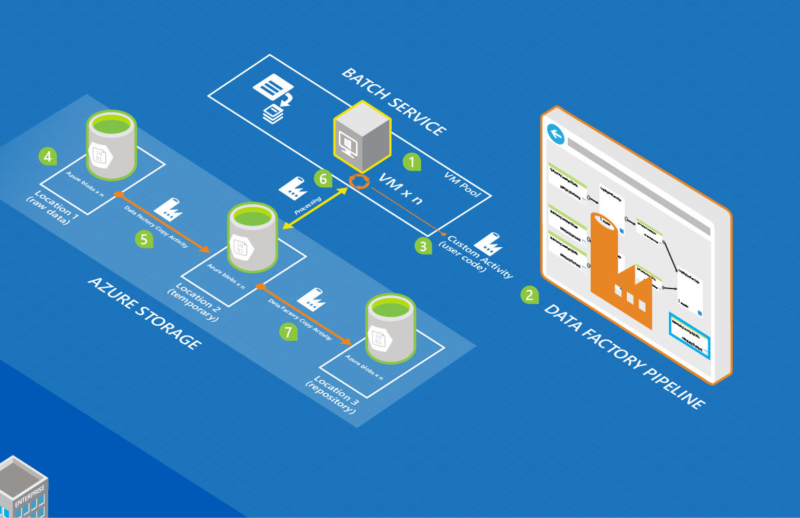](https://go.microsoft.com/fwlink/?LinkId=717686)

The following list provides the basic steps of the process. The solution includes code and explanations to build the end-to-end solution.

* **Configure Batch with a pool of compute nodes (VMs).** You can specify the number of nodes and the size of each node.

* **Create a Data Factory instance** that is configured with entities that represent blob storage, the Batch compute service, input/output data, and a workflow/pipeline with activities that move and transform data.

* **Create a custom .NET activity in the Data Factory pipeline.** The activity is your user code that runs on the Batch pool.

* **Store large amounts of input data as blobs in Azure Storage.** Data is divided into logical slices (usually by time).

* **Data Factory copies data that is processed in parallel** to the secondary location.

* **Data Factory runs the custom activity by using the pool allocated by Batch.** Data Factory can run activities concurrently. Each activity processes a slice of data. The results are stored in storage.

* **Data Factory moves the final results to a third location,** either for distribution via an app or for further processing by other tools.

## Implementation of the sample solution
The sample solution is intentionally simple. It's designed to show you how to use Data Factory and Batch together to process datasets. The solution counts the number of occurrences of the search term "Microsoft" in input files that are organized in a time series. It then outputs the count to output files.

**Time:** If you're familiar with the basics of Azure, Data Factory, and Batch and have completed the following prerequisites, this solution takes one to two hours to complete.

### Prerequisites
#### Azure subscription
If you don't have an Azure subscription, you can create a free trial account quickly. For more information, see [Free trial](https://azure.microsoft.com/pricing/free-trial/).

#### Azure storage account
You use a storage account to store the data in this tutorial. If you don't have a storage account, see [Create a storage account](../../storage/common/storage-account-create.md). The sample solution uses blob storage.

#### Azure Batch account
Create a Batch account by using the [Azure portal](https://portal.azure.com/). For more information, see [Create and manage a Batch account](../../batch/batch-account-create-portal.md). Note the Batch account name and account key. You also can use the [New-AzBatchAccount](https://docs.microsoft.com/powershell/module/az.batch/new-azbatchaccount) cmdlet to create a Batch account. For instructions on how to use this cmdlet, see [Get started with Batch PowerShell cmdlets](../../batch/batch-powershell-cmdlets-get-started.md).

The sample solution uses Batch (indirectly via a data factory pipeline) to process data in a parallel manner on a pool of compute nodes (a managed collection of VMs).

#### Azure Batch pool of virtual machines
Create a Batch pool with at least two compute nodes.

1. In the [Azure portal](https://portal.azure.com), select **Browse** in the left menu, and select **Batch Accounts**.

1. Select your Batch account to open the **Batch Account** blade.

1. Select the **Pools** tile.

1. On the **Pools** blade, select the **Add** button on the toolbar to add a pool.

   a. Enter an ID for the pool (**Pool ID**). Note the ID of the pool. You need it when you create the data factory solution.

   b. Specify **Windows Server 2012 R2** for the **Operating System Family** setting.

   c. Select a **node pricing tier**.

   d. Enter **2** as the value for the **Target Dedicated** setting.

   e. Enter **2** as the value for the **Max tasks per node** setting.

   f. Select **OK** to create the pool.

#### Azure Storage Explorer
You use [Azure Storage Explorer 6](https://azurestorageexplorer.codeplex.com/) or [CloudXplorer](https://clumsyleaf.com/products/cloudxplorer) (from ClumsyLeaf Software) to inspect and alter the data in your Storage projects. You also can inspect and alter the data in the logs of your cloud-hosted applications.

1. Create a container named **mycontainer** with private access (no anonymous access).

1. If you use CloudXplorer, create folders and subfolders with the following structure:

   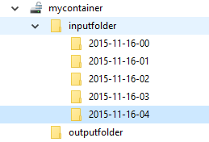

   `Inputfolder` and `outputfolder` are top-level folders in `mycontainer`. The `inputfolder` folder has subfolders with date-time stamps (YYYY-MM-DD-HH).

   If you use Storage Explorer, in the next step, you upload files with the following names: `inputfolder/2015-11-16-00/file.txt`, `inputfolder/2015-11-16-01/file.txt`, and so on. This step automatically creates the folders.

1. Create a text file **file.txt** on your machine with content that has the keyword **Microsoft**. An example is "test custom activity Microsoft test custom activity Microsoft."

1. Upload the file to the following input folders in blob storage:

   

   If you use Storage Explorer, upload the **file.txt** file to **mycontainer**. Select **Copy** on the toolbar to create a copy of the blob. In the **Copy Blob** dialog box, change the **destination blob name** to `inputfolder/2015-11-16-00/file.txt`. Repeat this step to create `inputfolder/2015-11-16-01/file.txt`, `inputfolder/2015-11-16-02/file.txt`, `inputfolder/2015-11-16-03/file.txt`, `inputfolder/2015-11-16-04/file.txt`, and so on. This action automatically creates the folders.

1. Create another container named `customactivitycontainer`. Upload the custom activity zip file to this container.

#### Visual Studio
Install Visual Studio 2012 or later to create the custom Batch activity to be used in the data factory solution.

### High-level steps to create the solution
1. Create a custom activity that contains the data processing logic.

1. Create a data factory that uses the custom activity.

### Create the custom activity
The data factory custom activity is the heart of this sample solution. The sample solution uses Batch to run the custom activity. For information about how to develop custom activities and use them in data factory pipelines, see [Use custom activities in a data factory pipeline](data-factory-use-custom-activities.md).

To create a .NET custom activity that you can use in a data factory pipeline, you create a .NET class library project with a class that implements the IDotNetActivity interface. This interface has only one method: Execute. Here is the signature of the method:

```csharp
public IDictionary<string, string> Execute(
            IEnumerable<LinkedService> linkedServices,
            IEnumerable<Dataset> datasets,
            Activity activity,
            IActivityLogger logger)
```

The method has a few key components that you need to understand:

* The method takes four parameters:

  * **linkedServices**. This parameter is an enumerable list of linked services that link input/output data sources (for example, blob storage) to the data factory. In this sample, there is only one linked service of the type Azure Storage used for both input and output.
  * **datasets**. This parameter is an enumerable list of datasets. You can use this parameter to get the locations and schemas defined by input and output datasets.
  * **activity**. This parameter represents the current compute entity. In this case, it's a Batch service.
  * **logger**. You can use the logger to write debug comments that surface as the "User" log for the pipeline.
* The method returns a dictionary that can be used to chain custom activities together in the future. This feature isn't implemented yet, so just return an empty dictionary from the method.

#### Procedure: Create the custom activity
1. Create a .NET class library project in Visual Studio.

   a. Start Visual Studio 2012/2013/2015.

   b. Select **File** > **New** > **Project**.

   c. Expand **Templates**, and select **Visual C\#**. In this walkthrough, you use C\#, but you can use any .NET language to develop the custom activity.

   d. Select **Class Library** from the list of project types on the right.

   e. Enter **MyDotNetActivity** for the **Name**.

   f. Select **C:\\ADF** for the **Location**. Create the folder **ADF** if it doesn't exist.

   g. Select **OK** to create the project.

1. Select **Tools** > **NuGet Package Manager** > **Package Manager Console**.

1. In the Package Manager Console, execute the following command to import Microsoft.Azure.Management.DataFactories:

    ```powershell
    Install-Package Microsoft.Azure.Management.DataFactories
    ```
1. Import the **Azure Storage** NuGet package into the project. You need this package because you use the Blob Storage API in this sample:

    ```powershell
    Install-Package Az.Storage
    ```
1. Add the following using directives to the source file in the project:

    ```csharp
    using System.IO;
    using System.Globalization;
    using System.Diagnostics;
    using System.Linq;

    using Microsoft.Azure.Management.DataFactories.Models;
    using Microsoft.Azure.Management.DataFactories.Runtime;

    using Microsoft.WindowsAzure.Storage;
    using Microsoft.WindowsAzure.Storage.Blob;
    ```
1. Change the name of the namespace to **MyDotNetActivityNS**.

    ```csharp
    namespace MyDotNetActivityNS
    ```
1. Change the name of the class to **MyDotNetActivity**, and derive it from the **IDotNetActivity** interface as shown:

    ```csharp
    public class MyDotNetActivity : IDotNetActivity
    ```
1. Implement (add) the **Execute** method of the **IDotNetActivity** interface to the **MyDotNetActivity** class. Copy the following sample code to the method. For an explanation of the logic used in this method, see the [Execute method](#execute-method) section.

    ```csharp
    /// <summary>
    /// The Execute method is the only method of IDotNetActivity interface you must implement.
    /// In this sample, the method invokes the Calculate method to perform the core logic.  
    /// </summary>
    public IDictionary<string, string> Execute(
       IEnumerable<LinkedService> linkedServices,
       IEnumerable<Dataset> datasets,
       Activity activity,
       IActivityLogger logger)
    {

       // Declare types for the input and output data stores.
       AzureStorageLinkedService inputLinkedService;

       Dataset inputDataset = datasets.Single(dataset => dataset.Name == activity.Inputs.Single().Name);

       foreach (LinkedService ls in linkedServices)
           logger.Write("linkedService.Name {0}", ls.Name);

       // Use the First method instead of Single because we are using the same
       // Azure Storage linked service for input and output.
       inputLinkedService = linkedServices.First(
           linkedService =>
           linkedService.Name ==
           inputDataset.Properties.LinkedServiceName).Properties.TypeProperties
           as AzureStorageLinkedService;

       string connectionString = inputLinkedService.ConnectionString; // To create an input storage client.
       string folderPath = GetFolderPath(inputDataset);
       string output = string.Empty; // for use later.

       // Create the storage client for input. Pass the connection string.
       CloudStorageAccount inputStorageAccount = CloudStorageAccount.Parse(connectionString);
       CloudBlobClient inputClient = inputStorageAccount.CreateCloudBlobClient();

       // Initialize the continuation token before using it in the do-while loop.
       BlobContinuationToken continuationToken = null;
       do
       {   // get the list of input blobs from the input storage client object.
           BlobResultSegment blobList = inputClient.ListBlobsSegmented(folderPath,
                                    true,
                                    BlobListingDetails.Metadata,
                                    null,
                                    continuationToken,
                                    null,
                                    null);

           // The Calculate method returns the number of occurrences of
           // the search term "Microsoft" in each blob associated
           // with the data slice.
           //
           // The definition of the method is shown in the next step.
           output = Calculate(blobList, logger, folderPath, ref continuationToken, "Microsoft");

       } while (continuationToken != null);

       // Get the output dataset by using the name of the dataset matched to a name in the Activity output collection.
       Dataset outputDataset = datasets.Single(dataset => dataset.Name == activity.Outputs.Single().Name);

       folderPath = GetFolderPath(outputDataset);

       logger.Write("Writing blob to the folder: {0}", folderPath);

       // Create a storage object for the output blob.
       CloudStorageAccount outputStorageAccount = CloudStorageAccount.Parse(connectionString);
       // Write the name of the file.
       Uri outputBlobUri = new Uri(outputStorageAccount.BlobEndpoint, folderPath + "/" + GetFileName(outputDataset));

       logger.Write("output blob URI: {0}", outputBlobUri.ToString());
       // Create a blob and upload the output text.
       CloudBlockBlob outputBlob = new CloudBlockBlob(outputBlobUri, outputStorageAccount.Credentials);
       logger.Write("Writing {0} to the output blob", output);
       outputBlob.UploadText(output);

       // The dictionary can be used to chain custom activities together in the future.
       // This feature is not implemented yet, so just return an empty dictionary.
       return new Dictionary<string, string>();
    }
    ```
1. Add the following helper methods to the class. These methods are invoked by the **Execute** method. Most important, the **Calculate** method isolates the code that iterates through each blob.

    ```csharp
    /// <summary>
    /// Gets the folderPath value from the input/output dataset.
    /// </summary>
    private static string GetFolderPath(Dataset dataArtifact)
    {
       if (dataArtifact == null || dataArtifact.Properties == null)
       {
           return null;
       }

       AzureBlobDataset blobDataset = dataArtifact.Properties.TypeProperties as AzureBlobDataset;
       if (blobDataset == null)
       {
           return null;
       }

       return blobDataset.FolderPath;
    }

    /// <summary>
    /// Gets the fileName value from the input/output dataset.
    /// </summary>

    private static string GetFileName(Dataset dataArtifact)
    {
       if (dataArtifact == null || dataArtifact.Properties == null)
       {
           return null;
       }

       AzureBlobDataset blobDataset = dataArtifact.Properties.TypeProperties as AzureBlobDataset;
       if (blobDataset == null)
       {
           return null;
       }

       return blobDataset.FileName;
    }

    /// <summary>
    /// Iterates through each blob (file) in the folder, counts the number of instances of the search term in the file,
    /// and prepares the output text that is written to the output blob.
    /// </summary>

    public static string Calculate(BlobResultSegment Bresult, IActivityLogger logger, string folderPath, ref BlobContinuationToken token, string searchTerm)
    {
       string output = string.Empty;
       logger.Write("number of blobs found: {0}", Bresult.Results.Count<IListBlobItem>());
       foreach (IListBlobItem listBlobItem in Bresult.Results)
       {
           CloudBlockBlob inputBlob = listBlobItem as CloudBlockBlob;
           if ((inputBlob != null) && (inputBlob.Name.IndexOf("$$$.$$$") == -1))
           {
               string blobText = inputBlob.DownloadText(Encoding.ASCII, null, null, null);
               logger.Write("input blob text: {0}", blobText);
               string[] source = blobText.Split(new char[] { '.', '?', '!', ' ', ';', ':', ',' }, StringSplitOptions.RemoveEmptyEntries);
               var matchQuery = from word in source
                                where word.ToLowerInvariant() == searchTerm.ToLowerInvariant()
                                select word;
               int wordCount = matchQuery.Count();
               output += string.Format("{0} occurrences(s) of the search term \"{1}\" were found in the file {2}.\r\n", wordCount, searchTerm, inputBlob.Name);
           }
       }
       return output;
    }
    ```
    The GetFolderPath method returns the path to the folder that the dataset points to and the GetFileName method returns the name of the blob/file that the dataset points to.

    ```csharp

    "name": "InputDataset",
    "properties": {
        "type": "AzureBlob",
        "linkedServiceName": "StorageLinkedService",
        "typeProperties": {
            "fileName": "file.txt",
            "folderPath": "mycontainer/inputfolder/{Year}-{Month}-{Day}-{Hour}",
    ```

    The Calculate method calculates the number of instances of the keyword "Microsoft" in the input files (blobs in the folder). The search term "Microsoft" is hard-coded in the code.

1. Compile the project. Select **Build** from the menu, and then select **Build Solution**.

1. Start Windows Explorer, and go to the **bin\\debug** or **bin\\release** folder. The folder choice depends on the type of build.

1. Create a zip file **MyDotNetActivity.zip** that contains all the binaries in the **\\bin\\Debug** folder. You might want to include the MyDotNetActivity.**pdb** file so that you get additional details such as the line number in the source code that caused the issue when a failure occurs.

   

1. Upload **MyDotNetActivity.zip** as a blob to the blob container `customactivitycontainer` in the blob storage that the StorageLinkedService linked service in ADFTutorialDataFactory uses. Create the blob container `customactivitycontainer` if it doesn't already exist.

#### Execute method
This section provides more details about the code in the Execute method.

1. The members for iterating through the input collection are found in the [Microsoft.WindowsAzure.Storage.Blob](https://docs.microsoft.com/java/api/com.microsoft.azure.storage.blob) namespace. To iterate through the blob collection, you're required to use the **BlobContinuationToken** class. In essence, you must use a do-while loop with the token as the mechanism for exiting the loop. For more information, see [Use Blob storage from .NET](../../storage/blobs/storage-dotnet-how-to-use-blobs.md). A basic loop is shown here:

    ```csharp
    // Initialize the continuation token.
    BlobContinuationToken continuationToken = null;
    do
    {
    // Get the list of input blobs from the input storage client object.
    BlobResultSegment blobList = inputClient.ListBlobsSegmented(folderPath,

                         true,
                                   BlobListingDetails.Metadata,
                                   null,
                                   continuationToken,
                                   null,
                                   null);
    // Return a string derived from parsing each blob.

     output = Calculate(blobList, logger, folderPath, ref continuationToken, "Microsoft");

    } while (continuationToken != null);

    ```
   For more information, see the documentation for the [ListBlobsSegmented](https://docs.microsoft.com/java/api/com.microsoft.azure.storage.blob.cloudblobcontainer.listblobssegmented) method.

1. The code for working through the set of blobs logically goes within the do-while loop. In the **Execute** method, the do-while loop passes the list of blobs to a method named **Calculate**. The method returns a string variable named **output** that is the result of having iterated through all the blobs in the segment.

   It returns the number of occurrences of the search term "Microsoft" in the blob passed to the **Calculate** method.

    ```csharp
    output += string.Format("{0} occurrences of the search term \"{1}\" were found in the file {2}.\r\n", wordCount, searchTerm, inputBlob.Name);
    ```
1. After the **Calculate** method is finished, it must be written to a new blob. For every set of blobs processed, a new blob can be written with the results. To write to a new blob, first find the output dataset.

    ```csharp
    // Get the output dataset by using the name of the dataset matched to a name in the Activity output collection.
    Dataset outputDataset = datasets.Single(dataset => dataset.Name == activity.Outputs.Single().Name);
    ```
1. The code also calls the helper method **GetFolderPath** to retrieve the folder path (the storage container name).

    ```csharp
    folderPath = GetFolderPath(outputDataset);
    ```
   The GetFolderPath method casts the DataSet object to an AzureBlobDataSet, which has a property named FolderPath.

    ```csharp
    AzureBlobDataset blobDataset = dataArtifact.Properties.TypeProperties as AzureBlobDataset;

    return blobDataset.FolderPath;
    ```
1. The code calls the **GetFileName** method to retrieve the file name (blob name). The code is similar to the previous code that was used to get the folder path.

    ```csharp
    AzureBlobDataset blobDataset = dataArtifact.Properties.TypeProperties as AzureBlobDataset;

    return blobDataset.FileName;
    ```
1. The name of the file is written by creating a URI object. The URI constructor uses the **BlobEndpoint** property to return the container name. The folder path and file name are added to construct the output blob URI.  

    ```csharp
    // Write the name of the file.
    Uri outputBlobUri = new Uri(outputStorageAccount.BlobEndpoint, folderPath + "/" + GetFileName(outputDataset));
    ```
1. After the name of the file is written, you can write the output string from the **Calculate** method to a new blob:

    ```csharp
    // Create a blob and upload the output text.
    CloudBlockBlob outputBlob = new CloudBlockBlob(outputBlobUri, outputStorageAccount.Credentials);
    logger.Write("Writing {0} to the output blob", output);
    outputBlob.UploadText(output);
    ```

### Create the data factory
In the [Create the custom activity](#create-the-custom-activity) section, you created a custom activity and uploaded the zip file with binaries and the PDB file to a blob container. In this section, you create a data factory with a pipeline that uses the custom activity.

The input dataset for the custom activity represents the blobs (files) in the input folder (`mycontainer\\inputfolder`) in blob storage. The output dataset for the activity represents the output blobs in the output folder (`mycontainer\\outputfolder`) in blob storage.

Drop one or more files into the input folders:

```
mycontainer -\> inputfolder
    2015-11-16-00
    2015-11-16-01
    2015-11-16-02
    2015-11-16-03
    2015-11-16-04
```

For example, drop one file (file.txt) with the following content into each of the folders:

```
test custom activity Microsoft test custom activity Microsoft
```

Each input folder corresponds to a slice in the data factory even if the folder has two or more files. When each slice is processed by the pipeline, the custom activity iterates through all the blobs in the input folder for that slice.

You see five output files with the same content. For example, the output file from processing the file in the 2015-11-16-00 folder has the following content:

```
2 occurrences(s) of the search term "Microsoft" were found in the file inputfolder/2015-11-16-00/file.txt.
```

If you drop multiple files (file.txt, file2.txt, file3.txt) with the same content into the input folder, you see the following content in the output file. Each folder (2015-11-16-00, etc.) corresponds to a slice in this sample even though the folder has multiple input files.

```csharp
2 occurrences(s) of the search term "Microsoft" were found in the file inputfolder/2015-11-16-00/file.txt.
2 occurrences(s) of the search term "Microsoft" were found in the file inputfolder/2015-11-16-00/file2.txt.
2 occurrences(s) of the search term "Microsoft" were found in the file inputfolder/2015-11-16-00/file3.txt.
```

The output file has three lines now, one for each input file (blob) in the folder associated with the slice (2015-11-16-00).

A task is created for each activity run. In this sample, there is only one activity in the pipeline. When a slice is processed by the pipeline, the custom activity runs on Batch to process the slice. Because there are five slices (each slice can have multiple blobs or file), five tasks are created in Batch. When a task runs on Batch, it's the custom activity that is running.

The following walkthrough provides additional details.

#### Step 1: Create the data factory
1. After you sign in to the [Azure portal](https://portal.azure.com/), take the following steps:

   a. Select **NEW** on the left menu.

   b. Select **Data + Analytics** on the **New** blade.

   c. Select **Data Factory** on the **Data analytics** blade.

1. On the **New data factory** blade, enter **CustomActivityFactory** for the name. The name of the data factory must be globally unique. If you receive the error "Data factory name CustomActivityFactory is not available," change the name of the data factory. For example, use yournameCustomActivityFactory, and create the data factory again.

1. Select **RESOURCE GROUP NAME**, and select an existing resource group or create a resource group.

1. Verify that the subscription and region where you want the data factory to be created are correct.

1. Select **Create** on the **New data factory** blade.

1. The data factory is created in the dashboard of the portal.

1. After the data factory is created successfully, you see the **Data factory** page, which shows you the contents of the data factory.

   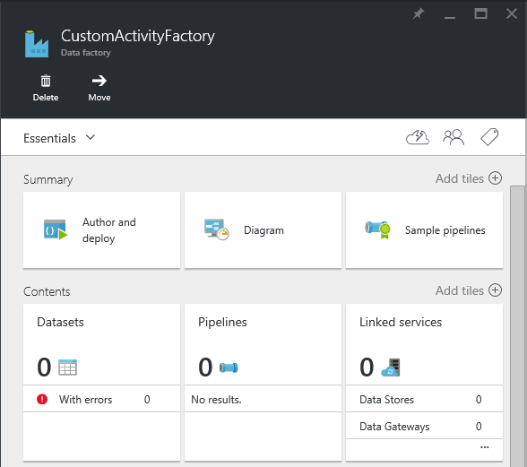

#### Step 2: Create linked services
Linked services link data stores or compute services to a data factory. In this step, you link your storage account and Batch account to your data factory.

#### Create an Azure Storage linked service
1. Select the **Author and deploy** tile on the **Data factory** blade for **CustomActivityFactory**. The Data Factory Editor appears.

1. Select **New data store** on the command bar, and choose **Azure storage.** The JSON script you use to create a Storage linked service in the editor appears.

   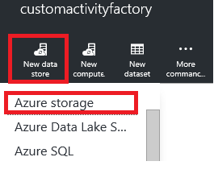

1. Replace **account name** with the name of your storage account. Replace **account key** with the access key of the storage account. To learn how to get your storage access key, see [Manage storage account access keys](../../storage/common/storage-account-keys-manage.md).

1. Select **Deploy** on the command bar to deploy the linked service.

   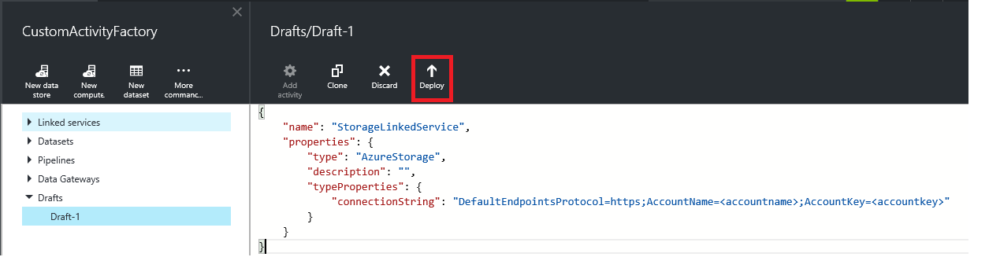

#### Create an Azure Batch linked service
In this step, you create a linked service for your Batch account that is used to run the data factory custom activity.

1. Select **New compute** on the command bar, and choose **Azure Batch.** The JSON script you use to create a Batch linked service in the editor appears.

1. In the JSON script:

   a. Replace **account name** with the name of your Batch account.

   b. Replace **access key** with the access key of the Batch account.

   c. Enter the ID of the pool for the **poolName** property. For this property, you can specify either the pool name or the pool ID.

   d. Enter the batch URI for the **batchUri** JSON property.

      > [!IMPORTANT]
      > The URL from the **Batch Account** blade is in the following format:
     \<accountname\>.\<region\>.batch.azure.com. For the **batchUri** property in the JSON script, you need to remove a88"accountname."** from the URL. An example is `"batchUri": "https://eastus.batch.azure.com"`.
      >
      >

      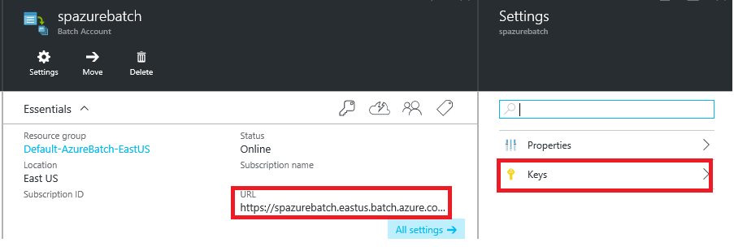

      For the **poolName** property, you also can specify the ID of the pool instead of the name of the pool.

      > [!NOTE]
      > The Data Factory service doesn't support an on-demand option for Batch as it does for HDInsight. You can use only your own Batch pool in a data factory.
      >
      >

   e. Specify **StorageLinkedService** for the **linkedServiceName** property. You created this linked service in the previous step. This storage is used as a staging area for files and logs.

1. Select **Deploy** on the command bar to deploy the linked service.

#### Step 3: Create datasets
In this step, you create datasets to represent input and output data.

#### Create the input dataset
1. In the Data Factory Editor, select the **New dataset** button on the toolbar. Select **Azure Blob storage** from the drop-down list.

1. Replace the JSON script in the right pane with the following JSON snippet:

    ```json
    {
       "name": "InputDataset",
       "properties": {
           "type": "AzureBlob",
           "linkedServiceName": "AzureStorageLinkedService",
           "typeProperties": {
               "folderPath": "mycontainer/inputfolder/{Year}-{Month}-{Day}-{Hour}",
               "format": {
                   "type": "TextFormat"
               },
               "partitionedBy": [
                   {
                       "name": "Year",
                       "value": {
                           "type": "DateTime",
                           "date": "SliceStart",
                           "format": "yyyy"
                       }
                   },
                   {
                       "name": "Month",
                       "value": {
                           "type": "DateTime",
                           "date": "SliceStart",
                           "format": "MM"
                       }
                   },
                   {
                       "name": "Day",
                       "value": {
                           "type": "DateTime",
                           "date": "SliceStart",
                           "format": "dd"
                       }
                   },
                   {
                       "name": "Hour",
                       "value": {
                           "type": "DateTime",
                           "date": "SliceStart",
                           "format": "HH"
                       }
                   }
               ]
           },
           "availability": {
               "frequency": "Hour",
               "interval": 1
           },
           "external": true,
           "policy": {}
       }
    }
    ```

    You create a pipeline later in this walkthrough with the start time 2015-11-16T00:00:00Z and the end time 2015-11-16T05:00:00Z. It's scheduled to produce data hourly, so there are five input/output slices (between **00**:00:00 -\> **05**:00:00).

    The **frequency** and **interval** for the input dataset are set to **Hour** and **1**, which means that the input slice is available hourly.

    The start time for each slice is represented by the **SliceStart** system variable in the previous JSON snippet. Here are the start times for each slice.

    | **Slice** | **Start time**          |
    |-----------|-------------------------|
    | 1         | 2015-11-16T**00**:00:00 |
    | 2         | 2015-11-16T**01**:00:00 |
    | 3         | 2015-11-16T**02**:00:00 |
    | 4         | 2015-11-16T**03**:00:00 |
    | 5         | 2015-11-16T**04**:00:00 |

    The **folderPath** is calculated by using the year, month, day, and hour part of the slice start time (**SliceStart**). Here is how an input folder is mapped to a slice.

    | **Slice** | **Start time**          | **Input folder**  |
    |-----------|-------------------------|-------------------|
    | 1         | 2015-11-16T**00**:00:00 | 2015-11-16-**00** |
    | 2         | 2015-11-16T**01**:00:00 | 2015-11-16-**01** |
    | 3         | 2015-11-16T**02**:00:00 | 2015-11-16-**02** |
    | 4         | 2015-11-16T**03**:00:00 | 2015-11-16-**03** |
    | 5         | 2015-11-16T**04**:00:00 | 2015-11-16-**04** |

1. Select **Deploy** on the toolbar to create and deploy the **InputDataset** table.

#### Create the output dataset
In this step, you create another dataset of the type AzureBlob to represent the output data.

1. In the Data Factory Editor, select the **New dataset** button on the toolbar. Select **Azure Blob storage** from the drop-down list.

1. Replace the JSON script in the right pane with the following JSON snippet:

    ```json
    {
       "name": "OutputDataset",
       "properties": {
           "type": "AzureBlob",
           "linkedServiceName": "AzureStorageLinkedService",
           "typeProperties": {
               "fileName": "{slice}.txt",
               "folderPath": "mycontainer/outputfolder",
               "partitionedBy": [
                   {
                       "name": "slice",
                       "value": {
                           "type": "DateTime",
                           "date": "SliceStart",
                           "format": "yyyy-MM-dd-HH"
                       }
                   }
               ]
           },
           "availability": {
               "frequency": "Hour",
               "interval": 1
           }
       }
    }
    ```

    An output blob/file is generated for each input slice. Here is how an output file is named for each slice. All the output files are generated in one output folder, `mycontainer\\outputfolder`.

    | **Slice** | **Start time**          | **Output file**       |
    |-----------|-------------------------|-----------------------|
    | 1         | 2015-11-16T**00**:00:00 | 2015-11-16-**00.txt** |
    | 2         | 2015-11-16T**01**:00:00 | 2015-11-16-**01.txt** |
    | 3         | 2015-11-16T**02**:00:00 | 2015-11-16-**02.txt** |
    | 4         | 2015-11-16T**03**:00:00 | 2015-11-16-**03.txt** |
    | 5         | 2015-11-16T**04**:00:00 | 2015-11-16-**04.txt** |

    Remember that all the files in an input folder (for example, 2015-11-16-00) are part of a slice with the start time 2015-11-16-00. When this slice is processed, the custom activity scans through each file and produces a line in the output file with the number of occurrences of the search term "Microsoft." If there are three files in the folder 2015-11-16-00, there are three lines in the output file  2015-11-16-00.txt.

1. Select **Deploy** on the toolbar to create and deploy the **OutputDataset**.

#### Step 4: Create and run the pipeline with a custom activity
In this step, you create a pipeline with one activity, the custom activity you created previously.

> [!IMPORTANT]
> If you haven't uploaded **file.txt** to input folders in the blob container, do so before you create the pipeline. The **isPaused** property is set to false in the pipeline JSON, so the pipeline runs immediately because the **start** date is in the past.
>
>

1. In the Data Factory Editor, select **New pipeline** on the command bar. If you don't see the command, select the ellipsis symbol to display it.

1. Replace the JSON script in the right pane with the following JSON snippet:

    ```json
    {
       "name": "PipelineCustom",
       "properties": {
           "description": "Use custom activity",
           "activities": [
               {
                   "type": "DotNetActivity",
                   "typeProperties": {
                       "assemblyName": "MyDotNetActivity.dll",
                       "entryPoint": "MyDotNetActivityNS.MyDotNetActivity",
                       "packageLinkedService": "AzureStorageLinkedService",
                       "packageFile": "customactivitycontainer/MyDotNetActivity.zip"
                   },
                   "inputs": [
                       {
                           "name": "InputDataset"
                       }
                   ],
                   "outputs": [
                       {
                           "name": "OutputDataset"
                       }
                   ],
                   "policy": {
                       "timeout": "00:30:00",
                       "concurrency": 5,
                       "retry": 3
                   },
                   "scheduler": {
                       "frequency": "Hour",
                       "interval": 1
                   },
                   "name": "MyDotNetActivity",
                   "linkedServiceName": "AzureBatchLinkedService"
               }
           ],
           "start": "2015-11-16T00:00:00Z",
           "end": "2015-11-16T05:00:00Z",
           "isPaused": false
      }
    }
    ```
   Note the following points:

   * Only one activity is in the pipeline, and it's of the type **DotNetActivity**.
   * **AssemblyName** is set to the name of the DLL **MyDotNetActivity.dll**.
   * **EntryPoint** is set to **MyDotNetActivityNS.MyDotNetActivity**. It's basically \<namespace\>.\<classname\> in your code.
   * **PackageLinkedService** is set to **StorageLinkedService**, which points to the blob storage that contains the custom activity zip file. If you use different storage accounts for input/output files and the custom activity zip file, you have to create another Storage linked service. This article assumes that you use the same storage account.
   * **PackageFile** is set to **customactivitycontainer/MyDotNetActivity.zip**. It's in the format \<containerforthezip\>/\<nameofthezip.zip\>.
   * The custom activity takes **InputDataset** as input and **OutputDataset** as output.
   * The **linkedServiceName** property of the custom activity points to **AzureBatchLinkedService**, which tells Data Factory that the custom activity needs to run on Batch.
   * The **concurrency** setting is important. If you use the default value, which is 1, even if you have two or more compute nodes in the Batch pool, the slices are processed one after another. Therefore, you aren't taking advantage of the parallel processing capability of Batch. If you set **concurrency** to a higher value, say 2, it means that two slices (corresponds to two tasks in Batch) can be processed at the same time. In this case, both the VMs in the Batch pool are utilized. Set the concurrency property appropriately.
   * Only one task (slice) is executed on a VM at any point by default. By default, **Maximum tasks per VM** is set to 1 for a Batch pool. As part of the prerequisites, you created a pool with this property set to 2. Therefore, two data factory slices can run on a VM at the same time.
     - The **isPaused** property is set to false by default. The pipeline runs immediately in this example because the slices start in the past. You can set this property to **true** to pause the pipeline and set it back to **false** to restart.
     -   The **start** and **end** times are five hours apart. Slices are produced hourly, so five slices are produced by the pipeline.

1. Select **Deploy** on the command bar to deploy the pipeline.

#### Step 5: Test the pipeline
In this step, you test the pipeline by dropping files into the input folders. Start by testing the pipeline with one file for each input folder.

1. On the **Data factory** blade in the Azure portal, select **Diagram**.

   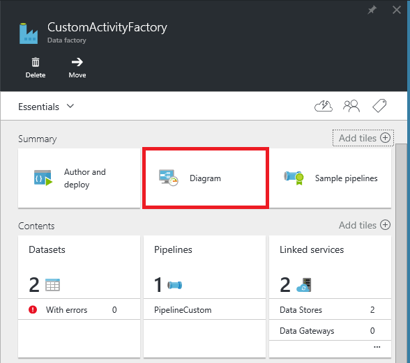

1. In the **Diagram** view, double-click the input dataset **InputDataset**.

   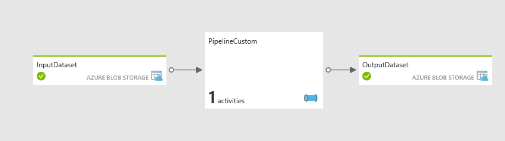

1. The **InputDataset** blade appears with all five slices ready. Notice the **SLICE START TIME** and **SLICE END TIME** for each slice.

   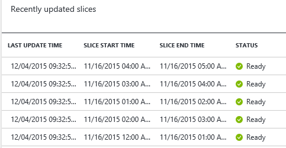

1. In the **Diagram** view, select **OutputDataset**.

1. The five output slices appear in the **Ready** state if they were produced.

   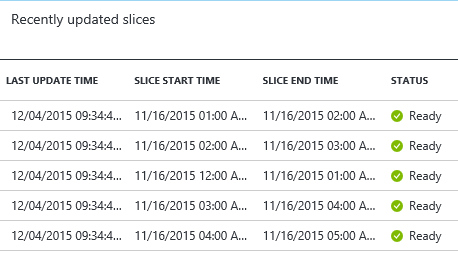

1. Use the portal to view the tasks associated with the slices and see what VM each slice ran on. For more information, see the [Data Factory and Batch integration](#data-factory-and-batch-integration) section.

1. The output files appear under `mycontainer` in `outputfolder` in your blob storage.

   

   Five output files are listed, one for each input slice. Each of the output files has content similar to the following output:

    ```
    2 occurrences(s) of the search term "Microsoft" were found in the file inputfolder/2015-11-16-00/file.txt.
    ```
   The following diagram illustrates how the data factory slices map to tasks in Batch. In this example, a slice has only one run.

   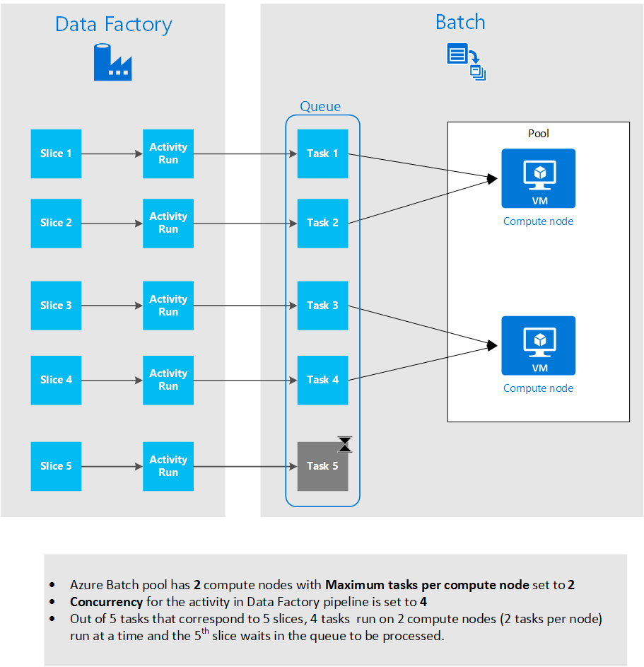

1. Now try with multiple files in a folder. Create the files **file2.txt**, **file3.txt**, **file4.txt**, and **file5.txt** with the same content as in file.txt in the folder **2015-11-06-01**.

1. In the output folder, delete the output file **2015-11-16-01.txt**.

1. On the **OutputDataset** blade, right-click the slice with **SLICE START TIME** set to **11/16/2015 01:00:00 AM**. Select **Run** to rerun/reprocess the slice. The slice now has five files instead of one file.

    

1. After the slice runs and its status is **Ready**, verify the content in the output file for this slice (**2015-11-16-01.txt**). The output file appears under `mycontainer` in `outputfolder` in your blob storage. There should be a line for each file of the slice.

    ```
    2 occurrences(s) of the search term "Microsoft" were found in the file inputfolder/2015-11-16-01/file.txt.
    2 occurrences(s) of the search term "Microsoft" were found in the file inputfolder/2015-11-16-01/file2.txt.
    2 occurrences(s) of the search term "Microsoft" were found in the file inputfolder/2015-11-16-01/file3.txt.
    2 occurrences(s) of the search term "Microsoft" were found in the file inputfolder/2015-11-16-01/file4.txt.
    2 occurrences(s) of the search term "Microsoft" were found in the file inputfolder/2015-11-16-01/file5.txt.
    ```

> [!NOTE]
> If you didn't delete the output file 2015-11-16-01.txt before you tried with five input files, you see one line from the previous slice run and five lines from the current slice run. By default, the content is appended to the output file if it already exists.
>
>

#### Data Factory and Batch integration
The Data Factory service creates a job in Batch with the name `adf-poolname:job-xxx`.


A task in the job is created for each activity run of a slice. If 10 slices are ready to be processed, 10 tasks are created in the job. You can have more than one slice running in parallel if you have multiple compute nodes in the pool. If the maximum number of tasks per compute node is set to greater than one, more than one slice can run on the same compute.

In this example, there are five slices, so there are five tasks in Batch. With **concurrency** set to **5** in the pipeline JSON in the data factory and **Maximum tasks per VM** set to **2** in the Batch pool with **2** VMs, the tasks run fast. (Check the start and end times for tasks.)

Use the portal to view the Batch job and its tasks that are associated with the slices and see what VM each slice ran on.


### Debug the pipeline
Debugging consists of a few basic techniques.

1. If the input slice isn't set to **Ready**, confirm that the input folder structure is correct and that file.txt exists in the input folders.

   

1. In the **Execute** method of your custom activity, use the **IActivityLogger** object to log information that helps you troubleshoot issues. The logged messages show up in the user\_0.log file.

   On the **OutputDataset** blade, select the slice to see the **Data slice** blade for that slice. Under **Activity runs**, you see one activity run for the slice. If you select **Run** in the command bar, you can start another activity run for the same slice.

   When you select the activity run, you see the **Activity run details** blade with a list of log files. You see logged messages in the user\_0.log file. When an error occurs, you see three activity runs because the retry count is set to 3 in the pipeline/activity JSON. When you select the activity run, you see the log files that you can review to troubleshoot the error.

   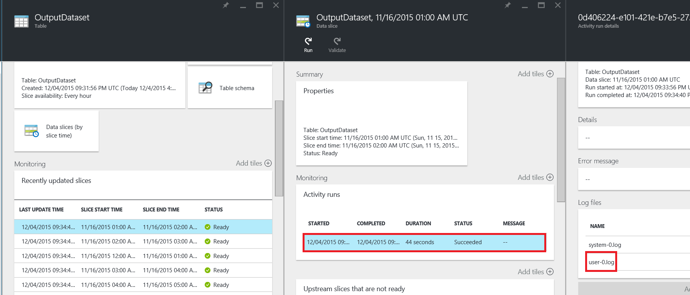

   In the list of log files, select **user-0.log**. In the right panel, the results of using the **IActivityLogger.Write** method appear.

   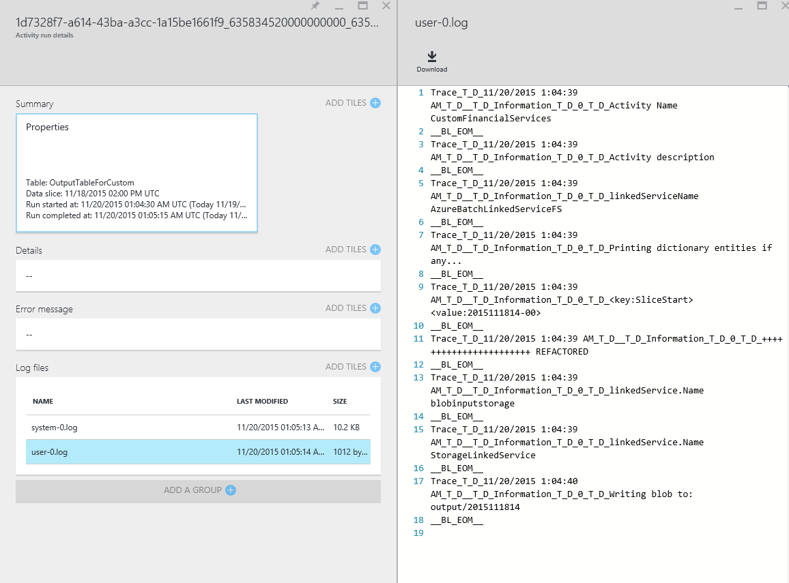

   Check the system-0.log for any system error messages and exceptions.

    ```
    Trace\_T\_D\_12/6/2015 1:43:35 AM\_T\_D\_\_T\_D\_Verbose\_T\_D\_0\_T\_D\_Loading assembly file MyDotNetActivity...

    Trace\_T\_D\_12/6/2015 1:43:35 AM\_T\_D\_\_T\_D\_Verbose\_T\_D\_0\_T\_D\_Creating an instance of MyDotNetActivityNS.MyDotNetActivity from assembly file MyDotNetActivity...

    Trace\_T\_D\_12/6/2015 1:43:35 AM\_T\_D\_\_T\_D\_Verbose\_T\_D\_0\_T\_D\_Executing Module

    Trace\_T\_D\_12/6/2015 1:43:38 AM\_T\_D\_\_T\_D\_Information\_T\_D\_0\_T\_D\_Activity e3817da0-d843-4c5c-85c6-40ba7424dce2 finished successfully
    ```
1. Include the **PDB** file in the zip file so that the error details have information such as call stack when an error occurs.

1. All the files in the zip file for the custom activity must be at the top level with no subfolders.

   

1. Ensure that **assemblyName** (MyDotNetActivity.dll), **entryPoint** (MyDotNetActivityNS.MyDotNetActivity), **packageFile** (customactivitycontainer/MyDotNetActivity.zip), and **packageLinkedService** (should point to the blob storage that contains the zip file) are set to the correct values.

1. If you fixed an error and want to reprocess the slice, right-click the slice in the **OutputDataset** blade and select **Run**.

   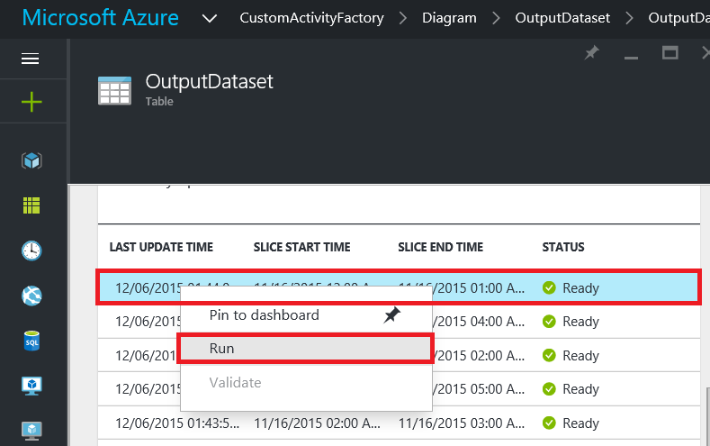

   > [!NOTE]
   > A container is in your blob storage named `adfjobs`. This container isn't automatically deleted, but you can safely delete it after you finish testing the solution. Similarly, the data factory solution creates a Batch job named `adf-\<pool ID/name\>:job-0000000001`. You can delete this job after you test the solution if you like.
   >
   >
1. The custom activity doesn't use the **app.config** file from your package. Therefore, if your code reads any connection strings from the configuration file, it doesn't work at runtime. The best practice when you use Batch is to hold any secrets in Azure Key Vault. Then use a certificate-based service principal to protect the key vault and distribute the certificate to the Batch pool. The .NET custom activity can access secrets from the key vault at runtime. This generic solution can scale to any type of secret, not just a connection string.

    There is an easier workaround, but it's not a best practice. You can create a SQL Database linked service with connection string settings. Then you can create a dataset that uses the linked service and chain the dataset as a dummy input dataset to the custom .NET activity. You can then access the linked service's connection string in the custom activity code. It should work fine at runtime.  

#### Extend the sample
You can extend this sample to learn more about Data Factory and Batch features. For example, to process slices in a different time range, take the following steps:

1. Add the following subfolders in `inputfolder`: 2015-11-16-05, 2015-11-16-06, 201-11-16-07, 2011-11-16-08, and 2015-11-16-09. Place input files in those folders. Change the end time for the pipeline from `2015-11-16T05:00:00Z` to `2015-11-16T10:00:00Z`. In the **Diagram** view, double-click **InputDataset** and confirm that the input slices are ready. Double-click **OutputDataset** to see the state of the output slices. If they're in the **Ready** state, check the output folder for the output files.

1. Increase or decrease the **concurrency** setting to understand how it affects the performance of your solution, especially the processing that occurs on Batch. For more information on the **concurrency** setting, see "Step 4: Create and run the pipeline with a custom activity."

1. Create a pool with higher/lower **Maximum tasks per VM**. To use the new pool you created, update the Batch linked service in the data factory solution. For more information on the **Maximum tasks per VM** setting, see "Step 4: Create and run the pipeline with a custom activity."

1. Create a Batch pool with the **autoscale** feature. Automatically scaling compute nodes in a Batch pool is the dynamic adjustment of processing power used by your application.

    The sample formula here achieves the following behavior. When the pool is initially created, it starts with one VM. The $PendingTasks metric defines the number of tasks in the running and active (queued) states. The formula finds the average number of pending tasks in the last 180 seconds and sets TargetDedicated accordingly. It ensures that TargetDedicated never goes beyond 25 VMs. As new tasks are submitted, the pool automatically grows. As tasks complete, VMs become free one by one and the autoscaling shrinks those VMs. You can adjust startingNumberOfVMs and maxNumberofVMs to your needs.

    Autoscale formula:

    ```
    startingNumberOfVMs = 1;
    maxNumberofVMs = 25;
    pendingTaskSamplePercent = $PendingTasks.GetSamplePercent(180 * TimeInterval_Second);
    pendingTaskSamples = pendingTaskSamplePercent < 70 ? startingNumberOfVMs : avg($PendingTasks.GetSample(180 * TimeInterval_Second));
    $TargetDedicated=min(maxNumberofVMs,pendingTaskSamples);
    ```

   For more information, see [Automatically scale compute nodes in a Batch pool](../../batch/batch-automatic-scaling.md).

   If the pool uses the default [autoScaleEvaluationInterval](https://msdn.microsoft.com/library/azure/dn820173.aspx), the Batch service might take 15 to 30 minutes to prepare the VM before running the custom activity. If the pool uses a different autoScaleEvaluationInterval, the Batch service might take autoScaleEvaluationInterval plus 10 minutes.

1. In the sample solution, the **Execute** method invokes the **Calculate** method that processes an input data slice to produce an output data slice. You can write your own method to process input data and replace the **Calculate** method call in the **Execute** method with a call to your method.

### Next steps: Consume the data
After you process data, you can consume it with online tools such as Power BI. Here are links to help you understand Power BI and how to use it in Azure:

* [Explore a dataset in Power BI](https://powerbi.microsoft.com/documentation/powerbi-service-get-data/)
* [Get started with Power BI Desktop](https://docs.microsoft.com/power-bi/fundamentals/desktop-getting-started)
* [Refresh data in Power BI](https://powerbi.microsoft.com/documentation/powerbi-refresh-data/)
* [Azure and Power BI: Basic overview](https://powerbi.microsoft.com/documentation/powerbi-azure-and-power-bi/)

## References
* [Azure Data Factory](https://azure.microsoft.com/documentation/services/data-factory/)

  * [Introduction to the Data Factory service](data-factory-introduction.md)
  * [Get started with Data Factory](data-factory-build-your-first-pipeline.md)
  * [Use custom activities in a Data Factory pipeline](data-factory-use-custom-activities.md)
* [Azure Batch](https://azure.microsoft.com/documentation/services/batch/)

  * [Basics of Batch](../../azure-sql/database/sql-database-paas-overview.md)
  * [Overview of Batch features](../../batch/batch-service-workflow-features.md))
  * [Create and manage a Batch account in the Azure portal](../../batch/batch-account-create-portal.md)
  * [Get started with the Batch client library for .NET](../../batch/quick-run-dotnet.md)

[batch-explorer]: https://github.com/Azure/azure-batch-samples/tree/master/CSharp/BatchExplorer
[batch-explorer-walkthrough]: https://blogs.technet.com/b/windowshpc/archive/2015/01/20/azure-batch-explorer-sample-walkthrough.aspx
