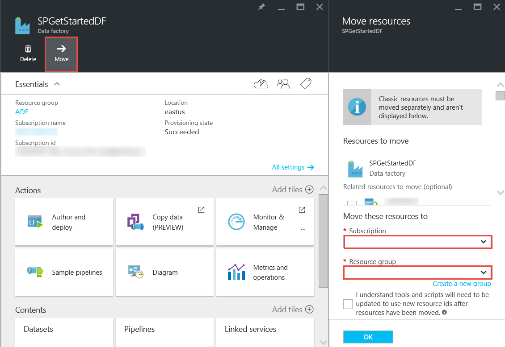

# Azure Data Factory - Frequently Asked Questions
> [!NOTE]
> This article applies to version 1 of Data Factory. If you are using the current version of the Data Factory service, see [frequently asked question - Data Factory](../frequently-asked-questions.md).

[!INCLUDE [updated-for-az](../../../includes/updated-for-az.md)]

## General questions
### What is Azure Data Factory?
Data Factory is a cloud-based data integration service that **automates the movement and transformation of data**. Just like a factory that runs equipment to take raw materials and transform them into finished goods, Data Factory orchestrates existing services that collect raw data and transform it into ready-to-use information.

Data Factory allows you to create data-driven workflows to move data between both on-premises and cloud data stores as well as process/transform data using compute services such as Azure HDInsight and Azure Data Lake Analytics. After you create a pipeline that performs the action that you need, you can schedule it to run periodically (hourly, daily, weekly etc.).   

For more information, see [Overview & Key Concepts](data-factory-introduction.md).

### Where can I find pricing details for Azure Data Factory?
See [Data Factory Pricing Details page][adf-pricing-details] for the pricing details for the Azure Data Factory.  

### How do I get started with Azure Data Factory?
* For an overview of Azure Data Factory, see [Introduction to Azure Data Factory](data-factory-introduction.md).
* For a tutorial on how to **copy/move data** using Copy Activity, see [Copy data from Azure Blob Storage to Azure SQL Database](data-factory-copy-data-from-azure-blob-storage-to-sql-database.md).
* For a tutorial on how to **transform data** using HDInsight Hive Activity. See [Process data by running Hive script on Hadoop cluster](data-factory-build-your-first-pipeline.md)

### What is the Data Factory's region availability?
Data Factory is available in **US West** and **North Europe**. The compute and storage services used by data factories can be in other regions. See [Supported regions](data-factory-introduction.md#supported-regions).

### What are the limits on number of data factories/pipelines/activities/datasets?
See **Azure Data Factory Limits** section of the [Azure Subscription and Service Limits, Quotas, and Constraints](../../azure-resource-manager/management/azure-subscription-service-limits.md#data-factory-limits) article.

### What is the authoring/developer experience with Azure Data Factory service?
You can author/create data factories using one of the following tools/SDKs:

* **Visual Studio**
    You can use Visual Studio to create an Azure data factory. See [Build your first data pipeline using Visual Studio](data-factory-build-your-first-pipeline-using-vs.md) for details.
* **Azure PowerShell**
    See [Create and monitor Azure Data Factory using Azure PowerShell](data-factory-build-your-first-pipeline-using-powershell.md) for a tutorial/walkthrough for creating a data factory using PowerShell. See [Data Factory Cmdlet Reference][adf-powershell-reference] content on MSDN Library for a comprehensive documentation of Data Factory cmdlets.
* **.NET Class Library**
    You can programmatically create data factories by using Data Factory .NET SDK. See [Create, monitor, and manage data factories using .NET SDK](data-factory-create-data-factories-programmatically.md) for a walkthrough of creating a data factory using .NET SDK. See [Data Factory Class Library Reference][msdn-class-library-reference] for a comprehensive documentation of Data Factory .NET SDK.
* **REST API**
    You can also use the REST API exposed by the Azure Data Factory service to create and deploy data factories. See [Data Factory REST API Reference][msdn-rest-api-reference] for a comprehensive documentation of Data Factory REST API.
* **Azure Resource Manager Template**
    See [Tutorial: Build your first Azure data factory using Azure Resource Manager template](data-factory-build-your-first-pipeline-using-arm.md) fo details.

### Can I rename a data factory?
No. Like other Azure resources, the name of an Azure data factory cannot be changed.

### Can I move a data factory from one Azure subscription to another?
Yes. Use the **Move** button on your data factory blade as shown in the following diagram:



### What are the compute environments supported by Data Factory?
The following table provides a list of compute environments supported by Data Factory and the activities that can run on them.

| Compute environment | activities |
| --- | --- |
| [On-demand HDInsight cluster](data-factory-compute-linked-services.md#azure-hdinsight-on-demand-linked-service) or [your own HDInsight cluster](data-factory-compute-linked-services.md#azure-hdinsight-linked-service) |[DotNet](data-factory-use-custom-activities.md), [Hive](data-factory-hive-activity.md), [Pig](data-factory-pig-activity.md), [MapReduce](data-factory-map-reduce.md), [Hadoop Streaming](data-factory-hadoop-streaming-activity.md) |
| [Azure Batch](data-factory-compute-linked-services.md#azure-batch-linked-service) |[DotNet](data-factory-use-custom-activities.md) |
| [Azure Machine Learning](data-factory-compute-linked-services.md#azure-machine-learning-linked-service) |[Machine Learning activities: Batch Execution and Update Resource](data-factory-azure-ml-batch-execution-activity.md) |
| [Azure Data Lake Analytics](data-factory-compute-linked-services.md#azure-data-lake-analytics-linked-service) |[Data Lake Analytics U-SQL](data-factory-usql-activity.md) |
| [Azure SQL](data-factory-compute-linked-services.md#azure-sql-linked-service), [Azure SQL Data Warehouse](data-factory-compute-linked-services.md#azure-sql-data-warehouse-linked-service), [SQL Server](data-factory-compute-linked-services.md#sql-server-linked-service) |[Stored Procedure](data-factory-stored-proc-activity.md) |

### How does Azure Data Factory compare with SQL Server Integration Services (SSIS)? 
See the [Azure Data Factory vs. SSIS](https://www.sqlbits.com/Sessions/Event15/Azure_Data_Factory_vs_SSIS) presentation from one of our MVPs (Most Valued Professionals): Reza Rad. Some of the recent changes in Data Factory may not be listed in the slide deck. We are continuously adding more capabilities to Azure Data Factory. We are continuously adding more capabilities to Azure Data Factory. We will incorporate these updates into the comparison of data integration technologies from Microsoft sometime later this year.   

## Activities - FAQ
### What are the different types of activities you can use in a Data Factory pipeline?
* [Data Movement Activities](data-factory-data-movement-activities.md) to move data.
* [Data Transformation Activities](data-factory-data-transformation-activities.md) to process/transform data.

### When does an activity run?
The **availability** configuration setting in the output data table determines when the activity is run. If input datasets are specified, the activity checks whether all the input data dependencies are satisfied (that is, **Ready** state) before it starts running.

## Copy Activity - FAQ
### Is it better to have a pipeline with multiple activities or a separate pipeline for each activity?
Pipelines are supposed to bundle related activities. If the datasets that connect them are not consumed by any other activity outside the pipeline, you can keep the activities in one pipeline. This way, you would not need to chain pipeline active periods so that they align with each other. Also, the data integrity in the tables internal to the pipeline is better preserved when updating the pipeline. Pipeline update essentially stops all the activities within the pipeline, removes them, and creates them again. From authoring perspective, it might also be easier to see the flow of data within the related activities in one JSON file for the pipeline.

### What are the supported data stores?
Copy Activity in Data Factory copies data from a source data store to a sink data store. Data Factory supports the following data stores. Data from any source can be written to any sink. Click a data store to learn how to copy data to and from that store.

[!INCLUDE [data-factory-supported-data-stores](../../../includes/data-factory-supported-data-stores.md)]

> [!NOTE]
> Data stores with * can be on-premises or on Azure IaaS, and require you to install [Data Management Gateway](data-factory-data-management-gateway.md) on an on-premises/Azure IaaS machine.

### What are the supported file formats?
[!INCLUDE [data-factory-file-format](../../../includes/data-factory-file-format.md)]

### Where is the copy operation performed?
See [Globally available data movement](data-factory-data-movement-activities.md#global) section for details. In short, when an on-premises data store is involved, the copy operation is performed by the Data Management Gateway in your on-premises environment. And, when the data movement is between two cloud stores, the copy operation is performed in the region closest to the sink location in the same geography.

## HDInsight Activity - FAQ
### What regions are supported by HDInsight?
See the Geographic Availability section in the following article: or [HDInsight Pricing Details][hdinsight-supported-regions].

### What region is used by an on-demand HDInsight cluster?
The on-demand HDInsight cluster is created in the same region where the storage you specified to be used with the cluster exists.    

### How to associate additional storage accounts to your HDInsight cluster?
If you are using your own HDInsight Cluster (BYOC - Bring Your Own Cluster), see the following topics:

* [Using an HDInsight Cluster with Alternate Storage Accounts and Metastores][hdinsight-alternate-storage]
* [Use Additional Storage Accounts with HDInsight Hive][hdinsight-alternate-storage-2]

If you are using an on-demand cluster that is created by the Data Factory service, specify additional storage accounts for the HDInsight linked service so that the Data Factory service can register them on your behalf. In the JSON definition for the on-demand linked service, use **additionalLinkedServiceNames** property to specify alternate storage accounts as shown in the following JSON snippet:

```JSON
{
    "name": "MyHDInsightOnDemandLinkedService",
    "properties":
    {
        "type": "HDInsightOnDemandLinkedService",
        "typeProperties": {
            "version": "3.5",
            "clusterSize": 1,
            "timeToLive": "00:05:00",
            "osType": "Linux",
            "linkedServiceName": "LinkedService-SampleData",
            "additionalLinkedServiceNames": [ "otherLinkedServiceName1", "otherLinkedServiceName2" ]
        }
    }
}
```
In the example above, otherLinkedServiceName1 and otherLinkedServiceName2 represent linked services whose definitions contain credentials that the HDInsight cluster needs to access alternate storage accounts.

## Slices - FAQ
### Why are my input slices not in Ready state?
A common mistake is not setting **external** property to **true** on the input dataset when the input data is external to the data factory (not produced by the data factory).

In the following example, you only need to set **external** to true on **dataset1**.  

**DataFactory1**
Pipeline 1: dataset1 -> activity1 -> dataset2 -> activity2 -> dataset3
Pipeline 2: dataset3-> activity3 -> dataset4

If you have another data factory with a pipeline that takes dataset4 (produced by pipeline 2 in data factory 1), mark dataset4 as an external dataset because the dataset is produced by a different data factory (DataFactory1, not DataFactory2).  

**DataFactory2**    
Pipeline 1: dataset4->activity4->dataset5

If the external property is properly set, verify whether the input data exists in the location specified in the input dataset definition.

### How to run a slice at another time than midnight when the slice is being produced daily?
Use the **offset** property to specify the time at which you want the slice to be produced. See [Dataset availability](data-factory-create-datasets.md#dataset-availability) section for details about this property. Here is a quick example:

```json
"availability":
{
    "frequency": "Day",
    "interval": 1,
    "offset": "06:00:00"
}
```
Daily slices start at **6 AM** instead of the default midnight.     

### How can I rerun a slice?
You can rerun a slice in one of the following ways:

* Use Monitor and Manage App to rerun an activity window or slice. See [Rerun selected activity windows](data-factory-monitor-manage-app.md#perform-batch-actions) for instructions.   
* Click **Run** in the command bar on the **DATA SLICE** blade for the slice in the Azure portal.
* Run **Set-AzDataFactorySliceStatus** cmdlet with Status set to **Waiting** for the slice.   

	```powershell
    Set-AzDataFactorySliceStatus -Status Waiting -ResourceGroupName $ResourceGroup -DataFactoryName $df -TableName $table -StartDateTime "02/26/2015 19:00:00" -EndDateTime "02/26/2015 20:00:00"
    ```
  See [Set-AzDataFactorySliceStatus][set-azure-datafactory-slice-status] for details about the cmdlet.

### How long did it take to process a slice?
Use Activity Window Explorer in Monitor & Manage App to know how long it took to process a data slice. See [Activity Window Explorer](data-factory-monitor-manage-app.md#activity-window-explorer) for details.

You can also do the following in the Azure portal:  

1. Click **Datasets** tile on the **DATA FACTORY** blade for your data factory.
2. Click the specific dataset on the **Datasets** blade.
3. Select the slice that you are interested in from the **Recent slices** list on the **TABLE** blade.
4. Click the activity run from the **Activity Runs** list on the **DATA SLICE** blade.
5. Click **Properties** tile on the **ACTIVITY RUN DETAILS** blade.
6. You should see the **DURATION** field with a value. This value is the time taken to process the slice.   

### How to stop a running slice?
If you need to stop the pipeline from executing, you can use [Suspend-AzDataFactoryPipeline](/powershell/module/az.datafactory/suspend-azdatafactorypipeline) cmdlet. Currently, suspending the pipeline does not stop the slice executions that are in progress. Once the in-progress executions finish, no extra slice is picked up.

If you really want to stop all the executions immediately, the only way would be to delete the pipeline and create it again. If you choose to delete the pipeline, you do NOT need to delete tables and linked services used by the pipeline.

[create-factory-using-dotnet-sdk]: data-factory-create-data-factories-programmatically.md
[msdn-class-library-reference]: /dotnet/api/microsoft.azure.management.datafactories.models
[msdn-rest-api-reference]: /rest/api/datafactory/

[adf-powershell-reference]: /powershell/module/az.datafactory/
[azure-portal]: https://portal.azure.com
[set-azure-datafactory-slice-status]: /powershell/module/az.datafactory/set-Azdatafactoryslicestatus

[adf-pricing-details]: https://go.microsoft.com/fwlink/?LinkId=517777
[hdinsight-supported-regions]: https://azure.microsoft.com/pricing/details/hdinsight/
[hdinsight-alternate-storage]: https://social.technet.microsoft.com/wiki/contents/articles/23256.using-an-hdinsight-cluster-with-alternate-storage-accounts-and-metastores.aspx
[hdinsight-alternate-storage-2]: https://blogs.msdn.com/b/cindygross/archive/2014/05/05/use-additional-storage-accounts-with-hdinsight-hive.aspx
