# Move data between on-premises sources and the cloud with Data Management Gateway
> [!NOTE]
> This article applies to version 1 of Data Factory. If you are using the current version of the Data Factory service, see [copy data between on-premises and cloud using Data Factory](../tutorial-hybrid-copy-powershell.md).

This article provides an overview of data integration between on-premises data stores and cloud data stores using Data Factory. It builds on the [Data Movement Activities](data-factory-data-movement-activities.md) article and other data factory core concepts articles: [datasets](data-factory-create-datasets.md) and [pipelines](data-factory-create-pipelines.md).

## Data Management Gateway
You must install Data Management Gateway on your on-premises machine to enable moving data to/from an on-premises data store. The gateway can be installed on the same machine as the data store or on a different machine as long as the gateway can connect to the data store.

> [!IMPORTANT]
> See [Data Management Gateway](data-factory-data-management-gateway.md) article for details about Data Management Gateway. 

The following walkthrough shows you how to create a data factory with a pipeline that moves data from an on-premises **SQL Server** database to an Azure blob storage. As part of the walkthrough, you install and configure the Data Management Gateway on your machine.

## Walkthrough: copy on-premises data to cloud
In this walkthrough you do the following steps: 

1. Create a data factory.
2. Create a data management gateway. 
3. Create linked services for source and sink data stores.
4. Create datasets to represent input and output data.
5. Create a pipeline with a copy activity to move the data.

## Prerequisites for the tutorial
Before you begin this walkthrough, you must have the following prerequisites:

* **Azure subscription**.  If you don't have a subscription, you can create a free trial account in just a couple of minutes. See the [Free Trial](https://azure.microsoft.com/pricing/free-trial/) article for details.
* **Azure Storage Account**. You use the blob storage as a **destination/sink** data store in this tutorial. if you don't have an Azure storage account, see the [Create a storage account](../../storage/common/storage-quickstart-create-account.md) article for steps to create one.
* **SQL Server**. You use an on-premises SQL Server database as a **source** data store in this tutorial. 

## Create data factory
In this step, you use the Azure portal to create an Azure Data Factory instance named **ADFTutorialOnPremDF**.

1. Log in to the [Azure portal](https://portal.azure.com).
2. Click **Create a resource**, click **Intelligence + analytics**, and click **Data Factory**.

     
3. In the **New data factory** page, enter **ADFTutorialOnPremDF** for the Name.

    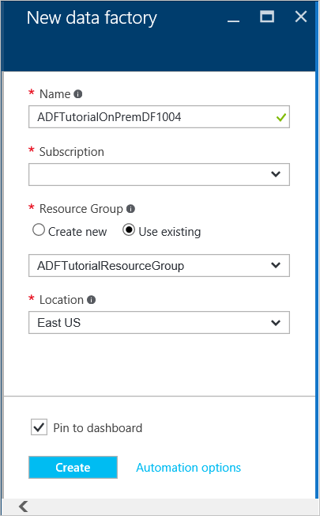

   > [!IMPORTANT]
   > The name of the Azure data factory must be globally unique. If you receive the error: **Data factory name “ADFTutorialOnPremDF” is not available**, change the name of the data factory (for example, yournameADFTutorialOnPremDF) and try creating again. Use this name in place of ADFTutorialOnPremDF while performing remaining steps in this tutorial.
   >
   > The name of the data factory may be registered as a **DNS** name in the future and hence become publicly visible.
   >
   >
4. Select the **Azure subscription** where you want the data factory to be created.
5. Select existing **resource group** or create a resource group. For the tutorial, create a resource group named: **ADFTutorialResourceGroup**.
6. Click **Create** on the **New data factory** page.

   > [!IMPORTANT]
   > To create Data Factory instances, you must be a member of the [Data Factory Contributor](../../role-based-access-control/built-in-roles.md#data-factory-contributor) role at the subscription/resource group level.
   >
   >
7. After creation is complete, you see the **Data Factory** page as shown in the following image:

   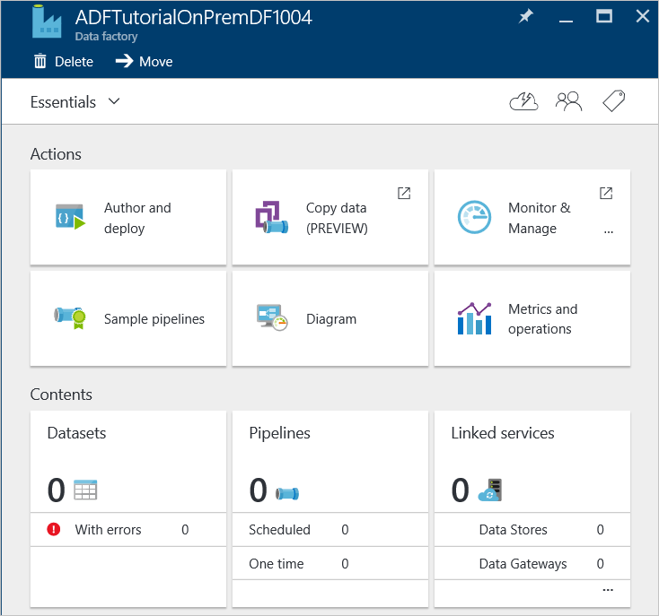

## Create gateway
1. In the **Data Factory** page, click **Author and deploy** tile to launch the **Editor** for the data factory.

    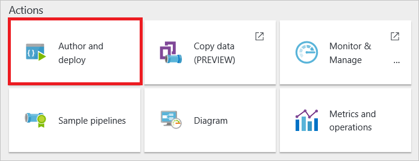
2. In the Data Factory Editor, click **... More** on the toolbar and then click **New data gateway**. Alternatively, you can right-click **Data Gateways** in the tree view, and click **New data gateway**.

   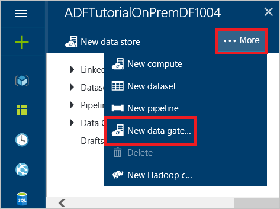
3. In the **Create** page, enter **adftutorialgateway** for the **name**, and click **OK**.     

    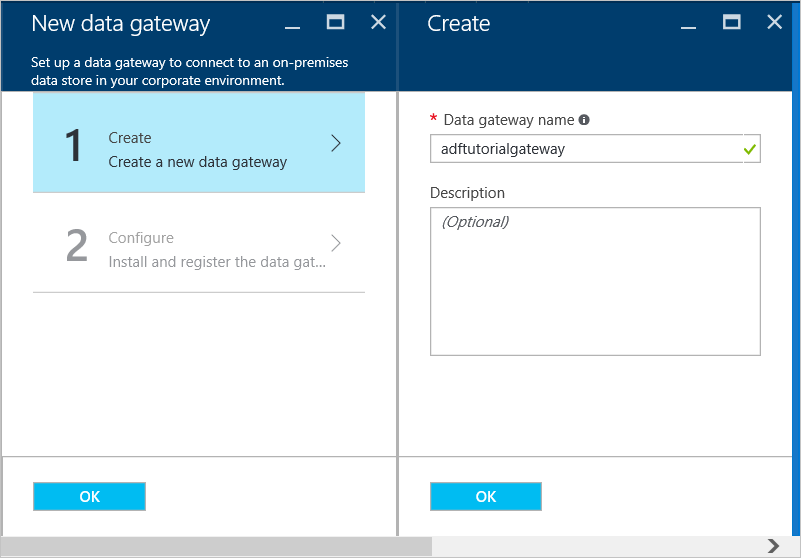

	> [!NOTE]
	> In this walkthrough, you create the logical gateway with only one node (on-premises Windows machine). You can scale out a data management gateway by associating multiple on-premises machines with the gateway. You can scale up by increasing number of data movement jobs that can run concurrently on a node. This feature is also available for a logical gateway with a single node. See [Scaling data management gateway in Azure Data Factory](data-factory-data-management-gateway-high-availability-scalability.md) article for details.  
4. In the **Configure** page, click **Install directly on this computer**. This action downloads the installation package for the gateway, installs, configures, and registers the gateway on the computer.  

   > [!NOTE]
   > Use Internet Explorer or a Microsoft ClickOnce compatible web browser.
   >
   > If you are using Chrome, go to the [Chrome web store](https://chrome.google.com/webstore/), search with "ClickOnce" keyword, choose one of the ClickOnce extensions, and install it.
   >
   > Do the same for Firefox (install add-in). Click **Open Menu** button on the toolbar (**three horizontal lines** in the top-right corner), click **Add-ons**, search with "ClickOnce" keyword, choose one of the ClickOnce extensions, and install it.    
   >
   >

    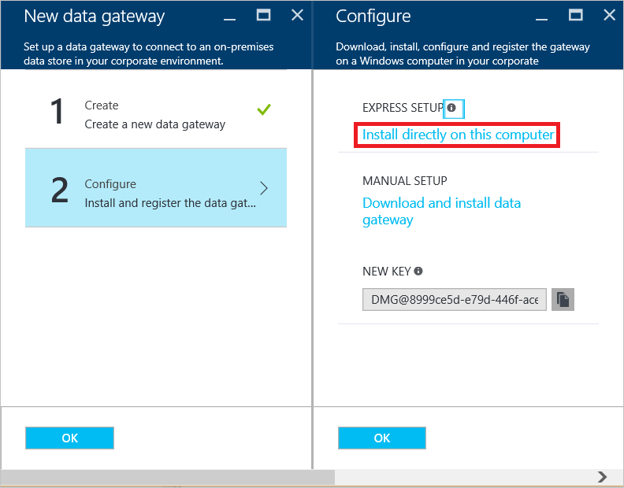

    This way is the easiest way (one-click) to download, install, configure, and register the gateway in one single step. You can see the **Microsoft Data Management Gateway Configuration Manager** application is installed on your computer. You can also find the executable **ConfigManager.exe** in the folder: **C:\Program Files\Microsoft Data Management Gateway\2.0\Shared**.

    You can also download and install gateway manually by using the links in this page and register it using the key shown in the **NEW KEY** text box.

    See [Data Management Gateway](data-factory-data-management-gateway.md) article for all the details about the gateway.

   > [!NOTE]
   > You must be an administrator on the local computer to install and configure the Data Management Gateway successfully. You can add additional users to the **Data Management Gateway Users** local Windows group. The members of this group can use the Data Management Gateway Configuration Manager tool to configure the gateway.
   >
   >
5. Wait for a couple of minutes or wait until you see the following notification message:

    
6. Launch **Data Management Gateway Configuration Manager** application on your computer. In the **Search** window, type **Data Management Gateway** to access this utility. You can also find the executable **ConfigManager.exe** in the folder: **C:\Program Files\Microsoft Data Management Gateway\2.0\Shared**

    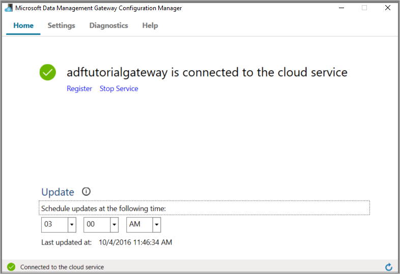
7. Confirm that you see `adftutorialgateway is connected to the cloud service` message. The status bar the bottom displays **Connected to the cloud service** along with a **green check mark**.

    On the **Home** tab, you can also do the following operations:

   * **Register** a gateway with a key from the Azure portal by using the Register button.
   * **Stop** the Data Management Gateway Host Service running on your gateway machine.
   * **Schedule updates** to be installed at a specific time of the day.
   * View when the gateway was **last updated**.
   * Specify time at which an update to the gateway can be installed.
8. Switch to the **Settings** tab. The certificate specified in the **Certificate** section is used to encrypt/decrypt credentials for the on-premises data store that you specify on the portal. (optional) Click **Change** to use your own certificate instead. By default, the gateway uses the certificate that is auto-generated by the Data Factory service.

    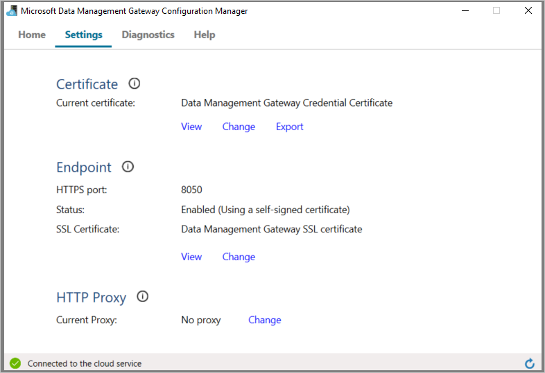

    You can also do the following actions on the **Settings** tab:

   * View or export the certificate being used by the gateway.
   * Change the HTTPS endpoint used by the gateway.    
   * Set an HTTP proxy to be used by the gateway.     
9. (optional) Switch to the **Diagnostics** tab, check the **Enable verbose logging** option if you want to enable verbose logging that you can use to troubleshoot any issues with the gateway. The logging information can be found in **Event Viewer** under **Applications and Services Logs** -> **Data Management Gateway** node.

    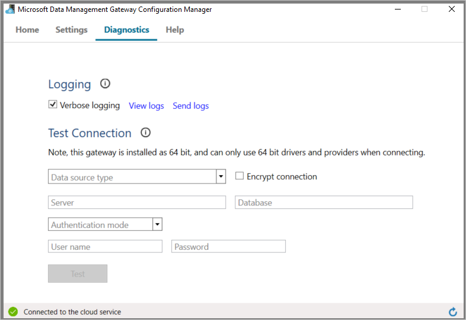

    You can also perform the following actions in the **Diagnostics** tab:

   * Use **Test Connection** section to an on-premises data source using the gateway.
   * Click **View Logs** to see the Data Management Gateway log in an Event Viewer window.
   * Click **Send Logs** to upload a zip file with logs of last seven days to Microsoft to facilitate troubleshooting of your issues.
10. On the **Diagnostics** tab, in the **Test Connection** section, select **SqlServer** for the type of the data store, enter the name of the database server, name of the database, specify authentication type, enter user name, and password, and click **Test** to test whether the gateway can connect to the database.
11. Switch to the web browser, and in the **Azure portal**, click **OK** on the **Configure** page and then on the **New data gateway** page.
12. You should see **adftutorialgateway** under **Data Gateways** in the tree view on the left.  If you click it, you should see the associated JSON.

## Create linked services
In this step, you create two linked services: **AzureStorageLinkedService** and **SqlServerLinkedService**. The **SqlServerLinkedService** links an on-premises SQL Server database and the **AzureStorageLinkedService** linked service links an Azure blob store to the data factory. You create a pipeline later in this walkthrough that copies data from the on-premises SQL Server database to the Azure blob store.

#### Add a linked service to an on-premises SQL Server database
1. In the **Data Factory Editor**, click **New data store** on the toolbar and select **SQL Server**.

   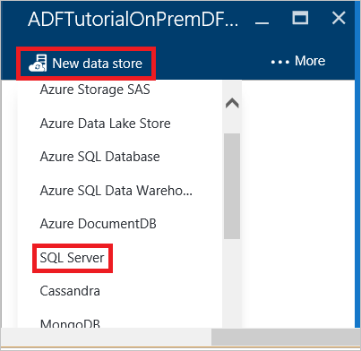
2. In the **JSON editor** on the right, do the following steps:

   1. For the **gatewayName**, specify **adftutorialgateway**.    
   2. In the **connectionString**, do the following steps:    

      1. For **servername**, enter the name of the server that hosts the SQL Server database.
      2. For **databasename**, enter the name of the database.
      3. Click **Encrypt** button on the toolbar. You see the Credentials Manager application.

         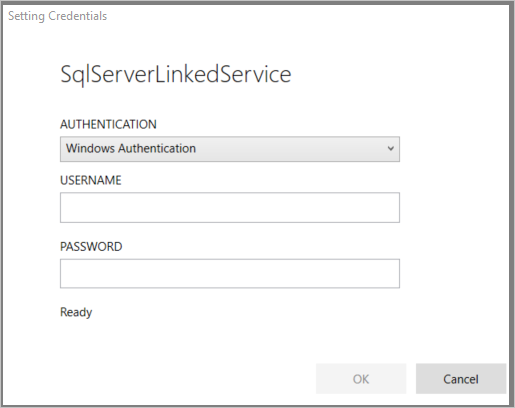
      4. In the **Setting Credentials** dialog box, specify authentication type, user name, and password, and click **OK**. If the connection is successful, the encrypted credentials are stored in the JSON and the dialog box closes.
      5. Close the empty browser tab that launched the dialog box if it is not automatically closed and get back to the tab with the Azure portal.

         On the gateway machine, these credentials are **encrypted** by using a certificate that the Data Factory service owns. If you want to use the certificate that is associated with the Data Management Gateway instead, see Set credentials securely.    
   3. Click **Deploy** on the command bar to deploy the SQL Server linked service. You should see the linked service in the tree view.

      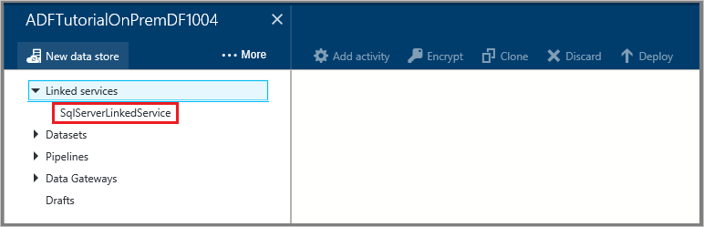    

#### Add a linked service for an Azure storage account
1. In the **Data Factory Editor**, click **New data store** on the command bar and click **Azure storage**.
2. Enter the name of your Azure storage account for the **Account name**.
3. Enter the key for your Azure storage account for the **Account key**.
4. Click **Deploy** to deploy the **AzureStorageLinkedService**.

## Create datasets
In this step, you create input and output datasets that represent input and output data for the copy operation (On-premises SQL Server database => Azure blob storage). Before creating datasets, do the following steps (detailed steps follows the list):

* Create a table named **emp** in the SQL Server Database you added as a linked service to the data factory and insert a couple of sample entries into the table.
* Create a blob container named **adftutorial** in the Azure blob storage account you added as a linked service to the data factory.

### Prepare On-premises SQL Server for the tutorial
1. In the database you specified for the on-premises SQL Server linked service (**SqlServerLinkedService**), use the following SQL script to create the **emp** table in the database.

	```SQL   
    CREATE TABLE dbo.emp
    (
        ID int IDENTITY(1,1) NOT NULL,
        FirstName varchar(50),
        LastName varchar(50),
        CONSTRAINT PK_emp PRIMARY KEY (ID)
    )
    GO
	```
2. Insert some sample into the table:

	```SQL
    INSERT INTO emp VALUES ('John', 'Doe')
    INSERT INTO emp VALUES ('Jane', 'Doe')
	```

### Create input dataset

1. In the **Data Factory Editor**, click **... More**, click **New dataset** on the command bar, and click **SQL Server table**.
2. Replace the JSON in the right pane with the following text:

	```JSON   
	{        
		"name": "EmpOnPremSQLTable",
		"properties": {
			"type": "SqlServerTable",
			"linkedServiceName": "SqlServerLinkedService",
			"typeProperties": {
				"tableName": "emp"
			},
			"external": true,
			"availability": {
				"frequency": "Hour",
				"interval": 1
			},
			"policy": {
				"externalData": {
					"retryInterval": "00:01:00",
					"retryTimeout": "00:10:00",
					"maximumRetry": 3
				}
			}
		}
	}     
	```   	
   Note the following points:

   * **type** is set to **SqlServerTable**.
   * **tableName** is set to **emp**.
   * **linkedServiceName** is set to **SqlServerLinkedService** (you had created this linked service earlier in this walkthrough.).
   * For an input dataset that is not generated by another pipeline in Azure Data Factory, you must set **external** to **true**. It denotes the input data is produced external to the Azure Data Factory service. You can optionally specify any external data policies using the **externalData** element in the **Policy** section.    

   See [Move data to/from SQL Server](data-factory-sqlserver-connector.md) for details about JSON properties.
3. Click **Deploy** on the command bar to deploy the dataset.  

### Create output dataset

1. In the **Data Factory Editor**, click **New dataset** on the command bar, and click **Azure Blob storage**.
2. Replace the JSON in the right pane with the following text:

	```JSON   
	{
		"name": "OutputBlobTable",
		"properties": {
			"type": "AzureBlob",
			"linkedServiceName": "AzureStorageLinkedService",
			"typeProperties": {
				"folderPath": "adftutorial/outfromonpremdf",
				"format": {
					"type": "TextFormat",
					"columnDelimiter": ","
				}
			},
			"availability": {
				"frequency": "Hour",
				"interval": 1
			}
		}
     }
	```   
   Note the following points:

   * **type** is set to **AzureBlob**.
   * **linkedServiceName** is set to **AzureStorageLinkedService** (you had created this linked service in Step 2).
   * **folderPath** is set to **adftutorial/outfromonpremdf** where outfromonpremdf is the folder in the adftutorial container. Create the **adftutorial** container if it does not already exist.
   * The **availability** is set to **hourly** (**frequency** set to **hour** and **interval** set to **1**).  The Data Factory service generates an output data slice every hour in the **emp** table in the Azure SQL Database.

   If you do not specify a **fileName** for an **output table**, the generated files in the **folderPath** are named in the following format: `Data.<Guid>.txt` (for example: : Data.0a405f8a-93ff-4c6f-b3be-f69616f1df7a.txt.).

   To set **folderPath** and **fileName** dynamically based on the **SliceStart** time, use the partitionedBy property. In the following example, folderPath uses Year, Month, and Day from the SliceStart (start time of the slice being processed) and fileName uses Hour from the SliceStart. For example, if a slice is being produced for 2014-10-20T08:00:00, the folderName is set to wikidatagateway/wikisampledataout/2014/10/20 and the fileName is set to 08.csv.

	```JSON
	"folderPath": "wikidatagateway/wikisampledataout/{Year}/{Month}/{Day}",
	"fileName": "{Hour}.csv",
	"partitionedBy":
	[

	    { "name": "Year", "value": { "type": "DateTime", "date": "SliceStart", "format": "yyyy" } },
	    { "name": "Month", "value": { "type": "DateTime", "date": "SliceStart", "format": "MM" } },
	    { "name": "Day", "value": { "type": "DateTime", "date": "SliceStart", "format": "dd" } },
	    { "name": "Hour", "value": { "type": "DateTime", "date": "SliceStart", "format": "hh" } }
	],
	```

	See [Move data to/from Azure Blob Storage](data-factory-azure-blob-connector.md) for details about JSON properties.
3. Click **Deploy** on the command bar to deploy the dataset. Confirm that you see both the datasets in the tree view.  

## Create pipeline
In this step, you create a **pipeline** with one **Copy Activity** that uses **EmpOnPremSQLTable** as input and **OutputBlobTable** as output.

1. In Data Factory Editor, click **... More**, and click **New pipeline**.
2. Replace the JSON in the right pane with the following text:    

	```JSON   
     {
         "name": "ADFTutorialPipelineOnPrem",
         "properties": {
         "description": "This pipeline has one Copy activity that copies data from an on premises SQL to Azure blob",
         "activities": [
           {
             "name": "CopyFromSQLtoBlob",
             "description": "Copy data from on premises SQL server to blob",
             "type": "Copy",
             "inputs": [
               {
                 "name": "EmpOnPremSQLTable"
               }
             ],
             "outputs": [
               {
                 "name": "OutputBlobTable"
               }
             ],
             "typeProperties": {
               "source": {
                 "type": "SqlSource",
                 "sqlReaderQuery": "select * from emp"
               },
               "sink": {
                 "type": "BlobSink"
               }
             },
             "Policy": {
               "concurrency": 1,
               "executionPriorityOrder": "NewestFirst",
               "style": "StartOfInterval",
               "retry": 0,
               "timeout": "01:00:00"
             }
           }
         ],
         "start": "2016-07-05T00:00:00Z",
         "end": "2016-07-06T00:00:00Z",
         "isPaused": false
       }
     }
	```   
   > [!IMPORTANT]
   > Replace the value of the **start** property with the current day and **end** value with the next day.
   >
   >

   Note the following points:

   * In the activities section, there is only activity whose **type** is set to **Copy**.
   * **Input** for the activity is set to **EmpOnPremSQLTable** and **output** for the activity is set to **OutputBlobTable**.
   * In the **typeProperties** section, **SqlSource** is specified as the **source type** and **BlobSink** is specified as the **sink type**.
   * SQL query `select * from emp` is specified for the **sqlReaderQuery** property of **SqlSource**.

   Both start and end datetimes must be in [ISO format](https://en.wikipedia.org/wiki/ISO_8601). For example: 2014-10-14T16:32:41Z. The **end** time is optional, but we use it in this tutorial.

   If you do not specify value for the **end** property, it is calculated as "**start + 48 hours**". To run the pipeline indefinitely, specify **9/9/9999** as the value for the **end** property.

   You are defining the time duration in which the data slices are processed based on the **Availability** properties that were defined for each Azure Data Factory dataset.

   In the example, there are 24 data slices as each data slice is produced hourly.        
3. Click **Deploy** on the command bar to deploy the dataset (table is a rectangular dataset). Confirm that the pipeline shows up in the tree view under **Pipelines** node.  
4. Now, click **X** twice to close the page to get back to the **Data Factory** page for the **ADFTutorialOnPremDF**.

**Congratulations!** You have successfully created an Azure data factory, linked services, datasets, and a pipeline and scheduled the pipeline.

#### View the data factory in a Diagram View
1. In the **Azure portal**, click **Diagram** tile on the home page for the **ADFTutorialOnPremDF** data factory. :

    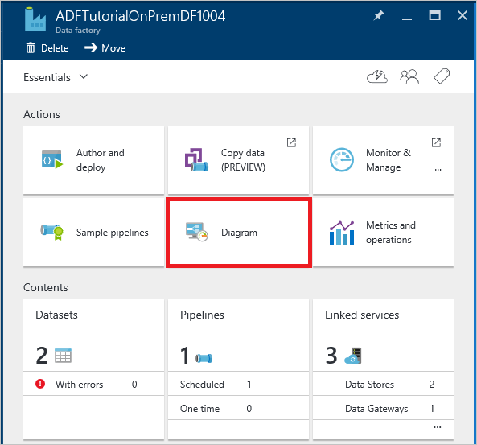
2. You should see the diagram similar to the following image:

    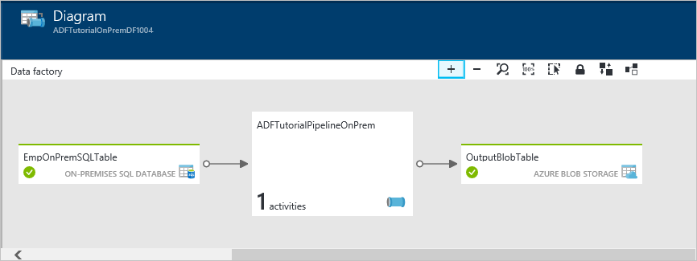

    You can zoom in, zoom out, zoom to 100%, zoom to fit, automatically position pipelines and datasets, and show lineage information (highlights upstream and downstream items of selected items).  You can double-click an object (input/output dataset or pipeline) to see properties for it.

## Monitor pipeline
In this step, you use the Azure portal to monitor what’s going on in an Azure data factory. You can also use PowerShell cmdlets to monitor datasets and pipelines. For details about monitoring, see [Monitor and Manage Pipelines](data-factory-monitor-manage-pipelines.md).

1. In the diagram, double-click **EmpOnPremSQLTable**.  

    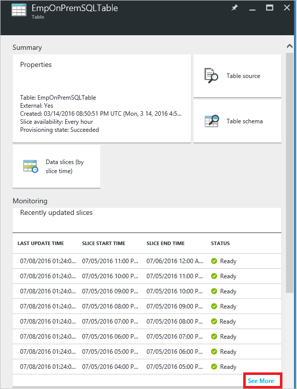
2. Notice that all the data slices up are in **Ready** state because the pipeline duration (start time to end time) is in the past. It is also because you have inserted the data in the SQL Server database and it is there all the time. Confirm that no slices show up in the **Problem slices** section at the bottom. To view all the slices, click **See More** at the bottom of the list of slices.
3. Now, In the **Datasets** page, click **OutputBlobTable**.

    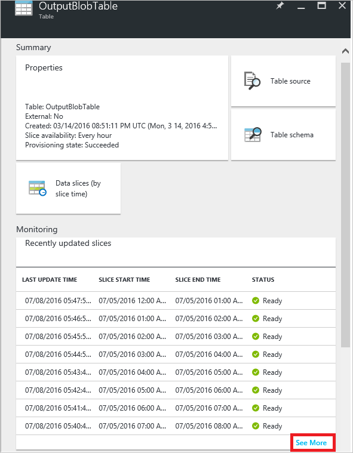
4. Click any data slice from the list and you should see the **Data Slice** page. You see activity runs for the slice. You see only one activity run usually.  

    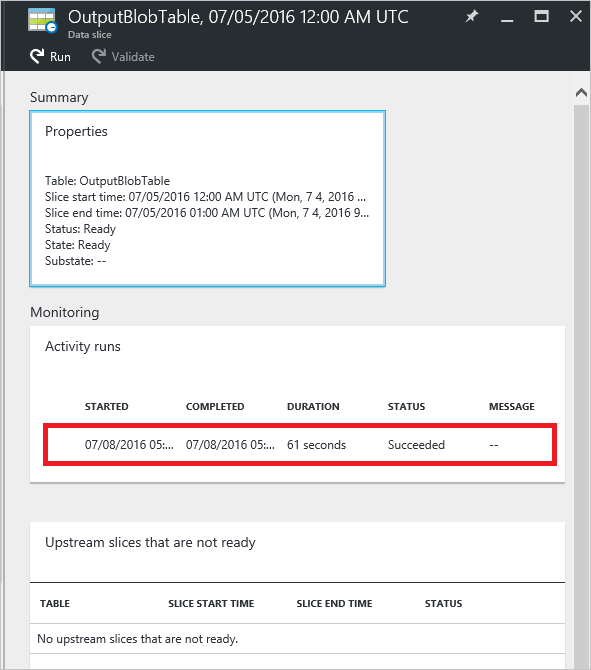

    If the slice is not in the **Ready** state, you can see the upstream slices that are not Ready and are blocking the current slice from executing in the **Upstream slices that are not ready** list.
5. Click the **activity run** from the list at the bottom to see **activity run details**.

   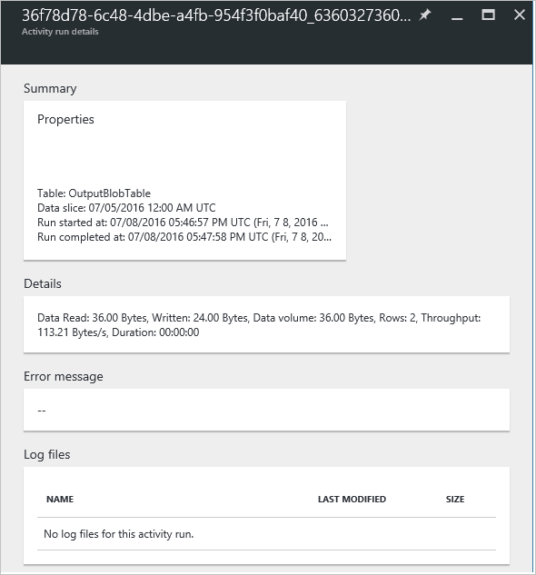

   You would see information such as throughput, duration, and the gateway used to transfer the data.
6. Click **X** to close all the pages until you
7. get back to the home page for the **ADFTutorialOnPremDF**.
8. (optional) Click **Pipelines**, click **ADFTutorialOnPremDF**, and drill through input tables (**Consumed**) or output datasets (**Produced**).
9. Use tools such as [Microsoft Storage Explorer](https://storageexplorer.com/) to verify that a blob/file is created for each hour.

   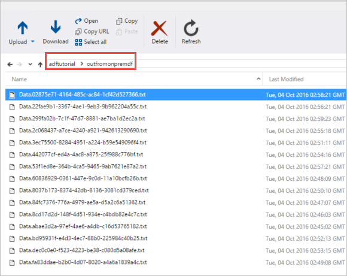

## Next steps
* See [Data Management Gateway](data-factory-data-management-gateway.md) article for all the details about the Data Management Gateway.
* See [Copy data from Azure Blob to Azure SQL](data-factory-copy-data-from-azure-blob-storage-to-sql-database.md) to learn about how to use Copy Activity to move data from a source data store to a sink data store.
