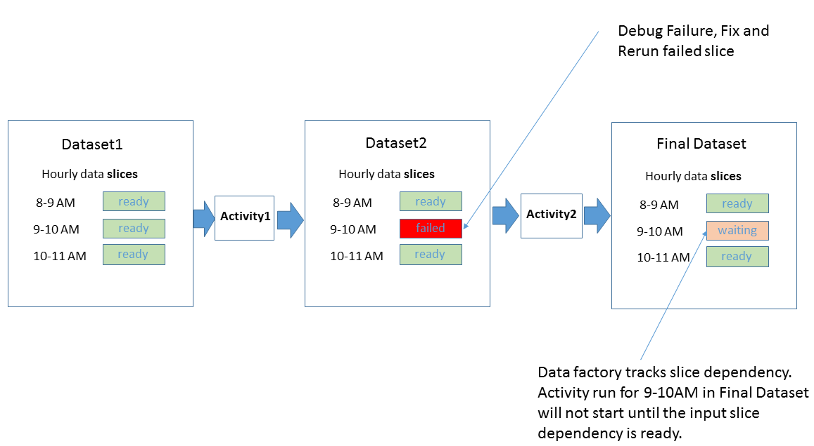
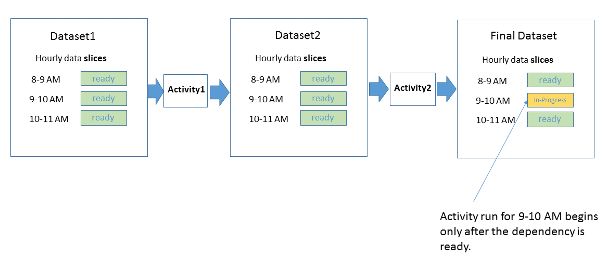
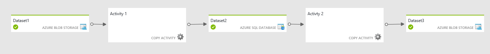
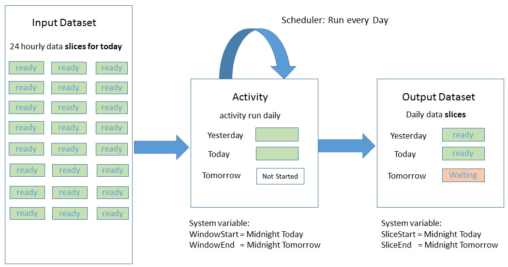

# Data Factory scheduling and execution
> [!NOTE]
> This article applies to version 1 of Data Factory. If you are using the current version of the Data Factory service, see [pipeline execution and triggers](../concepts-pipeline-execution-triggers.md) article.

This article explains the scheduling and execution aspects of the Azure Data Factory application model. This article assumes that you understand basics of Data Factory application model concepts, including activity, pipelines, linked services, and datasets. For basic concepts of Azure Data Factory, see the following articles:

* [Introduction to Data Factory](data-factory-introduction.md)
* [Pipelines](data-factory-create-pipelines.md)
* [Datasets](data-factory-create-datasets.md) 

## Start and end times of pipeline
A pipeline is active only between its **start** time and **end** time. It is not executed before the start time or after the end time. If the pipeline is paused, it is not executed irrespective of its start and end time. For a pipeline to run, it should not be paused. You find these settings (start, end, paused) in the pipeline definition: 

```json
"start": "2017-04-01T08:00:00Z",
"end": "2017-04-01T11:00:00Z"
"isPaused": false
```

For more information these properties, see [create pipelines](data-factory-create-pipelines.md) article. 


## Specify schedule for an activity
It is not the pipeline that is executed. It is the activities in the pipeline that are executed in the overall context of the pipeline. You can specify a recurring schedule for an activity by using the **scheduler** section of activity JSON. For example, you can schedule an activity to run hourly as follows:  

```json
"scheduler": {
    "frequency": "Hour",
    "interval": 1
},
```

As shown in the following diagram, specifying a schedule for an activity creates a series of tumbling windows with in the pipeline start and end times. Tumbling windows are a series of fixed-size non-overlapping, contiguous time intervals. These logical tumbling windows for an activity are called **activity windows**.


The **scheduler** property for an activity is optional. If you do specify this property, it must match the cadence you specify in the definition of output dataset for the activity. Currently, output dataset is what drives the schedule. Therefore, you must create an output dataset even if the activity does not produce any output. 

## Specify schedule for a dataset
An activity in a Data Factory pipeline can take zero or more input **datasets** and produce one or more output datasets. For an activity, you can specify the cadence at which the input data is available or the output data is produced by using the **availability** section in the dataset definitions. 

**Frequency** in the **availability** section specifies the time unit. The allowed values for frequency are: Minute, Hour, Day, Week, and Month. The **interval** property in the availability section specifies a multiplier for frequency. For example: if the frequency is set to Day and interval is set to 1 for an output dataset, the output data is produced daily. If you specify the frequency as minute, we recommend that you set the interval to no less than 15. 

In the following example, the input data is available hourly and the output data is produced hourly (`"frequency": "Hour", "interval": 1`). 

**Input dataset:** 

```json
{
    "name": "AzureSqlInput",
    "properties": {
        "published": false,
        "type": "AzureSqlTable",
        "linkedServiceName": "AzureSqlLinkedService",
        "typeProperties": {
            "tableName": "MyTable"
        },
        "availability": {
            "frequency": "Hour",
            "interval": 1
        },
        "external": true,
        "policy": {}
    }
}
```


**Output dataset**

```json
{
    "name": "AzureBlobOutput",
    "properties": {
        "published": false,
        "type": "AzureBlob",
        "linkedServiceName": "StorageLinkedService",
        "typeProperties": {
            "folderPath": "mypath/{Year}/{Month}/{Day}/{Hour}",
            "format": {
                "type": "TextFormat"
            },
            "partitionedBy": [
                { "name": "Year", "value": { "type": "DateTime", "date": "SliceStart", "format": "yyyy" } },
                { "name": "Month", "value": { "type": "DateTime", "date": "SliceStart", "format": "MM" } },
                { "name": "Day", "value": { "type": "DateTime", "date": "SliceStart", "format": "dd" } },
                { "name": "Hour", "value": { "type": "DateTime", "date": "SliceStart", "format": "HH" }}
            ]
        },
        "availability": {
            "frequency": "Hour",
            "interval": 1
        }
    }
}
```

Currently, **output dataset drives the schedule**. In other words, the schedule specified for the output dataset is used to run an activity at runtime. Therefore, you must create an output dataset even if the activity does not produce any output. If the activity doesn't take any input, you can skip creating the input dataset. 

In the following pipeline definition, the **scheduler** property is used to specify schedule for the activity. This property is optional. Currently, the schedule for the activity must match the schedule specified for the output dataset.
 
```json
{
    "name": "SamplePipeline",
    "properties": {
        "description": "copy activity",
        "activities": [
            {
                "type": "Copy",
                "name": "AzureSQLtoBlob",
                "description": "copy activity",
                "typeProperties": {
                    "source": {
                        "type": "SqlSource",
                        "sqlReaderQuery": "$$Text.Format('select * from MyTable where timestampcolumn >= \\'{0:yyyy-MM-dd HH:mm}\\' AND timestampcolumn < \\'{1:yyyy-MM-dd HH:mm}\\'', WindowStart, WindowEnd)"
                    },
                    "sink": {
                        "type": "BlobSink",
                        "writeBatchSize": 100000,
                        "writeBatchTimeout": "00:05:00"
                    }
                },
                "inputs": [
                    {
                        "name": "AzureSQLInput"
                    }
                ],
                "outputs": [
                    {
                        "name": "AzureBlobOutput"
                    }
                ],
				"scheduler": {
					"frequency": "Hour",
					"interval": 1
				}
            }
        ],
        "start": "2017-04-01T08:00:00Z",
        "end": "2017-04-01T11:00:00Z"
    }
}
```

In this example, the activity runs hourly between the start and end times of the pipeline. The output data is produced hourly for three-hour windows (8 AM - 9 AM, 9 AM - 10 AM, and 10 AM - 11 AM). 

Each unit of data consumed or produced by an activity run is called a **data slice**. The following diagram shows an example of an activity with one input dataset and one output dataset: 


The diagram shows the hourly data slices for the input and output dataset. The diagram shows three input slices that are ready for processing. The 10-11 AM activity is in progress, producing the 10-11 AM output slice. 

You can access the time interval associated with the current slice in the dataset JSON by using variables: [SliceStart](data-factory-functions-variables.md#data-factory-system-variables) and [SliceEnd](data-factory-functions-variables.md#data-factory-system-variables). Similarly, you can access the time interval associated with an activity window by using the WindowStart and WindowEnd. The schedule of an activity must match the schedule of the output dataset for the activity. Therefore, the SliceStart and SliceEnd values are the same as WindowStart and WindowEnd values respectively. For more information on these variables, see [Data Factory functions and system variables](data-factory-functions-variables.md#data-factory-system-variables) articles.  

You can use these variables for different purposes in your activity JSON. For example, you can use them to select data from input and output datasets representing time series data (for example: 8 AM to 9 AM). This example also uses **WindowStart** and **WindowEnd** to select relevant data for an activity run and copy it to a blob with the appropriate **folderPath**. The **folderPath** is parameterized to have a separate folder for every hour.  

In the preceding example, the schedule specified for input and output datasets is the same (hourly). If the input dataset for the activity is available at a different frequency, say every 15 minutes, the activity that produces this output dataset still runs once an hour as the output dataset is what drives the activity schedule. For more information, see [Model datasets with different frequencies](#model-datasets-with-different-frequencies).

## Dataset availability and policies
You have seen the usage of frequency and interval properties in the availability section of dataset definition. There are a few other properties that affect the scheduling and execution of an activity. 

### Dataset availability 
The following table describes properties you can use in the **availability** section:

| Property | Description | Required | Default |
| --- | --- | --- | --- |
| frequency |Specifies the time unit for dataset slice production.<br/><br/><b>Supported frequency</b>: Minute, Hour, Day, Week, Month |Yes |NA |
| interval |Specifies a multiplier for frequency<br/><br/>”Frequency x interval” determines how often the slice is produced.<br/><br/>If you need the dataset to be sliced on an hourly basis, you set <b>Frequency</b> to <b>Hour</b>, and <b>interval</b> to <b>1</b>.<br/><br/><b>Note</b>: If you specify Frequency as Minute, we recommend that you set the interval to no less than 15 |Yes |NA |
| style |Specifies whether the slice should be produced at the start/end of the interval.<ul><li>StartOfInterval</li><li>EndOfInterval</li></ul><br/><br/>If Frequency is set to Month and style is set to EndOfInterval, the slice is produced on the last day of month. If the style is set to StartOfInterval, the slice is produced on the first day of month.<br/><br/>If Frequency is set to Day and style is set to EndOfInterval, the slice is produced in the last hour of the day.<br/><br/>If Frequency is set to Hour and style is set to EndOfInterval, the slice is produced at the end of the hour. For example, for a slice for 1 PM – 2 PM period, the slice is produced at 2 PM. |No |EndOfInterval |
| anchorDateTime |Defines the absolute position in time used by scheduler to compute dataset slice boundaries. <br/><br/><b>Note</b>: If the AnchorDateTime has date parts that are more granular than the frequency then the more granular parts are ignored. <br/><br/>For example, if the <b>interval</b> is <b>hourly</b> (frequency: hour and interval: 1) and the <b>AnchorDateTime</b> contains <b>minutes and seconds</b>, then the <b>minutes and seconds</b> parts of the AnchorDateTime are ignored. |No |01/01/0001 |
| offset |Timespan by which the start and end of all dataset slices are shifted. <br/><br/><b>Note</b>: If both anchorDateTime and offset are specified, the result is the combined shift. |No |NA |

### offset example
By default, daily (`"frequency": "Day", "interval": 1`) slices start at 12 AM UTC time (midnight). If you want the start time to be 6 AM UTC time instead, set the offset as shown in the following snippet: 

```json
"availability":
{
    "frequency": "Day",
    "interval": 1,
    "offset": "06:00:00"
}
```
### anchorDateTime example
In the following example, the dataset is produced once every 23 hours. The first slice starts at the time specified by the anchorDateTime, which is set to `2017-04-19T08:00:00` (UTC time).

```json
"availability":    
{    
    "frequency": "Hour",        
    "interval": 23,    
    "anchorDateTime":"2017-04-19T08:00:00"    
}
```

### offset/style Example
The following dataset is a monthly dataset and is produced on 3rd of every month at 8:00 AM (`3.08:00:00`):

```json
"availability": {
	"frequency": "Month",
	"interval": 1,
	"offset": "3.08:00:00",	
	"style": "StartOfInterval"
}
```

### Dataset policy
A dataset can have a validation policy defined that specifies how the data generated by a slice execution can be validated before it is ready for consumption. In such cases, after the slice has finished execution, the output slice status is changed to **Waiting** with a substatus of **Validation**. After the slices are validated, the slice status changes to **Ready**. If a data slice has been produced but did not pass the validation, activity runs for downstream slices that depend on this slice are not processed. [Monitor and manage pipelines](data-factory-monitor-manage-pipelines.md) covers the various states of data slices in Data Factory.

The **policy** section in dataset definition defines the criteria or the condition that the dataset slices must fulfill. The following table describes properties you can use in the **policy** section:

| Policy Name | Description | Applied To | Required | Default |
| --- | --- | --- | --- | --- |
| minimumSizeMB | Validates that the data in an **Azure blob** meets the minimum size requirements (in megabytes). |Azure Blob |No |NA |
| minimumRows | Validates that the data in **Azure SQL Database** or **Azure table** contains the minimum number of rows. |<ul><li>Azure SQL Database</li><li>Azure Table</li></ul> |No |NA |

#### Examples
**minimumSizeMB:**

```json
"policy":

{
    "validation":
    {
        "minimumSizeMB": 10.0
    }
}
```

**minimumRows**

```json
"policy":
{
    "validation":
    {
        "minimumRows": 100
    }
}
```

For more information about these properties and examples, see [Create datasets](data-factory-create-datasets.md) article. 

## Activity policies
Policies affect the run-time behavior of an activity, specifically when the slice of a table is processed. The following table provides the details.

| Property | Permitted values | Default Value | Description |
| --- | --- | --- | --- |
| concurrency |Integer <br/><br/>Max value: 10 |1 |Number of concurrent executions of the activity.<br/><br/>It determines the number of parallel activity executions that can happen on different slices. For example, if an activity needs to go through a large set of available data, having a larger concurrency value speeds up the data processing. |
| executionPriorityOrder |NewestFirst<br/><br/>OldestFirst |OldestFirst |Determines the ordering of data slices that are being processed.<br/><br/>For example, if you have 2 slices (one happening at 4pm, and another one at 5pm), and both are pending execution. If you set the executionPriorityOrder to be NewestFirst, the slice at 5 PM is processed first. Similarly if you set the executionPriorityORder to be OldestFIrst, then the slice at 4 PM is processed. |
| retry |Integer<br/><br/>Max value can be 10 |0 |Number of retries before the data processing for the slice is marked as Failure. Activity execution for a data slice is retried up to the specified retry count. The retry is done as soon as possible after the failure. |
| timeout |TimeSpan |00:00:00 |Timeout for the activity. Example: 00:10:00 (implies timeout 10 mins)<br/><br/>If a value is not specified or is 0, the timeout is infinite.<br/><br/>If the data processing time on a slice exceeds the timeout value, it is canceled, and the system attempts to retry the processing. The number of retries depends on the retry property. When timeout occurs, the status is set to TimedOut. |
| delay |TimeSpan |00:00:00 |Specify the delay before data processing of the slice starts.<br/><br/>The execution of activity for a data slice is started after the Delay is past the expected execution time.<br/><br/>Example: 00:10:00 (implies delay of 10 mins) |
| longRetry |Integer<br/><br/>Max value: 10 |1 |The number of long retry attempts before the slice execution is failed.<br/><br/>longRetry attempts are spaced by longRetryInterval. So if you need to specify a time between retry attempts, use longRetry. If both Retry and longRetry are specified, each longRetry attempt includes Retry attempts and the max number of attempts is Retry * longRetry.<br/><br/>For example, if we have the following settings in the activity policy:<br/>Retry: 3<br/>longRetry: 2<br/>longRetryInterval: 01:00:00<br/><br/>Assume there is only one slice to execute (status is Waiting) and the activity execution fails every time. Initially there would be 3 consecutive execution attempts. After each attempt, the slice status would be Retry. After first 3 attempts are over, the slice status would be LongRetry.<br/><br/>After an hour (that is, longRetryInteval’s value), there would be another set of 3 consecutive execution attempts. After that, the slice status would be Failed and no more retries would be attempted. Hence overall 6 attempts were made.<br/><br/>If any execution succeeds, the slice status would be Ready and no more retries are attempted.<br/><br/>longRetry may be used in situations where dependent data arrives at non-deterministic times or the overall environment is flaky under which data processing occurs. In such cases, doing retries one after another may not help and doing so after an interval of time results in the desired output.<br/><br/>Word of caution: do not set high values for longRetry or longRetryInterval. Typically, higher values imply other systemic issues. |
| longRetryInterval |TimeSpan |00:00:00 |The delay between long retry attempts |

For more information, see [Pipelines](data-factory-create-pipelines.md) article. 

## Parallel processing of data slices
You can set the start date for the pipeline in the past. When you do so, Data Factory automatically calculates (back fills) all data slices in the past and begins processing them. For example: if you create a pipeline with start date 2017-04-01 and the current date is 2017-04-10. If the cadence of the output dataset is daily, then Data Factory starts processing all the slices from 2017-04-01 to 2017-04-09 immediately because the start date is in the past. The slice from 2017-04-10 is not processed yet because the value of style property in the availability section is EndOfInterval by default. The oldest slice is processed first as the default value of executionPriorityOrder is OldestFirst. For a description of the style property, see [dataset availability](#dataset-availability) section. For a description of the executionPriorityOrder section, see the [activity policies](#activity-policies) section. 

You can configure back-filled data slices to be processed in parallel by setting the **concurrency** property in the **policy** section of the activity JSON. This property determines the number of parallel activity executions that can happen on different slices. The default value for the concurrency property is 1. Therefore, one slice is processed at a time by default. The maximum value is 10. When a pipeline needs to go through a large set of available data, having a larger concurrency value speeds up the data processing. 

## Rerun a failed data slice
When an error occurs while processing a data slice, you can find out why the processing of a slice failed by using Azure portal blades or Monitor and Manage App. See [Monitoring and managing pipelines using Azure portal blades](data-factory-monitor-manage-pipelines.md) or [Monitoring and Management app](data-factory-monitor-manage-app.md) for details.

Consider the following example, which shows two activities. Activity1 and Activity 2. Activity1 consumes a slice of Dataset1 and produces a slice of Dataset2, which is consumed as an input by Activity2 to produce a slice of the Final Dataset.



The diagram shows that out of three recent slices, there was a failure producing the 9-10 AM slice for Dataset2. Data Factory automatically tracks dependency for the time series dataset. As a result, it does not start the activity run for the 9-10 AM downstream slice.

Data Factory monitoring and management tools allow you to drill into the diagnostic logs for the failed slice to easily find the root cause for the issue and fix it. After you have fixed the issue, you can easily start the activity run to produce the failed slice. For more information on how to rerun and understand state transitions for data slices, see [Monitoring and managing pipelines using Azure portal blades](data-factory-monitor-manage-pipelines.md) or [Monitoring and Management app](data-factory-monitor-manage-app.md).

After you rerun the 9-10 AM slice for **Dataset2**, Data Factory starts the run for the 9-10 AM dependent slice on the final dataset.



## Multiple activities in a pipeline
You can have more than one activity in a pipeline. If you have multiple activities in a pipeline and the output of an activity is not an input of another activity, the activities may run in parallel if input data slices for the activities are ready.

You can chain two activities (run one activity after another) by setting the output dataset of one activity as the input dataset of the other activity. The activities can be in the same pipeline or in different pipelines. The second activity executes only when the first one finishes successfully.

For example, consider the following case where a pipeline has two activities:

1. Activity A1 that requires external input dataset D1, and produces output dataset D2.
2. Activity A2 that requires input from dataset D2, and produces output dataset D3.

In this scenario, activities A1 and A2 are in the same pipeline. The activity A1 runs when the external data is available and the scheduled availability frequency is reached. The activity A2 runs when the scheduled slices from D2 become available and the scheduled availability frequency is reached. If there is an error in one of the slices in dataset D2, A2 does not run for that slice until it becomes available.

The Diagram view with both activities in the same pipeline would look like the following diagram:



As mentioned earlier, the activities could be in different pipelines. In such a scenario, the diagram view would look like the following diagram:


See the copy sequentially section in the appendix for an example.

## Model datasets with different frequencies
In the samples, the frequencies for input and output datasets and the activity schedule window were the same. Some scenarios require the ability to produce output at a frequency different than the frequencies of one or more inputs. Data Factory supports modeling these scenarios.

### Sample 1: Produce a daily output report for input data that is available every hour
Consider a scenario in which you have input measurement data from sensors available every hour in Azure Blob storage. You want to produce a daily aggregate report with statistics such as mean, maximum, and minimum for the day with [Data Factory hive activity](data-factory-hive-activity.md).

Here is how you can model this scenario with Data Factory:

**Input dataset**

The hourly input files are dropped in the folder for the given day. Availability for input is set at **Hour** (frequency: Hour, interval: 1).

```json
{
  "name": "AzureBlobInput",
  "properties": {
    "type": "AzureBlob",
    "linkedServiceName": "StorageLinkedService",
    "typeProperties": {
      "folderPath": "mycontainer/myfolder/{Year}/{Month}/{Day}/",
      "partitionedBy": [
        { "name": "Year", "value": {"type": "DateTime","date": "SliceStart","format": "yyyy"}},
        { "name": "Month","value": {"type": "DateTime","date": "SliceStart","format": "MM"}},
        { "name": "Day","value": {"type": "DateTime","date": "SliceStart","format": "dd"}}
      ],
      "format": {
        "type": "TextFormat"
      }
    },
    "external": true,
    "availability": {
      "frequency": "Hour",
      "interval": 1
    }
  }
}
```
**Output dataset**

One output file is created every day in the day's folder. Availability of output is set at **Day** (frequency: Day and interval: 1).

```json
{
  "name": "AzureBlobOutput",
  "properties": {
    "type": "AzureBlob",
    "linkedServiceName": "StorageLinkedService",
    "typeProperties": {
      "folderPath": "mycontainer/myfolder/{Year}/{Month}/{Day}/",
      "partitionedBy": [
        { "name": "Year", "value": {"type": "DateTime","date": "SliceStart","format": "yyyy"}},
        { "name": "Month","value": {"type": "DateTime","date": "SliceStart","format": "MM"}},
        { "name": "Day","value": {"type": "DateTime","date": "SliceStart","format": "dd"}}
      ],
      "format": {
        "type": "TextFormat"
      }
    },
    "availability": {
      "frequency": "Day",
      "interval": 1
    }
  }
}
```

**Activity: hive activity in a pipeline**

The hive script receives the appropriate *DateTime* information as parameters that use the **WindowStart** variable as shown in the following snippet. The hive script uses this variable to load the data from the correct folder for the day and run the aggregation to generate the output.

```json
{  
    "name":"SamplePipeline",
    "properties":{  
    "start":"2015-01-01T08:00:00",
    "end":"2015-01-01T11:00:00",
    "description":"hive activity",
    "activities": [
        {
            "name": "SampleHiveActivity",
            "inputs": [
                {
                    "name": "AzureBlobInput"
                }
            ],
            "outputs": [
                {
                    "name": "AzureBlobOutput"
                }
            ],
            "linkedServiceName": "HDInsightLinkedService",
            "type": "HDInsightHive",
            "typeProperties": {
                "scriptPath": "adftutorial\\hivequery.hql",
                "scriptLinkedService": "StorageLinkedService",
                "defines": {
                    "Year": "$$Text.Format('{0:yyyy}',WindowStart)",
                    "Month": "$$Text.Format('{0:MM}',WindowStart)",
                    "Day": "$$Text.Format('{0:dd}',WindowStart)"
                }
            },
            "scheduler": {
                "frequency": "Day",
                "interval": 1
            },            
            "policy": {
                "concurrency": 1,
                "executionPriorityOrder": "OldestFirst",
                "retry": 2,
                "timeout": "01:00:00"
            }
         }
     ]
   }
}
```

The following diagram shows the scenario from a data-dependency point of view.



The output slice for every day depends on 24 hourly slices from an input dataset. Data Factory computes these dependencies automatically by figuring out the input data slices that fall in the same time period as the output slice to be produced. If any of the 24 input slices is not available, Data Factory waits for the input slice to be ready before starting the daily activity run.

### Sample 2: Specify dependency with expressions and Data Factory functions
Let’s consider another scenario. Suppose you have a hive activity that processes two input datasets. One of them has new data daily, but one of them gets new data every week. Suppose you wanted to do a join across the two inputs and produce an output every day.

The simple approach in which Data Factory automatically figures out the right input slices to process by aligning to the output data slice’s time period does not work.

You must specify that for every activity run, the Data Factory should use last week’s data slice for the weekly input dataset. You use Azure Data Factory functions as shown in the following snippet to implement this behavior.

**Input1: Azure blob**

The first input is the Azure blob being updated daily.

```json
{
  "name": "AzureBlobInputDaily",
  "properties": {
    "type": "AzureBlob",
    "linkedServiceName": "StorageLinkedService",
    "typeProperties": {
      "folderPath": "mycontainer/myfolder/{Year}/{Month}/{Day}/",
      "partitionedBy": [
        { "name": "Year", "value": {"type": "DateTime","date": "SliceStart","format": "yyyy"}},
        { "name": "Month","value": {"type": "DateTime","date": "SliceStart","format": "MM"}},
        { "name": "Day","value": {"type": "DateTime","date": "SliceStart","format": "dd"}}
      ],
      "format": {
        "type": "TextFormat"
      }
    },
    "external": true,
    "availability": {
      "frequency": "Day",
      "interval": 1
    }
  }
}
```

**Input2: Azure blob**

Input2 is the Azure blob being updated weekly.

```json
{
  "name": "AzureBlobInputWeekly",
  "properties": {
    "type": "AzureBlob",
    "linkedServiceName": "StorageLinkedService",
    "typeProperties": {
      "folderPath": "mycontainer/myfolder/{Year}/{Month}/{Day}/",
      "partitionedBy": [
        { "name": "Year", "value": {"type": "DateTime","date": "SliceStart","format": "yyyy"}},
        { "name": "Month","value": {"type": "DateTime","date": "SliceStart","format": "MM"}},
        { "name": "Day","value": {"type": "DateTime","date": "SliceStart","format": "dd"}}
      ],
      "format": {
        "type": "TextFormat"
      }
    },
    "external": true,
    "availability": {
      "frequency": "Day",
      "interval": 7
    }
  }
}
```

**Output: Azure blob**

One output file is created every day in the folder for the day. Availability of output is set to **day** (frequency: Day, interval: 1).

```json
{
  "name": "AzureBlobOutputDaily",
  "properties": {
    "type": "AzureBlob",
    "linkedServiceName": "StorageLinkedService",
    "typeProperties": {
      "folderPath": "mycontainer/myfolder/{Year}/{Month}/{Day}/",
      "partitionedBy": [
        { "name": "Year", "value": {"type": "DateTime","date": "SliceStart","format": "yyyy"}},
        { "name": "Month","value": {"type": "DateTime","date": "SliceStart","format": "MM"}},
        { "name": "Day","value": {"type": "DateTime","date": "SliceStart","format": "dd"}}
      ],
      "format": {
        "type": "TextFormat"
      }
    },
    "availability": {
      "frequency": "Day",
      "interval": 1
    }
  }
}
```

**Activity: hive activity in a pipeline**

The hive activity takes the two inputs and produces an output slice every day. You can specify every day’s output slice to depend on the previous week’s input slice for weekly input as follows.

```json
{  
    "name":"SamplePipeline",
    "properties":{  
    "start":"2015-01-01T08:00:00",
    "end":"2015-01-01T11:00:00",
    "description":"hive activity",
    "activities": [
      {
        "name": "SampleHiveActivity",
        "inputs": [
          {
            "name": "AzureBlobInputDaily"
          },
          {
            "name": "AzureBlobInputWeekly",
            "startTime": "Date.AddDays(SliceStart, - Date.DayOfWeek(SliceStart))",
            "endTime": "Date.AddDays(SliceEnd,  -Date.DayOfWeek(SliceEnd))"  
          }
        ],
        "outputs": [
          {
            "name": "AzureBlobOutputDaily"
          }
        ],
        "linkedServiceName": "HDInsightLinkedService",
        "type": "HDInsightHive",
        "typeProperties": {
          "scriptPath": "adftutorial\\hivequery.hql",
          "scriptLinkedService": "StorageLinkedService",
          "defines": {
            "Year": "$$Text.Format('{0:yyyy}',WindowStart)",
            "Month": "$$Text.Format('{0:MM}',WindowStart)",
            "Day": "$$Text.Format('{0:dd}',WindowStart)"
          }
        },
        "scheduler": {
          "frequency": "Day",
          "interval": 1
        },            
        "policy": {
          "concurrency": 1,
          "executionPriorityOrder": "OldestFirst",
          "retry": 2,  
          "timeout": "01:00:00"
        }
       }
     ]
   }
}
```

See [Data Factory functions and system variables](data-factory-functions-variables.md) for a list of functions and system variables that Data Factory supports.

## Appendix

### Example: copy sequentially
It is possible to run multiple copy operations one after another in a sequential/ordered manner. For example, you might have two copy activities in a pipeline (CopyActivity1 and CopyActivity2) with the following input data output datasets:   

CopyActivity1

Input: Dataset. Output: Dataset2.

CopyActivity2

Input: Dataset2.  Output: Dataset3.

CopyActivity2 would run only if the CopyActivity1 has run successfully and Dataset2 is available.

Here is the sample pipeline JSON:

```json
{
    "name": "ChainActivities",
    "properties": {
        "description": "Run activities in sequence",
        "activities": [
            {
                "type": "Copy",
                "typeProperties": {
                    "source": {
                        "type": "BlobSource"
                    },
                    "sink": {
                        "type": "BlobSink",
                        "copyBehavior": "PreserveHierarchy",
                        "writeBatchSize": 0,
                        "writeBatchTimeout": "00:00:00"
                    }
                },
                "inputs": [
                    {
                        "name": "Dataset1"
                    }
                ],
                "outputs": [
                    {
                        "name": "Dataset2"
                    }
                ],
                "policy": {
                    "timeout": "01:00:00"
                },
                "scheduler": {
                    "frequency": "Hour",
                    "interval": 1
                },
                "name": "CopyFromBlob1ToBlob2",
                "description": "Copy data from a blob to another"
            },
            {
                "type": "Copy",
                "typeProperties": {
                    "source": {
                        "type": "BlobSource"
                    },
                    "sink": {
                        "type": "BlobSink",
                        "writeBatchSize": 0,
                        "writeBatchTimeout": "00:00:00"
                    }
                },
                "inputs": [
                    {
                        "name": "Dataset2"
                    }
                ],
                "outputs": [
                    {
                        "name": "Dataset3"
                    }
                ],
                "policy": {
                    "timeout": "01:00:00"
                },
                "scheduler": {
                    "frequency": "Hour",
                    "interval": 1
                },
                "name": "CopyFromBlob2ToBlob3",
                "description": "Copy data from a blob to another"
            }
        ],
        "start": "2016-08-25T01:00:00Z",
        "end": "2016-08-25T01:00:00Z",
        "isPaused": false
    }
}
```

Notice that in the example, the output dataset of the first copy activity (Dataset2) is specified as input for the second activity. Therefore, the second activity runs only when the output dataset from the first activity is ready.  

In the example, CopyActivity2 can have a different input, such as Dataset3, but you specify Dataset2 as an input to CopyActivity2, so the activity does not run until CopyActivity1 finishes. For example:

CopyActivity1

Input: Dataset1. Output: Dataset2.

CopyActivity2

Inputs: Dataset3, Dataset2. Output: Dataset4.

```json
{
    "name": "ChainActivities",
    "properties": {
        "description": "Run activities in sequence",
        "activities": [
            {
                "type": "Copy",
                "typeProperties": {
                    "source": {
                        "type": "BlobSource"
                    },
                    "sink": {
                        "type": "BlobSink",
                        "copyBehavior": "PreserveHierarchy",
                        "writeBatchSize": 0,
                        "writeBatchTimeout": "00:00:00"
                    }
                },
                "inputs": [
                    {
                        "name": "Dataset1"
                    }
                ],
                "outputs": [
                    {
                        "name": "Dataset2"
                    }
                ],
                "policy": {
                    "timeout": "01:00:00"
                },
                "scheduler": {
                    "frequency": "Hour",
                    "interval": 1
                },
                "name": "CopyFromBlobToBlob",
                "description": "Copy data from a blob to another"
            },
            {
                "type": "Copy",
                "typeProperties": {
                    "source": {
                        "type": "BlobSource"
                    },
                    "sink": {
                        "type": "BlobSink",
                        "writeBatchSize": 0,
                        "writeBatchTimeout": "00:00:00"
                    }
                },
                "inputs": [
                    {
                        "name": "Dataset3"
                    },
                    {
                        "name": "Dataset2"
                    }
                ],
                "outputs": [
                    {
                        "name": "Dataset4"
                    }
                ],
                "policy": {
                    "timeout": "01:00:00"
                },
                "scheduler": {
                    "frequency": "Hour",
                    "interval": 1
                },
                "name": "CopyFromBlob3ToBlob4",
                "description": "Copy data from a blob to another"
            }
        ],
        "start": "2017-04-25T01:00:00Z",
        "end": "2017-04-25T01:00:00Z",
        "isPaused": false
    }
}
```

Notice that in the example, two input datasets are specified for the second copy activity. When multiple inputs are specified, only the first input dataset is used for copying data, but other datasets are used as dependencies. CopyActivity2 would start only after the following conditions are met:

* CopyActivity1 has successfully completed and Dataset2 is available. This dataset is not used when copying data to Dataset4. It only acts as a scheduling dependency for CopyActivity2.   
* Dataset3 is available. This dataset represents the data that is copied to the destination. 
