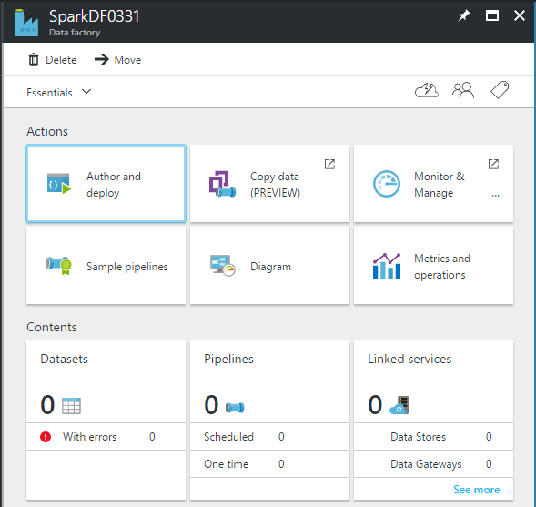
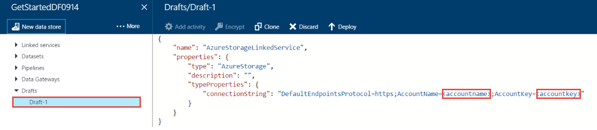
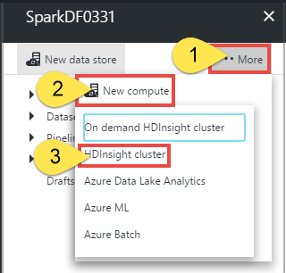
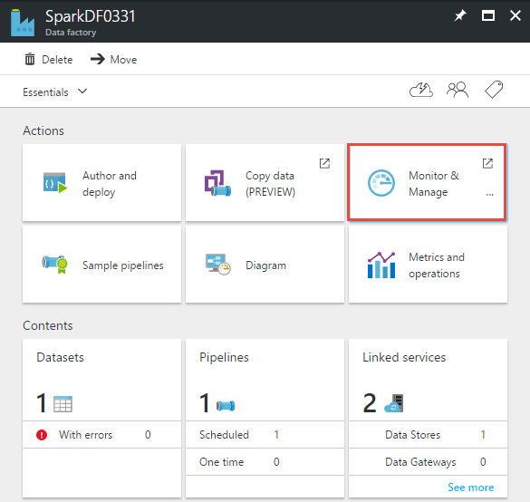
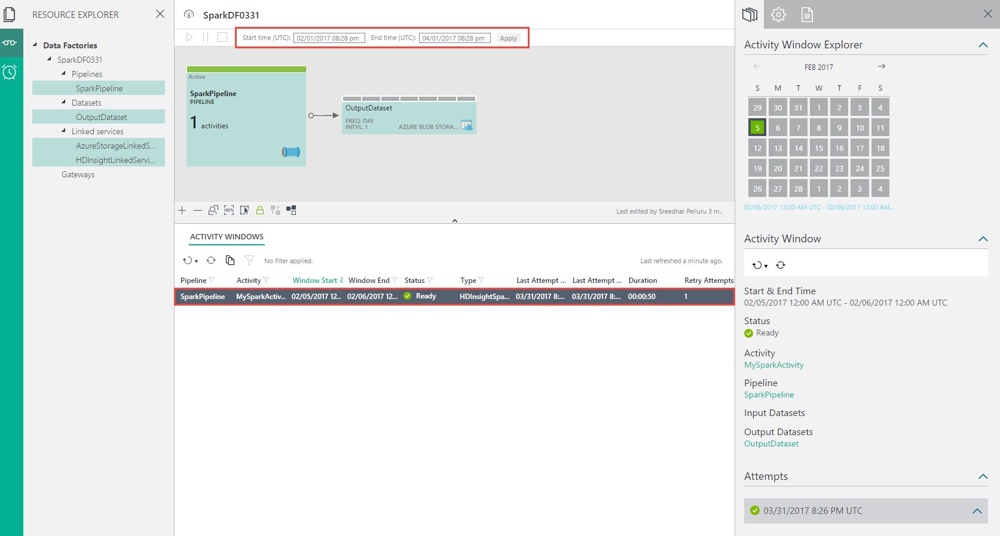
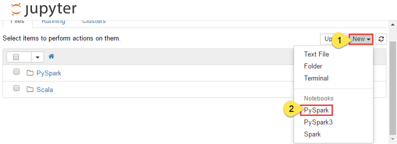
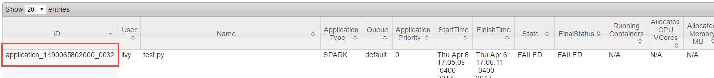
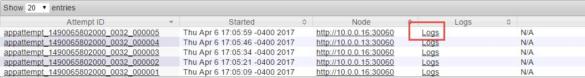
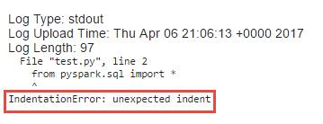

# Invoke Spark programs from Azure Data Factory pipelines

> [!div class="op_single_selector" title1="Transformation Activities"]
> * [Hive activity](data-factory-hive-activity.md)
> * [Pig activity](data-factory-pig-activity.md)
> * [MapReduce activity](data-factory-map-reduce.md)
> * [Hadoop Streaming activity](data-factory-hadoop-streaming-activity.md)
> * [Spark activity](data-factory-spark.md)
> * [Machine Learning Batch Execution activity](data-factory-azure-ml-batch-execution-activity.md)
> * [Machine Learning Update Resource activity](data-factory-azure-ml-update-resource-activity.md)
> * [Stored procedure activity](data-factory-stored-proc-activity.md)
> * [Data Lake Analytics U-SQL activity](data-factory-usql-activity.md)
> * [.NET custom activity](data-factory-use-custom-activities.md)

> [!NOTE]
> This article applies to version 1 of Azure Data Factory, which is generally available. If you use the current version of the Data Factory service, see [Transform data by using the Apache Spark activity in Data Factory](../transform-data-using-spark.md).

## Introduction
The Spark activity is one of the [data transformation activities](data-factory-data-transformation-activities.md) supported by Data Factory. This activity runs the specified Spark program on your Spark cluster in Azure HDInsight. 

> [!IMPORTANT]
> - The Spark activity doesn't support HDInsight Spark clusters that use Azure Data Lake Store as primary storage.
> - The Spark activity supports only existing (your own) HDInsight Spark clusters. It doesn't support an on-demand HDInsight linked service.

## Walkthrough: Create a pipeline with a Spark activity
Here are the typical steps to create a data factory pipeline with a Spark activity: 

* Create a data factory.
* Create an Azure Storage linked service to link your storage that is associated with your HDInsight Spark cluster to the data factory.
* Create an HDInsight linked service to link your Spark cluster in HDInsight to the data factory.
* Create a dataset that refers to the Storage linked service. Currently, you must specify an output dataset for an activity even if there is no output being produced. 
* Create a pipeline with Spark activity that refers to the HDInsight linked service you created. The activity is configured with the dataset you created in the previous step as an output dataset. The output dataset is what drives the schedule (hourly, daily). Therefore, you must specify the output dataset even though the activity doesn't really produce an output.

### Prerequisites
1. Create a general-purpose storage account by following the instructions in [Create a storage account](../../storage/common/storage-quickstart-create-account.md).

1. Create a Spark cluster in HDInsight by following the instructions in the tutorial [Create a Spark cluster in HDInsight](../../hdinsight/spark/apache-spark-jupyter-spark-sql.md). Associate the storage account you created in step 1 with this cluster.

1. Download and review the Python script file **test.py** located at [https://adftutorialfiles.blob.core.windows.net/sparktutorial/test.py](https://adftutorialfiles.blob.core.windows.net/sparktutorial/test.py).

1. Upload **test.py** to the **pyFiles** folder in the **adfspark** container in your blob storage. Create the container and the folder if they don't exist.

### Create a data factory
To create a data factory, follow these steps:

1. Sign in to the [Azure portal](https://portal.azure.com/).

1. Select **New** > **Data + Analytics** > **Data Factory**.

1. On the **New data factory** blade, under **Name**, enter **SparkDF**.

   > [!IMPORTANT]
   > The name of the Azure data factory must be globally unique. If you see the error "Data factory name SparkDF is not available," change the name of the data factory. For example, use yournameSparkDFdate, and create the data factory again. For more information on naming rules, see [Data Factory: Naming rules](data-factory-naming-rules.md).

1. Under **Subscription**, select the Azure subscription where you want the data factory to be created.

1. Select an existing resource group, or create an Azure resource group.

1. Select the **Pin to dashboard** check box.

1. Select **Create**.

   > [!IMPORTANT]
   > To create Data Factory instances, you must be a member of the [Data Factory contributor](../../role-based-access-control/built-in-roles.md#data-factory-contributor) role at the subscription/resource group level.

1. You see the data factory as it is created in the dashboard of the Azure portal.

1. After the data factory is created, you see the **Data factory** page, which shows you the contents of the data factory. If you don't see the **Data factory** page, select the tile for your data factory on the dashboard.

    

### Create linked services
In this step, you create two linked services. One service links your Spark cluster to your data factory, and the other service links your storage to your data factory. 

#### Create a Storage linked service
In this step, you link your storage account to your data factory. A dataset you create in a step later in this walkthrough refers to this linked service. The HDInsight linked service that you define in the next step refers to this linked service too. 

1. On the **Data factory** blade, select **Author and deploy**. The Data Factory Editor appears.

1. Select **New data store**, and choose **Azure Storage**.

   

1. The JSON script you use to create a Storage linked service appears in the editor.

   

1. Replace **account name** and **account key** with the name and access key of your storage account. To learn how to get your storage access key, see how to view, copy, and regenerate storage access keys in [Manage your storage account](../../storage/common/storage-account-manage.md#access-keys).

1. To deploy the linked service, select **Deploy** on the command bar. After the linked service is deployed successfully, the Draft-1 window disappears. You see **AzureStorageLinkedService** in the tree view on the left.

#### Create an HDInsight linked service
In this step, you create an HDInsight linked service to link your HDInsight Spark cluster to the data factory. The HDInsight cluster is used to run the Spark program specified in the Spark activity of the pipeline in this sample. 

1. In the Data Factory Editor, select **More** > **New compute** > **HDInsight cluster**.

	

1. Copy and paste the following snippet to the Draft-1 window. In the JSON editor, take the following steps:

	a. Specify the URI for the HDInsight Spark cluster. For example: `https://<sparkclustername>.azurehdinsight.net/`.

	b. Specify the name of the user who has access to the Spark cluster.

	c. Specify the password for the user.

	d. Specify the Storage linked service that is associated with the HDInsight Spark cluster. In this example, it's AzureStorageLinkedService.

	```json
	{
		"name": "HDInsightLinkedService",
	    "properties": {
	        "type": "HDInsight",
	        "typeProperties": {
	            "clusterUri": "https://<sparkclustername>.azurehdinsight.net/",
	            "userName": "admin",
	            "password": "**********",
	            "linkedServiceName": "AzureStorageLinkedService"
	        }
	    }
	}
	```

	> [!IMPORTANT]
	> - The Spark activity doesn't support HDInsight Spark clusters that use Azure Data Lake Store as primary storage.
	> - The Spark activity supports only existing (your own) HDInsight Spark clusters. It doesn't support an on-demand HDInsight linked service.

	For more information about the HDInsight linked service, see [HDInsight linked service](data-factory-compute-linked-services.md#azure-hdinsight-linked-service).

1. To deploy the linked service, select **Deploy** on the command bar. 

### Create the output dataset
The output dataset is what drives the schedule (hourly, daily). Therefore, you must specify an output dataset for the Spark activity in the pipeline even though the activity doesn't produce any output. Specifying an input dataset for the activity is optional.

1. In the Data Factory Editor, select **More** > **New dataset** > **Azure Blob storage**.

1. Copy and paste the following snippet to the Draft-1 window. The JSON snippet defines a dataset called **OutputDataset**. In addition, you specify that the results are stored in the blob container called **adfspark** and the folder called **pyFiles/output**. As mentioned previously, this dataset is a dummy dataset. The Spark program in this example doesn't produce any output. The **availability** section specifies that the output dataset is produced daily. 

	```json
	{
	    "name": "OutputDataset",
	    "properties": {
	        "type": "AzureBlob",
	        "linkedServiceName": "AzureStorageLinkedService",
	        "typeProperties": {
	            "fileName": "sparkoutput.txt",
	            "folderPath": "adfspark/pyFiles/output",
	            "format": {
	                "type": "TextFormat",
	                "columnDelimiter": "\t"
	            }
	        },
	        "availability": {
	            "frequency": "Day",
	            "interval": 1
	        }
	    }
	}
	```
1. To deploy the dataset, select **Deploy** on the command bar.


### Create a pipeline
In this step, you create a pipeline with an HDInsightSpark activity. Currently, the output dataset is what drives the schedule, so you must create an output dataset even if the activity doesn't produce any output. If the activity doesn't take any input, you can skip creating the input dataset. Therefore, no input dataset is specified in this example.

1. In the Data Factory Editor, select **More** > **New pipeline**.

1. Replace the script in the Draft-1 window with the following script:

	```json
	{
	    "name": "SparkPipeline",
	    "properties": {
	        "activities": [
	            {
	                "type": "HDInsightSpark",
	                "typeProperties": {
	                    "rootPath": "adfspark\\pyFiles",
	                    "entryFilePath": "test.py",
                    	"getDebugInfo": "Always"
	                },
	                "outputs": [
	                    {
	                        "name": "OutputDataset"
	                    }
	                ],
	                "name": "MySparkActivity",
	                "linkedServiceName": "HDInsightLinkedService"
	            }
	        ],
	        "start": "2017-02-05T00:00:00Z",
	        "end": "2017-02-06T00:00:00Z"
	    }
	}
	```
	Note the following points:

	a. The **type** property is set to **HDInsightSpark**.

	b. The **rootPath** property is set to **adfspark\\pyFiles** where adfspark is the blob container and pyFiles is file folder in that container. In this example, the blob storage is the one that is associated with the Spark cluster. You can upload the file to a different storage account. If you do so, create a Storage linked service to link that storage account to the data factory. Then, specify the name of the linked service as a value for the **sparkJobLinkedService** property. For more information about this property and other properties supported by the Spark activity, see [Spark activity properties](#spark-activity-properties).

	c. The **entryFilePath** property is set to **test.py**, which is the Python file.

	d. The **getDebugInfo** property is set to **Always**, which means the log files are always generated (success or failure).

	> [!IMPORTANT]
	> We recommend that you do not set this property to `Always` in a production environment unless you're troubleshooting an issue.

	e. The **outputs** section has one output dataset. You must specify an output dataset even if the Spark program doesn't produce any output. The output dataset drives the schedule for the pipeline (hourly, daily). 

	For more information about the properties supported by the Spark activity, see the section [Spark activity properties](#spark-activity-properties).

1. To deploy the pipeline, select **Deploy** on the command bar.

### Monitor a pipeline
1. On the **Data factory** blade, select **Monitor & Manage** to start the monitoring application in another tab.

	

1. Change the **Start time** filter at the top to **2/1/2017**, and select **Apply**.

1. Only one activity window appears because there is only one day between the start (2017-02-01) and end times (2017-02-02) of the pipeline. Confirm that the data slice is in the **Ready** state.

	

1. In the **Activity windows** list, select an activity run to see details about it. If there is an error, you see details about it in the right pane.

### Verify the results

1. Start the Jupyter Notebook for your HDInsight Spark cluster by going to [this website](https://CLUSTERNAME.azurehdinsight.net/jupyter). You also can open a cluster dashboard for your HDInsight Spark cluster, and then start the Jupyter Notebook.

1. Select **New** > **PySpark** to start a new notebook.

	

1. Run the following command by copying and pasting the text and pressing Shift+Enter at the end of the second statement:

	```sql
	%%sql

	SELECT buildingID, (targettemp - actualtemp) AS temp_diff, date FROM hvac WHERE date = \"6/1/13\"
	```
1. Confirm that you see the data from the hvac table. 

	

<!-- Removed bookmark #run-a-hive-query-using-spark-sql since it doesn't exist in the target article -->
For detailed instructions, see the section [Run a Spark SQL query](../../hdinsight/spark/apache-spark-jupyter-spark-sql.md). 

### Troubleshooting
Because you set getDebugInfo to **Always**, you see a log subfolder in the pyFiles folder in your blob container. The log file in the log folder provides additional information. This log file is especially useful when there is an error. In a production environment, you might want to set it to **Failure**.

For further troubleshooting, take the following steps:


1. Go to `https://<CLUSTERNAME>.azurehdinsight.net/yarnui/hn/cluster`.

	

1. Select **Logs** for one of the run attempts.

	

1. You see the following additional error information in the log page:

	

The following sections provide information about the data factory entities to use Spark cluster and Spark activity in your data factory.

## Spark activity properties
Here is the sample JSON definition of a pipeline with a Spark activity: 

```json
{
    "name": "SparkPipeline",
    "properties": {
        "activities": [
            {
                "type": "HDInsightSpark",
                "typeProperties": {
                    "rootPath": "adfspark\\pyFiles",
                    "entryFilePath": "test.py",
					"arguments": [ "arg1", "arg2" ],
					"sparkConfig": {
						"spark.python.worker.memory": "512m"
					}
                    "getDebugInfo": "Always"
                },
                "outputs": [
                    {
                        "name": "OutputDataset"
                    }
                ],
                "name": "MySparkActivity",
                "description": "This activity invokes the Spark program",
                "linkedServiceName": "HDInsightLinkedService"
            }
        ],
        "start": "2017-02-01T00:00:00Z",
        "end": "2017-02-02T00:00:00Z"
    }
}
```

The following table describes the JSON properties used in the JSON definition.

| Property | Description | Required |
| -------- | ----------- | -------- |
| name | Name of the activity in the pipeline. | Yes |
| description | Text that describes what the activity does. | No |
| type | This property must be set to HDInsightSpark. | Yes |
| linkedServiceName | Name of the HDInsight linked service on which the Spark program runs. | Yes |
| rootPath | The blob container and folder that contains the Spark file. The file name is case sensitive. | Yes |
| entryFilePath | Relative path to the root folder of the Spark code/package. | Yes |
| className | Application's Java/Spark main class. | No |
| arguments | A list of command-line arguments to the Spark program. | No |
| proxyUser | The user account to impersonate to execute the Spark program. | No |
| sparkConfig | Specify values for the Spark configuration properties listed in [Spark configuration: Application properties](https://spark.apache.org/docs/latest/configuration.html#available-properties). | No |
| getDebugInfo | Specifies when the Spark log files are copied to the storage used by the HDInsight cluster (or) specified by sparkJobLinkedService. Allowed values are None, Always, or Failure. The default value is None. | No |
| sparkJobLinkedService | The Storage linked service that holds the Spark job file, dependencies, and logs. If you don't specify a value for this property, the storage associated with the HDInsight cluster is used. | No |

## Folder structure
The Spark activity doesn't support an inline script as Pig and Hive activities do. Spark jobs are also more extensible than Pig/Hive jobs. For Spark jobs, you can provide multiple dependencies such as jar packages (placed in the java CLASSPATH), Python files (placed on the PYTHONPATH), and any other files.

Create the following folder structure in the blob storage referenced by the HDInsight linked service. Then, upload dependent files to the appropriate subfolders in the root folder represented by **entryFilePath**. For example, upload Python files to the pyFiles subfolder and jar files to the jars subfolder of the root folder. At runtime, the Data Factory service expects the following folder structure in the blob storage: 

| Path | Description | Required | Type |
| ---- | ----------- | -------- | ---- |
| .	| The root path of the Spark job in the storage linked service.	| Yes | Folder |
| &lt;user defined &gt; | The path that points to the entry file of the Spark job. | Yes | File |
| ./jars | All files under this folder are uploaded and placed on the Java classpath of the cluster. | No | Folder |
| ./pyFiles | All files under this folder are uploaded and placed on the PYTHONPATH of the cluster. | No | Folder |
| ./files | All files under this folder are uploaded and placed on the executor working directory. | No | Folder |
| ./archives | All files under this folder are uncompressed. | No | Folder |
| ./logs | The folder where logs from the Spark cluster are stored.| No | Folder |

Here is an example for storage that contains two Spark job files in the blob storage referenced by the HDInsight linked service:

```
SparkJob1
	main.jar
	files
		input1.txt
		input2.txt
	jars
		package1.jar
		package2.jar
	logs

SparkJob2
	main.py
	pyFiles
		scrip1.py
		script2.py
	logs
```
