# SQL Server Stored Procedure Activity
> [!div class="op_single_selector" title1="Transformation Activities"]
> * [Hive Activity](data-factory-hive-activity.md)
> * [Pig Activity](data-factory-pig-activity.md)
> * [MapReduce Activity](data-factory-map-reduce.md)
> * [Hadoop Streaming Activity](data-factory-hadoop-streaming-activity.md)
> * [Spark Activity](data-factory-spark.md)
> * [Machine Learning Batch Execution Activity](data-factory-azure-ml-batch-execution-activity.md)
> * [Machine Learning Update Resource Activity](data-factory-azure-ml-update-resource-activity.md)
> * [Stored Procedure Activity](data-factory-stored-proc-activity.md)
> * [Data Lake Analytics U-SQL Activity](data-factory-usql-activity.md)
> * [.NET Custom Activity](data-factory-use-custom-activities.md)

> [!NOTE]
> This article applies to version 1 of Azure Data Factory. If you are using the current version of the Data Factory service, see [transform data using stored procedure activity in Data Factory](../transform-data-using-stored-procedure.md).

## Overview
You use data transformation activities in a Data Factory [pipeline](data-factory-create-pipelines.md) to transform and process raw data into predictions and insights. The Stored Procedure Activity is one of the transformation activities that Data Factory supports. This article builds on the [data transformation activities](data-factory-data-transformation-activities.md) article, which presents a general overview of data transformation and the supported transformation activities in Data Factory.

You can use the Stored Procedure Activity to invoke a stored procedure in one of the following data stores in your enterprise or on an Azure virtual machine (VM):

- Azure SQL Database
- Azure SQL Data Warehouse
- SQL Server Database. If you are using SQL Server, install Data Management Gateway on the same machine that hosts the database or on a separate machine that has access to the database. Data Management Gateway is a component that connects data sources on-premises/on Azure VM with cloud services in a secure and managed way. See [Data Management Gateway](data-factory-data-management-gateway.md) article for details.

> [!IMPORTANT]
> When copying data into Azure SQL Database or SQL Server, you can configure the **SqlSink** in copy activity to invoke a stored procedure by using the **sqlWriterStoredProcedureName** property. For more information, see [Invoke stored procedure from copy activity](data-factory-invoke-stored-procedure-from-copy-activity.md). For details about the property, see following connector articles: [Azure SQL Database](data-factory-azure-sql-connector.md#copy-activity-properties), [SQL Server](data-factory-sqlserver-connector.md#copy-activity-properties). Invoking a stored procedure while copying data into an Azure SQL Data Warehouse by using a copy activity is not supported. But, you can use the stored procedure activity to invoke a stored procedure in a SQL Data Warehouse.
>
> When copying data from Azure SQL Database or SQL Server or Azure SQL Data Warehouse, you can configure **SqlSource** in copy activity to invoke a stored procedure to read data from the source database by using the **sqlReaderStoredProcedureName** property. For more information, see the following connector articles: [Azure SQL Database](data-factory-azure-sql-connector.md#copy-activity-properties), [SQL Server](data-factory-sqlserver-connector.md#copy-activity-properties), [Azure SQL Data Warehouse](data-factory-azure-sql-data-warehouse-connector.md#copy-activity-properties)

The following walkthrough uses the Stored Procedure Activity in a pipeline to invoke a stored procedure in an Azure SQL database.

## Walkthrough
### Sample table and stored procedure
1. Create the following **table** in your Azure SQL Database using SQL Server Management Studio or any other tool you are comfortable with. The datetimestamp column is the date and time when the corresponding ID is generated.

    ```SQL
    CREATE TABLE dbo.sampletable
    (
        Id uniqueidentifier,
        datetimestamp nvarchar(127)
    )
    GO

    CREATE CLUSTERED INDEX ClusteredID ON dbo.sampletable(Id);
    GO
    ```
    Id is the unique identified and the datetimestamp column is the date and time when the corresponding ID is generated.
    
	

	In this sample, the stored procedure is in an Azure SQL Database. If the stored procedure is in an Azure SQL Data Warehouse and SQL Server Database, the approach is similar. For a SQL Server database, you must install a [Data Management Gateway](data-factory-data-management-gateway.md).
2. Create the following **stored procedure** that inserts data in to the **sampletable**.

    ```SQL
    CREATE PROCEDURE usp_sample @DateTime nvarchar(127)
    AS

    BEGIN
        INSERT INTO [sampletable]
        VALUES (newid(), @DateTime)
    END
    ```

   > [!IMPORTANT]
   > **Name** and **casing** of the parameter (DateTime in this example) must match that of parameter specified in the pipeline/activity JSON. In the stored procedure definition, ensure that **\@** is used as a prefix for the parameter.

### Create a data factory
1. Log in to [Azure portal](https://portal.azure.com/).
2. Click **NEW** on the left menu, click **Intelligence + Analytics**, and click **Data Factory**.

    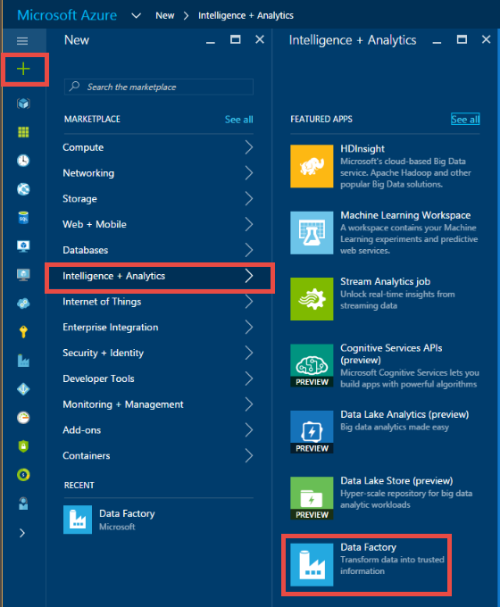
3. In the **New data factory** blade, enter **SProcDF** for the Name. Azure Data Factory names are **globally unique**. You need to prefix the name of the data factory with your name, to enable the successful creation of the factory.

   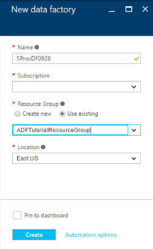
4. Select your **Azure subscription**.
5. For **Resource Group**, do one of the following steps:
   1. Click **Create new** and enter a name for the resource group.
   2. Click **Use existing** and select an existing resource group.
6. Select the **location** for the data factory.
7. Select **Pin to dashboard** so that you can see the data factory on the dashboard next time you log in.
8. Click **Create** on the **New data factory** blade.
9. You see the data factory being created in the **dashboard** of the Azure portal. After the data factory has been created successfully, you see the data factory page, which shows you the contents of the data factory.

   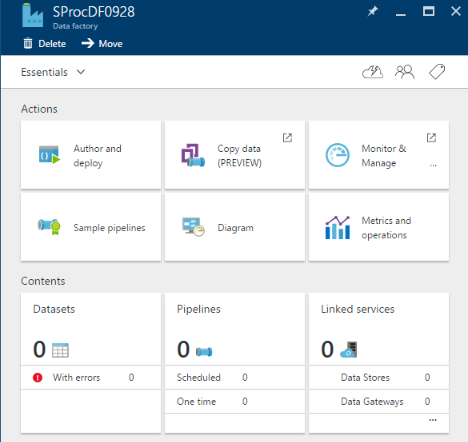

### Create an Azure SQL linked service
After creating the data factory, you create an Azure SQL linked service that links your Azure SQL database, which contains the sampletable table and usp_sample stored procedure, to your data factory.

1. Click **Author and deploy** on the **Data Factory** blade for **SProcDF** to launch the Data Factory Editor.
2. Click **New data store** on the command bar and choose **Azure SQL Database**. You should see the JSON script for creating an Azure SQL linked service in the editor.

   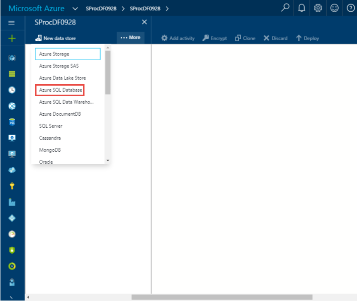
3. In the JSON script, make the following changes:

   1. Replace `<servername>` with the name of your server.
   2. Replace `<databasename>` with the database in which you created the table and the stored procedure.
   3. Replace `<username@servername>` with the user account that has access to the database.
   4. Replace `<password>` with the password for the user account.

      
4. To deploy the linked service, click **Deploy** on the command bar. Confirm that you see the AzureSqlLinkedService in the tree view on the left.

    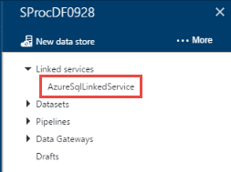

### Create an output dataset
You must specify an output dataset for a stored procedure activity even if the stored procedure does not produce any data. That's because it's the output dataset that drives the schedule of the activity (how often the activity is run - hourly, daily, etc.). The output dataset must use a **linked service** that refers to an Azure SQL Database or an Azure SQL Data Warehouse or a SQL Server Database in which you want the stored procedure to run. The output dataset can serve as a way to pass the result of the stored procedure for subsequent processing by another activity ([chaining activities](data-factory-scheduling-and-execution.md#multiple-activities-in-a-pipeline) in the pipeline. However, Data Factory does not automatically write the output of a stored procedure to this dataset. It is the stored procedure that writes to a SQL table that the output dataset points to. In some cases, the output dataset can be a **dummy dataset** (a dataset that points to a table that does not really hold output of the stored procedure). This dummy dataset is used only to specify the schedule for running the stored procedure activity.

1. Click **... More** on the toolbar, click **New dataset**, and click **Azure SQL**. **New dataset** on the command bar and select **Azure SQL**.

    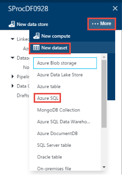
2. Copy/paste the following JSON script in to the JSON editor.

    ```JSON
    {
        "name": "sprocsampleout",
        "properties": {
            "type": "AzureSqlTable",
            "linkedServiceName": "AzureSqlLinkedService",
            "typeProperties": {
                "tableName": "sampletable"
            },
            "availability": {
                "frequency": "Hour",
                "interval": 1
            }
        }
    }
    ```
3. To deploy the dataset, click **Deploy** on the command bar. Confirm that you see the dataset in the tree view.

    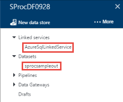

### Create a pipeline with SqlServerStoredProcedure activity
Now, let's create a pipeline with a stored procedure activity.

Notice the following properties:

- The **type** property is set to **SqlServerStoredProcedure**.
- The **storedProcedureName** in type properties is set to **usp_sample** (name of the stored procedure).
- The **storedProcedureParameters** section contains one parameter named **DateTime**. Name and casing of the parameter in JSON must match the name and casing of the parameter in the stored procedure definition. If you need pass null for a parameter, use the syntax: `"param1": null` (all lowercase).

1. Click **... More** on the command bar and click **New pipeline**.
2. Copy/paste the following JSON snippet:

    ```JSON
    {
        "name": "SprocActivitySamplePipeline",
        "properties": {
            "activities": [
                {
                    "type": "SqlServerStoredProcedure",
                    "typeProperties": {
                        "storedProcedureName": "usp_sample",
                        "storedProcedureParameters": {
                            "DateTime": "$$Text.Format('{0:yyyy-MM-dd HH:mm:ss}', SliceStart)"
                        }
                    },
                    "outputs": [
                        {
                            "name": "sprocsampleout"
                        }
                    ],
                    "scheduler": {
                        "frequency": "Hour",
                        "interval": 1
                    },
                    "name": "SprocActivitySample"
                }
            ],
            "start": "2017-04-02T00:00:00Z",
            "end": "2017-04-02T05:00:00Z",
            "isPaused": false
        }
    }
    ```
3. To deploy the pipeline, click **Deploy** on the toolbar.

### Monitor the pipeline
1. Click **X** to close Data Factory Editor blades and to navigate back to the Data Factory blade, and click **Diagram**.

    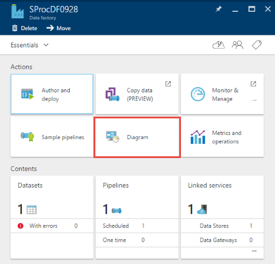
2. In the **Diagram View**, you see an overview of the pipelines, and datasets used in this tutorial.

    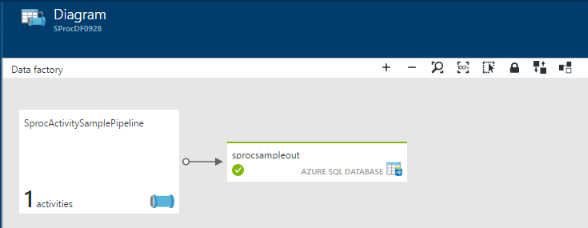
3. In the Diagram View, double-click the dataset `sprocsampleout`. You see the slices in Ready state. There should be five slices because a slice is produced for each hour between the start time and end time from the JSON.

    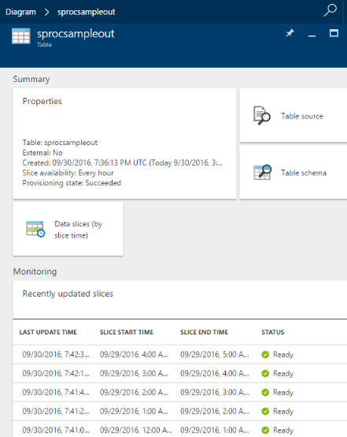
4. When a slice is in **Ready** state, run a `select * from sampletable` query against the Azure SQL database to verify that the data was inserted in to the table by the stored procedure.

   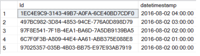

   See [Monitor the pipeline](data-factory-monitor-manage-pipelines.md) for detailed information about monitoring Azure Data Factory pipelines.

## Specify an input dataset
In the walkthrough, stored procedure activity does not have any input datasets. If you specify an input dataset, the stored procedure activity does not run until the slice of input dataset is available (in Ready state). The dataset can be an external dataset (that is not produced by another activity in the same pipeline) or an internal dataset that is produced by an upstream activity (the activity that runs before this activity). You can specify multiple input datasets for the stored procedure activity. If you do so, the stored procedure activity runs only when all the input dataset slices are available (in Ready state). The input dataset cannot be consumed in the stored procedure as a parameter. It is only used to check the dependency before starting the stored procedure activity.

## Chaining with other activities
If you want to chain an upstream activity with this activity, specify the output of the upstream activity as an input of this activity. When you do so, the stored procedure activity does not run until the upstream activity completes and the output dataset of the upstream activity is available (in Ready status). You can specify output datasets of multiple upstream activities as input datasets of the stored procedure activity. When you do so, the stored procedure activity runs only when all the input dataset slices are available.

In the following example, the output of the copy activity is: OutputDataset, which is an input of the stored procedure activity. Therefore, the stored procedure activity does not run until the copy activity completes and the OutputDataset slice is available (in Ready state). If you specify multiple input datasets, the stored procedure activity does not run until all the input dataset slices are available (in Ready state). The input datasets cannot be used directly as parameters to the stored procedure activity.

For more information on chaining activities, see [multiple activities in a pipeline](data-factory-create-pipelines.md#multiple-activities-in-a-pipeline)

```json
{
	"name": "ADFTutorialPipeline",
	"properties": {
		"description": "Copy data from a blob to blob",
		"activities": [
			{
				"type": "Copy",
				"typeProperties": {
					"source": {
						"type": "BlobSource"
					},
					"sink": {
						"type": "BlobSink",
						"writeBatchSize": 0,
						"writeBatchTimeout": "00:00:00"
					}
				},
				"inputs": [ { "name": "InputDataset" } ],
				"outputs": [ { "name": "OutputDataset" } ],
				"policy": {
					"timeout": "01:00:00",
					"concurrency": 1,
					"executionPriorityOrder": "NewestFirst"
				},
				"name": "CopyFromBlobToSQL"
			},
			{
				"type": "SqlServerStoredProcedure",
				"typeProperties": {
					"storedProcedureName": "SPSproc"
				},
				"inputs": [ { "name": "OutputDataset" } ],
				"outputs": [ { "name": "SQLOutputDataset" } ],
				"policy": {
					"timeout": "01:00:00",
					"concurrency": 1,
					"retry": 3
				},
				"name": "RunStoredProcedure"
			}
		],
		"start": "2017-04-12T00:00:00Z",
		"end": "2017-04-13T00:00:00Z",
		"isPaused": false,
	}
}
```

Similarly, to link the store procedure activity with **downstream activities** (the activities that run after the stored procedure activity completes), specify the output dataset of the stored procedure activity as an input of the downstream activity in the pipeline.

> [!IMPORTANT]
> When copying data into Azure SQL Database or SQL Server, you can configure the **SqlSink** in copy activity to invoke a stored procedure by using the **sqlWriterStoredProcedureName** property. For more information, see [Invoke stored procedure from copy activity](data-factory-invoke-stored-procedure-from-copy-activity.md). For details about the property, see the following connector articles: [Azure SQL Database](data-factory-azure-sql-connector.md#copy-activity-properties), [SQL Server](data-factory-sqlserver-connector.md#copy-activity-properties).
> 
> When copying data from Azure SQL Database or SQL Server or Azure SQL Data Warehouse, you can configure **SqlSource** in copy activity to invoke a stored procedure to read data from the source database by using the **sqlReaderStoredProcedureName** property. For more information, see the following connector articles: [Azure SQL Database](data-factory-azure-sql-connector.md#copy-activity-properties), [SQL Server](data-factory-sqlserver-connector.md#copy-activity-properties), [Azure SQL Data Warehouse](data-factory-azure-sql-data-warehouse-connector.md#copy-activity-properties)

## JSON format
Here is the JSON format for defining a Stored Procedure Activity:

```JSON
{
    "name": "SQLSPROCActivity",
    "description": "description",
    "type": "SqlServerStoredProcedure",
    "inputs": [ { "name": "inputtable" } ],
    "outputs": [ { "name": "outputtable" } ],
    "typeProperties":
    {
        "storedProcedureName": "<name of the stored procedure>",
        "storedProcedureParameters":
        {
            "param1": "param1Value"
            …
        }
    }
}
```

The following table describes these JSON properties:

| Property | Description | Required |
| --- | --- | --- |
| name | Name of the activity |Yes |
| description |Text describing what the activity is used for |No |
| type | Must be set to: **SqlServerStoredProcedure** | Yes |
| inputs | Optional. If you do specify an input dataset, it must be available (in ‘Ready’ status) for the stored procedure activity to run. The input dataset cannot be consumed in the stored procedure as a parameter. It is only used to check the dependency before starting the stored procedure activity. |No |
| outputs | You must specify an output dataset for a stored procedure activity. Output dataset specifies the **schedule** for the stored procedure activity (hourly, weekly, monthly, etc.). <br/><br/>The output dataset must use a **linked service** that refers to an Azure SQL Database or an Azure SQL Data Warehouse or a SQL Server Database in which you want the stored procedure to run. <br/><br/>The output dataset can serve as a way to pass the result of the stored procedure for subsequent processing by another activity ([chaining activities](data-factory-scheduling-and-execution.md#multiple-activities-in-a-pipeline) in the pipeline. However, Data Factory does not automatically write the output of a stored procedure to this dataset. It is the stored procedure that writes to a SQL table that the output dataset points to. <br/><br/>In some cases, the output dataset can be a **dummy dataset**, which is used only to specify the schedule for running the stored procedure activity. |Yes |
| storedProcedureName |Specify the name of the stored procedure in the Azure SQL database or Azure SQL Data Warehouse or SQL Server database that is represented by the linked service that the output table uses. |Yes |
| storedProcedureParameters |Specify values for stored procedure parameters. If you need to pass null for a parameter, use the syntax: "param1": null (all lower case). See the following sample to learn about using this property. |No |

## Passing a static value
Now, let’s consider adding another column named ‘Scenario’ in the table containing a static value called ‘Document sample’.


**Table:**

```SQL
CREATE TABLE dbo.sampletable2
(
    Id uniqueidentifier,
    datetimestamp nvarchar(127),
    scenario nvarchar(127)
)
GO

CREATE CLUSTERED INDEX ClusteredID ON dbo.sampletable2(Id);
```

**Stored procedure:**

```SQL
CREATE PROCEDURE usp_sample2 @DateTime nvarchar(127) , @Scenario nvarchar(127)

AS

BEGIN
    INSERT INTO [sampletable2]
    VALUES (newid(), @DateTime, @Scenario)
END
```

Now, pass the **Scenario** parameter and the value from the stored procedure activity. The **typeProperties** section in the preceding sample looks like the following snippet:

```JSON
"typeProperties":
{
    "storedProcedureName": "usp_sample",
    "storedProcedureParameters":
    {
        "DateTime": "$$Text.Format('{0:yyyy-MM-dd HH:mm:ss}', SliceStart)",
        "Scenario": "Document sample"
    }
}
```

**Data Factory dataset:**

```JSON
{
    "name": "sprocsampleout2",
    "properties": {
        "published": false,
        "type": "AzureSqlTable",
        "linkedServiceName": "AzureSqlLinkedService",
        "typeProperties": {
            "tableName": "sampletable2"
        },
        "availability": {
            "frequency": "Hour",
            "interval": 1
        }
    }
}
```

**Data Factory pipeline**

```JSON
{
    "name": "SprocActivitySamplePipeline2",
    "properties": {
        "activities": [
            {
                "type": "SqlServerStoredProcedure",
                "typeProperties": {
                    "storedProcedureName": "usp_sample2",
                    "storedProcedureParameters": {
                        "DateTime": "$$Text.Format('{0:yyyy-MM-dd HH:mm:ss}', SliceStart)",
                        "Scenario": "Document sample"
                    }
                },
                "outputs": [
                    {
                        "name": "sprocsampleout2"
                    }
                ],
                "scheduler": {
                    "frequency": "Hour",
                    "interval": 1
                },
                "name": "SprocActivitySample"
            }
        ],
        "start": "2016-10-02T00:00:00Z",
        "end": "2016-10-02T05:00:00Z"
    }
}
```
