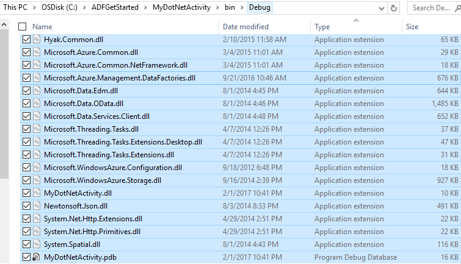
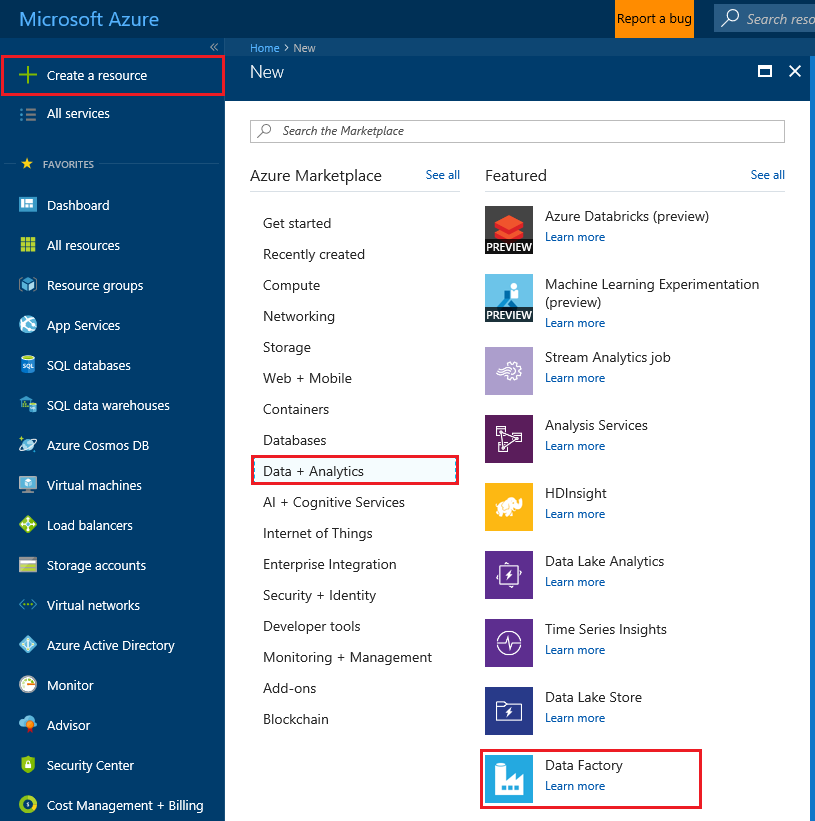
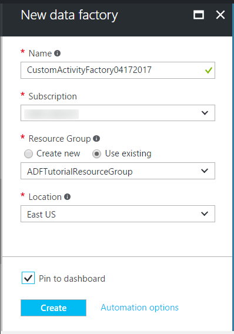
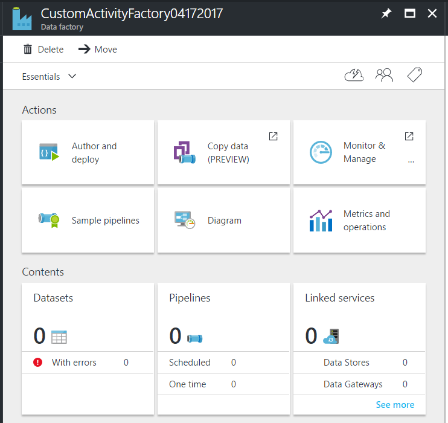
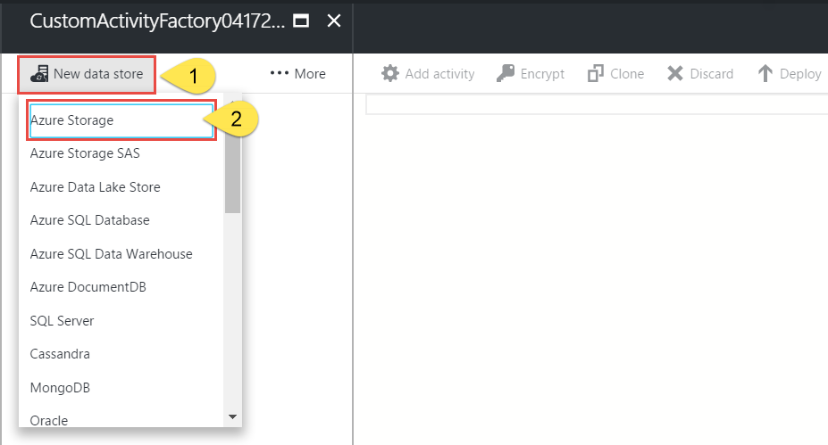
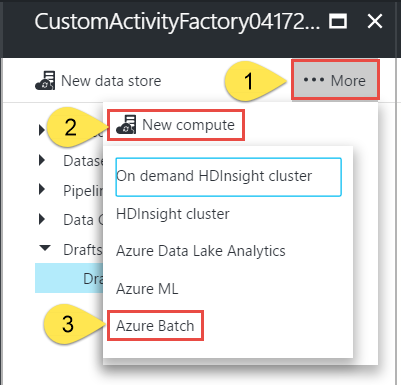
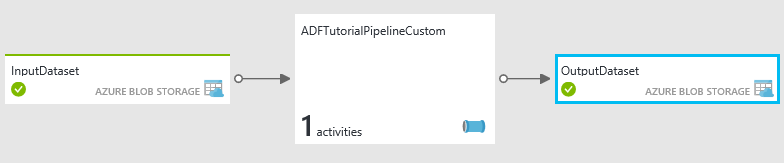
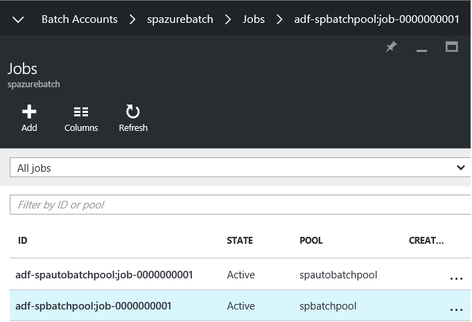
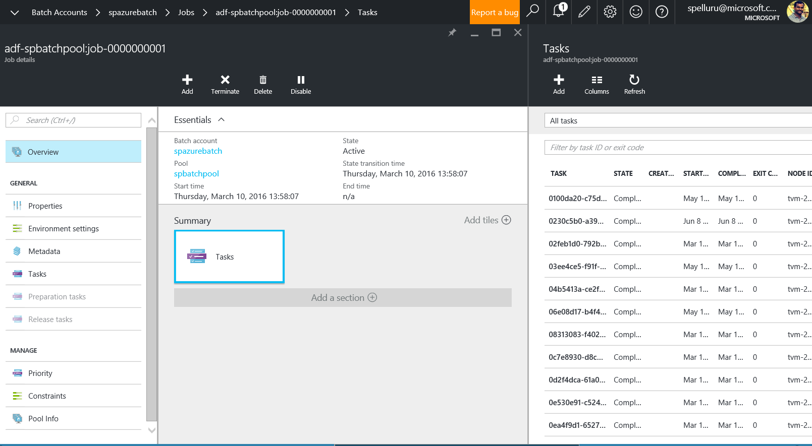
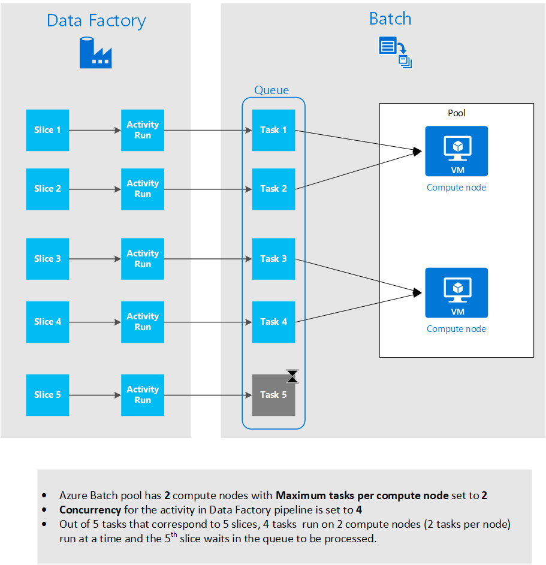

# Use custom activities in an Azure Data Factory pipeline
> [!div class="op_single_selector" title1="Select the version of Data Factory service you are using:"]
> * [Version 1](data-factory-use-custom-activities.md)
> * [Version 2 (current version)](../transform-data-using-dotnet-custom-activity.md)

> [!NOTE]
> This article applies to version 1 of Data Factory. If you are using the current version of the Data Factory service, see [Custom activities in V2](../transform-data-using-dotnet-custom-activity.md).

There are two types of activities that you can use in an Azure Data Factory pipeline.

- [Data Movement Activities](data-factory-data-movement-activities.md) to move data between [supported source and sink data stores](data-factory-data-movement-activities.md#supported-data-stores-and-formats).
- [Data Transformation Activities](data-factory-data-transformation-activities.md) to transform data using compute services such as Azure HDInsight, Azure Batch, and Azure Machine Learning.

To move data to/from a data store that Data Factory does not support, create a **custom activity** with your own data movement logic and use the activity in a pipeline. Similarly, to transform/process data in a way that isn't supported by Data Factory, create a custom activity with your own data transformation logic and use the activity in a pipeline.

You can configure a custom activity to run on an **Azure Batch** pool of virtual machines. When using Azure Batch, you can use only an existing Azure Batch pool.

The following walkthrough provides step-by-step instructions for creating a custom .NET activity and using the custom activity in a pipeline. The walkthrough uses an **Azure Batch** linked service.

> [!IMPORTANT]
> - It is not possible to use a Data Management Gateway from a custom activity to access on-premises data sources. Currently, [Data Management Gateway](data-factory-data-management-gateway.md) supports only the copy activity and stored procedure activity in Data Factory.

## Walkthrough: create a custom activity
### Prerequisites
* Visual Studio 2012/2013/2015/2017
* Download and install [Azure .NET SDK](https://azure.microsoft.com/downloads/)

### Azure Batch prerequisites
In the walkthrough, you run your custom .NET activities using Azure Batch as a compute resource. **Azure Batch** is a platform service for running large-scale parallel and high-performance computing (HPC) applications efficiently in the cloud. Azure Batch schedules compute-intensive work to run on a managed **collection of virtual machines**, and can automatically scale compute resources to meet the needs of your jobs. See [Azure Batch basics][batch-technical-overview] article for a detailed overview of the Azure Batch service.

For the tutorial, create an Azure Batch account with a pool of VMs. Here are the steps:

1. Create an **Azure Batch account** using the [Azure portal](https://portal.azure.com). See [Create and manage an Azure Batch account][batch-create-account] article for instructions.
2. Note down the Azure Batch account name, account key, URI, and pool name. You need them to create an Azure Batch linked service.
	1. On the home page for Azure Batch account, you see a **URL** in the following format: `https://myaccount.westus.batch.azure.com`. In this example, **myaccount** is the name of the Azure Batch account. URI you use in the linked service definition is the URL without the name of the account. For example: `https://<region>.batch.azure.com`.
	2. Click **Keys** on the left menu, and copy the **PRIMARY ACCESS KEY**.
	3. To use an existing pool, click **Pools** on the menu, and note down the **ID** of the pool. If you don't have an existing pool, move to the next step.
2. Create an **Azure Batch pool**.

   1. In the [Azure portal](https://portal.azure.com), click **Browse** in the left menu, and click **Batch Accounts**.
   2. Select your Azure Batch account to open the **Batch Account** blade.
   3. Click **Pools** tile.
   4. In the **Pools** blade, click Add button on the toolbar to add a pool.
      1. Enter an ID for the pool (Pool ID). Note the **ID of the pool**; you need it when creating the Data Factory solution.
      2. Specify **Windows Server 2012 R2** for the Operating System Family setting.
      3. Select a **node pricing tier**.
      4. Enter **2** as value for the **Target Dedicated** setting.
      5. Enter **2** as value for the **Max tasks per node** setting.
   5. Click **OK** to create the pool.
   6. Note down the **ID** of the pool.

### High-level steps
Here are the two high-level steps you perform as part of this walkthrough:

1. Create a custom activity that contains simple data transformation/processing logic.
2. Create an Azure data factory with a pipeline that uses the custom activity.

### Create a custom activity
To create a .NET custom activity, create a **.NET Class Library** project with a class that implements that **IDotNetActivity** interface. This interface has only one method: [Execute](https://msdn.microsoft.com/library/azure/mt603945.aspx) and its signature is:

```csharp
public IDictionary<string, string> Execute(
    IEnumerable<LinkedService> linkedServices,
    IEnumerable<Dataset> datasets,
    Activity activity,
    IActivityLogger logger)
```

The method takes four parameters:

- **linkedServices**. This property is an enumerable list of Data Store linked services referenced by input/output datasets for the activity.
- **datasets**. This property is an enumerable list of input/output datasets for the activity. You can use this parameter to get the locations and schemas defined by input and output datasets.
- **activity**. This property represents the current activity. It can be used to access extended properties associated with the custom activity. See [Access extended properties](#access-extended-properties) for details.
- **logger**. This object lets you write debug comments that surface in the user log for the pipeline.

The method returns a dictionary that can be used to chain custom activities together in the future. This feature is not implemented yet, so return an empty dictionary from the method.

### Procedure
1. Create a **.NET Class Library** project.
   <ol type="a">
     <li>Launch Visual Studio.</li>
     <li>Click <b>File</b>, point to <b>New</b>, and click <b>Project</b>.</li>
     <li>Expand <b>Templates</b>, and select <b>Visual C#</b>. In this walkthrough, you use C#, but you can use any .NET language to develop the custom activity.</li>
     <li>Select <b>Class Library</b> from the list of project types on the right. In Visual Studio, choose <b>Class Library (.NET Framework)</b> </li>
     <li>Enter <b>MyDotNetActivity</b> for the <b>Name</b>.</li>
     <li>Select <b>C:\ADFGetStarted</b> for the <b>Location</b>.</li>
     <li>Click <b>OK</b> to create the project.</li>
   </ol>

2. Click **Tools**, point to **NuGet Package Manager**, and click **Package Manager Console**.

3. In the Package Manager Console, execute the following command to import **Microsoft.Azure.Management.DataFactories**.

	```powershell
	Install-Package Microsoft.Azure.Management.DataFactories
    ```
4. Import the **Azure Storage** NuGet package in to the project.

	```powershell
	Install-Package WindowsAzure.Storage -Version 4.3.0
    ```

	> [!IMPORTANT]
	> Data Factory service launcher requires the 4.3 version of WindowsAzure.Storage. If you add a reference to a later version of Azure Storage assembly in your custom activity project, you see an error when the activity executes. To resolve the error, see [Appdomain isolation](#appdomain-isolation) section.
5. Add the following **using** statements to the source file in the project.

	```csharp

	// Comment these lines if using VS 2017
	using System.IO;
	using System.Globalization;
	using System.Diagnostics;
	using System.Linq;
	// --------------------

	// Comment these lines if using <= VS 2015
	using System;
	using System.Collections.Generic;
	using System.Linq;
	using System.Text;
	using System.Threading.Tasks;
	// ---------------------

	using Microsoft.Azure.Management.DataFactories.Models;
	using Microsoft.Azure.Management.DataFactories.Runtime;

	using Microsoft.WindowsAzure.Storage;
	using Microsoft.WindowsAzure.Storage.Blob;
    ```
6. Change the name of the **namespace** to **MyDotNetActivityNS**.

	```csharp
	namespace MyDotNetActivityNS
    ```
7. Change the name of the class to **MyDotNetActivity** and derive it from the **IDotNetActivity** interface as shown in the following code snippet:

	```csharp
	public class MyDotNetActivity : IDotNetActivity
    ```
8. Implement (Add) the **Execute** method of the **IDotNetActivity** interface to the **MyDotNetActivity** class and copy the following sample code to the method.

    The following sample counts the number of occurrences of the search term (“Microsoft”) in each blob associated with a data slice.

	```csharp
	/// <summary>
	/// Execute method is the only method of IDotNetActivity interface you must implement.
	/// In this sample, the method invokes the Calculate method to perform the core logic.
	/// </summary>

	public IDictionary<string, string> Execute(
	    IEnumerable<LinkedService> linkedServices,
	    IEnumerable<Dataset> datasets,
	    Activity activity,
	    IActivityLogger logger)
	{
	    // get extended properties defined in activity JSON definition
		// (for example: SliceStart)
	    DotNetActivity dotNetActivity = (DotNetActivity)activity.TypeProperties;
	    string sliceStartString = dotNetActivity.ExtendedProperties["SliceStart"];

	    // to log information, use the logger object
		// log all extended properties
	    IDictionary<string, string> extendedProperties = dotNetActivity.ExtendedProperties;
	    logger.Write("Logging extended properties if any...");
	    foreach (KeyValuePair<string, string> entry in extendedProperties)
	    {
	        logger.Write("<key:{0}> <value:{1}>", entry.Key, entry.Value);
	    }

	    // linked service for input and output data stores
		// in this example, same storage is used for both input/output
	    AzureStorageLinkedService inputLinkedService;

		// get the input dataset
	    Dataset inputDataset = datasets.Single(dataset => dataset.Name == activity.Inputs.Single().Name);

	    // declare variables to hold type properties of input/output datasets
	    AzureBlobDataset inputTypeProperties, outputTypeProperties;

		// get type properties from the dataset object
	    inputTypeProperties = inputDataset.Properties.TypeProperties as AzureBlobDataset;

		// log linked services passed in linkedServices parameter
		// you will see two linked services of type: AzureStorage
		// one for input dataset and the other for output dataset
	    foreach (LinkedService ls in linkedServices)
	        logger.Write("linkedService.Name {0}", ls.Name);

		// get the first Azure Storage linked service from linkedServices object
	    // using First method instead of Single since we are using the same
	    // Azure Storage linked service for input and output.
	    inputLinkedService = linkedServices.First(
	        linkedService =>
	        linkedService.Name ==
	        inputDataset.Properties.LinkedServiceName).Properties.TypeProperties
	        as AzureStorageLinkedService;

		// get the connection string in the linked service
	    string connectionString = inputLinkedService.ConnectionString;

		// get the folder path from the input dataset definition
	    string folderPath = GetFolderPath(inputDataset);
	    string output = string.Empty; // for use later.

	    // create storage client for input. Pass the connection string.
	    CloudStorageAccount inputStorageAccount = CloudStorageAccount.Parse(connectionString);
	    CloudBlobClient inputClient = inputStorageAccount.CreateCloudBlobClient();

	    // initialize the continuation token before using it in the do-while loop.
	    BlobContinuationToken continuationToken = null;
	    do
	    {   // get the list of input blobs from the input storage client object.
	        BlobResultSegment blobList = inputClient.ListBlobsSegmented(folderPath,
	                                 true,
	                                 BlobListingDetails.Metadata,
	                                 null,
	                                 continuationToken,
	                                 null,
	                                 null);

	        // Calculate method returns the number of occurrences of
	        // the search term (“Microsoft”) in each blob associated
	        // with the data slice. definition of the method is shown in the next step.

	        output = Calculate(blobList, logger, folderPath, ref continuationToken, "Microsoft");

	    } while (continuationToken != null);

	    // get the output dataset using the name of the dataset matched to a name in the Activity output collection.
	    Dataset outputDataset = datasets.Single(dataset => dataset.Name == activity.Outputs.Single().Name);

	    // get type properties for the output dataset
	    outputTypeProperties = outputDataset.Properties.TypeProperties as AzureBlobDataset;

		// get the folder path from the output dataset definition
	    folderPath = GetFolderPath(outputDataset);

		// log the output folder path
	    logger.Write("Writing blob to the folder: {0}", folderPath);

	    // create a storage object for the output blob.
	    CloudStorageAccount outputStorageAccount = CloudStorageAccount.Parse(connectionString);
	    // write the name of the file.
	    Uri outputBlobUri = new Uri(outputStorageAccount.BlobEndpoint, folderPath + "/" + GetFileName(outputDataset));

		// log the output file name
	    logger.Write("output blob URI: {0}", outputBlobUri.ToString());

	    // create a blob and upload the output text.
	    CloudBlockBlob outputBlob = new CloudBlockBlob(outputBlobUri, outputStorageAccount.Credentials);
	    logger.Write("Writing {0} to the output blob", output);
	    outputBlob.UploadText(output);

	    // The dictionary can be used to chain custom activities together in the future.
	    // This feature is not implemented yet, so just return an empty dictionary.

	    return new Dictionary<string, string>();
	}
    ```
9. Add the following helper methods:

	```csharp
	/// <summary>
	/// Gets the folderPath value from the input/output dataset.
	/// </summary>

	private static string GetFolderPath(Dataset dataArtifact)
	{
	    if (dataArtifact == null || dataArtifact.Properties == null)
	    {
	        return null;
	    }

		// get type properties of the dataset
	    AzureBlobDataset blobDataset = dataArtifact.Properties.TypeProperties as AzureBlobDataset;
	    if (blobDataset == null)
	    {
	        return null;
	    }

		// return the folder path found in the type properties
	    return blobDataset.FolderPath;
	}

	/// <summary>
	/// Gets the fileName value from the input/output dataset.
	/// </summary>

	private static string GetFileName(Dataset dataArtifact)
	{
	    if (dataArtifact == null || dataArtifact.Properties == null)
	    {
	        return null;
	    }

		// get type properties of the dataset
	    AzureBlobDataset blobDataset = dataArtifact.Properties.TypeProperties as AzureBlobDataset;
	    if (blobDataset == null)
	    {
	        return null;
	    }

		// return the blob/file name in the type properties
	    return blobDataset.FileName;
	}

	/// <summary>
	/// Iterates through each blob (file) in the folder, counts the number of instances of search term in the file,
	/// and prepares the output text that is written to the output blob.
	/// </summary>

	public static string Calculate(BlobResultSegment Bresult, IActivityLogger logger, string folderPath, ref BlobContinuationToken token, string searchTerm)
	{
	    string output = string.Empty;
	    logger.Write("number of blobs found: {0}", Bresult.Results.Count<IListBlobItem>());
	    foreach (IListBlobItem listBlobItem in Bresult.Results)
	    {
	        CloudBlockBlob inputBlob = listBlobItem as CloudBlockBlob;
	        if ((inputBlob != null) && (inputBlob.Name.IndexOf("$$$.$$$") == -1))
	        {
	            string blobText = inputBlob.DownloadText(Encoding.ASCII, null, null, null);
	            logger.Write("input blob text: {0}", blobText);
	            string[] source = blobText.Split(new char[] { '.', '?', '!', ' ', ';', ':', ',' }, StringSplitOptions.RemoveEmptyEntries);
	            var matchQuery = from word in source
	                             where word.ToLowerInvariant() == searchTerm.ToLowerInvariant()
	                             select word;
	            int wordCount = matchQuery.Count();
	            output += string.Format("{0} occurrences(s) of the search term \"{1}\" were found in the file {2}.\r\n", wordCount, searchTerm, inputBlob.Name);
	        }
	    }
	    return output;
	}
    ```

    The GetFolderPath method returns the path to the folder that the dataset points to and the GetFileName method returns the name of the blob/file that the dataset points to. If you have folderPath defines using variables such as {Year}, {Month}, {Day} etc., the method returns the string as it is without replacing them with runtime values. See [Access extended properties](#access-extended-properties) section for details on accessing SliceStart, SliceEnd, etc.

	```JSON
    "name": "InputDataset",
    "properties": {
        "type": "AzureBlob",
        "linkedServiceName": "AzureStorageLinkedService",
        "typeProperties": {
            "fileName": "file.txt",
            "folderPath": "adftutorial/inputfolder/",
    ```

    The Calculate method calculates the number of instances of keyword Microsoft in the input files (blobs in the folder). The search term (“Microsoft”) is hard-coded in the code.
10. Compile the project. Click **Build** from the menu and click **Build Solution**.

    > [!IMPORTANT]
    > Set 4.5.2 version of .NET Framework as the target framework for your project: right-click the project, and click **Properties** to set the target framework. Data Factory does not support custom activities compiled against .NET Framework versions later than 4.5.2.

11. Launch **Windows Explorer**, and navigate to **bin\debug** or **bin\release** folder depending on the type of build.
12. Create a zip file **MyDotNetActivity.zip** that contains all the binaries in the \<project folder\>\bin\Debug folder. Include the **MyDotNetActivity.pdb** file so that you get additional details such as line number in the source code that caused the issue if there was a failure.

	> [!IMPORTANT]
	> All the files in the zip file for the custom activity must be at the **top level** with no sub folders.

    
14. Create a blob container named **customactivitycontainer** if it does not already exist.
15. Upload MyDotNetActivity.zip as a blob to the customactivitycontainer in a **general-purpose** Azure blob storage (not hot/cool Blob storage) that is referred by AzureStorageLinkedService.

> [!IMPORTANT]
> If you add this .NET activity project to a solution in Visual Studio that contains a Data Factory project, and add a reference to .NET activity project from the Data Factory application project, you do not need to perform the last two steps of manually creating the zip file and uploading it to the general-purpose Azure blob storage. When you publish Data Factory entities using Visual Studio, these steps are automatically done by the publishing process. For more information, see [Data Factory project in Visual Studio](#data-factory-project-in-visual-studio) section.

## Create a pipeline with custom activity
You have created a custom activity and uploaded the zip file with binaries to a blob container in a **general-purpose** Azure Storage Account. In this section, you create an Azure data factory with a pipeline that uses the custom activity.

The input dataset for the custom activity represents blobs (files) in the customactivityinput folder of adftutorial container in the blob storage. The output dataset for the activity represents output blobs in the customactivityoutput folder of adftutorial container in the blob storage.

Create **file.txt** file with the following content and upload it to **customactivityinput** folder of the **adftutorial** container. Create the adftutorial container if it does not exist already.

```
test custom activity Microsoft test custom activity Microsoft
```

The input folder corresponds to a slice in Azure Data Factory even if the folder has two or more files. When each slice is processed by the pipeline, the custom activity iterates through all the blobs in the input folder for that slice.

You see one output file with in the adftutorial\customactivityoutput folder with one or more lines (same as number of blobs in the input folder):

```
2 occurrences(s) of the search term "Microsoft" were found in the file inputfolder/2016-11-16-00/file.txt.
```


Here are the steps you perform in this section:

1. Create a **data factory**.
2. Create **Linked services** for the Azure Batch pool of VMs on which the custom activity runs and the Azure Storage that holds the input/output blobs.
3. Create input and output **datasets** that represent input and output of the custom activity.
4. Create a **pipeline** that uses the custom activity.

> [!NOTE]
> Create the **file.txt** and upload it to a blob container if you haven't already done so. See instructions in the preceding section.

### Step 1: Create the data factory
1. After logging in to the Azure portal, do the following steps:
   1. Click **Create a resource** on the left menu.
   2. Click **Data + Analytics** in the **New** blade.
   3. Click **Data Factory** on the **Data analytics** blade.

      
2. In the **New data factory** blade, enter **CustomActivityFactory** for the Name. The name of the Azure data factory must be globally unique. If you receive the error: **Data factory name “CustomActivityFactory” is not available**, change the name of the data factory (for example, **yournameCustomActivityFactory**) and try creating again.

	
3. Click **RESOURCE GROUP NAME**, and select an existing resource group or create a resource group.
4. Verify that you are using the correct **subscription** and **region** where you want the data factory to be created.
5. Click **Create** on the **New data factory** blade.
6. You see the data factory being created in the **Dashboard** of the Azure portal.
7. After the data factory has been created successfully, you see the Data Factory blade, which shows you the contents of the data factory.

	

### Step 2: Create linked services
Linked services link data stores or compute services to an Azure data factory. In this step, you link your Azure Storage account and Azure Batch account to your data factory.

#### Create Azure Storage linked service
1. Click the **Author and deploy** tile on the **DATA FACTORY** blade for **CustomActivityFactory**. You see the Data Factory Editor.
2. Click **New data store** on the command bar and choose **Azure storage**. You should see the JSON script for creating an Azure Storage linked service in the editor.

	
3. Replace `<accountname>` with name of your Azure storage account and `<accountkey>` with access key of the Azure storage account. To learn how to get your storage access key, see [View, copy and regenerate storage access keys](../../storage/common/storage-account-manage.md#access-keys).

	
4. Click **Deploy** on the command bar to deploy the linked service.

#### Create Azure Batch linked service
1. In the Data Factory Editor, click **... More** on the command bar, click **New compute**, and then select **Azure Batch** from the menu.

	
2. Make the following changes to the JSON script:

   1. Specify Azure Batch account name for the **accountName** property. The **URL** from the **Azure Batch account blade** is in the following format: `http://accountname.region.batch.azure.com`. For the **batchUri** property in the JSON, you need to remove `accountname.` from the URL and use the `accountname` for the `accountName` JSON property.
   2. Specify the Azure Batch account key for the **accessKey** property.
   3. Specify the name of the pool you created as part of prerequisites for the **poolName** property. You can also specify the ID of the pool instead of the name of the pool.
   4. Specify Azure Batch URI for the **batchUri** property. Example: `https://westus.batch.azure.com`.
   5. Specify the **AzureStorageLinkedService** for the **linkedServiceName** property.

		```json
		{
		  "name": "AzureBatchLinkedService",
		  "properties": {
		    "type": "AzureBatch",
		    "typeProperties": {
		      "accountName": "myazurebatchaccount",
		      "batchUri": "https://westus.batch.azure.com",
		      "accessKey": "<yourbatchaccountkey>",
		      "poolName": "myazurebatchpool",
		      "linkedServiceName": "AzureStorageLinkedService"
		    }
		  }
		}
        ```

       For the **poolName** property, you can also specify the ID of the pool instead of the name of the pool.

### Step 3: Create datasets
In this step, you create datasets to represent input and output data.

#### Create input dataset
1. In the **Editor** for the Data Factory, click **... More** on the command bar, click **New dataset**, and then select **Azure Blob storage** from the drop-down menu.
2. Replace the JSON in the right pane with the following JSON snippet:

	```json
	{
	    "name": "InputDataset",
	    "properties": {
	        "type": "AzureBlob",
	        "linkedServiceName": "AzureStorageLinkedService",
	        "typeProperties": {
	            "folderPath": "adftutorial/customactivityinput/",
	            "format": {
	                "type": "TextFormat"
	            }
	        },
	        "availability": {
	            "frequency": "Hour",
	            "interval": 1
	        },
	        "external": true,
	        "policy": {}
	    }
	}
    ```

   You create a pipeline later in this walkthrough with start time: 2016-11-16T00:00:00Z and end time: 2016-11-16T05:00:00Z. It is scheduled to produce data hourly, so there are five input/output slices (between **00**:00:00 -> **05**:00:00).

   The **frequency** and **interval** for the input dataset is set to **Hour** and **1**, which means that the input slice is available hourly. In this sample, it is the same file (file.txt) in the intputfolder.

   Here are the start times for each slice, which is represented by SliceStart system variable in the above JSON snippet.
3. Click **Deploy** on the toolbar to create and deploy the **InputDataset**. Confirm that you see the **TABLE CREATED SUCCESSFULLY** message on the title bar of the Editor.

#### Create an output dataset
1. In the **Data Factory editor**, click **... More** on the command bar, click **New dataset**, and then select **Azure Blob storage**.
2. Replace the JSON script in the right pane with the following JSON script:

	```JSON
	{
	    "name": "OutputDataset",
	    "properties": {
	        "type": "AzureBlob",
	        "linkedServiceName": "AzureStorageLinkedService",
	        "typeProperties": {
	            "fileName": "{slice}.txt",
	            "folderPath": "adftutorial/customactivityoutput/",
	            "partitionedBy": [
	                {
	                    "name": "slice",
	                    "value": {
	                        "type": "DateTime",
	                        "date": "SliceStart",
	                        "format": "yyyy-MM-dd-HH"
	                    }
	                }
	            ]
	        },
	        "availability": {
	            "frequency": "Hour",
	            "interval": 1
	        }
	    }
	}
    ```

     Output location is **adftutorial/customactivityoutput/** and output file name is yyyy-MM-dd-HH.txt where yyyy-MM-dd-HH is the year, month, date, and hour of the slice being produced. See [Developer Reference][adf-developer-reference] for details.

    An output blob/file is generated for each input slice. Here is how an output file is named for each slice. All the output files are generated in one output folder: **adftutorial\customactivityoutput**.

   | Slice | Start time | Output file |
   |:--- |:--- |:--- |
   | 1 |2016-11-16T00:00:00 |2016-11-16-00.txt |
   | 2 |2016-11-16T01:00:00 |2016-11-16-01.txt |
   | 3 |2016-11-16T02:00:00 |2016-11-16-02.txt |
   | 4 |2016-11-16T03:00:00 |2016-11-16-03.txt |
   | 5 |2016-11-16T04:00:00 |2016-11-16-04.txt |

    Remember that all the files in an input folder are part of a slice with the start times mentioned above. When this slice is processed, the custom activity scans through each file and produces a line in the output file with the number of occurrences of search term (“Microsoft”). If there are three files in the inputfolder, there are three lines in the output file for each hourly slice: 2016-11-16-00.txt, 2016-11-16:01:00:00.txt, etc.
3. To deploy the **OutputDataset**, click **Deploy** on the command bar.

### Create and run a pipeline that uses the custom activity
1. In the Data Factory Editor, click **... More**, and then select **New pipeline** on the command bar.
2. Replace the JSON in the right pane with the following JSON script:

	```JSON
	{
	  "name": "ADFTutorialPipelineCustom",
	  "properties": {
	    "description": "Use custom activity",
	    "activities": [
	      {
	        "Name": "MyDotNetActivity",
	        "Type": "DotNetActivity",
	        "Inputs": [
	          {
	            "Name": "InputDataset"
	          }
	        ],
	        "Outputs": [
	          {
	            "Name": "OutputDataset"
	          }
	        ],
	        "LinkedServiceName": "AzureBatchLinkedService",
	        "typeProperties": {
	          "AssemblyName": "MyDotNetActivity.dll",
	          "EntryPoint": "MyDotNetActivityNS.MyDotNetActivity",
	          "PackageLinkedService": "AzureStorageLinkedService",
	          "PackageFile": "customactivitycontainer/MyDotNetActivity.zip",
	          "extendedProperties": {
	            "SliceStart": "$$Text.Format('{0:yyyyMMddHH-mm}', Time.AddMinutes(SliceStart, 0))"
	          }
	        },
	        "Policy": {
	          "Concurrency": 2,
	          "ExecutionPriorityOrder": "OldestFirst",
	          "Retry": 3,
	          "Timeout": "00:30:00",
	          "Delay": "00:00:00"
	        }
	      }
	    ],
	    "start": "2016-11-16T00:00:00Z",
	    "end": "2016-11-16T05:00:00Z",
	    "isPaused": false
	  }
	}
    ```

    Note the following points:

   * **Concurrency** is set to **2** so that two slices are processed in parallel by 2 VMs in the Azure Batch pool.
   * There is one activity in the activities section and it is of type: **DotNetActivity**.
   * **AssemblyName** is set to the name of the DLL: **MyDotnetActivity.dll**.
   * **EntryPoint** is set to **MyDotNetActivityNS.MyDotNetActivity**.
   * **PackageLinkedService** is set to **AzureStorageLinkedService** that points to the blob storage that contains the custom activity zip file. If you are using different Azure Storage accounts for input/output files and the custom activity zip file, you create another Azure Storage linked service. This article assumes that you are using the same Azure Storage account.
   * **PackageFile** is set to **customactivitycontainer/MyDotNetActivity.zip**. It is in the format: containerforthezip/nameofthezip.zip.
   * The custom activity takes **InputDataset** as input and **OutputDataset** as output.
   * The linkedServiceName property of the custom activity points to the **AzureBatchLinkedService**, which tells Azure Data Factory that the custom activity needs to run on Azure Batch VMs.
   * **isPaused** property is set to **false** by default. The pipeline runs immediately in this example because the slices start in the past. You can set this property to true to pause the pipeline and set it back to false to restart.
   * The **start** time and **end** times are **five** hours apart and slices are produced hourly, so five slices are produced by the pipeline.
3. To deploy the pipeline, click **Deploy** on the command bar.

### Monitor the pipeline
1. In the Data Factory blade in the Azure portal, click **Diagram**.

    
2. In the Diagram View, now click the OutputDataset.

    
3. You should see that the five output slices are in the Ready state. If they are not in the Ready state, they haven't been produced yet.

   
4. Verify that the output files are generated in the blob storage in the **adftutorial** container.

   ![output from custom activity][image-data-factory-output-from-custom-activity]
5. If you open the output file, you should see the output similar to the following output:

    ```
    2 occurrences(s) of the search term "Microsoft" were found in the file inputfolder/2016-11-16-00/file.txt.
    ```
6. Use the [Azure portal][azure-preview-portal] or Azure PowerShell cmdlets to monitor your data factory, pipelines, and data sets. You can see messages from the **ActivityLogger** in the code for the custom activity in the logs (specifically user-0.log) that you can download from the portal or using cmdlets.

   ![download logs from custom activity][image-data-factory-download-logs-from-custom-activity]

See [Monitor and Manage Pipelines](data-factory-monitor-manage-pipelines.md) for detailed steps for monitoring datasets and pipelines.

## Data Factory project in Visual Studio
You can create and publish Data Factory entities by using Visual Studio instead of using Azure portal. For detailed information about creating and publishing Data Factory entities by using Visual Studio, See [Build your first pipeline using Visual Studio](data-factory-build-your-first-pipeline-using-vs.md) and [Copy data from Azure Blob to Azure SQL](data-factory-copy-activity-tutorial-using-visual-studio.md) articles.

Do the following additional steps if you are creating Data Factory project in Visual Studio:

1. Add the Data Factory project to the Visual Studio solution that contains the custom activity project.
2. Add a reference to the .NET activity project from the Data Factory project. Right-click Data Factory project, point to **Add**, and then click **Reference**.
3. In the **Add Reference** dialog box, select the **MyDotNetActivity** project, and click **OK**.
4. Build and publish the solution.

	> [!IMPORTANT]
	> When you publish Data Factory entities, a zip file is automatically created for you and is uploaded to the blob container: customactivitycontainer. If the blob container does not exist, it is automatically created too.

## Data Factory and Batch integration
The Data Factory service creates a job in Azure Batch with the name: **adf-poolname: job-xxx**. Click **Jobs** from the left menu.



A task is created for each activity run of a slice. If there are five slices ready to be processed, five tasks are created in this job. If there are multiple compute nodes in the Batch pool, two or more slices can run in parallel. If the maximum tasks per compute node is set to > 1, you can also have more than one slice running on the same compute.



The following diagram illustrates the relationship between Azure Data Factory and Batch tasks.



## Troubleshoot failures
Troubleshooting consists of a few basic techniques:

1. If you see the following error, you may be using a Hot/Cool blob storage instead of using a general-purpose Azure blob storage. Upload the zip file to a **general-purpose Azure Storage Account**.

    ```
	Error in Activity: Job encountered scheduling error. Code: BlobDownloadMiscError Category: ServerError Message: Miscellaneous error encountered while downloading one of the specified Azure Blob(s).
    ```
2. If you see the following error, confirm that the name of the class in the CS file matches the name you specified for the **EntryPoint** property in the pipeline JSON. In the walkthrough, name of the class is: MyDotNetActivity, and the EntryPoint in the JSON is: MyDotNetActivityNS.**MyDotNetActivity**.

    ```
	MyDotNetActivity assembly does not exist or doesn't implement the type Microsoft.DataFactories.Runtime.IDotNetActivity properly
    ```

   If the names do match, confirm that all the binaries are in the **root folder** of the zip file. That is, when you open the zip file, you should see all the files in the root folder, not in any sub folders.
3. If the input slice is not set to **Ready**, confirm that the input folder structure is correct and **file.txt** exists in the input folders.
3. In the **Execute** method of your custom activity, use the **IActivityLogger** object to log information that helps you troubleshoot issues. The logged messages show up in the user log files (one or more files named: user-0.log, user-1.log, user-2.log, etc.).

   In the **OutputDataset** blade, click the slice to see the **DATA SLICE** blade for that slice. You see **activity runs** for that slice. You should see one activity run for the slice. If you click Run in the command bar, you can start another activity run for the same slice.

   When you click the activity run, you see the **ACTIVITY RUN DETAILS** blade with a list of log files. You see logged messages in the user_0.log file. When an error occurs, you see three activity runs because the retry count is set to 3 in the pipeline/activity JSON. When you click the activity run, you see the log files that you can review to troubleshoot the error.

   In the list of log files, click the **user-0.log**. In the right panel are the results of using the **IActivityLogger.Write** method. If you don't see all messages, check if you have more log files named: user_1.log, user_2.log etc. Otherwise, the code may have failed after the last logged message.

   In addition, check **system-0.log** for any system error messages and exceptions.
4. Include the **PDB** file in the zip file so that the error details have information such as **call stack** when an error occurs.
5. All the files in the zip file for the custom activity must be at the **top level** with no sub folders.
6. Ensure that the **assemblyName** (MyDotNetActivity.dll), **entryPoint**(MyDotNetActivityNS.MyDotNetActivity), **packageFile** (customactivitycontainer/MyDotNetActivity.zip), and **packageLinkedService** (should point to the **general-purpose**Azure blob storage that contains the zip file) are set to correct values.
7. If you fixed an error and want to reprocess the slice, right-click the slice in the **OutputDataset** blade and click **Run**.
8. If you see the following error, you are using the Azure Storage package of version > 4.3.0. Data Factory service launcher requires the 4.3 version of WindowsAzure.Storage. See [Appdomain isolation](#appdomain-isolation) section for a work-around if you must use the later version of Azure Storage assembly.

    ```
	Error in Activity: Unknown error in module: System.Reflection.TargetInvocationException: Exception has been thrown by the target of an invocation. ---> System.TypeLoadException: Could not load type 'Microsoft.WindowsAzure.Storage.Blob.CloudBlob' from assembly 'Microsoft.WindowsAzure.Storage, Version=4.3.0.0, Culture=neutral,
    ```

	If you can use the 4.3.0 version of Azure Storage package, remove the existing reference to Azure Storage package of version > 4.3.0. Then, run the following command from NuGet Package Manager Console.

	```powershell
	Install-Package WindowsAzure.Storage -Version 4.3.0
    ```

	Build the project. Delete Azure.Storage assembly of version > 4.3.0 from the bin\Debug folder. Create a zip file with binaries and the PDB file. Replace the old zip file with this one in the blob container (customactivitycontainer). Rerun the slices that failed (right-click slice, and click Run).
8. The custom activity does not use the **app.config** file from your package. Therefore, if your code reads any connection strings from the configuration file, it does not work at runtime. The best practice when using Azure Batch is to hold any secrets in an **Azure KeyVault**, use a certificate-based service principal to protect the **keyvault**, and distribute the certificate to Azure Batch pool. The .NET custom activity then can access secrets from the KeyVault at runtime. This solution is a generic solution and can scale to any type of secret, not just connection string.

   There is an easier workaround (but not a best practice): you can create an **Azure SQL linked service** with connection string settings, create a dataset that uses the linked service, and chain the dataset as a dummy input dataset to the custom .NET activity. You can then access the linked service's connection string in the custom activity code.

## Update custom activity
If you update the code for the custom activity, build it, and upload the zip file that contains new binaries to the blob storage.

## Appdomain isolation
See [Cross AppDomain Sample](https://github.com/Azure/Azure-DataFactory/tree/master/Samples/CrossAppDomainDotNetActivitySample) that shows you how to create a custom activity that is not constrained to assembly versions used by the Data Factory launcher (example: WindowsAzure.Storage v4.3.0, Newtonsoft.Json v6.0.x, etc.).

## Access extended properties
You can declare extended properties in the activity JSON as shown in the following sample:

```JSON
"typeProperties": {
  "AssemblyName": "MyDotNetActivity.dll",
  "EntryPoint": "MyDotNetActivityNS.MyDotNetActivity",
  "PackageLinkedService": "AzureStorageLinkedService",
  "PackageFile": "customactivitycontainer/MyDotNetActivity.zip",
  "extendedProperties": {
    "SliceStart": "$$Text.Format('{0:yyyyMMddHH-mm}', Time.AddMinutes(SliceStart, 0))",
    "DataFactoryName": "CustomActivityFactory"
  }
},
```

In the example, there are two extended properties: **SliceStart** and **DataFactoryName**. The value for SliceStart is based on the SliceStart system variable. See [System Variables](data-factory-functions-variables.md) for a list of supported system variables. The value for DataFactoryName is hard-coded to CustomActivityFactory.

To access these extended properties in the **Execute** method, use code similar to the following code:

```csharp
// to get extended properties (for example: SliceStart)
DotNetActivity dotNetActivity = (DotNetActivity)activity.TypeProperties;
string sliceStartString = dotNetActivity.ExtendedProperties["SliceStart"];

// to log all extended properties
IDictionary<string, string> extendedProperties = dotNetActivity.ExtendedProperties;
logger.Write("Logging extended properties if any...");
foreach (KeyValuePair<string, string> entry in extendedProperties)
{
    logger.Write("<key:{0}> <value:{1}>", entry.Key, entry.Value);
}
```

## Auto-scaling of Azure Batch
You can also create an Azure Batch pool with **autoscale** feature. For example, you could create an azure batch pool with 0 dedicated VMs and an autoscale formula based on the number of pending tasks.

The sample formula here achieves the following behavior: When the pool is initially created, it starts with 1 VM. $PendingTasks metric defines the number of tasks in running + active (queued) state.  The formula finds the average number of pending tasks in the last 180 seconds and sets TargetDedicated accordingly. It ensures that TargetDedicated never goes beyond 25 VMs. So, as new tasks are submitted, pool automatically grows and as tasks complete, VMs become free one by one and the autoscaling shrinks those VMs. startingNumberOfVMs and maxNumberofVMs can be adjusted to your needs.

Autoscale formula:

```
startingNumberOfVMs = 1;
maxNumberofVMs = 25;
pendingTaskSamplePercent = $PendingTasks.GetSamplePercent(180 * TimeInterval_Second);
pendingTaskSamples = pendingTaskSamplePercent < 70 ? startingNumberOfVMs : avg($PendingTasks.GetSample(180 * TimeInterval_Second));
$TargetDedicated=min(maxNumberofVMs,pendingTaskSamples);
```

See [Automatically scale compute nodes in an Azure Batch pool](../../batch/batch-automatic-scaling.md) for details.

If the pool is using the default [autoScaleEvaluationInterval](https://msdn.microsoft.com/library/azure/dn820173.aspx), the Batch service could take 15-30 minutes to prepare the VM before running the custom activity.  If the pool is using a different autoScaleEvaluationInterval, the Batch service could take autoScaleEvaluationInterval + 10 minutes.


## Create a custom activity by using .NET SDK
In the walkthrough in this article, you create a data factory with a pipeline that uses the custom activity by using the Azure portal. The following code shows you how to create the data factory by using .NET SDK instead. You can find more details about using SDK to programmatically create pipelines in the [create a pipeline with copy activity by using .NET API](data-factory-copy-activity-tutorial-using-dotnet-api.md) article.

```csharp
using System;
using System.Configuration;
using System.Collections.ObjectModel;
using System.Threading;
using System.Threading.Tasks;

using Microsoft.Azure;
using Microsoft.Azure.Management.DataFactories;
using Microsoft.Azure.Management.DataFactories.Models;
using Microsoft.Azure.Management.DataFactories.Common.Models;

using Microsoft.IdentityModel.Clients.ActiveDirectory;
using System.Collections.Generic;

namespace DataFactoryAPITestApp
{
    class Program
    {
        static void Main(string[] args)
        {
            // create data factory management client

			// TODO: replace ADFTutorialResourceGroup with the name of your resource group.
            string resourceGroupName = "ADFTutorialResourceGroup";

			// TODO: replace APITutorialFactory with a name that is globally unique. For example: APITutorialFactory04212017
            string dataFactoryName = "APITutorialFactory";

            TokenCloudCredentials aadTokenCredentials = new TokenCloudCredentials(
                ConfigurationManager.AppSettings["SubscriptionId"],
                GetAuthorizationHeader().Result);

            Uri resourceManagerUri = new Uri(ConfigurationManager.AppSettings["ResourceManagerEndpoint"]);

            DataFactoryManagementClient client = new DataFactoryManagementClient(aadTokenCredentials, resourceManagerUri);

            Console.WriteLine("Creating a data factory");
            client.DataFactories.CreateOrUpdate(resourceGroupName,
                new DataFactoryCreateOrUpdateParameters()
                {
                    DataFactory = new DataFactory()
                    {
                        Name = dataFactoryName,
                        Location = "westus",
                        Properties = new DataFactoryProperties()
                    }
                }
            );

            // create a linked service for input data store: Azure Storage
            Console.WriteLine("Creating Azure Storage linked service");
            client.LinkedServices.CreateOrUpdate(resourceGroupName, dataFactoryName,
                new LinkedServiceCreateOrUpdateParameters()
                {
                    LinkedService = new LinkedService()
                    {
                        Name = "AzureStorageLinkedService",
                        Properties = new LinkedServiceProperties
                        (
							// TODO: Replace <accountname> and <accountkey> with name and key of your Azure Storage account.
                            new AzureStorageLinkedService("DefaultEndpointsProtocol=https;AccountName=<accountname>;AccountKey=<accountkey>")
                        )
                    }
                }
            );

            // create a linked service for output data store: Azure SQL Database
            Console.WriteLine("Creating Azure Batch linked service");
            client.LinkedServices.CreateOrUpdate(resourceGroupName, dataFactoryName,
                new LinkedServiceCreateOrUpdateParameters()
                {
                    LinkedService = new LinkedService()
                    {
                        Name = "AzureBatchLinkedService",
                        Properties = new LinkedServiceProperties
                        (
							// TODO: replace <batchaccountname> and <yourbatchaccountkey> with name and key of your Azure Batch account
                            new AzureBatchLinkedService("<batchaccountname>", "https://westus.batch.azure.com", "<yourbatchaccountkey>", "myazurebatchpool", "AzureStorageLinkedService")
                        )
                    }
                }
            );

            // create input and output datasets
            Console.WriteLine("Creating input and output datasets");
            string Dataset_Source = "InputDataset";
            string Dataset_Destination = "OutputDataset";

            Console.WriteLine("Creating input dataset of type: Azure Blob");
            client.Datasets.CreateOrUpdate(resourceGroupName, dataFactoryName,

                new DatasetCreateOrUpdateParameters()
                {
                    Dataset = new Dataset()
                    {
                        Name = Dataset_Source,
                        Properties = new DatasetProperties()
                        {
                            LinkedServiceName = "AzureStorageLinkedService",
                            TypeProperties = new AzureBlobDataset()
                            {
                                FolderPath = "adftutorial/customactivityinput/",
                                Format = new TextFormat()
                            },
                            External = true,
                            Availability = new Availability()
                            {
                                Frequency = SchedulePeriod.Hour,
                                Interval = 1,
                            },

                            Policy = new Policy() { }
                        }
                    }
                });

            Console.WriteLine("Creating output dataset of type: Azure Blob");
            client.Datasets.CreateOrUpdate(resourceGroupName, dataFactoryName,
                new DatasetCreateOrUpdateParameters()
                {
                    Dataset = new Dataset()
                    {
                        Name = Dataset_Destination,
                        Properties = new DatasetProperties()
                        {
                            LinkedServiceName = "AzureStorageLinkedService",
                            TypeProperties = new AzureBlobDataset()
                            {
                                FileName = "{slice}.txt",
                                FolderPath = "adftutorial/customactivityoutput/",
                                PartitionedBy = new List<Partition>()
                                {
                                    new Partition()
                                    {
                                        Name = "slice",
                                        Value = new DateTimePartitionValue()
                                        {
                                            Date = "SliceStart",
                                            Format = "yyyy-MM-dd-HH"
                                        }
                                    }
                                }
                            },
                            Availability = new Availability()
                            {
                                Frequency = SchedulePeriod.Hour,
                                Interval = 1,
                            },
                        }
                    }
                });

            Console.WriteLine("Creating a custom activity pipeline");
            DateTime PipelineActivePeriodStartTime = new DateTime(2017, 3, 9, 0, 0, 0, 0, DateTimeKind.Utc);
            DateTime PipelineActivePeriodEndTime = PipelineActivePeriodStartTime.AddMinutes(60);
            string PipelineName = "ADFTutorialPipelineCustom";

            client.Pipelines.CreateOrUpdate(resourceGroupName, dataFactoryName,
                new PipelineCreateOrUpdateParameters()
                {
                    Pipeline = new Pipeline()
                    {
                        Name = PipelineName,
                        Properties = new PipelineProperties()
                        {
                            Description = "Use custom activity",

                            // Initial value for pipeline's active period. With this, you won't need to set slice status
                            Start = PipelineActivePeriodStartTime,
                            End = PipelineActivePeriodEndTime,
                            IsPaused = false,

                            Activities = new List<Activity>()
                            {
                                new Activity()
                                {
                                    Name = "MyDotNetActivity",
                                    Inputs = new List<ActivityInput>()
                                    {
                                        new ActivityInput() {
                                            Name = Dataset_Source
                                        }
                                    },
                                    Outputs = new List<ActivityOutput>()
                                    {
                                        new ActivityOutput()
                                        {
                                            Name = Dataset_Destination
                                        }
                                    },
                                    LinkedServiceName = "AzureBatchLinkedService",
                                    TypeProperties = new DotNetActivity()
                                    {
                                        AssemblyName = "MyDotNetActivity.dll",
                                        EntryPoint = "MyDotNetActivityNS.MyDotNetActivity",
                                        PackageLinkedService = "AzureStorageLinkedService",
                                        PackageFile = "customactivitycontainer/MyDotNetActivity.zip",
                                        ExtendedProperties = new Dictionary<string, string>()
                                        {
                                            { "SliceStart", "$$Text.Format('{0:yyyyMMddHH-mm}', Time.AddMinutes(SliceStart, 0))"}
                                        }
                                    },
                                    Policy = new ActivityPolicy()
                                    {
                                        Concurrency = 2,
                                        ExecutionPriorityOrder = "OldestFirst",
                                        Retry = 3,
                                        Timeout = new TimeSpan(0,0,30,0),
                                        Delay = new TimeSpan()
                                    }
                                }
                            }
                        }
                    }
                });
        }

        public static async Task<string> GetAuthorizationHeader()
        {
            AuthenticationContext context = new AuthenticationContext(ConfigurationManager.AppSettings["ActiveDirectoryEndpoint"] + ConfigurationManager.AppSettings["ActiveDirectoryTenantId"]);
            ClientCredential credential = new ClientCredential(
                ConfigurationManager.AppSettings["ApplicationId"],
                ConfigurationManager.AppSettings["Password"]);
            AuthenticationResult result = await context.AcquireTokenAsync(
                resource: ConfigurationManager.AppSettings["WindowsManagementUri"],
                clientCredential: credential);

            if (result != null)
                return result.AccessToken;

            throw new InvalidOperationException("Failed to acquire token");
        }
    }
}
```

## Debug custom activity in Visual Studio
The [Azure Data Factory - local environment](https://github.com/gbrueckl/Azure.DataFactory.LocalEnvironment) sample on GitHub includes a tool that allows you to debug custom .NET activities within Visual Studio.

## Sample custom activities on GitHub
| Sample | What custom activity does |
| --- | --- |
| [HTTP Data Downloader](https://github.com/Azure/Azure-DataFactory/tree/master/Samples/HttpDataDownloaderSample). |Downloads data from an HTTP Endpoint to Azure Blob Storage using custom C# Activity in Data Factory. |
| [Twitter Sentiment Analysis sample](https://github.com/Azure/Azure-DataFactory/tree/master/Samples/TwitterAnalysisSample-CustomC%23Activity) |Invokes an Azure Machine Learning studio model and do sentiment analysis, scoring, prediction etc. |
| [Run R Script](https://github.com/Azure/Azure-DataFactory/tree/master/Samples/RunRScriptUsingADFSample). |Invokes R script by running RScript.exe on your HDInsight cluster that already has R Installed on it. |
| [Cross AppDomain .NET Activity](https://github.com/Azure/Azure-DataFactory/tree/master/Samples/CrossAppDomainDotNetActivitySample) |Uses different assembly versions from ones used by the Data Factory launcher |
| [Reprocess a model in Azure Analysis Services](https://github.com/Azure/Azure-DataFactory/tree/master/Samples/AzureAnalysisServicesProcessSample) |  Reprocesses a model in Azure Analysis Services. |

[batch-net-library]: ../../batch/batch-dotnet-get-started.md
[batch-create-account]: ../../batch/batch-account-create-portal.md
[batch-technical-overview]: ../../batch/batch-technical-overview.md
[batch-get-started]: ../../batch/batch-dotnet-get-started.md
[use-custom-activities]: data-factory-use-custom-activities.md
[troubleshoot]: data-factory-troubleshoot.md
[data-factory-introduction]: data-factory-introduction.md
[azure-powershell-install]: https://github.com/Azure/azure-sdk-tools/releases


[developer-reference]: https://go.microsoft.com/fwlink/?LinkId=516908
[cmdlet-reference]: https://go.microsoft.com/fwlink/?LinkId=517456

[new-azure-batch-account]: https://msdn.microsoft.com/library/mt125880.aspx
[new-azure-batch-pool]: https://msdn.microsoft.com/library/mt125936.aspx
[azure-batch-blog]: https://blogs.technet.com/b/windowshpc/archive/2014/10/28/using-azure-powershell-to-manage-azure-batch-account.aspx

[nuget-package]: https://go.microsoft.com/fwlink/?LinkId=517478
[adf-developer-reference]: https://go.microsoft.com/fwlink/?LinkId=516908
[azure-preview-portal]: https://portal.azure.com/

[adfgetstarted]: data-factory-copy-data-from-azure-blob-storage-to-sql-database.md
[hivewalkthrough]: data-factory-data-transformation-activities.md

[image-data-factory-output-from-custom-activity]: ./media/data-factory-use-custom-activities/OutputFilesFromCustomActivity.png

[image-data-factory-download-logs-from-custom-activity]: ./media/data-factory-use-custom-activities/DownloadLogsFromCustomActivity.png
