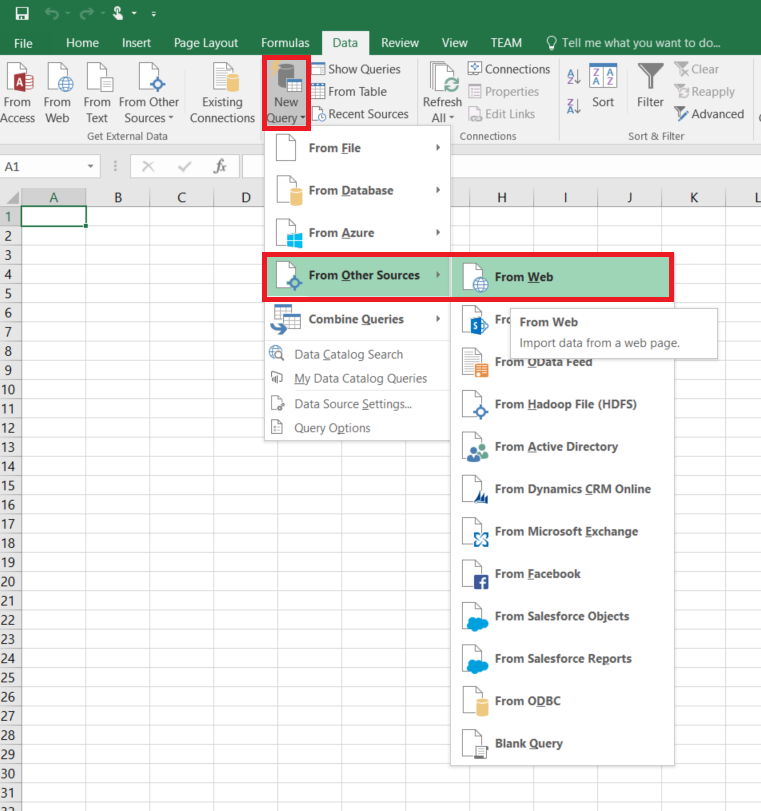

# Move data from a Web table source using Azure Data Factory
> [!div class="op_single_selector" title1="Select the version of Data Factory service you are using:"]
> * [Version 1](data-factory-web-table-connector.md)
> * [Version 2 (current version)](../connector-web-table.md)

> [!NOTE]
> This article applies to version 1 of Data Factory. If you are using the current version of the Data Factory service, see [Web table connector in V2](../connector-web-table.md).

This article outlines how to use the Copy Activity in Azure Data Factory to move data from a table in a Web page to a supported sink data store. This article builds on the [data movement activities](data-factory-data-movement-activities.md) article that presents a general overview of data movement with copy activity and the list of data stores supported as sources/sinks.

Data factory currently supports only moving data from a Web table to other data stores, but not moving data from other data stores to a Web table destination.

> [!IMPORTANT]
> This Web connector currently supports only extracting table content from an HTML page. To retrieve data from a HTTP/s endpoint, use [HTTP connector](data-factory-http-connector.md) instead.

## Prerequisites

To use this Web table connector, you need to set up a Self-hosted Integration Runtime (aka Data Management Gateway) and configure the `gatewayName` property in the sink linked service. For example, to copy from Web table to Azure Blob storage, configure the Azure Storage linked service as the following:

```json
{
  "name": "AzureStorageLinkedService",
  "properties": {
    "type": "AzureStorage",
    "typeProperties": {
      "connectionString": "DefaultEndpointsProtocol=https;AccountName=<accountname>;AccountKey=<accountkey>",
      "gatewayName": "<gateway name>"
    }
  }
}
```

## Getting started
You can create a pipeline with a copy activity that moves data from an on-premises Cassandra data store by using different tools/APIs. 

- The easiest way to create a pipeline is to use the **Copy Wizard**. See [Tutorial: Create a pipeline using Copy Wizard](data-factory-copy-data-wizard-tutorial.md) for a quick walkthrough on creating a pipeline using the Copy data wizard. 
- You can also use the following tools to create a pipeline: **Visual Studio**, **Azure PowerShell**, **Azure Resource Manager template**, **.NET API**, and **REST API**. See [Copy activity tutorial](data-factory-copy-data-from-azure-blob-storage-to-sql-database.md) for step-by-step instructions to create a pipeline with a copy activity. 

Whether you use the tools or APIs, you perform the following steps to create a pipeline that moves data from a source data store to a sink data store:

1. Create **linked services** to link input and output data stores to your data factory.
2. Create **datasets** to represent input and output data for the copy operation. 
3. Create a **pipeline** with a copy activity that takes a dataset as an input and a dataset as an output. 

When you use the wizard, JSON definitions for these Data Factory entities (linked services, datasets, and the pipeline) are automatically created for you. When you use tools/APIs (except .NET API), you define these Data Factory entities by using the JSON format.  For a sample with JSON definitions for Data Factory entities that are used to copy data from a web table, see [JSON example: Copy data from Web table to Azure Blob](#json-example-copy-data-from-web-table-to-azure-blob) section of this article. 

The following sections provide details about JSON properties that are used to define Data Factory entities specific to a Web table:

## Linked service properties
The following table provides description for JSON elements specific to Web linked service.

| Property | Description | Required |
| --- | --- | --- |
| type |The type property must be set to: **Web** |Yes |
| Url |URL to the Web source |Yes |
| authenticationType |Anonymous. |Yes |

### Using Anonymous authentication

```json
{
    "name": "web",
    "properties":
    {
        "type": "Web",
        "typeProperties":
        {
            "authenticationType": "Anonymous",
            "url" : "https://en.wikipedia.org/wiki/"
        }
    }
}
```

## Dataset properties
For a full list of sections & properties available for defining datasets, see the [Creating datasets](data-factory-create-datasets.md) article. Sections such as structure, availability, and policy of a dataset JSON are similar for all dataset types (Azure SQL, Azure blob, Azure table, etc.).

The **typeProperties** section is different for each type of dataset and provides information about the location of the data in the data store. The typeProperties section for dataset of type **WebTable** has the following properties

| Property | Description | Required |
|:--- |:--- |:--- |
| type |type of the dataset. must be set to **WebTable** |Yes |
| path |A relative URL to the resource that contains the table. |No. When path is not specified, only the URL specified in the linked service definition is used. |
| index |The index of the table in the resource. See [Get index of a table in an HTML page](#get-index-of-a-table-in-an-html-page) section for steps to getting index of a table in an HTML page. |Yes |

**Example:**

```json
{
    "name": "WebTableInput",
    "properties": {
        "type": "WebTable",
        "linkedServiceName": "WebLinkedService",
        "typeProperties": {
            "index": 1,
            "path": "AFI's_100_Years...100_Movies"
        },
        "external": true,
        "availability": {
            "frequency": "Hour",
            "interval":  1
        }
    }
}
```

## Copy activity properties
For a full list of sections & properties available for defining activities, see the [Creating Pipelines](data-factory-create-pipelines.md) article. Properties such as name, description, input and output tables, and policy are available for all types of activities.

Whereas, properties available in the typeProperties section of the activity vary with each activity type. For Copy activity, they vary depending on the types of sources and sinks.

Currently, when the source in copy activity is of type **WebSource**, no additional properties are supported.


## JSON example: Copy data from Web table to Azure Blob
The following sample shows:

1. A linked service of type [Web](#linked-service-properties).
2. A linked service of type [AzureStorage](data-factory-azure-blob-connector.md#linked-service-properties).
3. An input [dataset](data-factory-create-datasets.md) of type [WebTable](#dataset-properties).
4. An output [dataset](data-factory-create-datasets.md) of type [AzureBlob](data-factory-azure-blob-connector.md#dataset-properties).
5. A [pipeline](data-factory-create-pipelines.md) with Copy Activity that uses [WebSource](#copy-activity-properties) and [BlobSink](data-factory-azure-blob-connector.md#copy-activity-properties).

The sample copies data from a Web table to an Azure blob every hour. The JSON properties used in these samples are described in sections following the samples.

The following sample shows how to copy data from a Web table to an Azure blob. However, data can be copied directly to any of the sinks stated in the [Data Movement Activities](data-factory-data-movement-activities.md) article by using the Copy Activity in Azure Data Factory.

**Web linked service**
This example uses the Web linked service with anonymous authentication. See [Web linked service](#linked-service-properties) section for different types of authentication you can use.

```json
{
    "name": "WebLinkedService",
    "properties":
    {
        "type": "Web",
        "typeProperties":
        {
            "authenticationType": "Anonymous",
            "url" : "https://en.wikipedia.org/wiki/"
        }
    }
}
```

**Azure Storage linked service**

```json
{
  "name": "AzureStorageLinkedService",
  "properties": {
    "type": "AzureStorage",
    "typeProperties": {
      "connectionString": "DefaultEndpointsProtocol=https;AccountName=<accountname>;AccountKey=<accountkey>",
      "gatewayName": "<gateway name>"
    }
  }
}
```

**WebTable input dataset**
Setting **external** to **true** informs the Data Factory service that the dataset is external to the data factory and is not produced by an activity in the data factory.

> [!NOTE]
> See [Get index of a table in an HTML page](#get-index-of-a-table-in-an-html-page) section for steps to getting index of a table in an HTML page.  
>
>

```json
{
    "name": "WebTableInput",
    "properties": {
        "type": "WebTable",
        "linkedServiceName": "WebLinkedService",
        "typeProperties": {
            "index": 1,
            "path": "AFI's_100_Years...100_Movies"
        },
        "external": true,
        "availability": {
            "frequency": "Hour",
            "interval":  1
        }
    }
}
```


**Azure Blob output dataset**

Data is written to a new blob every hour (frequency: hour, interval: 1).

```json
{
    "name": "AzureBlobOutput",
    "properties":
    {
        "type": "AzureBlob",
        "linkedServiceName": "AzureStorageLinkedService",
        "typeProperties":
        {
            "folderPath": "adfgetstarted/Movies"
        },
        "availability":
        {
            "frequency": "Hour",
            "interval": 1
        }
    }
}
```


**Pipeline with Copy activity**

The pipeline contains a Copy Activity that is configured to use the input and output datasets and is scheduled to run every hour. In the pipeline JSON definition, the **source** type is set to **WebSource** and **sink** type is set to **BlobSink**.

See WebSource type properties for the list of properties supported by the WebSource.

```json
{  
    "name":"SamplePipeline",
    "properties":{  
    "start":"2014-06-01T18:00:00",
    "end":"2014-06-01T19:00:00",
    "description":"pipeline with copy activity",
    "activities":[  
      {
        "name": "WebTableToAzureBlob",
        "description": "Copy from a Web table to an Azure blob",
        "type": "Copy",
        "inputs": [
          {
            "name": "WebTableInput"
          }
        ],
        "outputs": [
          {
            "name": "AzureBlobOutput"
          }
        ],
        "typeProperties": {
          "source": {
            "type": "WebSource"
          },
          "sink": {
            "type": "BlobSink"
          }
        },
       "scheduler": {
          "frequency": "Hour",
          "interval": 1
        },
        "policy": {
          "concurrency": 1,
          "executionPriorityOrder": "OldestFirst",
          "retry": 0,
          "timeout": "01:00:00"
        }
      }
      ]
   }
}
```

## Get index of a table in an HTML page
1. Launch **Excel 2016** and switch to the **Data** tab.  
2. Click **New Query** on the toolbar, point to **From Other Sources** and click **From Web**.

    
3. In the **From Web** dialog box, enter **URL** that you would use in linked service JSON (for example: https://en.wikipedia.org/wiki/) along with path you would specify for the dataset (for example: AFI%27s_100_Years...100_Movies), and click **OK**.

    

    URL used in this example: https://en.wikipedia.org/wiki/AFI%27s_100_Years...100_Movies
4. If you see **Access Web content** dialog box, select the right **URL**, **authentication**, and click **Connect**.

   
5. Click a **table** item in the tree view to see content from the table and then click **Edit** button at the bottom.  

   
6. In the **Query Editor** window, click **Advanced Editor** button on the toolbar.

    
7. In the Advanced Editor dialog box, the number next to "Source" is the index.

    

If you are using Excel 2013, use [Microsoft Power Query for Excel](https://www.microsoft.com/download/details.aspx?id=39379) to get the index. See [Connect to a web page](https://support.office.com/article/Connect-to-a-web-page-Power-Query-b2725d67-c9e8-43e6-a590-c0a175bd64d8) article for details. The steps are similar if you are using [Microsoft Power BI for Desktop](https://powerbi.microsoft.com/desktop/).

> [!NOTE]
> To map columns from source dataset to columns from sink dataset, see [Mapping dataset columns in Azure Data Factory](data-factory-map-columns.md).

## Performance and Tuning
See [Copy Activity Performance & Tuning Guide](data-factory-copy-activity-performance.md) to learn about key factors that impact performance of data movement (Copy Activity) in Azure Data Factory and various ways to optimize it.
