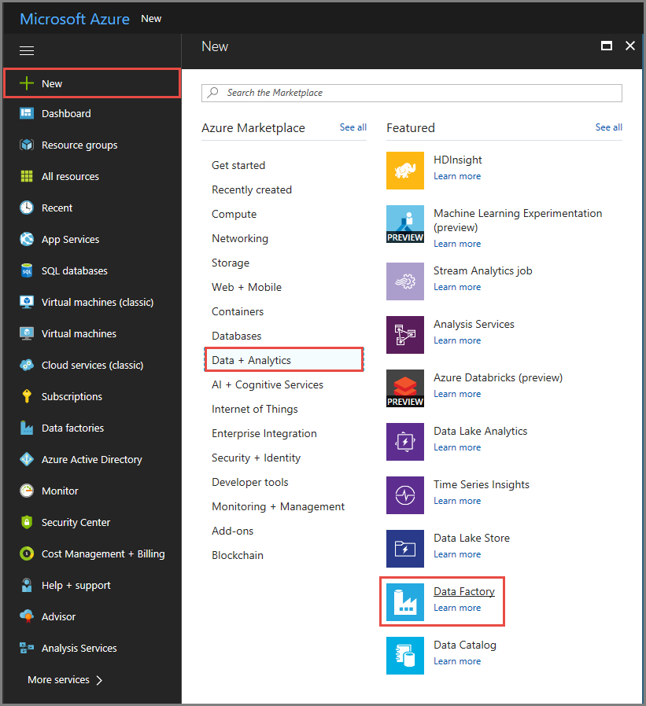
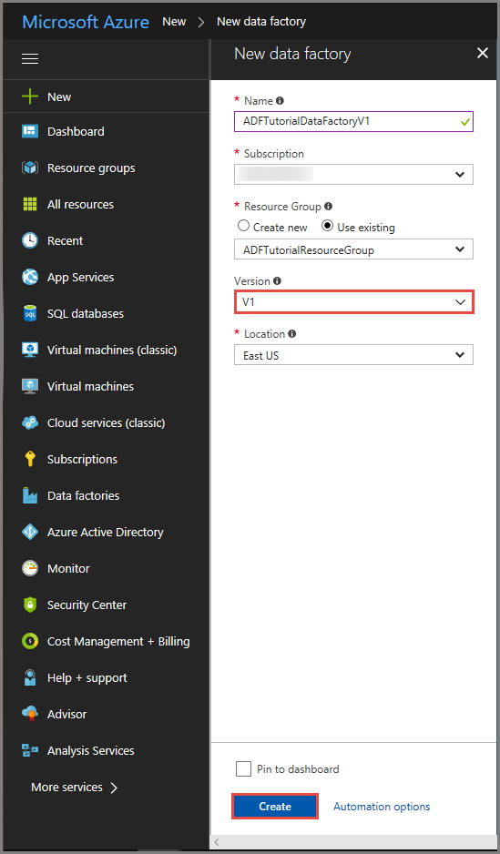
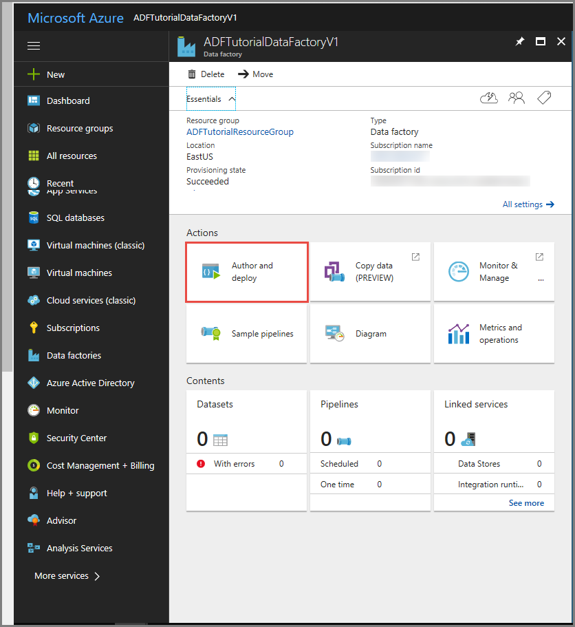
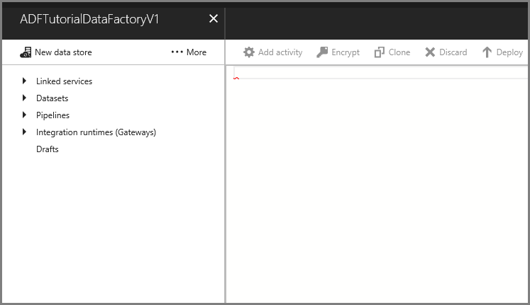
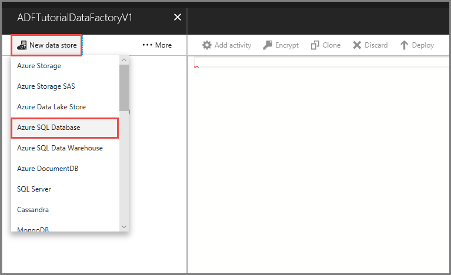
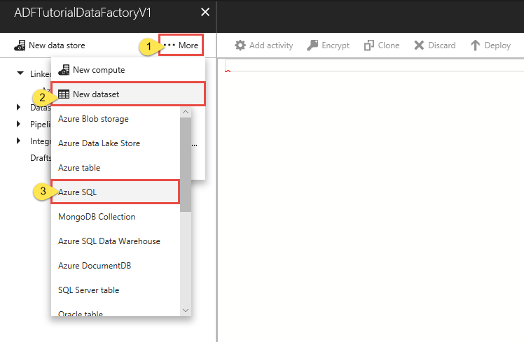
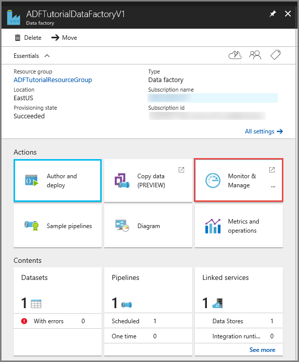

# Invoke an SSIS package using stored procedure activity in Azure Data Factory
This article describes how to invoke an SSIS package from an Azure Data Factory pipeline by using a stored procedure activity. 

> [!NOTE]
> This article applies to version 1 of Data Factory. If you are using the current version of the Data Factory service, see [Invoke SSIS packages using stored procedure activity in](../how-to-invoke-ssis-package-stored-procedure-activity.md).

## Prerequisites

### Azure SQL Database 
The walkthrough in this article uses an Azure SQL database that hosts the SSIS catalog. You can also use an Azure SQL Database Managed Instance.

### Create an Azure-SSIS integration runtime
Create an Azure-SSIS integration runtime if you don't have one by following the step-by-step instruction in the [Tutorial: Deploy SSIS packages](../tutorial-create-azure-ssis-runtime-portal.md). You cannot use Data Factory version 1 to create an Azure-SSIS integration runtime. 

## Azure portal
In this section you use the Azure portal to create a Data Factory pipeline with a stored procedure activity that invokes an SSIS package.

### Create a data factory
First step is to create a data factory by using the Azure portal. 

1. Navigate to the [Azure portal](https://portal.azure.com). 
2. Click **New** on the left menu, click **Data + Analytics**, and click **Data Factory**. 
   
   
2. In the **New data factory** page, enter **ADFTutorialDataFactory** for the **name**. 
      
     
 
   The name of the Azure data factory must be **globally unique**. If you see the following error for the name field, change the name of the data factory (for example, yournameADFTutorialDataFactory). See [Data Factory - Naming Rules](data-factory-naming-rules.md) article for naming rules for Data Factory artifacts.

    `Data factory name ADFTutorialDataFactory is not available`
3. Select your Azure **subscription** in which you want to create the data factory. 
4. For the **Resource Group**, do one of the following steps:
     
      - Select **Use existing**, and select an existing resource group from the drop-down list. 
      - Select **Create new**, and enter the name of a resource group.   
         
    To learn about resource groups, see [Using resource groups to manage your Azure resources](../../azure-resource-manager/resource-group-overview.md).  
4. Select **V1** for the **version**.
5. Select the **location** for the data factory. Only locations that are supported by Data Factory are shown in the drop-down list. The data stores (Azure Storage, Azure SQL Database, etc.) and computes (HDInsight, etc.) used by data factory can be in other locations.
6. Select **Pin to dashboard**.     
7. Click **Create**.
8. On the dashboard, you see the following tile with status: **Deploying data factory**. 

    
9. After the creation is complete, you see the **Data Factory** page as shown in the image.
   
    
10. Click **Author and deploy** tile to launch the Data Factory Editor.

    

### Create an Azure SQL Database linked service
Create a linked service to link your Azure SQL database that hosts the SSIS catalog to your data factory. Data Factory uses information in this linked service to connect to SSISDB database, and executes a stored procedure to run an SSIS package. 

1. In the Data Factory Editor, click **New data store** on the menu, and click **Azure SQL Database**. 

    
2. In the right pane, do the following steps:

    1. Replace `<servername>` with the name of your Azure SQL server. 
    2. Replace `<databasename>` with **SSISDB** (name of the SSIS Catalog database). 
    3. Replace `<username@servername>` with the name of the user who has access to the Azure SQL server. 
    4. Replace `<password>` with the password for the user. 
    5. Deploy the linked service by clicking the **Deploy** button on the toolbar. 

        

### Create a dummy dataset for output
This output dataset is a dummy dataset that drives the schedule of the pipeline. Notice that the frequency is set to Hour and interval is set to 1. Therefore, the pipeline runs once an hour within the pipeline start and end times. 

1. In the left pane of the Data Factory Editor, click **... More** -> **New dataset** -> **Azure SQL**.

    
2. Copy the following JSON snippet into the JSON editor in the right pane. 
    
    ```json
    {
        "name": "sprocsampleout",
        "properties": {
            "type": "AzureSqlTable",
            "linkedServiceName": "AzureSqlLinkedService",
            "typeProperties": { },
            "availability": {
                "frequency": "Hour",
                "interval": 1
            }
        }
    }
    ```
3. Click **Deploy** on the toolbar. This action deploys the dataset to the Azure Data Factory service. 

### Create a pipeline with stored procedure activity 
In this step, you create a pipeline with a stored procedure activity. The activity invokes the sp_executesql stored procedure to run your SSIS package. 

1. In the left pane, click **... More**, and click **New pipeline**.
2. Copy the following JSON snippet into the JSON editor: 

    > [!IMPORTANT]
	> Replace &lt;folder name&gt;, &lt;project name&gt;, &lt;package name&gt; with names of folder, project, and package in the SSIS catalog before saving the file.

    ```json
    {
        "name": "MyPipeline",
        "properties": {
            "activities": [{
                "name": "SprocActivitySample",
                "type": "SqlServerStoredProcedure",
                "typeProperties": {
                    "storedProcedureName": "sp_executesql",
                    "storedProcedureParameters": {
                        "stmt": "DECLARE @return_value INT, @exe_id BIGINT, @err_msg NVARCHAR(150)    EXEC @return_value=[SSISDB].[catalog].[create_execution] @folder_name=N'<folder name>', @project_name=N'<project name>', @package_name=N'<package name>', @use32bitruntime=0, @runinscaleout=1, @useanyworker=1, @execution_id=@exe_id OUTPUT    EXEC [SSISDB].[catalog].[set_execution_parameter_value] @exe_id, @object_type=50, @parameter_name=N'SYNCHRONIZED', @parameter_value=1    EXEC [SSISDB].[catalog].[start_execution] @execution_id=@exe_id, @retry_count=0    IF(SELECT [status] FROM [SSISDB].[catalog].[executions] WHERE execution_id=@exe_id)<>7 BEGIN SET @err_msg=N'Your package execution did not succeed for execution ID: ' + CAST(@exe_id AS NVARCHAR(20)) RAISERROR(@err_msg,15,1) END"
                    }
                },
                "outputs": [{
                    "name": "sprocsampleout"
                }],
                "scheduler": {
                    "frequency": "Hour",
                    "interval": 1
                }
            }],
            "start": "2018-01-19T00:00:00Z",
            "end": "2018-01-19T05:00:00Z",
            "isPaused": false
        }
    }    
    ```
3. Click **Deploy** on the toolbar. This action deploys the pipeline to the Azure Data Factory service. 

### Monitor the pipeline run
The schedule on the output dataset is defined as hourly. The pipeline end time is five hours from the start time. Therefore, you see five pipeline runs. 

1. Close the editor windows so that you see the home page for the data factory. Click **Monitor & Manage** tile. 

    
2. Update the **Start time** and **End time** to **01/18/2018 08:30 AM** and **01/20/2018 08:30 AM**, and click **Apply**. You should see the **activity windows** associated with the pipeline run. 

    

For more information about monitoring pipelines, see [Monitor and manage Azure Data Factory pipelines by using the Monitoring and Management App](data-factory-monitor-manage-app.md).

## Azure PowerShell
In this section you use Azure PowerShell to create a Data Factory pipeline with a stored procedure activity that invokes an SSIS package.

Install the latest Azure PowerShell modules by following instructions in [How to install and configure Azure PowerShell](/powershell/azure/install-azurerm-ps).

### Create a data factory
The following procedure provides steps to create a data factory. You create a pipeline with a stored procedure activity in this data factory. The stored procedure activity executes a stored procedure in the SSISDB database to run your SSIS package.

1. Define a variable for the resource group name that you use in PowerShell commands later. Copy the following command text to PowerShell, specify a name for the [Azure resource group](../../azure-resource-manager/resource-group-overview.md) in double quotes, and then run the command. For example: `"adfrg"`. 
   
     ```powershell
    $resourceGroupName = "ADFTutorialResourceGroup";
    ```

    If the resource group already exists, you may not want to overwrite it. Assign a different value to the `$ResourceGroupName` variable and run the command again
2. To create the Azure resource group, run the following command: 

    ```powershell
    $ResGrp = New-AzureRmResourceGroup $resourceGroupName -location 'eastus'
    ``` 
    If the resource group already exists, you may not want to overwrite it. Assign a different value to the `$ResourceGroupName` variable and run the command again. 
3. Define a variable for the data factory name. 

    > [!IMPORTANT]
    >  Update the data factory name to be globally unique. 

    ```powershell
    $DataFactoryName = "ADFTutorialFactory";
    ```

5. To create the data factory, run the following **New-AzureRmDataFactory** cmdlet, using the Location and ResourceGroupName property from the $ResGrp variable: 
    
    ```powershell       
    $df = New-AzureRmDataFactory -ResourceGroupName $ResourceGroupName -Name $dataFactoryName -Location "East US"
    ```

Note the following points:

* The name of the Azure data factory must be globally unique. If you receive the following error, change the name and try again.

    ```
    The specified Data Factory name 'ADFTutorialFactory' is already in use. Data Factory names must be globally unique.
    ```
* To create Data Factory instances, the user account you use to log in to Azure must be a member of **contributor** or **owner** roles, or an **administrator** of the Azure subscription.

### Create an Azure SQL Database linked service
Create a linked service to link your Azure SQL database that hosts the SSIS catalog to your data factory. Data Factory uses information in this linked service to connect to SSISDB database, and executes a stored procedure to run an SSIS package. 

1. Create a JSON file named **AzureSqlDatabaseLinkedService.json** in **C:\ADF\RunSSISPackage** folder with the following content: 

	> [!IMPORTANT]
	> Replace &lt;servername&gt;, &lt;username&gt;@&lt;servername&gt; and &lt;password&gt; with values of your Azure SQL Database before saving the file.

    ```json
    {
        "name": "AzureSqlDatabaseLinkedService",
        "properties": {
            "type": "AzureSqlDatabase",
            "typeProperties": {
                "connectionString": "Server=tcp:<servername>.database.windows.net,1433;Database=SSISDB;User ID=<username>;Password=<password>;Trusted_Connection=False;Encrypt=True;Connection Timeout=30"
            }
        }
        }
    ```
2. In **Azure PowerShell**, switch to the **C:\ADF\RunSSISPackage** folder.
3. Run the **New-AzureRmDataFactoryLinkedService** cmdlet to create the linked service: **AzureSqlDatabaseLinkedService**. 

    ```powershell
    New-AzureRmDataFactoryLinkedService $df -File ".\AzureSqlDatabaseLinkedService.json"
    ```

### Create an output dataset
This output dataset is a dummy dataset that drives the schedule of the pipeline. Notice that the frequency is set to Hour and interval is set to 1. Therefore, the pipeline runs once an hour within the pipeline start and end times. 

1. Create an OuputDataset.json file with the following content: 
    
    ```json
    {
        "name": "sprocsampleout",
        "properties": {
            "type": "AzureSqlTable",
            "linkedServiceName": "AzureSqlLinkedService",
            "typeProperties": { },
            "availability": {
                "frequency": "Hour",
                "interval": 1
            }
        }
    }
    ```
2. Run the **New-AzureRmDataFactoryDataset** cmdlet to create a dataset. 

    ```powershell
    New-AzureRmDataFactoryDataset $df -File ".\OutputDataset.json"
    ```

### Create a pipeline with stored procedure activity 
In this step, you create a pipeline with a stored procedure activity. The activity invokes the sp_executesql stored procedure to run your SSIS package. 

1. Create a JSON file named **MyPipeline.json** in the **C:\ADF\RunSSISPackage** folder with the following content:

    > [!IMPORTANT]
	> Replace &lt;folder name&gt;, &lt;project name&gt;, &lt;package name&gt; with names of folder, project, and package in the SSIS catalog before saving the file.

    ```json
    {
        "name": "MyPipeline",
        "properties": {
            "activities": [{
                "name": "SprocActivitySample",
                "type": "SqlServerStoredProcedure",
                "typeProperties": {
                    "storedProcedureName": "sp_executesql",
                    "storedProcedureParameters": {
                        "stmt": "DECLARE @return_value INT, @exe_id BIGINT, @err_msg NVARCHAR(150)    EXEC @return_value=[SSISDB].[catalog].[create_execution] @folder_name=N'<folder name>', @project_name=N'<project name>', @package_name=N'<package name>', @use32bitruntime=0, @runinscaleout=1, @useanyworker=1, @execution_id=@exe_id OUTPUT    EXEC [SSISDB].[catalog].[set_execution_parameter_value] @exe_id, @object_type=50, @parameter_name=N'SYNCHRONIZED', @parameter_value=1    EXEC [SSISDB].[catalog].[start_execution] @execution_id=@exe_id, @retry_count=0    IF(SELECT [status] FROM [SSISDB].[catalog].[executions] WHERE execution_id=@exe_id)<>7 BEGIN SET @err_msg=N'Your package execution did not succeed for execution ID: ' + CAST(@exe_id AS NVARCHAR(20)) RAISERROR(@err_msg,15,1) END"
                    }
                },
                "outputs": [{
                    "name": "sprocsampleout"
                }],
                "scheduler": {
                    "frequency": "Hour",
                    "interval": 1
                }
            }],
            "start": "2017-10-01T00:00:00Z",
            "end": "2017-10-01T05:00:00Z",
            "isPaused": false
        }
    }    
    ```

2. To create the pipeline: **RunSSISPackagePipeline**, run the **New-AzureRmDataFactoryPipeline** cmdlet.

    ```powershell
    $DFPipeLine = New-AzureRmDataFactoryPipeline -DataFactoryName $DataFactory.DataFactoryName -ResourceGroupName $ResGrp.ResourceGroupName -Name "RunSSISPackagePipeline" -DefinitionFile ".\RunSSISPackagePipeline.json"
    ```

### Monitor the pipeline run

2. Run **Get-AzureRmDataFactorySlice** to get details about all slices of the output dataset**, which is the output table of the pipeline.

	```PowerShell
    Get-AzureRmDataFactorySlice $df -DatasetName sprocsampleout -StartDateTime 2017-10-01T00:00:00Z
	```
    Notice that the StartDateTime you specify here is the same start time specified in the pipeline JSON. 
3. Run **Get-AzureRmDataFactoryRun** to get the details of activity runs for a specific slice.

	```PowerShell
	Get-AzureRmDataFactoryRun $df -DatasetName sprocsampleout -StartDateTime 2017-10-01T00:00:00Z
	```

    You can keep running this cmdlet until you see the slice in **Ready** state or **Failed** state. 

    You can run the following query against the SSISDB database in your Azure SQL server to verify that the package executed. 

    ```sql
    select * from catalog.executions
    ```

## Next steps
For details about the stored procedure activity, see the [Stored Procedure activity](data-factory-stored-proc-activity.md) article.

