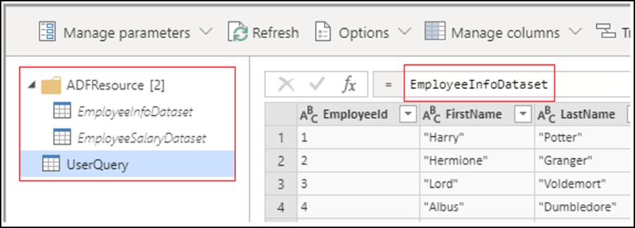

# What are wrangling data flows?

[!INCLUDE[appliesto-adf-xxx-md](includes/appliesto-adf-xxx-md.md)]

Organizations need to do data preparation and wrangling for accurate analysis of complex data that continues to grow every day. Data preparation is required so that organizations can use the data in various business processes and reduce the time to value.

Wrangling data flows in Azure Data Factory allow you to do code-free data preparation at cloud scale iteratively. Wrangling data flows integrate with [Power Query Online](https://docs.microsoft.com/power-query/) and makes Power Query M functions available for data factory users.

Wrangling data flow translates M generated by the Power Query Online Mashup Editor into spark code for cloud scale execution.

Wrangling data flows are especially useful for data engineers or 'citizen data integrators'.

## Use cases

### Fast interactive data exploration and preparation

Multiple data engineers and citizen data integrators can interactively explore and prepare datasets at cloud scale. With the rise of volume, variety and velocity of data in data lakes, users need an effective way to explore and prepare data sets. For example, you may need to create a dataset that 'has all customer demographic info for new customers since 2017'. You aren't mapping to a known target. You're exploring, wrangling, and prepping datasets to meet a requirement before publishing it in the lake. Wrangling data flows are often used for less formal analytics scenarios. The prepped datasets can be used for doing transformations and machine learning operations downstream.

### Code-free agile data preparation

Citizen data integrators spend more than 60% of their time looking for and preparing data. They're looking to do it in a code free manner to improve operational productivity. Allowing citizen data integrators to enrich, shape, and publish data using known tools like Power Query Online in a scalable manner drastically improves their productivity. Wrangling data flow in Azure Data Factory enables the familiar Power Query Online mashup editor to allow citizen data integrators to fix errors quickly, standardize data, and produce high-quality data to support business decisions.

### Data validation

Visually scan your data in a code-free manner to remove any outliers, anomalies,
and conform it to a shape for fast analytics.

## Supported sources

| Connector | Data format | Authentication type |
| -- | -- | --|
| [Azure Blob Storage](connector-azure-blob-storage.md) | CSV, Parquet | Account Key |
| [Azure Data Lake Storage Gen1](connector-azure-data-lake-store.md) | CSV | Service Principal |
| [Azure Data Lake Storage Gen2](connector-azure-data-lake-storage.md) | CSV, Parquet | Account Key, Service Principal |
| [Azure SQL Database](connector-azure-sql-database.md) | - | SQL authentication |
| [Azure Synapse Analytics](connector-azure-sql-data-warehouse.md) | - | SQL authentication |

## The mashup editor

When you create a wrangling data flow, all source datasets become dataset queries and are placed in the **ADFResource** folder. By default, the UserQuery will point to the first dataset query. All transformations should be done on the UserQuery as changes to dataset queries are not supported nor will they be persisted. Renaming, adding and deleting queries is currently not supported.

Currently not all Power Query M functions are supported for data wrangling despite being available during authoring. While building your wrangling data flows, you'll be prompted with the following error message if a function isn't supported:

`The wrangling data flow is invalid. Expression.Error: The transformation logic isn't supported. Please try a simpler expression`

For more information on supported transformations, see [wrangling data flow functions](wrangling-data-flow-functions.md).

Currently wrangling data flow only supports writing to one sink.

## Next steps

Learn how to [create a wrangling data flow](wrangling-data-flow-tutorial.md).