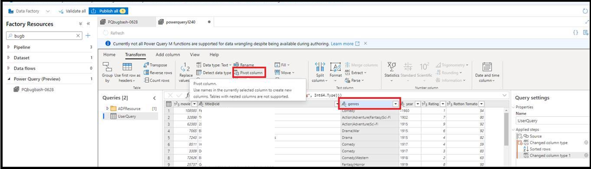
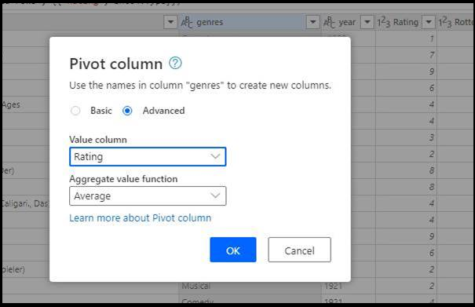
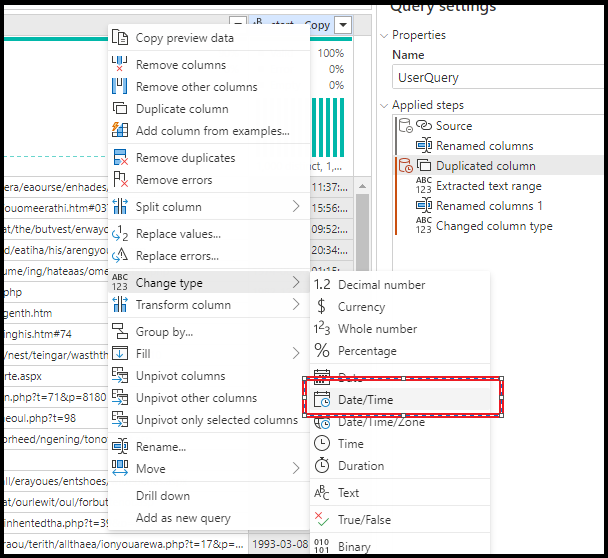
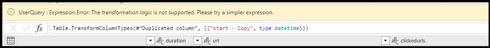

# Transformation functions in Power Query for data wrangling

[!INCLUDE[appliesto-adf-xxx-md](includes/appliesto-adf-xxx-md.md)]

Data Wrangling in Azure Data Factory allows you to do code-free agile data preparation and wrangling at cloud scale by translating Power Query ```M``` scripts into Data Flow script. ADF integrates with [Power Query Online](/powerquery-m/power-query-m-reference) and makes Power Query ```M``` functions available for data wrangling via Spark execution using the data flow Spark infrastructure. 

Currently not all Power Query M functions are supported for data wrangling despite being available during authoring. While building your mash-ups, you'll be prompted with the following error message if a function isn't supported:

`UserQuery : Expression.Error: The transformation logic is not supported as it requires dynamic access to rows of data, which cannot be scaled out.`

Below is a list of supported Power Query M functions.

## Column Management

* Selection: [Table.SelectColumns](/powerquery-m/table-selectcolumns)
* Removal: [Table.RemoveColumns](/powerquery-m/table-removecolumns)
* Renaming: [Table.RenameColumns](/powerquery-m/table-renamecolumns), [Table.PrefixColumns](/powerquery-m/table-prefixcolumns), [Table.TransformColumnNames](/powerquery-m/table-transformcolumnnames)
* Reordering: [Table.ReorderColumns](/powerquery-m/table-reordercolumns)

## Row Filtering

Use  M function [Table.SelectRows](/powerquery-m/table-selectrows) to filter on the following conditions:

* Equality and inequality
* Numeric, text, and date comparisons (but not DateTime)
* Numeric information such as [Number.IsEven](/powerquery-m/number-iseven)/[Odd](/powerquery-m/number-iseven)
* Text containment using [Text.Contains](/powerquery-m/text-contains), [Text.StartsWith](/powerquery-m/text-startswith), or [Text.EndsWith](/powerquery-m/text-endswith)
* Date ranges including all the 'IsIn' [Date functions](/powerquery-m/date-functions)) 
* Combinations of these using and, or, or not conditions

## Adding and Transforming Columns

The following M functions add or transform columns: [Table.AddColumn](/powerquery-m/table-addcolumn), [Table.TransformColumns](/powerquery-m/table-transformcolumns), [Table.ReplaceValue](/powerquery-m/table-replacevalue), [Table.DuplicateColumn](/powerquery-m/table-duplicatecolumn). Below are the supported transformation functions.

* Numeric arithmetic
* Text concatenation
* Date and Time Arithmetic (Arithmetic operators, [Date.AddDays](/powerquery-m/date-adddays), [Date.AddMonths](/powerquery-m/date-addmonths), [Date.AddQuarters](/powerquery-m/date-addquarters), [Date.AddWeeks](/powerquery-m/date-addweeks), [Date.AddYears](/powerquery-m/date-addyears))
* Durations can be used for date and time arithmetic, but must be transformed into another type before written to a sink (Arithmetic operators, [#duration](/powerquery-m/sharpduration), [Duration.Days](/powerquery-m/duration-days), [Duration.Hours](/powerquery-m/duration-hours), [Duration.Minutes](/powerquery-m/duration-minutes), [Duration.Seconds](/powerquery-m/duration-seconds), [Duration.TotalDays](/powerquery-m/duration-totaldays), [Duration.TotalHours](/powerquery-m/duration-totalhours), [Duration.TotalMinutes](/powerquery-m/duration-totalminutes), [Duration.TotalSeconds](/powerquery-m/duration-totalseconds))    
* Most standard, scientific, and trigonometric numeric functions (All functions under [Operations](/powerquery-m/number-functions#operations), [Rounding](/powerquery-m/number-functions#rounding), and [Trigonometry](/powerquery-m/number-functions#trigonometry) *except* Number.Factorial, Number.Permutations, and Number.Combinations)
* Replacement ([Replacer.ReplaceText](/powerquery-m/replacer-replacetext), [Replacer.ReplaceValue](/powerquery-m/replacer-replacevalue), [Text.Replace](/powerquery-m/text-replace), [Text.Remove](/powerquery-m/text-remove))
* Positional text extraction ([Text.PositionOf](/powerquery-m/text-positionof), [Text.Length](/powerquery-m/text-length), [Text.Start](/powerquery-m/text-start), [Text.End](/powerquery-m/text-end), [Text.Middle](/powerquery-m/text-middle), [Text.ReplaceRange](/powerquery-m/text-replacerange), [Text.RemoveRange](/powerquery-m/text-removerange))
* Basic text formatting ([Text.Lower](/powerquery-m/text-lower), [Text.Upper](/powerquery-m/text-upper),
 [Text.Trim](/powerquery-m/text-trim)/[Start](/powerquery-m/text-trimstart)/[End](/powerquery-m/text-trimend), [Text.PadStart](/powerquery-m/text-padstart)/[End](/powerquery-m/text-padend), [Text.Reverse](/powerquery-m/text-reverse))
* Date/Time Functions ([Date.Day](/powerquery-m/date-day), [Date.Month](/powerquery-m/date-month), [Date.Year](/powerquery-m/date-year) [Time.Hour](/powerquery-m/time-hour), [Time.Minute](/powerquery-m/time-minute), [Time.Second](/powerquery-m/time-second), [Date.DayOfWeek](/powerquery-m/date-dayofweek), [Date.DayOfYear](/powerquery-m/date-dayofyear), [Date.DaysInMonth](/powerquery-m/date-daysinmonth))
* If expressions (but branches must have matching types)
* Row filters as a logical column
* Number, text, logical, date, and datetime constants

## Merging/Joining tables

* Power Query will generate a nested join (Table.NestedJoin; users can also
    manually write
    [Table.AddJoinColumn](/powerquery-m/table-addjoincolumn)).
    Users must then expand the nested join column into a non-nested join
    (Table.ExpandTableColumn, not supported in any other context).
* The M function
    [Table.Join](/powerquery-m/table-join) can
    be written directly to avoid the need for an additional expansion
    step, but the user must ensure that there are no duplicate column names
    among the joined tables
* Supported Join Kinds:
    Inner,
    LeftOuter,
    RightOuter,
    FullOuter
* Both
    [Value.Equals](/powerquery-m/value-equals)
    and
    [Value.NullableEquals](/powerquery-m/value-nullableequals)
    are supported as key equality comparers

## Group by

Use [Table.Group](/powerquery-m/table-group) to aggregate values.
* Must be used with an aggregation function
* Supported aggregation functions:
    [List.Sum](/powerquery-m/list-sum),
    [List.Count](/powerquery-m/list-count),
    [List.Average](/powerquery-m/list-average),
    [List.Min](/powerquery-m/list-min),
    [List.Max](/powerquery-m/list-max),
    [List.StandardDeviation](/powerquery-m/list-standarddeviation),
    [List.First](/powerquery-m/list-first),
    [List.Last](/powerquery-m/list-last)

## Sorting

Use [Table.Sort](/powerquery-m/table-sort) to sort values.

## Reducing Rows

Keep and Remove Top, Keep Range (corresponding M functions,
    only supporting counts, not conditions:
    [Table.FirstN](/powerquery-m/table-firstn),
    [Table.Skip](/powerquery-m/table-skip),
    [Table.RemoveFirstN](/powerquery-m/table-removefirstn),
    [Table.Range](/powerquery-m/table-range),
    [Table.MinN](/powerquery-m/table-minn),
    [Table.MaxN](/powerquery-m/table-maxn))

## Known unsupported functions

| Function | Status |
| -- | -- |
| Table.PromoteHeaders | Not supported. The same result can be achieved by setting "First row as header" in the dataset. |
| Table.CombineColumns | This is a common scenario that isn't directly supported but can be achieved by adding a new column that concatenates two given columns.  For example, Table.AddColumn(RemoveEmailColumn, "Name", each [FirstName] & " " & [LastName]) |
| Table.TransformColumnTypes | This is supported in most cases. The following scenarios are unsupported: transforming string to currency type, transforming string to time type, transforming string to Percentage type and tranfoming with locale. |
| Table.NestedJoin | Just doing a join will result in a validation error. The columns must be expanded for it to work. |
| Table.RemoveLastN | Remove bottom rows isn't supported. |
| Table.RowCount | Not supported, but can be achieved by adding a custom column containing the value 1, then aggregating that column with List.Sum. Table.Group is supported. | 
| Row level error handling | Row level error handling is currently not supported. For example, to filter out non-numeric values from a column, one approach would be to transform the text column to a number. Every cell, which fails to transform will be in an error state and need to be filtered. This scenario isn't possible in scaled-out M. |
| Table.Transpose | Not supported |

## M script workarounds

### ```SplitColumn```

An alternate for split by length and by position is listed below

* Table.AddColumn(Source, "First characters", each Text.Start([Email], 7), type text)
* Table.AddColumn(#"Inserted first characters", "Text range", each Text.Middle([Email], 4, 9), type text)

This option is accessible from the Extract option in the ribbon

:::image type="content" source="media/wrangling-data-flow/power-query-split.png" alt-text="Power Query Add Column":::

### ```Table.CombineColumns```

* Table.AddColumn(RemoveEmailColumn, "Name", each [FirstName] & " " & [LastName])

### Pivots

* Select Pivot transformation from the PQ editor and select your pivot column



* Next, select the value column and the aggregate function



* When you click OK, you'll see the data in the editor updated with the pivoted values
* You'll also see a warning message that the transformation may be unsupported
* To fix this warning, expand the pivoted list manually using the PQ editor
* Select Advanced Editor option from the ribbon
* Expand the list of pivoted values manually
* Replace List.Distinct() with the list of values like this:
```
#"Pivoted column" = Table.Pivot(Table.TransformColumnTypes(#"Changed column type 1", {{"genres", type text}}), {"Drama", "Horror", "Comedy", "Musical", "Documentary"}, "genres", "Rating", List.Average)
in
  #"Pivoted column"
```

> [!VIDEO https://www.microsoft.com/en-us/videoplayer/embed/RWNbBf]

### Formatting date/time columns

To set the date/time format when using Power Query ADF, please follow these sets to set the format.



1. Select the column in the Power Query UI and choose Change Type > Date/Time
2. You'll see a warning message
3. Open Advanced Editor and change ```TransformColumnTypes``` to ```TransformColumns```. Specify the format and culture based on the input data.



```
#"Changed column type 1" = Table.TransformColumns(#"Duplicated column", {{"start - Copy", each DateTime.FromText(_, [Format = "yyyy-MM-dd HH:mm:ss", Culture = "en-us"]), type datetime}})
```

> [!VIDEO https://www.microsoft.com/en-us/videoplayer/embed/RWNdQg]

## Next steps

Learn how to [create a data wrangling Power Query in ADF](wrangling-tutorial.md).
