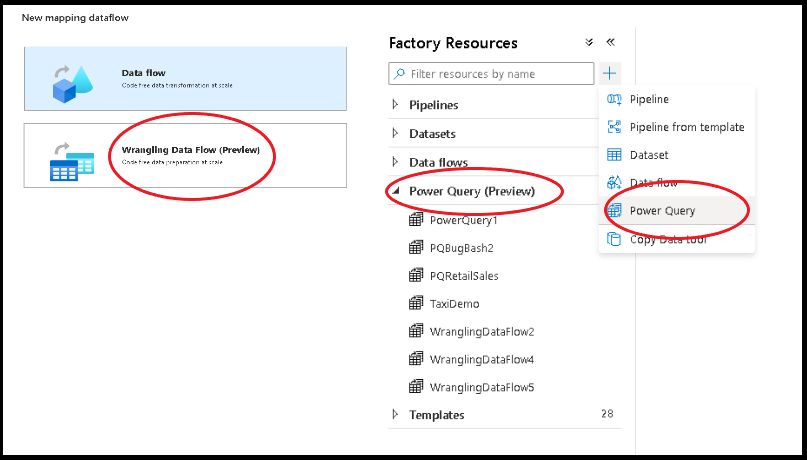
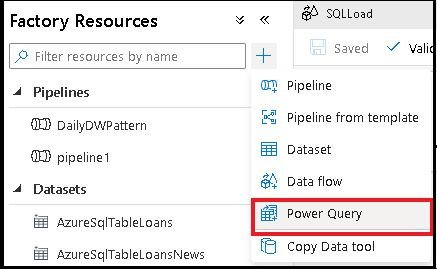
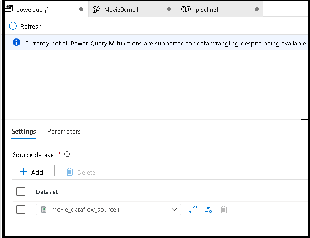

# Prepare data with data wrangling

[!INCLUDE[appliesto-adf-xxx-md](includes/appliesto-adf-xxx-md.md)]

Data wrangling in data factory allows you to build interactive Power Query mash-ups natively in ADF and then execute those at scale inside of an ADF pipeline.

> [!NOTE]
> Power Query activity in ADF is currently available in public preview

## Create a Power Query activity

There are two ways to create a Power Query in Azure Data Factory. One way is to click the plus icon and select **Power Query** in the factory resources pane.

> [!VIDEO https://www.microsoft.com/en-us/videoplayer/embed/RWJd3T]

> [!NOTE]
> Previously, the data wrangling feature was located in the data flow workflow. Now, you will build your data wrangling mash-up from ```New > Power query```



The other method is in the activities pane of the pipeline canvas. Open the **Power Query** accordion and drag the **Power Query** activity onto the canvas.



## Author a Power Query data wrangling activity

Add a **Source dataset** for your Power Query mash-up. You can either choose an existing dataset or create a new one. After you have saved your mash-up, you can then add the Power Query data wrangling activity to your pipeline and select a sink dataset to tell ADF where to land your data. While you can choose one or more source datasets, only one sink is allowed at this time. Choosing a sink dataset is optional, but at least one source dataset is required.


Click **Create** to open the Power Query Online mashup editor.

First, you will choose a dataset source for the mashup editor.



Once you have completed building your Power Query, you can save it and add the mashup as an activity to your pipeline. That is when you will set the sink dataset properties.


Author your wrangling Power Query using code-free data preparation. For the list of available functions, see [transformation functions](wrangling-functions.md). ADF translates the M script into a data flow script so that you can execute your Power Query at scale using the Azure Data Factory data flow Spark environment.


## Running and monitoring a Power Query data wrangling activity

To execute a pipeline debug run of a Power Query activity, click **Debug** in the pipeline canvas. Once you publish your pipeline, **Trigger now** executes an on-demand run of the last published pipeline. Power Query pipelines can be schedule with all existing Azure Data Factory triggers.


Go to the **Monitor** tab to visualize the output of a triggered Power Query activity run.


## Next steps

Learn how to [create a mapping data flow](tutorial-data-flow.md).
