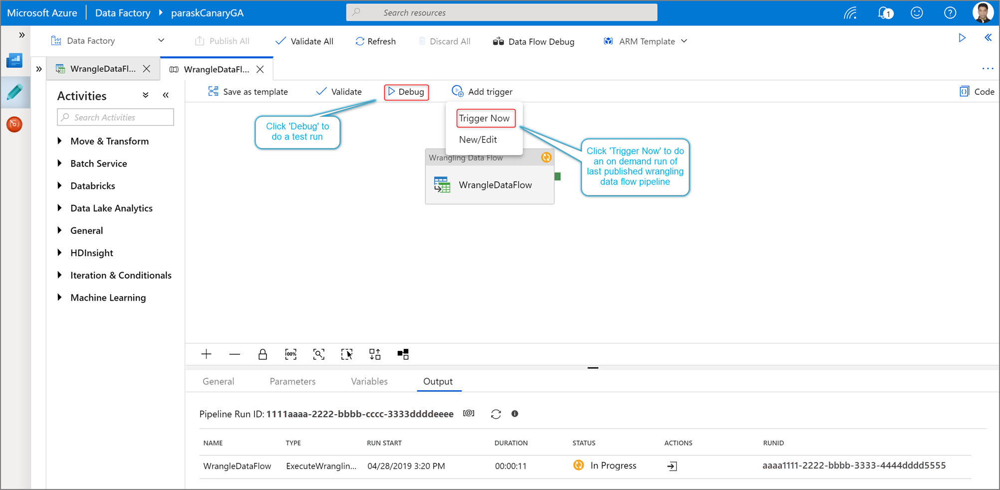
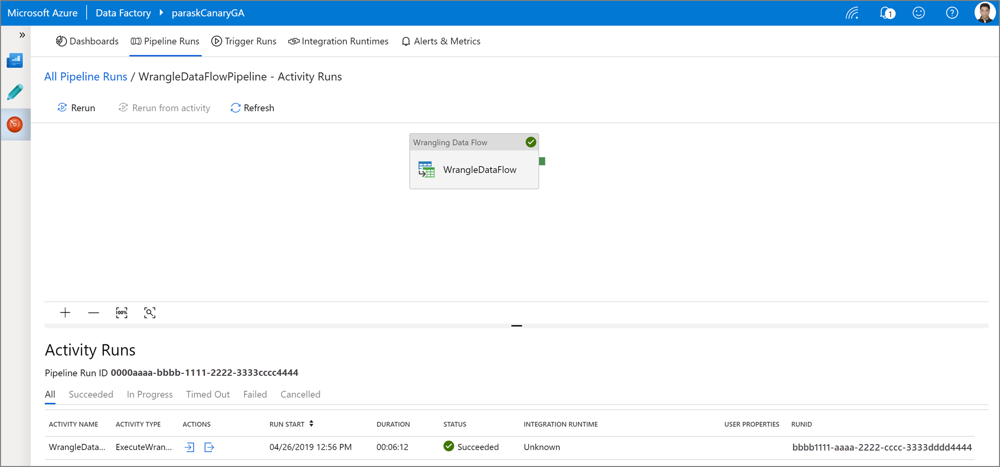

# Prepare data with data wrangling

[!INCLUDE[appliesto-adf-xxx-md](includes/appliesto-adf-xxx-md.md)]

> [!NOTE]
> Power Query acitivty in ADF is currently avilable in public preview

## Create a Power Query activity

There are two ways to create a Power Query in Azure Data Factory. One way is to click the plus icon and select **Data Flow** in the factory resources pane.

> [!NOTE]
> Previously, the data wrangling feature was located in the data flow workflow. Now, you will build your data wrangling mash-up from ```New > Power query```


The other method is in the activities pane of the pipeline canvas. Open the **Power Query** accordion and drag the **Power Query** activity onto the canvas.


## Author a wrangling data flow

Add a **Source dataset** for your Power Query mash-up. You can either choose an existing dataset or create a new one. You can also select a sink dataset. You can choose one or more source datasets, but only one sink is allowed at this time. Choosing a sink dataset is optional, but at least one source dataset is required.



Click **Create** to open the Power Query Online mashup editor.


Author your wrangling data flow using code-free data preparation. For the list of available functions, see [transformation functions](wrangling-functions.md).


## Running and monitoring a wrangling data flow

To execute a pipeline debug run of a wrangling data flow, click **Debug** in the pipeline canvas. Once you publish your data flow, **Trigger now** executes an on-demand run of the last published pipeline. Wrangling data flows can be schedule with all existing Azure Data Factory triggers.


Go to the **Monitor** tab to visualize the output of a triggered wrangling data flow activity run.



## Next steps

Learn how to [create a mapping data flow](tutorial-data-flow.md).
