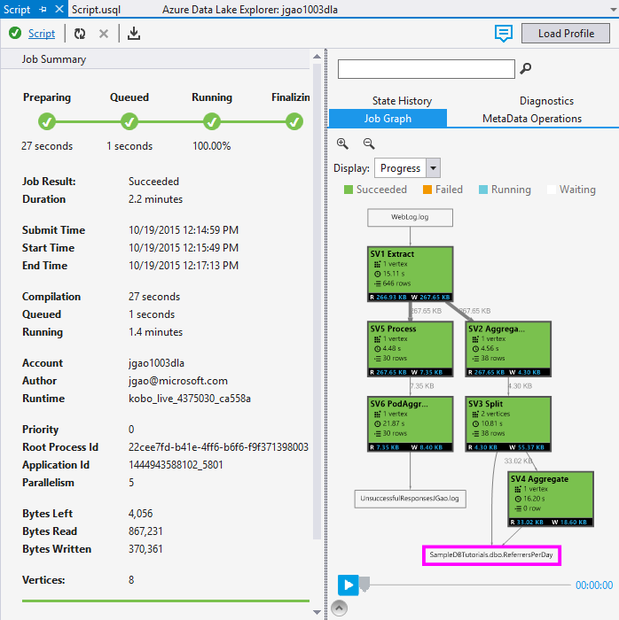

<properties
   pageTitle="Analyze Website logs using Azure Data Lake Analytics | Azure"
   description="Learn how to analyze website logs using Data Lake Analytics. "
   services="data-lake-analytics"
   documentationCenter=""
   authors="edmacauley"
   manager="paulettm"
   editor="cgronlun"/>

<tags
   ms.service="data-lake-analytics"
   ms.devlang="na"
   ms.topic="article"
   ms.tgt_pltfrm="na"
   ms.workload="big-data"
   ms.date="05/16/2016"
   ms.author="edmaca"/>

# Tutorial: Analyze Website logs using Azure Data Lake Analytics

Learn how to analyze website logs using Data Lake Analytics, especially on finding out which referrers ran into errors when they tried to visit the website.

>[AZURE.NOTE] If you just want to see the application working, it saves time to go through [Use Azure Data Lake Analytics interactive tutorials](data-lake-analytics-use-interactive-tutorials.md). This tutorial is based on the same scenario and the same code. The purpose of this tutorial is to give developers the experience of creating and running a Data Lake Analytics application from end to end.

## Prerequisites:

- **Visual Studio 2015, Visual Studio 2013 update 4, or Visual Studio 2012 with Visual C++ Installed**.
- **Microsoft Azure SDK for .NET version 2.5 or above**.  Install it using the [Web platform installer](http://www.microsoft.com/web/downloads/platform.aspx).
- **[Data Lake Tools for Visual Studio](http://aka.ms/adltoolsvs)**.

	Once Data Lake Tools for Visual Studio is installed, you will see a **Data Lake** menu in Visual Studio:

	

- **Basic knowledge of Data Lake Analytics and the Data Lake Tools for Visual Studio**. To get started, see:

	- [Get Started with Azure Data Lake Analytics using Azure Portal](data-lake-analytics-get-started-portal.md).
	- [Develop U-SQL script using Data Lake tools for Visual Studio](data-lake-analytics-data-lake-tools-get-started.md).

- **A Data Lake Analytics account.**  See [Create an Azure Data Lake Analytics account](data-lake-analytics-get-started-portal.md#create_adl_analytics_account).

	The Data Lake Tools doesn't support creating Data Lake Analytics accounts.  So you have to create it using the Azure Portal, Azure PowerShell, .NET SDK or Azure CLI.
- **Upload the sample data to the Data Lake Analytics account.** See [Upload SearchLog.tsv to the default Data Lake Storage account](data-lake-analytics-get-started-portal.md#update-data-to-the-default-adl-storage-account).

    To run a Data Lake Analytics job, you will need some data. Even though the Data Lake Tools supports uploading data, you will use the portal to upload the sample data to make this tutorial easier to follow.

## Connect to Azure

Before you can build and test any U-SQL scripts, you must first connect to Azure.

**To connect to Data Lake Analytics**

1. Open Visual Studio.
2. From the **Data Lake** menu, click **Options and Settings**.
4. Click **Sign In**, or **Change User** if someone has signed in, and follow the instructions.
5. Click **OK** to close the Options and Settings dialog.

**To browse your Data Lake Analytics accounts**

1. From Visual Studio, open **Server Explorer** by press **CTRL+ALT+S**.
2. From **Server Explorer**, expand **Azure**, and then expand **Data Lake Analytics**. You shall see a list of your Data Lake Analytics accounts if there are any. You cannot create Data Lake Analytics accounts from the studio. To create an account, see [Get Started with Azure Data Lake Analytics using Azure Portal](data-lake-analytics-get-started-portal.md) or [Get Started with Azure Data Lake Analytics using Azure PowerShell](data-lake-analytics-get-started-powershell.md).

## Develop U-SQL application

A U-SQL application is mostly a U-SQL script. To learn more about U-SQL, see [Get started with U-SQL](data-lake-analytics-u-sql-get-started.md).

You can add addition user-defined operators to the application.  For more information, see [Develop U-SQL user defined operators for Data Lake Analytics jobs](data-lake-analytics-u-sql-develop-user-defined-operators.md).

**To create and submit a Data Lake Analytics job**

1. From the **File** menu, click **New**, and then click **Project**.
2. Select the U-SQL Project type.

	

3. Click **OK**. Visual studio creates a solution with a Script.usql file.
4. Enter the following script into the Script.usql file:

        // Create a database for easy reuse, so you don't need to read from a file every time.
        CREATE DATABASE IF NOT EXISTS SampleDBTutorials;

        // Create a Table valued function. TVF ensures that your jobs fetch data from the weblog file with the correct schema.
        DROP FUNCTION IF EXISTS SampleDBTutorials.dbo.WeblogsView;
        CREATE FUNCTION SampleDBTutorials.dbo.WeblogsView()
        RETURNS @result TABLE
        (
            s_date DateTime,
            s_time string,
            s_sitename string,
            cs_method string,
            cs_uristem string,
            cs_uriquery string,
            s_port int,
            cs_username string,
            c_ip string,
            cs_useragent string,
            cs_cookie string,
            cs_referer string,
            cs_host string,
            sc_status int,
            sc_substatus int,
            sc_win32status int,
            sc_bytes int,
            cs_bytes int,
            s_timetaken int
        )
        AS
        BEGIN

            @result = EXTRACT
                s_date DateTime,
                s_time string,
                s_sitename string,
                cs_method string,
                cs_uristem string,
                cs_uriquery string,
                s_port int,
                cs_username string,
                c_ip string,
                cs_useragent string,
                cs_cookie string,
                cs_referer string,
                cs_host string,
                sc_status int,
                sc_substatus int,
                sc_win32status int,
                sc_bytes int,
                cs_bytes int,
                s_timetaken int
            FROM @"/Samples/Data/WebLog.log"
            USING Extractors.Text(delimiter:' ');
		    RETURN;
		END;

        // Create a table for storing referrers and status
        DROP TABLE IF EXISTS SampleDBTutorials.dbo.ReferrersPerDay;
        @weblog = SampleDBTutorials.dbo.WeblogsView();
        CREATE TABLE SampleDBTutorials.dbo.ReferrersPerDay
        (
            INDEX idx1
            CLUSTERED(Year ASC)
            PARTITIONED BY HASH(Year)
        ) AS

        SELECT s_date.Year AS Year,
            s_date.Month AS Month,
            s_date.Day AS Day,
            cs_referer,
            sc_status,
            COUNT(DISTINCT c_ip) AS cnt
        FROM @weblog
        GROUP BY s_date,
                cs_referer,
                sc_status;

    To understand the U-SQL, see [Get started with Data Lake Analytics U-SQL language](data-lake-analytics-u-sql-get-started.md).    

5. Add a new U-SQL script to your project and enter the following:

        // Query the referrers that ran into errors
        @content =
            SELECT *
            FROM SampleDBTutorials.dbo.ReferrersPerDay
            WHERE sc_status >=400 AND sc_status < 500;

        OUTPUT @content
        TO @"/Samples/Outputs/UnsuccessfulResponses.log"
        USING Outputters.Tsv();

6. Switch back to the first U-SQL script and next to the **Submit** button, specify your Analytics account.
7. From **Solution Explorer**, right click **Script.usql**, and then click **Build Script**. Verify the results in the Output pane.
8. From **Solution Explorer**, right click **Script.usql**, and then click **Submit Script**.
9. Verify the **Analytics Account** is the one where you want to run the job, and then click **Submit**. Submission results and job link are available in the Data Lake Tools for Visual Studio Results window when the submission is completed.
10. Wait until the job is completed successfully.  If the job failed, it is most likely missing the source file.  Please see the Prerequisite section of this tutorial. For additional troubleshooting information, see [Monitor and troubleshoot Azure Data Lake Analytics jobs](data-lake-analytics-monitor-and-troubleshoot-jobs-tutorial.md).

    When the job is completed, you shall see the following screen:

    

11. Now repeat steps 7- 10 for **Script1.usql**.

>[AZURE.NOTE]You can't read from or write to a U-SQL table that has been created or modified in the same script.  That's why use use two scripts for this example.

**To see the job output**

1. From **Server Explorer**, expand **Azure**, expand **Data Lake Analytics**, expand your Data Lake Analytics account, expand **Storage Accounts**, right-click the default Data Lake Storage account, and then click **Explorer**.
2.  Double-click **Samples** to open the folder, and then double-click **Outputs**.
3.  Double-click **UnsuccessfulResponsees.log**.
4.  You can also double-click the output file inside the graph view of the job in order to navigate directly to the output.

## See also

To get started with Data Lake Analytics using different tools, see:

- [Get started with Data Lake Analytics using Azure Portal](data-lake-analytics-get-started-portal.md)
- [Get started with Data Lake Analytics using Azure PowerShell](data-lake-analytics-get-started-powershell.md)
- [Get started with Data Lake Analytics using .NET SDK](data-lake-analytics-get-started-net-sdk.md)

To see more development topics:

- [Develop U-SQL scripts using Data Lake Tools for Visual Studio](data-lake-analytics-data-lake-tools-get-started.md)
- [Get started with Azure Data Lake Analytics U-SQL language](data-lake-analytics-u-sql-get-started.md)
- [Develop U-SQL user defined operators for Data Lake Analytics jobs](data-lake-analytics-u-sql-develop-user-defined-operators.md)
