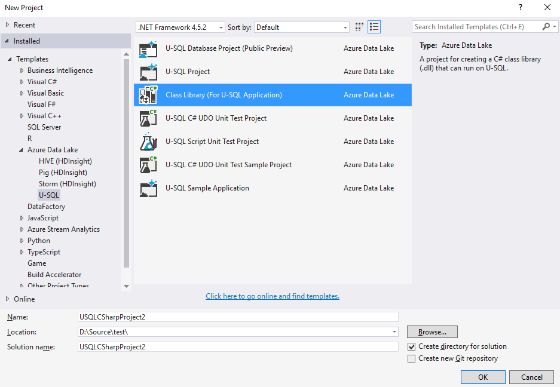
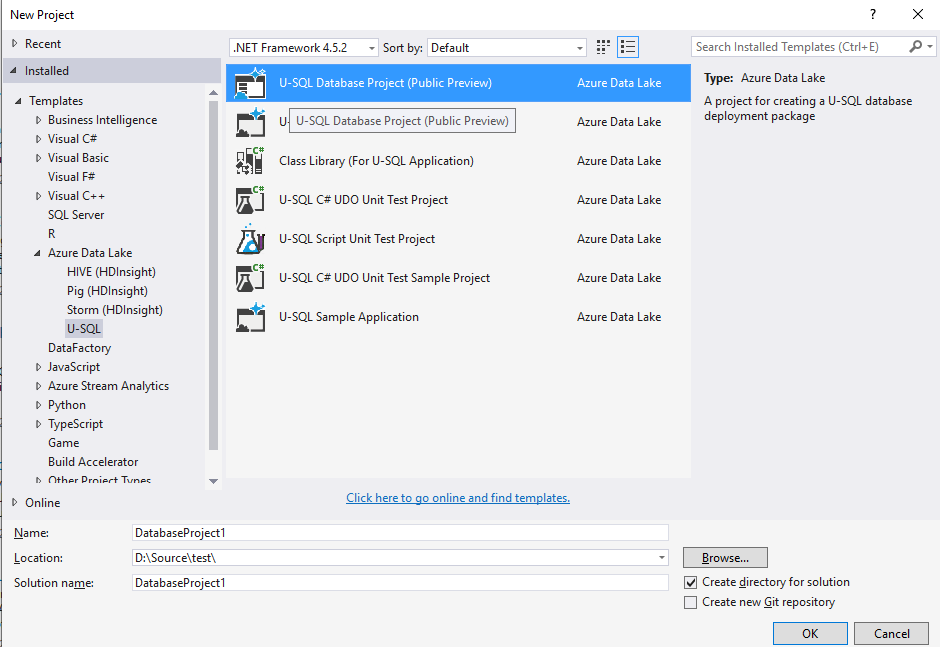
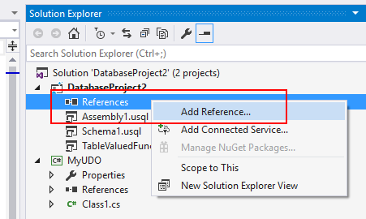
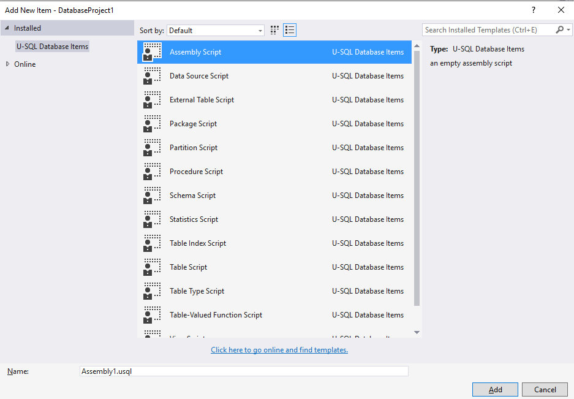
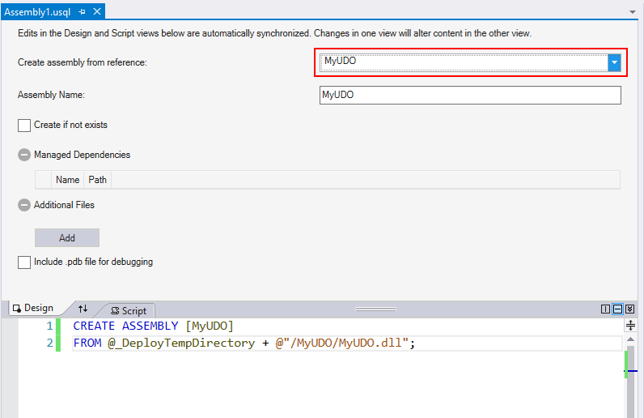
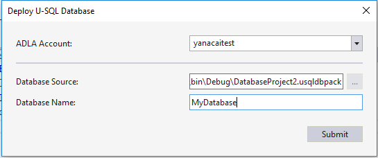

# Best practices for managing U-SQL assemblies in a CI/CD pipeline

In this article, you learn how to manage U-SQL assembly source code with the newly introduced U-SQL database project. You also learn how to set up a continuous integration and deployment (CI/CD) pipeline for assembly registration by using Azure DevOps.

## Use the U-SQL database project to manage assembly source code

[The U-SQL database project](data-lake-analytics-data-lake-tools-develop-usql-database.md) is a project type in Visual Studio that helps developers develop, manage, and deploy their U-SQL databases quickly and easily. You can manage all U-SQL database objects (except for credentials) with the U-SQL database project. 

To manage the C# assembly source code and assembly registration DDL U-SQL scripts, use the:

* U-SQL database project to manage assembly registration U-SQL scripts.
* Class Library (For U-SQL Application) to manage the C# source code and dependencies for user-defined operators, functions, and aggregators (UDOs, UDFs, and UDAGs).
* U-SQL database project to reference the Class Library project. 

A U-SQL database project can reference a Class Library (For U-SQL Application) project. You can create assemblies registered in the U-SQL database by using referenced C# source code from this Class Library (For U-SQL Application) project.

Follow these steps to create projects and add references.
1. Create a Class Library (For U-SQL Application) project by selecting **File** > **New** > **Project**. The project is under the **Azure Data Lake > U-SQL** node.

   
1. Add your user-defined C# code in the Class Library (For U-SQL Application) project.

1. Create a U-SQL project by selecting **File** > **New** > **Project**. The project is under the **Azure Data Lake** > **U-SQL** node.

   
1. Add a reference to the C# class library project for the U-SQL database project.

     

    

5. Create an assembly script in the U-SQL database project by right-clicking the project and selecting **Add New Item**.

   

1. Open the assembly script in the assembly design view. Select the referenced assembly from the **Create assembly from reference** drop-down menu.

    

7. Add **Managed Dependencies** and **Additional Files**, if there are any. When you add additional files, the tool uses the relative path to make sure it can find the assemblies on your local machine and on the build machine later.

**\@_DeployTempDirectory** in the editor window at the bottom is a predefined variable that points the tool to the build output folder. Under the build output folder, every assembly has a subfolder named with the assembly name. All DLLs and additional files are in that subfolder.

## Build a U-SQL database project

The build output for a U-SQL database project is a U-SQL database deployment package. It's named with the suffix `.usqldbpack`. The `.usqldbpack` package is a .zip file that includes all DDL statements in a single U-SQL script in the DDL folder. All built .dll files and additional files for assemblies are in the Temp folder.

## Deploy a U-SQL database

The `.usqldbpack` package can be deployed to either a local account or an Azure Data Lake Analytics account. Use Visual Studio or the deployment SDK. 

### Deploy a U-SQL database in Visual Studio

You can deploy a U-SQL database by using a U-SQL database project or a `.usqldbpack` package in Visual Studio.

#### Deploy by using a U-SQL database project

1.	Right-click the U-SQL database project, and then select **Deploy**.
2.	In the **Deploy U-SQL Database** wizard, select the **ADLA Account** to which you want to deploy the database. Both local accounts and ADLA accounts are supported.
3.	**Database Source** is filled in automatically. It points to the .usqldbpack package in the project's build output folder.
4.	Enter a name in **Database Name** to create a database. If a database with that same name already exists in the target Azure Data Lake Analytics account, all objects that are defined in the database project are created without re-creating the database.
5.	To deploy the U-SQL database, select **Submit**. All resources, such as assemblies and additional files, are uploaded. A U-SQL job that includes all DDL statements is submitted.

    

    

### Deploy a U-SQL database in Azure DevOps

`PackageDeploymentTool.exe` provides the programming and command-line interfaces that help to deploy U-SQL databases. The SDK is included in the [U-SQL SDK Nuget package](https://www.nuget.org/packages/Microsoft.Azure.DataLake.USQL.SDK/), located at `build/runtime/PackageDeploymentTool.exe`.

In Azure DevOps, you can use a command-line task and this SDK to set up an automation pipeline for the U-SQL database refresh. [Learn more about the SDK and how to set up a CI/CD pipeline for U-SQL database deployment](data-lake-analytics-cicd-overview.md#deploy-u-sql-database-through-azure-pipelines).

## Next steps

* [Set up a CI/CD pipeline for Azure Data Lake Analytics](data-lake-analytics-cicd-overview.md)
* [Test your Azure Data Lake Analytics code](data-lake-analytics-cicd-test.md)
* [Run U-SQL script on your local machine](data-lake-analytics-data-lake-tools-local-run.md)
