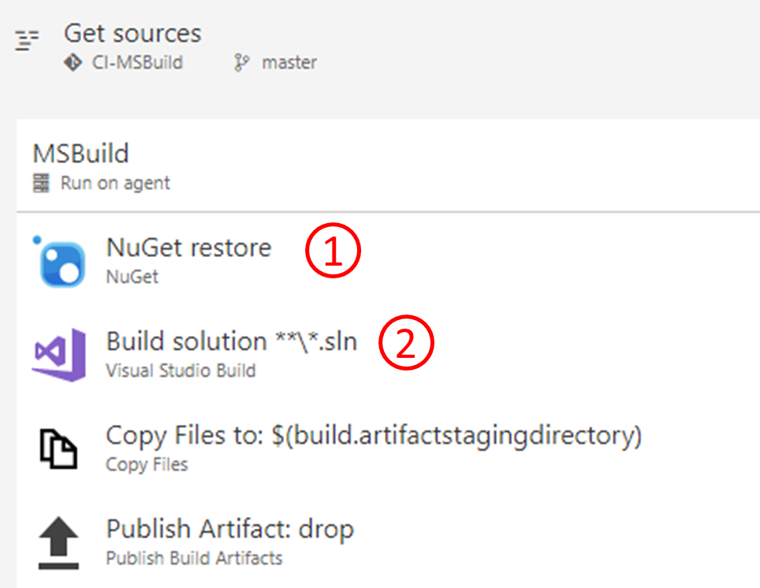
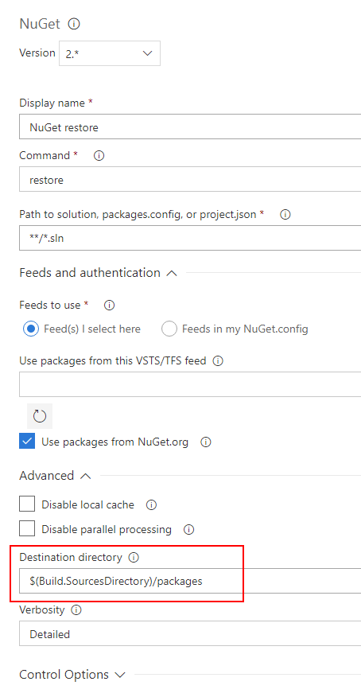
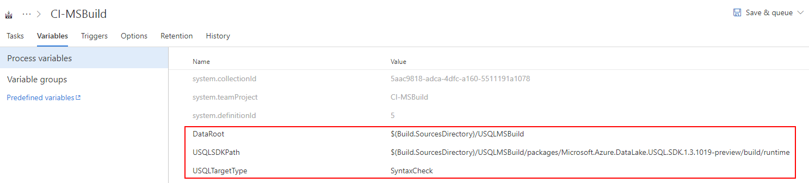
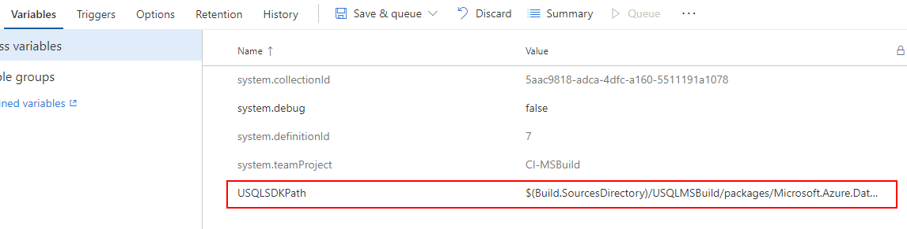

# How to set up a CI/CD pipeline for Azure Data Lake Analytics  

In this article, you learn how to set up a continuous integration and deployment (CI/CD) pipeline for U-SQL jobs and U-SQL databases.  

## Use CI/CD for U-SQL jobs

Azure Data Lake Tools for Visual Studio provides the U-SQL project type that helps you organize U-SQL scripts. Using the U-SQL project to manage your U-SQL code makes further CI/CD scenarios easy.

## Build a U-SQL project

A U-SQL project can be built with the Microsoft Build Engine (MSBuild) by passing corresponding parameters. Follow the steps in this article to set up a build process for a U-SQL project.

### Project migration

Before you set up a build task for a U-SQL project, make sure you have the latest version of the U-SQL project. Open the U-SQL project file in your editor and verify that you have these import items:

```   
<!-- check for SDK Build target in current path then in USQLSDKPath-->
<Import Project="UsqlSDKBuild.targets" Condition="Exists('UsqlSDKBuild.targets')" />
<Import Project="$(USQLSDKPath)\UsqlSDKBuild.targets" Condition="!Exists('UsqlSDKBuild.targets') And '$(USQLSDKPath)' != '' And Exists('$(USQLSDKPath)\UsqlSDKBuild.targets')" />
``` 

If not, you have two options to migrate the project:

- Option 1: Change the old import item to the preceding one.
- Option 2: Open the old project in the Azure Data Lake Tools for Visual Studio. Use a version newer than 2.3.3000.0. The old project template will be upgraded automatically to the newest version. New projects created with versions newer than 2.3.3000.0 use the new template.

### Get NuGet

MSBuild doesn't provide built-in support for U-SQL projects. To get this support, you need to add a reference for your solution to the [Microsoft.Azure.DataLake.USQL.SDK](https://www.nuget.org/packages/Microsoft.Azure.DataLake.USQL.SDK/) NuGet package that adds the required language service.

To add the NuGet package reference, right-click the solution in Visual Studio Solution Explorer and choose **Manage NuGet Packages**. Or you can add a file called `packages.config` in the solution folder and put the following contents into it:

```xml 
<?xml version="1.0" encoding="utf-8"?>
<packages>
  <package id="Microsoft.Azure.DataLake.USQL.SDK" version="1.3.180620" targetFramework="net452" />
</packages>
``` 

### Manage U-SQL database references

U-SQL scripts in a U-SQL project might have query statements for U-SQL database objects. In that case, you need to reference the corresponding U-SQL database project that includes the objects' definition before you build the U-SQL project. An example is when you query a U-SQL table or reference an assembly. 

Learn more about [U-SQL database project](data-lake-analytics-data-lake-tools-develop-usql-database.md).

>[!NOTE]
>U-SQL database project is currently in public preview. If you have DROP statement in the project, the build fails. The DROP statement will be allowed soon.
>

### Build a U-SQL project with the MSBuild command line

First migrate the project and get the NuGet package. Then call the standard MSBuild command line with the following additional arguments to build your U-SQL project: 

``` 
msbuild USQLBuild.usqlproj /p:USQLSDKPath=packages\Microsoft.Azure.DataLake.USQL.SDK.1.3.180615\build\runtime;USQLTargetType=SyntaxCheck;DataRoot=datarootfolder;/p:EnableDeployment=true
``` 

The arguments definition and values are as follows:

* **USQLSDKPath=<U-SQL Nuget package>\build\runtime**. This parameter refers to the installation path of the NuGet package for the U-SQL language service.
* **USQLTargetType=Merge or SyntaxCheck**:
    * **Merge**. Merge mode compiles code-behind files. Examples are **.cs**, **.py**, and **.r** files. It inlines the resulting user-defined code library into the U-SQL script. Examples are a dll binary, Python, or R code.
    * **SyntaxCheck**. SyntaxCheck mode first merges code-behind files into the U-SQL script. Then it compiles the U-SQL script to validate your code.
* **DataRoot=<DataRoot path>**. DataRoot is needed only for SyntaxCheck mode. When it builds the script with SyntaxCheck mode, MSBuild checks the references to database objects in the script. Before building, set up a matching local environment that contains the referenced objects from the U-SQL database in the build machine's DataRoot folder. You can also manage these database dependencies by [referencing a U-SQL database project](data-lake-analytics-data-lake-tools-develop-usql-database.md#reference-a-u-sql-database-project). MSBuild only checks database object references, not files.
* **EnableDeployment=true** or **false**. EnableDeployment indicates if it's allowed to deploy referenced U-SQL databases during the build process. If you reference a U-SQL database project and consume the database objects in your U-SQL script, set this parameter to **true**.

### Continuous integration through Azure Pipelines

In addition to the command line, you can also use the Visual Studio Build or an MSBuild task to build U-SQL projects in Azure Pipelines. To set up a build pipeline, make sure to add two tasks in the build pipeline: a NuGet restore task and an MSBuild task.

 

1.	Add a NuGet restore task to get the solution-referenced NuGet package that includes `Azure.DataLake.USQL.SDK`, so that MSBuild can find the U-SQL language targets. Set **Advanced** > **Destination directory** to `$(Build.SourcesDirectory)/packages` if you want to use the MSBuild arguments sample directly in step 2.

    

2.	Set MSBuild arguments in Visual Studio build tools or in an MSBuild task as shown in the following example. Or you can define variables for these arguments in the Azure Pipelines build pipeline.

     

    ```
    /p:USQLSDKPath=/p:USQLSDKPath=$(Build.SourcesDirectory)/packages/Microsoft.Azure.DataLake.USQL.SDK.1.3.180615/build/runtime /p:USQLTargetType=SyntaxCheck /p:DataRoot=$(Build.SourcesDirectory) /p:EnableDeployment=true
    ```

### U-SQL project build output

After you run a build, all scripts in the U-SQL project are built and output to a zip file called `USQLProjectName.usqlpack`. The folder structure in your project is kept in the zipped build output.

> [!NOTE]
>
> Code-behind files for each U-SQL script will be merged as an inline statement to the script build output.
>

## Test U-SQL scripts

Azure Data Lake provides test projects for U-SQL scripts and C# UDO/UDAG/UDF:
* Learn how to [add test cases for U-SQL scripts and extended C# code](data-lake-analytics-cicd-test.md#test-u-sql-scripts).
* Learn how to [run test cases in Azure Pipelines](data-lake-analytics-cicd-test.md#run-test-cases-in-azure-devops).

## Deploy a U-SQL job

After you verify code through the build and test process, you can submit U-SQL jobs directly from Azure Pipelines through an Azure PowerShell task. You can also deploy the script to Azure Data Lake Store or Azure Blob storage and [run the scheduled jobs through Azure Data Factory](https://docs.microsoft.com/azure/data-factory/transform-data-using-data-lake-analytics).

### Submit U-SQL jobs through Azure Pipelines

The build output of the U-SQL project is a zip file called **USQLProjectName.usqlpack**. The zip file includes all U-SQL scripts in the project. You can use the [Azure PowerShell task](https://docs.microsoft.com/azure/devops/pipelines/tasks/deploy/azure-powershell?view=vsts) in Pipelines with the following sample PowerShell script to submit U-SQL jobs directly from Azure Pipelines.

```powershell
<#
    This script can be used to submit U-SQL Jobs with given U-SQL project build output(.usqlpack file).
    This will unzip the U-SQL project build output, and submit all scripts one-by-one.

    Note: the code behind file for each U-SQL script will be merged into the built U-SQL script in build output.
          
    Example :
        USQLJobSubmission.ps1 -ADLAAccountName "myadlaaccount" -ArtifactsRoot "C:\USQLProject\bin\debug\" -DegreeOfParallelism 2
#>

param(
    [Parameter(Mandatory=$true)][string]$ADLAAccountName, # ADLA account name to submit U-SQL jobs
    [Parameter(Mandatory=$true)][string]$ArtifactsRoot, # Root folder of U-SQL project build output
    [Parameter(Mandatory=$false)][string]$DegreeOfParallelism = 1
)

function Unzip($USQLPackfile, $UnzipOutput)
{
    $USQLPackfileZip = Rename-Item -Path $USQLPackfile -NewName $([System.IO.Path]::ChangeExtension($USQLPackfile, ".zip")) -Force -PassThru
    Expand-Archive -Path $USQLPackfileZip -DestinationPath $UnzipOutput -Force
    Rename-Item -Path $USQLPackfileZip -NewName $([System.IO.Path]::ChangeExtension($USQLPackfileZip, ".usqlpack")) -Force
}

## Get U-SQL scripts in U-SQL project build output(.usqlpack file)
Function GetUsqlFiles()
{

    $USQLPackfiles = Get-ChildItem -Path $ArtifactsRoot -Include *.usqlpack -File -Recurse -ErrorAction SilentlyContinue

    $UnzipOutput = Join-Path $ArtifactsRoot -ChildPath "UnzipUSQLScripts"

    foreach ($USQLPackfile in $USQLPackfiles)
    {
        Unzip $USQLPackfile $UnzipOutput
    }

    $USQLFiles = Get-ChildItem -Path $UnzipOutput -Include *.usql -File -Recurse -ErrorAction SilentlyContinue

    return $USQLFiles
}

## Submit U-SQL scripts to ADLA account one-by-one
Function SubmitAnalyticsJob()
{
    $usqlFiles = GetUsqlFiles

    Write-Output "$($usqlFiles.Count) jobs to be submitted..."

    # Submit each usql script and wait for completion before moving ahead.
    foreach ($usqlFile in $usqlFiles)
    {
        $scriptName = "[Release].[$([System.IO.Path]::GetFileNameWithoutExtension($usqlFile.fullname))]"

        Write-Output "Submitting job for '{$usqlFile}'"

        $jobToSubmit = Submit-AzureRmDataLakeAnalyticsJob -Account $ADLAAccountName -Name $scriptName -ScriptPath $usqlFile -DegreeOfParallelism $DegreeOfParallelism
        
		LogJobInformation $jobToSubmit
        
        Write-Output "Waiting for job to complete. Job ID:'{$($jobToSubmit.JobId)}', Name: '$($jobToSubmit.Name)' "
        $jobResult = Wait-AzureRmDataLakeAnalyticsJob -Account $ADLAAccountName -JobId $jobToSubmit.JobId  
        LogJobInformation $jobResult
    }
}

Function LogJobInformation($jobInfo)
{
    Write-Output "************************************************************************"
    Write-Output ([string]::Format("Job Id: {0}", $(DefaultIfNull $jobInfo.JobId)))
    Write-Output ([string]::Format("Job Name: {0}", $(DefaultIfNull $jobInfo.Name)))
    Write-Output ([string]::Format("Job State: {0}", $(DefaultIfNull $jobInfo.State)))
    Write-Output ([string]::Format("Job Started at: {0}", $(DefaultIfNull  $jobInfo.StartTime)))
    Write-Output ([string]::Format("Job Ended at: {0}", $(DefaultIfNull  $jobInfo.EndTime)))
    Write-Output ([string]::Format("Job Result: {0}", $(DefaultIfNull $jobInfo.Result)))
    Write-Output "************************************************************************"
}

Function DefaultIfNull($item)
{
    if ($item -ne $null)
	{
        return $item
    }
    return ""
}

Function Main()
{
	Write-Output ([string]::Format("ADLA account: {0}", $ADLAAccountName))
	Write-Output ([string]::Format("Root folde for usqlpack: {0}", $ArtifactsRoot))
	Write-Output ([string]::Format("AU count: {0}", $DegreeOfParallelism))

    Write-Output "Starting USQL script deployment..."
    
	SubmitAnalyticsJob

    Write-Output "Finished deployment..."
}

Main
```

### Deploy U-SQL jobs through Azure Data Factory

You can submit U-SQL jobs directly from Azure Pipelines. Or you can upload the built scripts to Azure Data Lake Store or Azure Blob storage and [run the scheduled jobs through Azure Data Factory](https://docs.microsoft.com/azure/data-factory/transform-data-using-data-lake-analytics).

Use the [Azure PowerShell task](https://docs.microsoft.com/azure/devops/pipelines/tasks/deploy/azure-powershell?view=vsts) in Azure Pipelines with the following sample PowerShell script to upload the U-SQL scripts to an Azure Data Lake Store account:

```powershell
<#
    This script can be used to upload U-SQL files to ADLS with given U-SQL project build output(.usqlpack file).
    This will unzip the U-SQL project build output, and upload all scripts to ADLS one-by-one.
          
    Example :
        FileUpload.ps1 -ADLSName "myadlsaccount" -ArtifactsRoot "C:\USQLProject\bin\debug\"
#>

param(
    [Parameter(Mandatory=$true)][string]$ADLSName, # ADLS account name to upload U-SQL scripts
    [Parameter(Mandatory=$true)][string]$ArtifactsRoot, # Root folder of U-SQL project build output
    [Parameter(Mandatory=$false)][string]$DesitinationFolder = "USQLScriptSource" # Desitination folder in ADLS
)

Function UploadResources()
{
	Write-Host "************************************************************************"
    Write-Host "Uploading files to $ADLSName"
    Write-Host "***********************************************************************"

    $usqlScripts = GetUsqlFiles

    $files = @(get-childitem $usqlScripts -recurse)
    foreach($file in $files)
    {
        Write-Host "Uploading file: $($file.Name)"
        Import-AzureRmDataLakeStoreItem -AccountName $ADLSName -Path $file.FullName -Destination "/$(Join-Path $DesitinationFolder $file)" -Force
    }
}

function Unzip($USQLPackfile, $UnzipOutput)
{
    $USQLPackfileZip = Rename-Item -Path $USQLPackfile -NewName $([System.IO.Path]::ChangeExtension($USQLPackfile, ".zip")) -Force -PassThru
    Expand-Archive -Path $USQLPackfileZip -DestinationPath $UnzipOutput -Force
    Rename-Item -Path $USQLPackfileZip -NewName $([System.IO.Path]::ChangeExtension($USQLPackfileZip, ".usqlpack")) -Force
}

Function GetUsqlFiles()
{

    $USQLPackfiles = Get-ChildItem -Path $ArtifactsRoot -Include *.usqlpack -File -Recurse -ErrorAction SilentlyContinue

    $UnzipOutput = Join-Path $ArtifactsRoot -ChildPath "UnzipUSQLScripts"

    foreach ($USQLPackfile in $USQLPackfiles)
    {
        Unzip $USQLPackfile $UnzipOutput
    }

    return Get-ChildItem -Path $UnzipOutput -Include *.usql -File -Recurse -ErrorAction SilentlyContinue
}

UploadResources
```

## CI/CD for a U-SQL database

Azure Data Lake Tools for Visual Studio provides U-SQL database project templates that help you develop, manage, and deploy U-SQL databases. Learn more about a [U-SQL database project](data-lake-analytics-data-lake-tools-develop-usql-database.md).

## Build U-SQL database project

### Get the NuGet package

MSBuild doesn't provide built-in support for U-SQL database projects. To get this ability, you need to add a reference for your solution to the [Microsoft.Azure.DataLake.USQL.SDK](https://www.nuget.org/packages/Microsoft.Azure.DataLake.USQL.SDK/) NuGet package that adds the required language service.

To add the NuGet package reference, right-click the solution in Visual Studio Solution Explorer. Choose **Manage NuGet Packages**. Then search for and install the NuGet package. Or you can add a file called **packages.config** in the solution folder and put the following contents into it:

```xml
<?xml version="1.0" encoding="utf-8"?>
<packages>
  <package id="Microsoft.Azure.DataLake.USQL.SDK" version="1.3.180615" targetFramework="net452" />
</packages>
```

### Build U-SQL a database project with the MSBuild command line

To build your U-SQL database project, call the standard MSBuild command line and pass the U-SQL SDK NuGet package reference as an additional argument. See the following example: 

```
msbuild DatabaseProject.usqldbproj /p:USQLSDKPath=packages\Microsoft.Azure.DataLake.USQL.SDK.1.3.180615\build\runtime
```

The argument `USQLSDKPath=<U-SQL Nuget package>\build\runtime` refers to the install path of the NuGet package for the U-SQL language service.

### Continuous integration with Azure Pipelines

In addition to the command line, you can use Visual Studio Build or an MSBuild task to build U-SQL database projects in Azure Pipelines. To set up a build task, make sure to add two tasks in the build pipeline: a NuGet restore task and an MSBuild task.

    


1.	Add a NuGet restore task to get the solution-referenced NuGet package, which includes `Azure.DataLake.USQL.SDK`, so that MSBuild can find the U-SQL language targets. Set **Advanced** > **Destination directory** to `$(Build.SourcesDirectory)/packages` if you want to use the MSBuild arguments sample directly in step 2.

    

2.	Set MSBuild arguments in Visual Studio build tools or in an MSBuild task as shown in the following example. Or you can define variables for these arguments in the Azure Pipelines build pipeline.

    

    ```
    /p:USQLSDKPath=/p:USQLSDKPath=$(Build.SourcesDirectory)/packages/Microsoft.Azure.DataLake.USQL.SDK.1.3.180615/build/runtime
    ```
 
### U-SQL database project build output

The build output for a U-SQL database project is a U-SQL database deployment package, named with the suffix `.usqldbpack`. The `.usqldbpack` package is a zip file that includes all DDL statements in a single U-SQL script in a DDL folder. It includes all **.dlls** and additional files for assembly in a temp folder.

## Test table-valued functions and stored procedures

Adding test cases for table-valued functions and stored procedures directly isn't currently supported. As a workaround, you can create a U-SQL project that has U-SQL scripts that call those functions and write test cases for them. Take the following steps to set up test cases for table-valued functions and stored procedures defined in the U-SQL database project:

1.	Create a U-SQL project for test purposes and write U-SQL scripts calling the table-valued functions and stored procedures.
2.	Add a database reference to the U-SQL project. To get the table-valued function and stored procedure definition, you need to reference the database project that contains the DDL statement. Learn more about [database references](data-lake-analytics-data-lake-tools-develop-usql-database.md#reference-a-u-sql-database-project).
3.	Add test cases for U-SQL scripts that call table-valued functions and stored procedures. Learn how to [add test cases for U-SQL scripts](data-lake-analytics-cicd-test.md#test-u-sql-scripts).

## Deploy U-SQL database through Azure Pipelines

`PackageDeploymentTool.exe` provides the programming and command-line interfaces that help deploy U-SQL database deployment packages, **.usqldbpack**. The SDK is included in the [U-SQL SDK NuGet package](https://www.nuget.org/packages/Microsoft.Azure.DataLake.USQL.SDK/), located at **build/runtime/PackageDeploymentTool.exe**. By using `PackageDeploymentTool.exe`, you can deploy U-SQL databases to both Azure Data Lake Analytics and local accounts.

> [!NOTE]
>
> PowerShell command-line support and Azure Pipelines release task support for U-SQL database deployment is currently pending.
>

Take the following steps to set up a database deployment task in Azure Pipelines:

1. Add a PowerShell Script task in a build or release pipeline and execute the following PowerShell script. This task helps to get Azure SDK dependencies for `PackageDeploymentTool.exe` and `PackageDeploymentTool.exe`. You can set the **-AzureSDK** and **-DBDeploymentTool** parameters to load the dependencies and deployment tool to specific folders. Pass the **-AzureSDK** path to `PackageDeploymentTool.exe` as the **-AzureSDKPath** parameter in step 2. 

    ```powershell
    <#
        This script is used for getting dependencies and SDKs for U-SQL database deployment.
        PowerShell command line support for deploying U-SQL database package(.usqldbpack file) will come soon.
        
        Example :
            GetUSQLDBDeploymentSDK.ps1 -AzureSDK "AzureSDKFolderPath" -DBDeploymentTool "DBDeploymentToolFolderPath"
    #>

    param (
        [string]$AzureSDK = "AzureSDK", # Folder to cache Azure SDK dependencies
        [string]$DBDeploymentTool = "DBDeploymentTool", # Folder to cache U-SQL database deployment tool
        [string]$workingfolder = "" # Folder to execute these command lines
    )

    if ([string]::IsNullOrEmpty($workingfolder))
    {
        $scriptpath = $MyInvocation.MyCommand.Path
        $workingfolder = Split-Path $scriptpath
    }
    cd $workingfolder

    echo "workingfolder=$workingfolder, outputfolder=$outputfolder"
    echo "Downloading required packages..."

    iwr https://www.nuget.org/api/v2/package/Microsoft.Azure.Management.DataLake.Analytics/3.5.1-preview -outf Microsoft.Azure.Management.DataLake.Analytics.3.5.1-preview.zip
    iwr https://www.nuget.org/api/v2/package/Microsoft.Azure.Management.DataLake.Store/2.4.1-preview -outf Microsoft.Azure.Management.DataLake.Store.2.4.1-preview.zip
    iwr https://www.nuget.org/api/v2/package/Microsoft.IdentityModel.Clients.ActiveDirectory/2.28.3 -outf Microsoft.IdentityModel.Clients.ActiveDirectory.2.28.3.zip
    iwr https://www.nuget.org/api/v2/package/Microsoft.Rest.ClientRuntime/2.3.11 -outf Microsoft.Rest.ClientRuntime.2.3.11.zip
    iwr https://www.nuget.org/api/v2/package/Microsoft.Rest.ClientRuntime.Azure/3.3.7 -outf Microsoft.Rest.ClientRuntime.Azure.3.3.7.zip
    iwr https://www.nuget.org/api/v2/package/Microsoft.Rest.ClientRuntime.Azure.Authentication/2.3.3 -outf Microsoft.Rest.ClientRuntime.Azure.Authentication.2.3.3.zip
    iwr https://www.nuget.org/api/v2/package/Newtonsoft.Json/6.0.8 -outf Newtonsoft.Json.6.0.8.zip
    iwr https://www.nuget.org/api/v2/package/Microsoft.Azure.DataLake.USQL.SDK/ -outf USQLSDK.zip

    echo "Extracting packages..."

    Expand-Archive Microsoft.Azure.Management.DataLake.Analytics.3.5.1-preview.zip -DestinationPath Microsoft.Azure.Management.DataLake.Analytics.3.5.1-preview -Force
    Expand-Archive Microsoft.Azure.Management.DataLake.Store.2.4.1-preview.zip -DestinationPath Microsoft.Azure.Management.DataLake.Store.2.4.1-preview -Force
    Expand-Archive Microsoft.IdentityModel.Clients.ActiveDirectory.2.28.3.zip -DestinationPath Microsoft.IdentityModel.Clients.ActiveDirectory.2.28.3 -Force
    Expand-Archive Microsoft.Rest.ClientRuntime.2.3.11.zip -DestinationPath Microsoft.Rest.ClientRuntime.2.3.11 -Force
    Expand-Archive Microsoft.Rest.ClientRuntime.Azure.3.3.7.zip -DestinationPath Microsoft.Rest.ClientRuntime.Azure.3.3.7 -Force
    Expand-Archive Microsoft.Rest.ClientRuntime.Azure.Authentication.2.3.3.zip -DestinationPath Microsoft.Rest.ClientRuntime.Azure.Authentication.2.3.3 -Force
    Expand-Archive Newtonsoft.Json.6.0.8.zip -DestinationPath Newtonsoft.Json.6.0.8 -Force
    Expand-Archive USQLSDK.zip -DestinationPath USQLSDK -Force

    echo "Copy required DLLs to output folder..."

    mkdir $AzureSDK -Force
    mkdir $DBDeploymentTool -Force
    copy Microsoft.Azure.Management.DataLake.Analytics.3.5.1-preview\lib\net452\*.dll $AzureSDK
    copy Microsoft.Azure.Management.DataLake.Store.2.4.1-preview\lib\net452\*.dll $AzureSDK
    copy Microsoft.IdentityModel.Clients.ActiveDirectory.2.28.3\lib\net45\*.dll $AzureSDK
    copy Microsoft.Rest.ClientRuntime.2.3.11\lib\net452\*.dll $AzureSDK
    copy Microsoft.Rest.ClientRuntime.Azure.3.3.7\lib\net452\*.dll $AzureSDK
    copy Microsoft.Rest.ClientRuntime.Azure.Authentication.2.3.3\lib\net452\*.dll $AzureSDK
    copy Newtonsoft.Json.6.0.8\lib\net45\*.dll $AzureSDK
    copy USQLSDK\build\runtime\*.* $DBDeploymentTool
    ```

2. Add a **Command-Line task** in a build or release pipeline and fill in the script by calling `PackageDeploymentTool.exe`. `PackageDeploymentTool.exe` is located under the defined **$DBDeploymentTool** folder. The sample script is as follows: 

    * Deploy a U-SQL database locally:

        ```
        PackageDeploymentTool.exe deploylocal -Package <package path> -Database <database name> -DataRoot <data root path>
        ```

    * Use interactive authentication mode to deploy a U-SQL database to an Azure Data Lake Analytics account:

        ```
        PackageDeploymentTool.exe deploycluster -Package <package path> -Database <database name> -Account <account name> -ResourceGroup <resource group name> -SubscriptionId <subscript id> -Tenant <tenant name> -AzureSDKPath <azure sdk path> -Interactive
        ```

    * Use **secrete** authentication to deploy a U-SQL database to an Azure Data Lake Analytics account:

        ```
        PackageDeploymentTool.exe deploycluster -Package <package path> -Database <database name> -Account <account name> -ResourceGroup <resource group name> -SubscriptionId <subscript id> -Tenant <tenant name> -ClientId <client id> -Secrete <secrete>
        ```

    * Use **certFile** authentication to deploy a U-SQL database to an Azure Data Lake Analytics account:

        ```
        PackageDeploymentTool.exe deploycluster -Package <package path> -Database <database name> -Account <account name> -ResourceGroup <resource group name> -SubscriptionId <subscript id> -Tenant <tenant name> -ClientId <client id> -Secrete <secrete> -CertFile <certFile>
        ```

### PackageDeploymentTool.exe parameter descriptions

#### Common parameters

| Parameter | Description | Default Value | Required |
|---------|-----------|-------------|--------|
|Package|The path of the U-SQL database deployment package to be deployed.|null|true|
|Database|The database name to be deployed to or created.|master|false|
|LogFile|The path of the file for logging. Default to standard out (console).|null|false|
|LogLevel|Log level: Verbose, Normal, Warning, or Error.|LogLevel.Normal|false|

#### Parameter for local deployment

|Parameter|Description|Default Value|Required|
|---------|-----------|-------------|--------|
|DataRoot|The path of the local data root folder.|null|true|

#### Parameters for Azure Data Lake Analytics deployment

|Parameter|Description|Default Value|Required|
|---------|-----------|-------------|--------|
|Account|Specifies which Azure Data Lake Analytics account to deploy to by account name.|null|true|
|ResourceGroup|The Azure resource group name for the Azure Data Lake Analytics account.|null|true|
|SubscriptionId|The Azure subscription ID for the Azure Data Lake Analytics account.|null|true|
|Tenant|The tenant name is the Azure Active Directory (Azure AD) domain name. Find it in the subscription management page in the Azure portal.|null|true|
|AzureSDKPath|The path to search dependent assemblies in the Azure SDK.|null|true|
|Interactive|Whether or not to use interactive mode for authentication.|false|false|
|ClientId|The Azure AD application ID required for non-interactive authentication.|null|Required for non-interactive authentication.|
|Secrete|The secrete or password for non-interactive authentication. It should be used only in a trusted and secure environment.|null|Required for non-interactive authentication, or else use SecreteFile.|
|SecreteFile|The file saves the secrete or password for non-interactive authentication. Make sure to keep it readable only by the current user.|null|Required for non-interactive authentication, or else use Secrete.|
|CertFile|The file saves X.509 certification for non-interactive authentication. The default is to use client secrete authentication.|null|false|
| JobPrefix | The prefix for database deployment of a U-SQL DDL job. | Deploy_ + DateTime.Now | false |

## Next steps

- [How to test your Azure Data Lake Analytics code](data-lake-analytics-cicd-test.md).
- [Run U-SQL script on your local machine](data-lake-analytics-data-lake-tools-local-run.md).
- [Use U-SQL database project to develop U-SQL database](data-lake-analytics-data-lake-tools-develop-usql-database.md).
