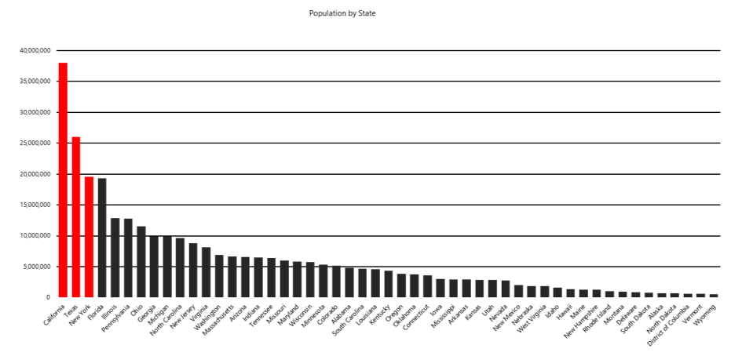
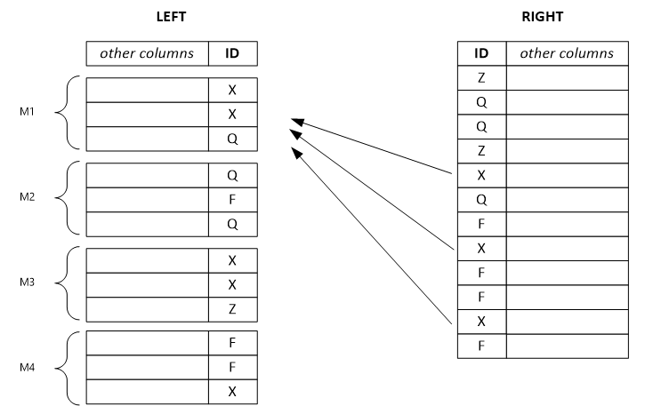

# Resolve data-skew problems by using Azure Data Lake Tools for Visual Studio

## What is data skew?

Briefly stated, data skew is an over-represented value. Imagine that you have assigned 50 tax examiners to audit tax returns, one examiner for each US state. The Wyoming examiner, because the population there is small, has little to do. In California, however, the examiner is kept very busy because of the state's large population.
    

In our scenario, the data is unevenly distributed across all tax examiners, which means that some examiners must work more than others. In your own job, you frequently experience situations like the tax-examiner example here. In more technical terms, one vertex gets much more data than its peers, a situation that makes the vertex work more than the others and that eventually slows down an entire job. What's worse, the job might fail, because vertices might have, for example, a 5-hour runtime limitation and a 6-GB memory limitation.

## Resolving data-skew problems

Azure Data Lake Tools for Visual Studio can help detect whether your job has a data-skew problem. If a problem exists, you can resolve it by trying the solutions in this section.

## Solution 1: Improve table partitioning

### Option 1: Filter the skewed key value in advance

If it does not affect your business logic, you can filter the higher-frequency values in advance. For example, if there are a lot of 000-000-000 in column GUID, you might not want to aggregate that value. Before you aggregate, you can write “WHERE GUID != “000-000-000”” to filter the high-frequency value.

### Option 2: Pick a different partition or distribution key

In the preceding example, if you want only to check the tax-audit workload all over the country/region, you can improve the data distribution by selecting the ID number as your key. Picking a different partition or distribution key can sometimes distribute the data more evenly, but you need to make sure that this choice doesn’t affect your business logic. For instance, to calculate the tax sum for each state, you might want to designate _State_ as the partition key. If you continue to experience this problem, try using Option 3.

### Option 3: Add more partition or distribution keys

Instead of using only _State_ as a partition key, you can use more than one key for partitioning. For example, consider adding _ZIP Code_ as an additional partition key to reduce data-partition sizes and distribute the data more evenly.

### Option 4: Use round-robin distribution

If you cannot find an appropriate key for partition and distribution, you can try to use round-robin distribution. Round-robin distribution treats all rows equally and randomly puts them into corresponding buckets. The data gets evenly distributed, but it loses locality information, a drawback that can also reduce job performance for some operations. Additionally, if you are doing aggregation for the skewed key anyway, the data-skew problem will persist. To learn more about round-robin distribution, see the U-SQL Table Distributions section in [CREATE TABLE (U-SQL): Creating a Table with Schema](/u-sql/ddl/tables/create/managed/create-table-u-sql-creating-a-table-with-schema#dis_sch).

## Solution 2: Improve the query plan

### Option 1: Use the CREATE STATISTICS statement

U-SQL provides the CREATE STATISTICS statement on tables. This statement gives more information to the query optimizer about the data characteristics, such as value distribution, that are stored in a table. For most queries, the query optimizer already generates the necessary statistics for a high-quality query plan. Occasionally, you might need to improve query performance by creating additional statistics with CREATE STATISTICS or by modifying the query design. For more information, see the [CREATE STATISTICS (U-SQL)](/u-sql/ddl/statistics/create-statistics) page.

Code example:

```usql
CREATE STATISTICS IF NOT EXISTS stats_SampleTable_date ON SampleDB.dbo.SampleTable(date) WITH FULLSCAN;
```

>[!NOTE]
>Statistics information is not updated automatically. If you update the data in a table without re-creating the statistics, the query performance might decline.

### Option 2: Use SKEWFACTOR

If you want to sum the tax for each state, you must use GROUP BY state, an approach that doesn't avoid the data-skew problem. However, you can provide a data hint in your query to identify data skew in keys so that the optimizer can prepare an execution plan for you.

Usually, you can set the parameter as 0.5 and 1, with 0.5 meaning not much skew and 1 meaning heavy skew. Because the hint affects execution-plan optimization for the current statement and all downstream statements, be sure to add the hint before the potential skewed key-wise aggregation.

```usql
SKEWFACTOR (columns) = x
```

Provides a hint that the given columns have a skew factor x from 0 (no skew) through 1 (very heavy skew).

Code example:

```usql
//Add a SKEWFACTOR hint.
@Impressions =
    SELECT * FROM
    searchDM.SML.PageView(@start, @end) AS PageView
    OPTION(SKEWFACTOR(Query)=0.5)
    ;
//Query 1 for key: Query, ClientId
@Sessions =
    SELECT
        ClientId,
        Query,
        SUM(PageClicks) AS Clicks
    FROM
        @Impressions
    GROUP BY
        Query, ClientId
    ;
//Query 2 for Key: Query
@Display =
    SELECT * FROM @Sessions
        INNER JOIN @Campaigns
            ON @Sessions.Query == @Campaigns.Query
    ;
```

### Option 3: Use ROWCOUNT
In addition to SKEWFACTOR, for specific skewed-key join cases, if you know that the other joined row set is small, you can tell the optimizer by adding a ROWCOUNT hint in the U-SQL statement before JOIN. This way, optimizer can choose a broadcast join strategy to help improve performance. Be aware that ROWCOUNT does not resolve the data-skew problem, but it can offer some additional help.

```usql
OPTION(ROWCOUNT = n)
```

Identify a small row set before JOIN by providing an estimated integer row count.

Code example:

```usql
//Unstructured (24-hour daily log impressions)
@Huge   = EXTRACT ClientId int, ...
            FROM @"wasb://ads@wcentralus/2015/10/30/{*}.nif"
            ;
//Small subset (that is, ForgetMe opt out)
@Small  = SELECT * FROM @Huge
            WHERE Bing.ForgetMe(x,y,z)
            OPTION(ROWCOUNT=500)
            ;
//Result (not enough information to determine simple broadcast JOIN)
@Remove = SELECT * FROM Bing.Sessions
            INNER JOIN @Small ON Sessions.Client == @Small.Client
            ;
```

## Solution 3: Improve the user-defined reducer and combiner

You can sometimes write a user-defined operator to deal with complicated process logic, and a well-written reducer and combiner might mitigate a data-skew problem in some cases.

### Option 1: Use a recursive reducer, if possible

By default, a user-defined reducer runs in non-recursive mode, which means that reduce work for a key is distributed into a single vertex. But if your data is skewed, the huge data sets might be processed in a single vertex and run for a long time.

To improve performance, you can add an attribute in your code to define reducer to run in recursive mode. Then, the huge data sets can be distributed to multiple vertices and run in parallel, which speeds up your job.

To change a non-recursive reducer to recursive, you need to make sure that your algorithm is associative. For example, the sum is associative, and the median is not. You also need to make sure that the input and output for reducer keep the same schema.

Attribute of recursive reducer:

```usql
[SqlUserDefinedReducer(IsRecursive = true)]
```

Code example:

```usql
[SqlUserDefinedReducer(IsRecursive = true)]
public class TopNReducer : IReducer
{
    public override IEnumerable<IRow>
        Reduce(IRowset input, IUpdatableRow output)
    {
        //Your reducer code goes here.
    }
}
```

### Option 2: Use row-level combiner mode, if possible

Similar to the ROWCOUNT hint for specific skewed-key join cases, combiner mode tries to distribute huge skewed-key value sets to multiple vertices so that the work can be executed concurrently. Combiner mode can’t resolve data-skew issues, but it can offer some additional help for huge skewed-key value sets.

By default, the combiner mode is Full, which means that the left row set and right row set cannot be separated. Setting the mode as Left/Right/Inner enables row-level join. The system separates the corresponding row sets and distributes them into multiple vertices that run in parallel. However, before you configure the combiner mode, be careful to ensure that the corresponding row sets can be separated.

The example that follows shows a separated left row set. Each output row depends on a single input row from the left, and it potentially depends on all rows from the right with the same key value. If you set the combiner mode as left, the system separates the huge left-row set into small ones and assigns them to multiple vertices.



>[!NOTE]
>If you set the wrong combiner mode, the combination is less efficient, and the results might be wrong.

Attributes of combiner mode:

- SqlUserDefinedCombiner(Mode=CombinerMode.Full): Every output row potentially depends on all the input rows from left and right with the same key value.

- SqlUserDefinedCombiner(Mode=CombinerMode.Left): Every output row depends on a single input row from the left (and potentially all rows from the right with the same key value).

- qlUserDefinedCombiner(Mode=CombinerMode.Right): Every output row depends on a single input row from the right (and potentially all rows from the left with the same key value).

- SqlUserDefinedCombiner(Mode=CombinerMode.Inner): Every output row depends on a single input row from the left and the right with the same value.

Code example:

```usql
[SqlUserDefinedCombiner(Mode = CombinerMode.Right)]
public class WatsonDedupCombiner : ICombiner
{
    public override IEnumerable<IRow>
        Combine(IRowset left, IRowset right, IUpdatableRow output)
    {
    //Your combiner code goes here.
    }
}
```
