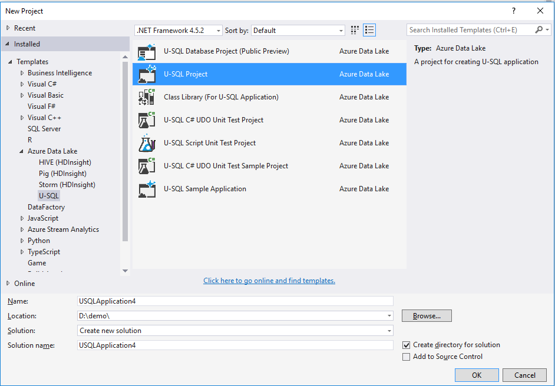
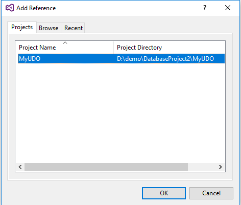
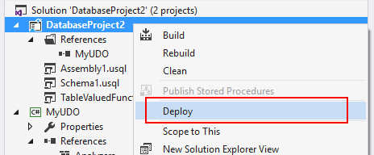
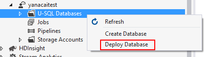
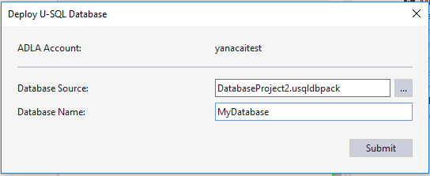
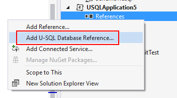
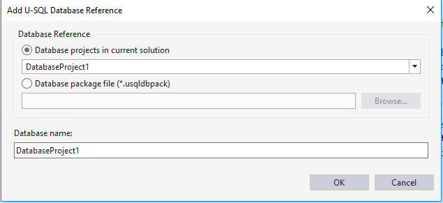

# Use a U-SQL database project to develop a U-SQL database for Azure Data Lake

U-SQL database provides structured views over unstructured data and managed structured data in tables. It also provides a general metadata catalog system for organizing your structured data and custom code. The database is the concept that groups these related objects together.

Learn more about [U-SQL database and Data Definition Language (DDL)](/u-sql/data-definition-language-ddl-statements). 

The U-SQL database project is a project type in Visual Studio that helps developers develop, manage, and deploy their U-SQL databases quickly and easily.

## Create a U-SQL database project

Azure Data Lake Tools for Visual Studio added a new project template called U-SQL database project after version 2.3.3000.0. To create a U-SQL project, select **File > New > Project**. The U-SQL Database Project can be found under **Azure Data Lake > U-SQL node**.

 

## Develop U-SQL database objects by using a database project

Right-click the U-SQL database project. The select **Add > New item**. You can find all new supported object types in the **Add New Item** Wizard. 

For a non-assembly object (for example, a table-valued function), a new U-SQL script is created after you add a new item. You can start to develop the DDL statement for that object in the editor.

For an assembly object, the tool provides a user-friendly UI editor that helps you register the assembly and deploy DLL files and other additional files. The following steps show you how to add an assembly object definition to the U-SQL database project:

1.	Add references to the C# project that include the UDO/UDAG/UDF for the U-SQL database project.

     

    

2.	In the assembly design view, choose the referenced assembly from **Create assembly from reference** drop-down menu.

    

3.	Add **Managed Dependencies** and **Additional Files** if there are any. When you add additional files, the tool uses the relative path to make sure it can find the assemblies both on your local machine and on the build machine later. 

@_DeployTempDirectory is a predefined variable that points the tool to the build output folder. Under the build output folder, every assembly has a subfolder named with the assembly name. All DLLs and additional files are in that subfolder. 
 
## Build a U-SQL database project

The build output for a U-SQL database project is a U-SQL database deployment package, named with the suffix `.usqldbpack`. The `.usqldbpack` package is a .zip file that includes all DDL statements in a single U-SQL script in the **DDL** folder, and all DLLs and additional files for assemblies in the **Temp** folder.

Learn more about [how to build a U-SQL database project with the MSBuild command line and an Azure DevOps Services build task](data-lake-analytics-cicd-overview.md).

## Deploy a U-SQL database

The .usqldbpack package can be deployed to either a local account or an Azure Data Lake Analytics account by using Visual Studio or the deployment SDK. 

### Deploy a U-SQL database in Visual Studio

You can deploy a U-SQL database through a U-SQL database project or a .usqldbpack package in Visual Studio.

#### Deploy through a U-SQL database project

1.	Right-click the U-SQL database project, and then select **Deploy**.
2.	In the **Deploy U-SQL Database Wizard**, select the **ADLA account** to which you want to deploy the database. Both local accounts and ADLA accounts are supported.
3.	**Database Source** is filled in automatically, and points to the .usqldbpack package in the project's build output folder.
4.	Enter a name in **Database Name** to create a database. If a database with that same name already exists in the target Azure Data Lake Analytics account, all objects that are defined in the database project are created without recreating the database.
5.	To deploy the U-SQL database, select **Submit**. All resources (assemblies and additional files) are uploaded, and a U-SQL job that includes all DDL statements is submitted.

    

    

#### Deploy through a U-SQL database deployment package

1.	Open **Server Explorer**. Then expand the **Azure Data Lake Analytics account** to which you want to deploy the database.
2.	Right click **U-SQL Databases**, and then choose **Deploy Database**.
3.	Set **Database Source** to the U-SQL database deployment package (.usqldbpack file) path.
4.	Enter the **Database Name** to create a database. If there is a database with the same name that already exists in the target Azure Data Lake Analytics account, all objects that are defined in the database project are created without recreating the database.

    

    
  
### Deploy U-SQL database by using the SDK

`PackageDeploymentTool.exe` provides the programming and command-line interfaces that help to deploy U-SQL databases. The SDK is included in the [U-SQL SDK Nuget package](https://www.nuget.org/packages/Microsoft.Azure.DataLake.USQL.SDK/), located at `build/runtime/PackageDeploymentTool.exe`.

[Learn more about the SDK and how to set up CI/CD pipeline for U-SQL database deployment](data-lake-analytics-cicd-overview.md).

## Reference a U-SQL database project

A U-SQL project can reference a U-SQL database project. The reference affects two workloads:

- *Project build*: Set up the referenced database environments before building the U-SQL scripts. 
- *Local run against (a local-project) account*: The referenced database environments are deployed to (a local-project) account before U-SQL script execution. [Learn more about local runs and the difference between (the local-machine) and (a local-project) account here](data-lake-analytics-data-lake-tools-local-run.md).

### How to add a U-SQL database reference

1. Right-click the U-SQL project in **Solution Explorer**, and then choose **Add U-SQL Database Reference...**.

    

2. Configure a database reference from a U-SQL database project in the current solution or in a U-SQL database package file.
3. Provide the name for the database.

    

## Next steps

- [How to set up a CI/CD pipeline for Azure Data Lake Analytics](data-lake-analytics-cicd-overview.md)
- [How to test your Azure Data Lake Analytics code](data-lake-analytics-cicd-test.md)
- [Run U-SQL script on your local machine](data-lake-analytics-data-lake-tools-local-run.md)
