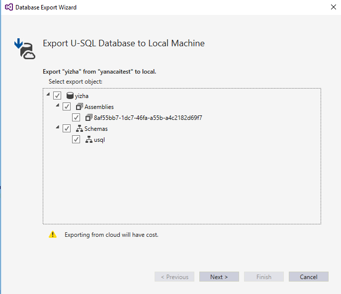
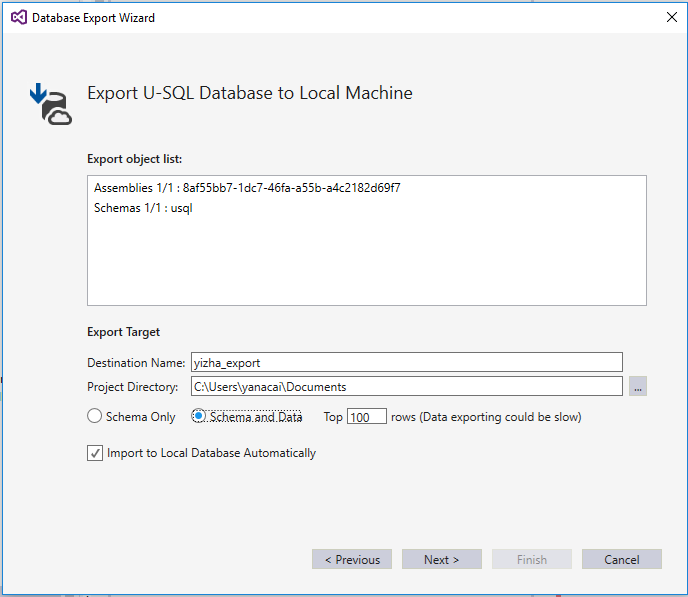
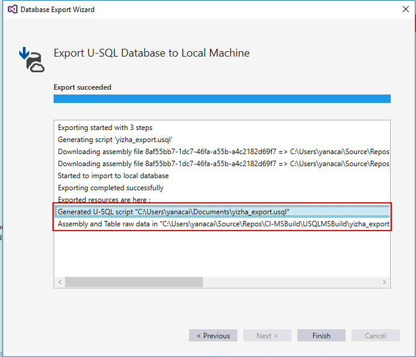

# Export a U-SQL database

[!INCLUDE [retirement-flag](includes/retirement-flag.md)]

In this article, learn how to use [Azure Data Lake Tools for Visual Studio](https://aka.ms/adltoolsvs) to export a U-SQL database as a single U-SQL script and downloaded resources. You can import the exported database to a local account in the same process.

Customers usually maintain multiple environments for development, test, and production. These environments are hosted on both a local account, on a developer's local computer, and in an Azure Data Lake Analytics account in Azure. 

When you develop and tune U-SQL queries in development and test environments, developers often need to re-create their work in a production database. The Database Export Wizard helps accelerate this process. By using the wizard, developers can clone the existing database environment and sample data to other Data Lake Analytics accounts.

## Export steps

### Step 1: Export the database in Server Explorer

All Data Lake Analytics accounts that you have permissions for are listed in Server Explorer. To export the database:

1. In Server Explorer, expand the account that contains the database that you want to export.
2. Right-click the database, and then select **Export**. 
   
    

     If the **Export** menu option isn't available, you need to [update the tool to the lasted release](https://aka.ms/adltoolsvs).

### Step 2: Configure the objects that you want to export

If you need only a small part of a large database, you can configure a subset of objects that you want to export in the export wizard. 

The export action is completed by running a U-SQL job. Therefore, exporting from an Azure account incurs some cost.

### Step 3: Check the objects list and other configurations

In this step, you can verify the selected objects in the **Export object list** box. If there are any errors, select **Previous** to go back, and correctly configure the objects that you want to export.

You can also configure other settings for the export target. Configuration descriptions are listed in the following table:

|Configuration|Description|
|-------------|-----------|
|Destination Name|This name indicates where you want to save the exported database resources. Examples are assemblies, additional files, and sample data. A folder with this name is created under your local data root folder.|
|Project Directory|This path defines where you want to save the exported U-SQL script. All database object definitions are saved at this location.|
|Schema Only|If you select this option, only database definitions and resources (like assemblies and additional files) are exported.|
|Schema and Data|If you select this option, database definitions, resources, and data are exported. The top N rows of tables are exported.|
|Import to Local Database Automatically|If you select this option, the exported database is automatically imported to your local database when exporting is finished.|

### Step 4: Check the export results

When exporting is finished, you can view the exported results in the log window in the wizard. The following example shows how to find exported U-SQL script and database resources, including assemblies, additional files, and sample data:

## Import the exported database to a local account

The most convenient way to import the exported database is to select the **Import to Local Database Automatically** check box during the exporting process in Step 3. If you didn't check this box, first, find the exported U-SQL script in the export log. Then, run the U-SQL script locally to import the database to your local account.

## Import the exported database to a Data Lake Analytics account

To import the database to different Data Lake Analytics account:

1. Upload the exported resources, including assemblies, additional files, and sample data, to the default Azure Data Lake Store account of the Data Lake Analytics account that you want to import to. You can find the exported resource folder under the local data root folder. Upload the entire folder to the root of the default Data Lake Store account.
2. When uploading is finished, submit the exported U-SQL script to the Data Lake Analytics account that you want to import the database to.

## Known limitations

Currently, if you select the **Schema and Data** option in Step 3, the tool runs a U-SQL job to export the data stored in tables. Because of this, the data exporting process might be slow and you might incur costs. 

## Next steps

* [Learn about U-SQL databases](/u-sql/data-definition-language-ddl-statements) 
* [Test and debug U-SQL jobs by using local run and the Azure Data Lake U-SQL SDK](data-lake-analytics-data-lake-tools-local-run.md)

