# Use the Azure Data Lake Tools for Visual Studio Code

Learn how to use the Azure Data Lake Tools for Visual Studio Code (VSCode) to create, test, and run U-SQL scripts.  The information is also covered in the following video:

<a href="https://www.youtube.com/watch?v=J_gWuyFnaGA&feature=youtu.be"></a>

## Prerequisites

The Data Lake Tools can be installed on the platforms supported by VSCode that include Windows, Linux, and MacOS. You can find the prerequisites for different platforms

- Windows

    - [Visual Studio Code]( https://www.visualstudio.com/products/code-vs.aspx).
    - [Java SE Runtime Environment version 8 update 77 or later](https://java.com/download/manual.jsp). You must add the java.exe path to the system environment variable path.  For the instructions, see [how do I set or change the Path system variable?]( https://www.java.com/download/help/path.xml) The path is similar to C:\Program Files\Java\jdk1.8.0_77\jre\bin
    - [.NET Core SDK 1.0.3 or .NET Core 1.1 runtime](https://www.microsoft.com/net/download).
    
- Linux (We recommend Ubuntu 14.04 LTS)

    - [Visual Studio Code]( https://www.visualstudio.com/products/code-vs.aspx). Use the following command to install:

        sudo dpkg -i code_<version_number>_amd64.deb

    - [Mono 4.2.x](http://www.mono-project.com/docs/getting-started/install/linux/). 

        - Update the deb package source by executing following commands:

                sudo apt-key adv --keyserver hkp://keyserver.ubuntu.com:80 --recv-keys 3FA7E0328081BFF6A14DA29AA6A19B38D3D831EF
                echo "deb http://download.mono-project.com/repo/debian wheezy/snapshots 4.2.4.4/main" | sudo tee /etc/apt/sources.list.d/mono-xamarin.list
                sudo apt-get update

        - Install mono by running the command:

                sudo apt-get install mono-complete

		    > [!NOTE] 
            > Mono 4.6 is not supported.  You must uninstall version 4.6 entirely before installing 4.2.x.  

        - [Java SE Runtime Environment version 8 update 77 or later](https://java.com/download/manual.jsp). The instruction can be found [here]( https://java.com/en/download/help/linux_x64_install.xml).
        - [.NET Core SDK 1.0.3 or .NET Core 1.1 runtime](https://www.microsoft.com/net/download).
- MacOS

    - [Visual Studio Code]( https://www.visualstudio.com/products/code-vs.aspx).
    - [Mono 4.2.4](http://download.mono-project.com/archive/4.2.4/macos-10-x86/). 
    - [Java SE Runtime Environment version 8 update 77 or later](https://java.com/download/manual.jsp). The instruction can be found [here](https://java.com/en/download/help/mac_install.xml).
    - [.NET Core SDK 1.0.3 or .NET Core 1.1 runtime](https://www.microsoft.com/net/download).

## Install the Data Lake Tools

After you have installed the prerequisites, you can install the Data Lake Tools for VSCode.

**To install the Data Lake Tools**

1. Open **Visual Studio Code**.
2. Press **CTRL+P**, and then enter:

        ext install usql-vscode-ext
    You can see a list of Visual Studio code extensions. One of them is **Azure Data Lake Tool (Preview)**.
3. Click **Install** next to **Azure Data Lake Tool (Preview)**. After a few seconds, the Install button will be changed to Reload.
4. Click **Reload** to activate the extension.
5. Click **OK** to confirm. You can see Azure Data Lake Tools in the Extensions pane.

    

## Activate Azure Data Lake Tools
Please create a new .USQL file or open an existing .USQL file to activate the extension. 

## Connect to Azure

Before you can compile and run U-SQL scripts in Azure Data Lake Analytics, you must connect to your Azure account.

**To connect to Azure**

1.	Open the command palette by pressing **CTRL+SHIFT+P**. 
2.  Enter **ADL:Login**.

    

3.  It generates random code and URL in output pane for login. Copy this code and transfer to webpage.

    
4.	Paste code to web page, and click Continue.

    
    
5.  Follow the instructions to sign in from the web page. Once connected, your account name is shown on the status bar on the bottom of the window.

> [!NOTE] 
> If your account has two factors enabled, it is recommended to use phone authentication instead of Pin.

To sign off, use the command **ADL:Logout**

## List Data Lake Analytics accounts

To test the connection, you can list your Data Lake Analytics accounts:

**To list the Data Lake Analytics accounts under your Azure subscription**

1. Open the command palette by pressing **CTRL+SHIFT+P**.
2. Type **ADL:List Accounts**.  The accounts appear in the **Output** pane.

## Open sample script

Use Command Palette (**Ctrl+Shift+P**) and choose **ADL: Open Sample Script**. Then it will open another instance for this sample. You also edit, configure, submit script on this instance.

## Work with U-SQL

You need open either a U-SQL file or a folder to work with U-SQL.

**To open a folder for your U-SQL project**

1. From Visual Studio Code, Click the **File** menu, and then click **Open Folder**.
2. Specify a folder, and then click **Select Folder**.
3. Click the **File** menu, and then click **New**. An **Untilted-1** file is added to the project.
4. Copy and paste the following code into Untitled-1 file:

        @departments  = 
            SELECT * FROM 
                (VALUES
                    (31,    "Sales"),
                    (33,    "Engineering"), 
                    (34,    "Clerical"),
                    (35,    "Marketing")
                ) AS 
                      D( DepID, DepName );
         
        OUTPUT @departments
            TO “/Output/departments.csv”

    The script creates a departments.csv file with some data in the /output folder.

5. Save the file as **myUSQL.usql** in the openned folder. Notice an **adltools_settings.json** configuration file is also added to the project.
4. Open and configure **adltools_settings.json** with the following properties:

    - Account:  A Data Lake Analytics account under your Azure subscription.
    - Database: A database under your account. The default is master.
    - Schema: A schema under your database. The default is dbo.
    - Optional settings:

        - Priority: The priority range is from 1 to 1000 with 1 the highest priority. The default value is 1000.
        - Parallelism: The parallelism range is from 1 to 150. The default value is 150. 

        > [!NOTE] 
        > If the settings are invalid, the default values are used.

    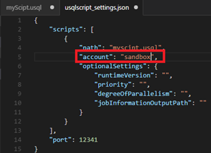

    A compute Data Lake Analytics account is needed for compiling and running U-SQL jobs.  You must configure the computer account before you can compile and run U-SQL jobs.
    Once saved, the current usql script file is shown corresponding account|database|schema on the status bar on the bottom of the window. 

Comparing to openning a file, openning a folder allows you to:

- Use code-behind file.  In the single-file mode, code-behind is not supported.
- Use configuration file. When you open a folder, the scripts in the working folder share one configuration file.


The U-SQL script compilation is done remotely by the Data Lake Analytics service.  When you issue the compile command, the U-SQL script is sent to your Data Lake Analytics account. The compilation result is late received by the Visual Studio Code. Because of the remote compilation, Visual Studio code requires the information to connect to your Data Lake Analytics account in the configuration file.

**To compile a U-SQL script**

1. Open the command palette by pressing **CTRL+SHIFT+P**. 
2. Enter **ADL: Compile Script**. Compile results show in output window. You can also right-click a script file, and then click **ADL: Compile Script** to compile a U-SQL job. The compilation result is shown in the output pane.
 

**To submit a U-SQL script**

1. Open the command palette by pressing **CTRL+SHIFT+P**. 
2. Enter **ADL: Submit Job**.  You can also right-click a script file, and then click **ADL: Submit Job** to submit a U-SQL job. 

After submitting a U-SQL job, submission logs is shown in output window in VSCode. If the submission is successful, the job URL is shown as well. You can open the job URL in a web browser to track real-time job status.

To enable output job details: set ‘jobInformationOutputPath’ in the **vscode for u-sql_settings.json** file.
 
## Use code-behind file

Code-behind file is a CSharp file associate with one U-SQL script. You can define script dedicated UDO/UDA/UDT/UDF in the code-behind file. The UDO/UDA/UDT/UDF can be directly used in the script without register the assembly first. Code-behind file is put in the same folder as its peering U-SQL script file. If the script is named xxx.usql, the code-behind is named as xxx.usql.cs. Deleting the code-behind file manually disables the code-behind feature for its associated U-SQL script. For more information about writing customer code for U-SQL script, see [Writing and Using Custom Code in U-SQL – User-Defined Functions]( https://blogs.msdn.microsoft.com/visualstudio/2015/10/28/writing-and-using-custom-code-in-u-sql-user-defined-functions/).

To support code-behind, a working folder must be opened. 

**To generate a code-behind file**

1. Open a soucre file. 
2. Open the command palette by pressing **CTRL+SHIFT+P**.
3. Enter **ADL: Generate Code Behind**.  A code-behind file is created in the same folder. 

You can also right-click a script file, and then click **ADL: Generate Code Behind** to generate a code-behind file. 

Compile and submit a U-SQL script with code-behind is the same as the standalone U-SQL script.

The following two screenshots show a code-behind file and its associated U-SQL script file:
 
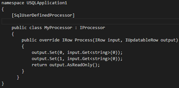

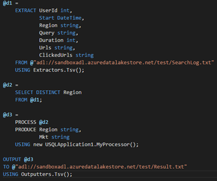 

## Use assemblies

For the information on developing assemblies, see [Develop U-SQL assemblies for Azure Data Lake Analytics jobs](data-lake-analytics-u-sql-develop-assemblies.md).

Using the Data Lake Tools, you can register custom code assemblies to the Data Lake Analytics catalog.

**To register an assembly**

1.	Press **CTRL+SHIFT+P** to open Command Palette.
2.	Enter **ADL:Register Assembly** or **ADL:Register Assembly - Advanced**.
3.	Select a Data Lake Analytics account.
4.	Select a database.
5.	Specify the local assembly path. If you select **Register Assembly**, it will directly submit assembly.
6.  If you select **ADL:Register Assembly - Advanced**, it will show a json file so that you can be reconfigure.


- Assembly Dependencies: You can register other reference dependencies. Mutiple dependencies the formate as {"depend1":"usql1.dll","depend2":"usql2.dll"}.
- Resources: You can register any type of resource. Mutiple resources the formate as ["xx.xx","xx.xx"].
Save the config file (Ctrl + S) to proceed your registering assembly.  

Another more convenient way to select **ADL:Register Assembly** on right click dll file in explorer.

The following U-SQL code demonstrates how to call an assembly. In the sample, the assemly name is *test*.

```
REFERENCE ASSEMBLY [test];

@a = 
    EXTRACT 
        Iid int,
	Starts DateTime,
	Region string,
	Query string,
	DwellTime int,
	Results string,
	ClickedUrls string 
    FROM @"Sample/SearchLog.txt" 
    USING Extractors.Tsv();

@d =
    SELECT DISTINCT Region 
    FROM @a;

@d1 = 
    PROCESS @d
    PRODUCE 
        Region string,
	Mkt string
    USING new USQLApplication_codebehind.MyProcessor();

OUTPUT @d1 
    TO @"Sample/SearchLogtest.txt" 
    USING Outputters.Tsv();
```


## Access Data Lake Analytics catalog

After you have connected to Azure, you can use the following steps to access the U-SQL catalog:

**To access Azure Data Lake Analytics metadata**

1.	Press **CTRL+SHIFT+P**, and then type **ADL:List Tables**.
2.	Click one of the Data Lake Analytics accounts.
3.	Click one of the Data Lake Analytics databases.
4.	Click one of the schemas. You can see the tables.

## Show Data Lake Analytics Jobs

Use Command Palette (**Ctrl+Shift+P**) and choose **ADL: Show Job**. 

1.	Select an ADLA or Local account 
2.  Wait for the jobs list for the account to be shown
3.	Select a job from job list, ADL Tools open the job details in the portal and display the JobInfo file in VSCode.
    

## Azure Data Lake Storage (ADLS) Integration

You can use ADLS related commands to navigate ADLS resources, preview ADLS file and upload file into ADLS directly in VSCode.  You can also open **Web Azure Storage Explorer** through command: **ADL: Open Web Azure Storage Explorer** or from the right click context menu.

### List Storage Path

Use Command Palette (**Ctrl+Shift+P**) and choose **ADL: List Storage Path**.
1.  Open Command Palette and input the command.

    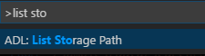

2.  Select one way for listing storage path. This passage uses **Enter a path** as an example.

    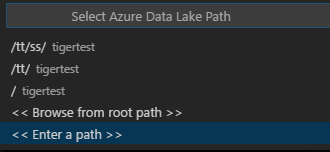
    
    - Vscode keeps the path you have visited the last every ADLA account. Example：/tt/ss.
    - Browser from root path: list root path from you select ADLA account or local.
    - Enter a path: listing specified path from you select ADLA account or local.

3. Select an account from local or ADLA account.

    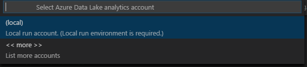

4.  Click more to list more ADLA accounts and select an ADLA account.

    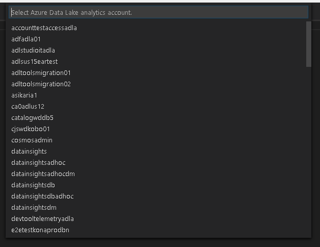

5.  Input an azure storage path. E.g.: /output

       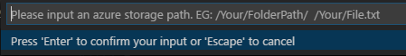

6.  Results: Command Palette lists the path information based on your inputs.

    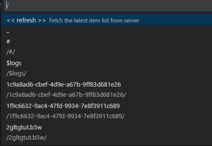

Another more convenient way to list relative path is through the right click context menu.

1.  Right click on path string to select List Storage Path.

       
2. Seleted relative path is shown in Command Palette.

   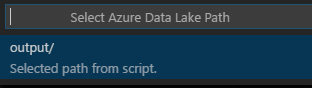

3.  Select an account from local or ADLA account.

       

4.  Results: Command Palette lists folders and files for the current path.

       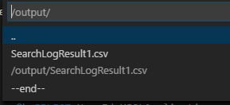

### Preview Storage File

Use Command Palette (**Ctrl+Shift+P**) and choose **ADL: : Preview Storage File**.
1.  Open Command Palette and input the command.

       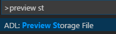

2.  Select an account from local or ADLA.

       

3.  Click more to list more ADLA accounts and select an ADLA account.

       

4.  Input an azure storage path or file. E.g.: /output/SearchLog.txt

       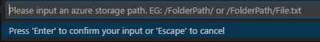

5.  Results: Command Palette lists the path information based on your inputs.

       

Another more convenient way to preview a file is through the right click context menu.

1.  Right click on a file path to preview a file.

       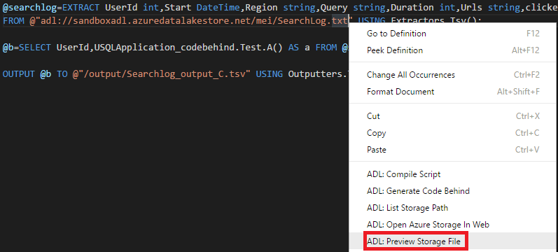

2.  Select an account from local or ADLA account.

       

3.  Results: VSCode displays the preview results of the file.

       

### Upload to Storage Path

Use Command Palette (**Ctrl+Shift+P**) and choose **ADL: : Upload to Storage Path** or **Upload to Storage Path - Advanced**.
1.  Open Command Palette and input the command. This passage uses **Upload to Storage Path - Advanced** as an example.

    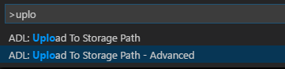
2. Input a local path for uploading.

    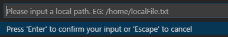

3. Select one way for listing storage path. This passage uses **Enter a path** as an example.

    
    
    - Vscode keeps the path you have visited the last every ADLA account. Example：/tt/ss.
    - Browser from root path: list root path from you select ADLA account or local.
    - Enter a path: listing specified path from you select ADLA account or local.

4. Select an account from local or ADLA account.

    

5.  Input an azure storage path. E.g.: /output/

       

6. Listing you input the azure storage path. Select **Choose current folder**.

    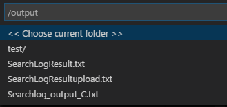
   

7.  VSCode displays a json configurations file, you can make any further updates if needed. Save (CTRL+S) file to proceed the file upload.

       

8.  Results: The output window displays the file upload status.

       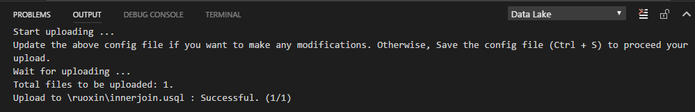    

Another more convenient way to upload to storage path is through the right click on full path or relative path in script editor. The way is similar and no longer enumerated.

### Open Web Azure Storage Explorer

1. Press CTRL+SHIFT+P to open Command Palette.
2. Enter **Open Web Azure Storage Explorer** or right click on a relative path or full path in script editor to choose **Open Web Azure Storage Explorer**.
3. Select a Data Lake Analytics account.

ADL Tools open the Azure storage path in the portal. You can visit path and preview file from web.

### Local Run
U-SQL local run for windows has been implemented to allow you to perform local run to test your local data, validate your script locally before publishing you production ready code to Azure HDInsight clusters. You can start your local run service, confirm the configurations, and simply submit your U-SQL job to the local run service.

1. Press CTRL+SHIFT+P to open Command Palette and enter **Start Local Run Service**.
2. The cmd window will show up. Input 3 to set your input, output path. 

   
3. Press CTRL+SHIFT+P to open Command Palette and enter **Submit Job**.
4. Select **Local** to submit.

5. After submitting a U-SQL job to local, submission information is shown in output window in VSCode. You can see submission logs by clicking jobUrl. And the status of submission you can see in CMD window.


### Local Debug
Before debugging, you need to install C# for Visual studio Code that can set breakpoint and debug code.


1. Press CTRL+SHIFT+P to open Command Palette and enter **Start Local Run Service**.
2. The cmd window will show up. Make sure the **DataRoot** is set.
3. Set a breakpoint in code behind.
4. Back to script editor, press CTRL+SHIFT+P to open Command Palette and enter **Local Debug**.

When the program execution reaches the breaking point, you see a DEBUG CONSOLE in the bottom pane. You also see the view parameter and variable information,call stack in the left pane. Click the Step Over icon to proceed to the next line of code. Then you can further step through the code. 
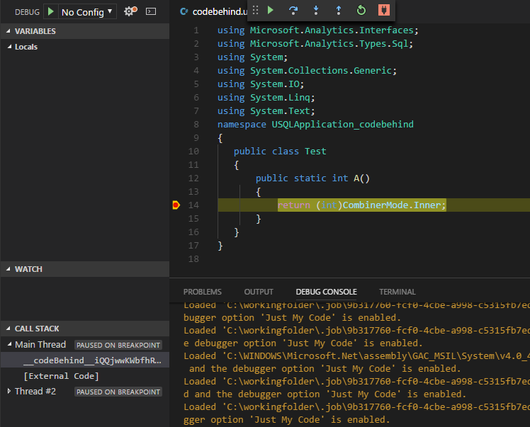

## Additional features

The Data Lake Tools for VSCode supports the following features:

-	IntelliSense auto-complete. Suggestions are popped up around keyword, method, variables, etc. Different icons represent different types of the objects:

    - Scala Data Type
    - Complex Data Type
    - Built-in UDTs
    - .Net Collection & Classes
    - C# Expressions
    - Built-in C# UDFs, UDOs, and UDAAGs 
    - U-SQL Functions
    - U-SQL Windowing Function
 
    
 
-	IntelliSense auto-complete on the Data Lake Analytics Metadata. The Data Lake Tools download Data Lake Analytics metadata information locally.  The IntelliSense feature automatically populates objects, including Database, Schema, Table, View, TVF, Procedures, C# Assemblies, from the Data Lake Analytics metadata.
 
    

-	IntelliSense error marker. The Data Lake Tools underline the editing errors for U-SQL and C#. 
-	Syntax highlights. The Data Lake Tools use different color to differentiate variables, keywords, data type, functions, etc. 

    

## Next steps:

- For the getting started information on Data Lake Analytics, see [Tutorial: get started with Azure Data Lake Analytics](data-lake-analytics-get-started-portal.md).
- For information on using Data Lake Tools for Visual Studio, see [Tutorial: develop U-SQL scripts using Data Lake Tools for Visual Studio](data-lake-analytics-data-lake-tools-get-started.md).
- For the information on developing assemblies, see [Develop U-SQL assemblies for Azure Data Lake Analytics jobs](data-lake-analytics-u-sql-develop-assemblies.md).


