# Use Azure Data Lake Tools for Visual Studio Code

In this article, learn how you can use Azure Data Lake Tools for Visual Studio Code (VS Code) to create, test, and run U-SQL scripts. The information is also covered in the following video:

[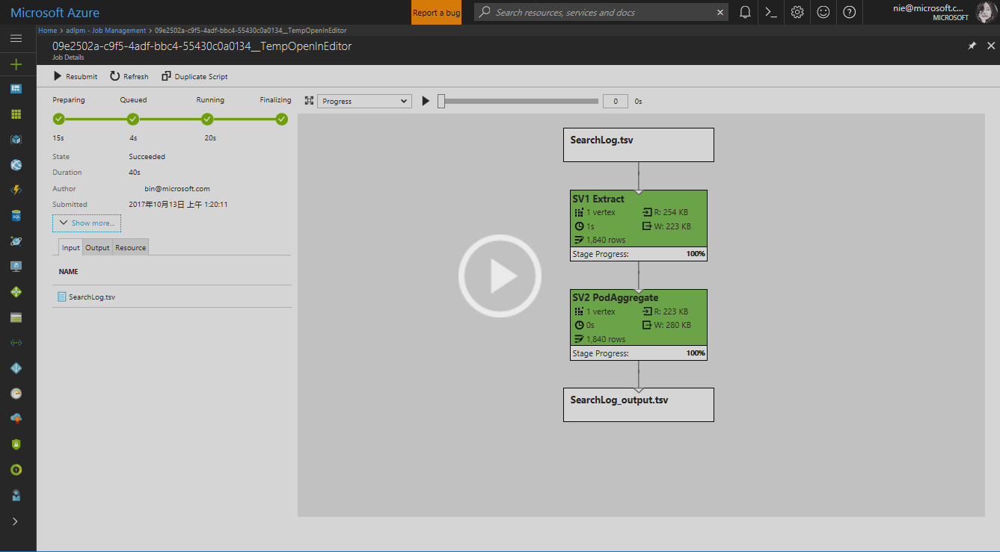](https://channel9.msdn.com/Series/AzureDataLake/Azure-Data-Lake-Tools-for-VSCode?term=ADL%20Tools%20for%20VSCode")

## Prerequisites

Azure Data Lake Tools for VS Code supports Windows, Linux, and macOS. U-SQL local run and local debug works only in Windows.

- [Visual Studio Code](https://www.visualstudio.com/products/code-vs.aspx)

For MacOS and Linux:

- [.NET Core SDK 5.0](https://www.microsoft.com/net/download/core)
- [Mono 6.12.x](https://www.mono-project.com/download/)

## Install Azure Data Lake Tools

After you install the prerequisites, you can install Azure Data Lake Tools for VS Code.

### To install Azure Data Lake Tools

1. Open Visual Studio Code.
2. Select **Extensions** in the left pane. Enter **Azure Data Lake Tools** in the search box.
3. Select **Install** next to **Azure Data Lake Tools**.

   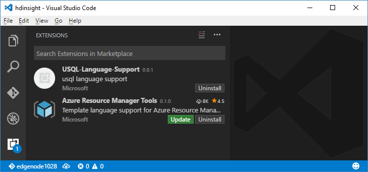

   After a few seconds, the **Install** button changes to **Reload**.
4. Select **Reload** to activate the **Azure Data Lake Tools** extension.
5. Select **Reload Window** to confirm. You can see **Azure Data Lake Tools** in the **Extensions** pane.

## Activate Azure Data Lake Tools

Create a .usql file or open an existing .usql file to activate the extension.

## Work with U-SQL

To work with U-SQL, you need open either a U-SQL file or a folder.

### To open the sample script

Open the command palette (Ctrl+Shift+P) and enter **ADL: Open Sample Script**. It opens another instance of this sample. You can also edit, configure, and submit a script on this instance.

### To open a folder for your U-SQL project

1. From Visual Studio Code, select the **File** menu, and then select **Open Folder**.
2. Specify a folder, and then select **Select Folder**.
3. Select the **File** menu, and then select **New**. An Untitled-1 file is added to the project.
4. Enter the following code in the Untitled-1 file:

   ```usql
   @departments  =
       SELECT * FROM
           (VALUES
               (31,    "Sales"),
               (33,    "Engineering"),
               (34,    "Clerical"),
               (35,    "Marketing")
           ) AS
                 D( DepID, DepName );
   ```

   OUTPUT @departments
       TO "/Output/departments.csv"
   USING Outputters.Csv();

    The script creates a departments.csv file with some data included in the /output folder.

5. Save the file as **myUSQL.usql** in the opened folder.

### To compile a U-SQL script

1. Select Ctrl+Shift+P to open the command palette.
2. Enter **ADL: Compile Script**. The compile results appear in the **Output** window. You can also right-click a script file, and then select **ADL: Compile Script** to compile a U-SQL job. The compilation result appears in the **Output** pane.

### To submit a U-SQL script

1. Select Ctrl+Shift+P to open the command palette.
2. Enter **ADL: Submit Job**. You can also right-click a script file, and then select **ADL: Submit Job**.

After you submit a U-SQL job, the submission logs appear in the **Output** window in VS Code. The job view appears in the right pane. If the submission is successful, the job URL appears too. You can open the job URL in a web browser to track the real-time job status.

On the job view's **SUMMARY** tab, you can see the job details. Main functions include resubmit a script, duplicate a script, and open in the portal. On the job view's **DATA** tab, you can refer to the input files, output files, and resource files. Files can be downloaded to the local computer.


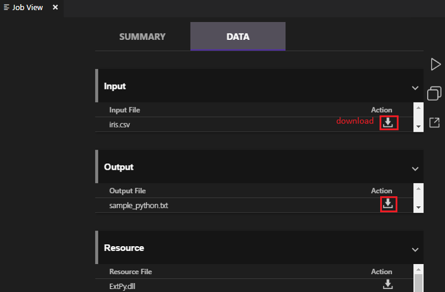

### To set the default context

You can set the default context to apply this setting to all script files if you have not set parameters for files individually.

1. Select Ctrl+Shift+P to open the command palette.
2. Enter **ADL: Set Default Context**. Or right-click the script editor and select **ADL: Set Default Context**.
3. Choose the account, database, and schema that you want. The setting is saved to the xxx_settings.json configuration file.

   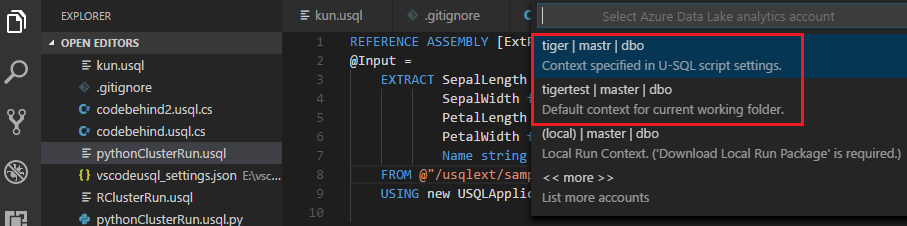

### To set script parameters

1. Select Ctrl+Shift+P to open the command palette.
2. Enter **ADL: Set Script Parameters**.
3. The xxx_settings.json file is opened with the following properties:

   - **account**: An Azure Data Lake Analytics account under your Azure subscription that's needed to compile and run U-SQL jobs. You need configure the computer account before you compile and run U-SQL jobs.
   - **database**: A database under your account. The default is **master**.
   - **schema**: A schema under your database. The default is **dbo**.
   - **optionalSettings**:
        - **priority**: The priority range is from 1 to 1000, with 1 as the highest priority. The default value is **1000**.
        - **degreeOfParallelism**: The parallelism range is from 1 to 150. The default value is the maximum parallelism allowed in your Azure Data Lake Analytics account.

   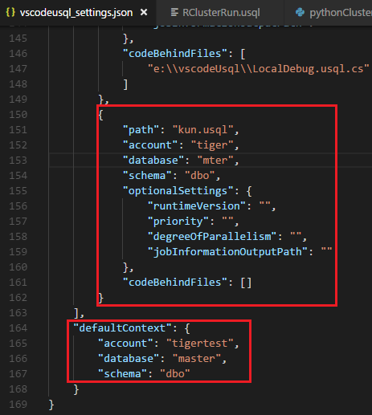

> [!NOTE]
> After you save the configuration, the account, database, and schema information appear on the status bar at the lower-left corner of the corresponding .usql file if you don’t have a default context set up.

### To set Git ignore

1. Select Ctrl+Shift+P to open the command palette.
2. Enter **ADL: Set Git Ignore**.

   - If you don’t have a **.gitIgnore** file in your VS Code working folder, a file named **.gitIgnore** is created in your folder. Four items (**usqlCodeBehindReference**, **usqlCodeBehindGenerated**, **.cache**, **obj**) are added in the file by default. You can make more updates if needed.
   - If you already have a **.gitIgnore** file in your VS Code working folder, the tool adds four items (**usqlCodeBehindReference**, **usqlCodeBehindGenerated**, **.cache**, **obj**) in your **.gitIgnore** file if the four items were not included in the file.

   

## Work with code-behind files: C Sharp, Python, and R

Azure Data Lake Tools supports multiple custom codes. For instructions, see [Develop U-SQL with Python, R, and C Sharp for Azure Data Lake Analytics in VS Code](data-lake-analytics-u-sql-develop-with-python-r-csharp-in-vscode.md).

## Work with assemblies

For information on developing assemblies, see [Develop U-SQL assemblies for Azure Data Lake Analytics jobs]().

You can use Data Lake Tools to register custom code assemblies in the Data Lake Analytics catalog.

### To register an assembly

You can register the assembly through the **ADL: Register Assembly** or **ADL: Register Assembly (Advanced)** command.

### To register through the ADL: Register Assembly command

1. Select Ctrl+Shift+P to open the command palette.
2. Enter **ADL: Register Assembly**.
3. Specify the local assembly path.
4. Select a Data Lake Analytics account.
5. Select a database.

The portal is opened in a browser and displays the assembly registration process.  

A more convenient way to trigger the **ADL: Register Assembly** command is to right-click the .dll file in File Explorer.

### To register through the ADL: Register Assembly (Advanced) command

1. Select Ctrl+Shift+P to open the command palette.
2. Enter **ADL: Register Assembly (Advanced)**.
3. Specify the local assembly path.
4. The JSON file is displayed. Review and edit the assembly dependencies and resource parameters, if needed. Instructions are displayed in the **Output** window. To proceed to the assembly registration, save (Ctrl+S) the JSON file.

   

>[!NOTE]
>
>- Azure Data Lake Tools autodetects whether the DLL has any assembly dependencies. The dependencies are displayed in the JSON file after they're detected.
>- You can upload your DLL resources (for example, .txt, .png, and .csv) as part of the assembly registration.

Another way to trigger the **ADL: Register Assembly (Advanced)** command is to right-click the .dll file in File Explorer.

The following U-SQL code demonstrates how to call an assembly. In the sample, the assembly name is *test*.

```usql
REFERENCE ASSEMBLY [test];
@a =
    EXTRACT
        Iid int,
    Starts DateTime,
    Region string,
    Query string,
    DwellTime int,
    Results string,
    ClickedUrls string
    FROM @"Sample/SearchLog.txt"
    USING Extractors.Tsv();
@d =
    SELECT DISTINCT Region
    FROM @a;
@d1 =
    PROCESS @d
    PRODUCE
        Region string,
    Mkt string
    USING new USQLApplication_codebehind.MyProcessor();
OUTPUT @d1
    TO @"Sample/SearchLogtest.txt"
    USING Outputters.Tsv();
```

## Use U-SQL local run and local debug for Windows users

U-SQL local run tests your local data and validates your script locally before your code is published to Data Lake Analytics. You can use the local debug feature to complete the following tasks before your code is submitted to Data Lake Analytics:

- Debug your C# code-behind.
- Step through the code.
- Validate your script locally.

The local run and local debug feature only works in Windows environments, and is not supported on macOS and Linux-based operating systems.

For instructions on local run and local debug, see [U-SQL local run and local debug with Visual Studio Code](data-lake-tools-for-vscode-local-run-and-debug.md).

## Connect to Azure

Before you can compile and run U-SQL scripts in Data Lake Analytics, you must connect to your Azure account.

<a id="sign-in-by-command"></a>

### To connect to Azure by using a command

1. Select Ctrl+Shift+P to open the command palette.

2. Enter **ADL: Login**. The login information appears on the lower right.

   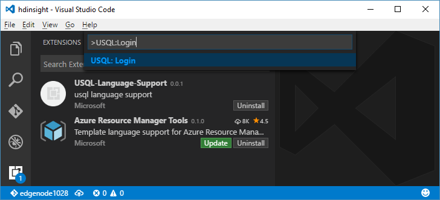

   

3. Select **Copy & Open** to open the [login webpage](https://aka.ms/devicelogin). Paste the code into the box, and then select **Continue**.

    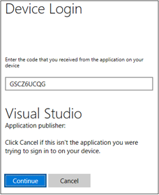  

4. Follow the instructions to sign in from the webpage. When you're connected, your Azure account name appears on the status bar in the lower-left corner of the VS Code window.

> [!NOTE]
>
> - Data Lake Tools automatically signs you in the next time if you don't sign out.
> - If your account has two factors enabled, we recommend that you use phone authentication rather than using a PIN.

To sign out, enter the command **ADL: Logout**.

### To connect to Azure from the explorer

Expand **AZURE DATALAKE**, select **Sign in to Azure**, and then follow step 3 and step 4 of [To connect to Azure by using a command](#sign-in-by-command).

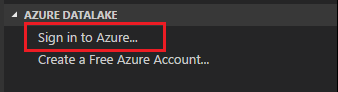  

You can't sign out from the explorer. To sign out, see [To connect to Azure by using a command](#sign-in-by-command).

## Create an extraction script

You can create an extraction script for .csv, .tsv, and .txt files by using the command **ADL: Create EXTRACT Script** or from the Azure Data Lake explorer.

### To create an extraction script by using a command

1. Select Ctrl+Shift+P to open the command palette, and enter **ADL: Create EXTRACT Script**.
2. Specify the full path for an Azure Storage file, and select the Enter key.
3. Select one account.
4. For a .txt file, select a delimiter to extract the file.

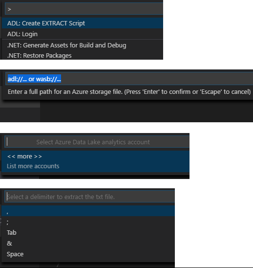

The extraction script is generated based on your entries. For a script that cannot detect the columns, choose one from the two options. If not, only one script will be generated.

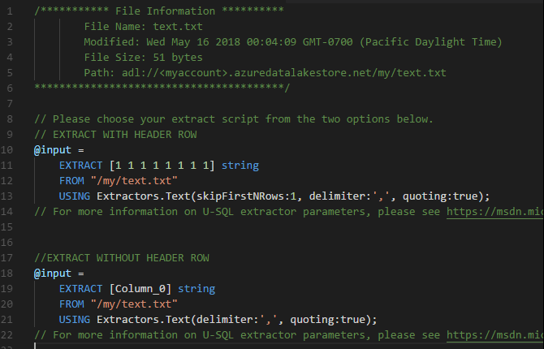

### To create an extraction script from the explorer

Another way to create the extraction script is through the right-click (shortcut) menu on the .csv, .tsv, or .txt file in Azure Data Lake Store or Azure Blob storage.

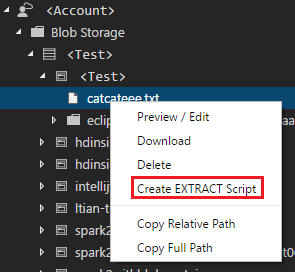

## Next steps

- [Develop U-SQL with Python, R, and C Sharp for Azure Data Lake Analytics in VS Code](data-lake-analytics-u-sql-develop-with-python-r-csharp-in-vscode.md)
- [U-SQL local run and local debug with Visual Studio Code](data-lake-tools-for-vscode-local-run-and-debug.md)
- [Tutorial: Get started with Azure Data Lake Analytics](data-lake-analytics-get-started-portal.md)
- [Tutorial: Develop U-SQL scripts by using Data Lake Tools for Visual Studio](data-lake-analytics-data-lake-tools-get-started.md)
