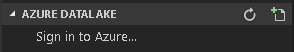
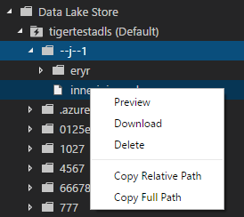

# Use Azure Data Lake Tools for Visual Studio Code

Learn the Azure Data Lake Tools for Visual Studio Code (VS Code) to create, test, and run U-SQL scripts. The information is also covered in the following video:

## Prerequisites

Azure Data Lake Tools for VSCode supports Windows, Linux, and MacOS.  

- [Visual Studio Code](https://www.visualstudio.com/products/code-vs.aspx).

For MacOS and Linux:
- [.NET Core SDK 2.0](https://www.microsoft.com/net/download/core). 
- [Mono 5.2.x](http://www.mono-project.com/download/).

## Install Data Lake Tools

After you install the prerequisites, you can install Data Lake Tools for VS Code.

**To install Data Lake Tools**

1. Open Visual Studio Code.
2. Click **Extensions** in the left pane. Enter **Azure Data Lake** in the search box.
3. Click **Install** next to **Azure Data Lake tools**. After a few seconds, the **Install** button will be changed to **Reload**.
4. Click **Reload** to activate the **Azure Data Lake tools** extension.
5. Click **Reload Window** to confirm. You can see **Azure Data Lake tools** in the Extensions pane.

    

 
## Activate Azure Data Lake Tools
Create a new .usql file or open an existing .usql file to activate the extension. 

## Open the sample script
Open the command palette (Ctrl+Shift+P) and enter **ADL: Open Sample Script**. It opens another instance of this sample. You can also edit, configure, and submit script on this instance.

## Work with U-SQL

You need open either a U-SQL file or a folder to work with U-SQL.

**To open a folder for your U-SQL project**

1. From Visual Studio Code, select the **File** menu, and then select **Open Folder**.
2. Specify a folder, and then select **Select Folder**.
3. Select the **File** menu, and then select **New**. An Untitled-1 file is added to the project.
4. Enter the following code into the Untitled-1 file:

        @departments  = 
            SELECT * FROM 
                (VALUES
                    (31,    "Sales"),
                    (33,    "Engineering"), 
                    (34,    "Clerical"),
                    (35,    "Marketing")
                ) AS 
                      D( DepID, DepName );
         
        OUTPUT @departments
            TO "/Output/departments.csv"
	    USING Outputters.Csv();

    The script creates a departments.csv file with some data included in the /output folder.

5. Save the file as **myUSQL.usql** in the opened folder.

**To compile a U-SQL script**

1. Select Ctrl+Shift+P to open the command palette. 
2. Enter **ADL: Compile Script**. The compile results appear in the **Output** window. You can also right-click a script file, and then select **ADL: Compile Script** to compile a U-SQL job. The compilation result appears in the **Output** pane.
 
**To submit a U-SQL script**

1. Select Ctrl+Shift+P to open the command palette. 
2. Enter **ADL: Submit Job**.  You can also right-click a script file, and then select **ADL: Submit Job**. 

 After you submit a U-SQL job, the submission logs appear in the **Output** window in VS Code. Job view is shown the right pane. If the submission is successful, the job URL appears as well. You can open the job URL in a web browser to track the realtime job status. In Job View Summary tab, you can see the job details. Main functions include resubmit script, duplicate script, open in portal. In Job View Data tab, you can refer to the Input files, Output files, Resource. Files can be downloaded to local computer.

   

   

**Set Default Context**

 You can set default context to apply this setting to all script files if you have not set parameters for file respectively.

1. Select Ctrl+Shift+P to open the command palette. 
2. Enter **ADL: Set Default Context**.
3. Or right-click the script editor and select **ADL:  Set Default Context**, then choose the account, database, and schema you want. The setting is saved to xxx_settings.json configuration file.

    

**Set Script Parameters**

1. Select Ctrl+Shift+P to open the command palette. 
2. Enter **ADL: Set Script Parameters**.
3. xxx_settings.json file is opened with the following properties:

  - Account:  A Data Lake Analytics account under your Azure subscription that is needed to compile and run U-SQL jobs, so you need configure the computer account before compiling and running U-SQL jobs.
    - Database: A database under your account. The default is **master**.
    - Schema: A schema under your database. The default is **dbo**.
    - Optional settings:
        - Priority: The priority range is from 1 to 1000 with 1 as the highest priority. The default value is **1000**.
        - Parallelism: The parallelism range is from 1 to 150. The default value is the maximum parallelism allowed in your Azure Data Lake Analytics account. 

        
      
        > [!NOTE] 
        > After the configuration is saved, The account, database, and schema information appear on the status bar at the bottom-left corner of the corresponding .usql file file if you don’t have default context set up.

**Set Git Ignore**

1. Select Ctrl+Shift+P to open the command palette. 
2. Enter **ADL:  Set Git Ignore**.

    - If you don’t have a **.gitIgnore** file in your VSCode working folder, a file named **.gitIgnor** is created in your folder. Four items (**usqlCodeBehindReference**, **usqlCodeBehindGenerated**, **.cache**, **obj**) are added into the file by default. You can further make updates if needed.
    - If you already have a **.gitIgnore** file in your VSCode working folder, the tool adds four items (**usqlCodeBehindReference**, **usqlCodeBehindGenerated**, **.cache**, **obj**) into your **.gitIgnore** file if the four items were not included in the file.

    

## Use Python, R, and CSharp code-behind file
Azure Data Lake Tool supports multiple custom codes, the instructions see [Develop U-SQL with Python, R, and CSharp for Azure Data Lake Analytics in VSCode](data-lake-analytics-u-sql-develop-with-python-r-csharp-in-vscode.md).

## Use assemblies

For information on developing assemblies, see [Develop U-SQL assemblies for Azure Data Lake Analytics jobs](data-lake-analytics-u-sql-develop-assemblies.md).

You can use Data Lake Tools to register custom code assemblies in the Data Lake Analytics catalog.

**To register an assembly**

You can register the assembly through the **ADL: Register Assembly** or **ADL: Register Assembly (Advanced)** commands.

**To register through the ADL: Register Assembly command**
1.	Select Ctrl+Shift+P to open the command palette.
2.	Enter **ADL: Register Assembly**. 
3.	Specify the local assembly path. 
4.	Select a Data Lake Analytics account.
5.	Select a database.

Results: The portal is opened in a browser and displays the assembly registration process.  

Another convenient way to trigger the **ADL: Register Assembly** command is to right-click the .dll file in File Explorer. 

**To register though the ADL: Register Assembly (Advanced)**
1.	Select Ctrl+Shift+P to open the command palette.
2.	Enter **ADL: Register Assembly (Advanced)**. 
3.	Specify the local assembly path. 
4.  The JSON file is displayed. Review and edit the assembly dependencies and resource parameters, if needed. Instructions are displayed in the **Output** window. To proceed to the assembly registration, save (Ctrl+S) the JSON file.

    
    
   >[!NOTE]
   >- Assembly dependencies: Azure Data Lake Tools autodetects whether the DLL has any dependencies. The dependencies are displayed in the JSON file after they are detected. 
   >- Resources: You can upload your DLL resources (For example, .txt, .png, and .csv ) as part of the assembly registration. 

Another way to trigger the **ADL: Register Assembly (Advanced)** command is to right-click the .dll file in File Explorer. 

The following U-SQL code demonstrates how to call an assembly. In the sample, the assembly name is *test*.

        REFERENCE ASSEMBLY [test];

        @a = 
            EXTRACT 
                Iid int,
            Starts DateTime,
            Region string,
            Query string,
            DwellTime int,
            Results string,
            ClickedUrls string 
            FROM @"Sample/SearchLog.txt" 
            USING Extractors.Tsv();

        @d =
            SELECT DISTINCT Region 
            FROM @a;

        @d1 = 
            PROCESS @d
            PRODUCE 
                Region string,
            Mkt string
            USING new USQLApplication_codebehind.MyProcessor();

        OUTPUT @d1 
            TO @"Sample/SearchLogtest.txt" 
            USING Outputters.Tsv();

## Connect to Azure

Before you can compile and run U-SQL scripts in Data Lake Analytics, you must connect to your Azure account.

**To connect to Azure**

1.	Select Ctrl+Shift+P to open the command palette. 
2.  Enter **ADL: Login**. The login information appears on the top area.

    
    
3.  Click **Copy & Open** to open the login webpage with URL: https://aka.ms/devicelogin. Paste the code **G567LX42V** into the text box, and then select **Continue**.

      
4.  Follow the instructions to sign in from the webpage. When you're connected, your Azure account name appears on the status bar in the lower-left corner of the **VS Code** window. 

    > [!NOTE] 
    >- Data Lake Tool automatically signs in next time If you have signed in before, but you have not logged out yet.
    >- If your account has two factors enabled, we recommend that you use phone authentication rather than using a PIN.

To sign out, enter the command **ADL: Logout**.

## List your Data Lake Analytics accounts

To test the connection, get a list of your Data Lake Analytics accounts.

**To list the Data Lake Analytics accounts under your Azure subscription**

1. Select Ctrl+Shift+P to open the command palette.
2. Enter **ADL: List Accounts**. The accounts appear in the **Output** pane.

## Access the Data Lake Analytics catalog

After you have connected to Azure, you can use the following steps to access the U-SQL catalog.

**To access Azure Data Lake Analytics metadata**

1.	Select Ctrl+Shift+P, and then enter **ADL: List Tables**.
2.	Select one of the Data Lake Analytics accounts.
3.	Select one of the Data Lake Analytics databases.
4.	Select one of the schemas. You can see the list of tables.

## View Data Lake Analytics jobs

**To view Data Lake Analytics jobs**
1.  Open the command palette (Ctrl+Shift+P) and select **ADL: Show Jobs**. 
2.	Select a Data Lake Analytics or local account. 
3.  Wait for the jobs list for the account to appear.
4.	Select a job from job list, Data Lake Tools opens the job view in the right pane and displays some information in VS Code **OUTPUT**.

    

## Azure Data Lake Storage integration

You can use Azure Data Lake Storage-related commands to:
 - Browse through the Azure Data Lake Storage resources. [List the storage path](#list-the-storage-path). 
 - Preview the Azure Data Lake Storage file. [Preview the storage file](#preview-the-storage-file). 
 - Upload the file directly to Azure Data Lake Storage in VS Code. [Upload file or folder](#upload-file-or-folder).
 - Download the file directly from Azure Data Lake Storage in VS Code. [Download file](#download-file).

### List the storage path 

**To list the storage path through the command palette**

Right-click the script editor and select **ADL: List Path**.

Choose the folder in the list, or click **Enter Path** or **Browse from Root** (uses Enter a path as an example). -> Select your **ADLA Account**. ->  Navigate or enter the storage folder path (For example: /output/). -> The command palette lists the path information based on your entries.

A more convenient way to list the relative path is through the right-click context menu.

**To list the storage path through right-click**

Right-click the path string to select **List Path** to continue.

### Preview the storage file

Right-click the script editor and select **ADL: Preview File**.

Select your **ADLA Account**. ->  Enter an Azure storage file path (For example, /output/SearchLog.txt). -> Result: file opens in VSCode.

   

Another way to preview file is through the right-click menu on the file's full path or the file's relative path in the script editor. 

### Upload file or folder

1. Right-click the script editor and select **Upload File** or **Upload Folder**.

2. Choose one file or multiple files if select upload file, or choose the whole folder if select upload folder then click **Upload**. -> Choose the storage folder in the list, or click **Enter Path** or **Browse from Root** (uses Enter a path as an example). -> Select your **ADLA Account**. ->  Navigate or enter the storage folder path (For example: /output/). -> click **Choose Current Folder** to specify your upload destination.

       

   Another way of uploading files to storage is through the right-click menu on the file's full path or the file's relative path in the script editor.

As the same time, you can monitor the [uploading status](#check-storage-tasks-status).

### Download file 
You can download files by entering the commands **ADL: Download File** or **ADL: Download File (Advanced)**.

**To download files though the ADL: Download File (Advanced)**
1. Right-click the script editor, and then select **Download File (Advanced)**.
2. VS Code displays a JSON file. You can enter file paths and download multiple files at the same time. Instructions are displayed in the **Output** window. To proceed to download the file, save (Ctrl+S) the JSON file.

    

3.  Results: The **Output** window displays the file upload status.

         

As the same time, you can monitor the [downloading status](#check-storage-tasks-status).

**To Download files though the ADL: Download File**

1. Right-click the script editor, select **Download File**, and then select the destination folder from the **Select Folder** dialog.

2. Choose the folder in the list, or click **Enter Path** or **Browse from Root** (uses Enter a path as an example). -> Select your **ADLA Account**. ->  Navigate or enter the storage folder path (For example: /output/) -> choose a file to download.

    

   
   Another way of downloading storage files is through the right-click menu on the file's full path or the file's relative path in the script editor.

As the same time, you can monitor the [downloading status](#check-storage-tasks-status).

### Check storage tasks' status
The status displays on the bottom of the status bar when completed downloading and uploading.
1. Click the bellow status bar, and then the downloading and uploading status show in **OUTPUT** panel.

   

## VSCode Explorer integration with Azure Data Lake

**Azure Integration** 

- Before login to Azure, you can always expand **DATALAKE EXPLORER**, then click **Sign in to Azur** to login to Azure. After login, you will see all the subscriptions under your Azure account are listed in the left panel of the **DATALAKE EXPLORER**. 

   

   

**ADLA Metadata Navigation** 

- Expand your Azure subscription, you can navigate your U-SQL database, view the **Schemas**, **Credentials**, **Assemblies**, **Table**, **Index**, and so on, under the U-SQL Databases node.

**ADLA Metadata Entity Management**

- Expand **U-SQL Databases**, you can create a new database, schema, table, table types, index, statistics by right-clicking the **Script to Create** context menu under the corresponding node. In the opened script page, edit the script according to your needs, then submit the job by right-clicking context menu **ADL: Submit Job**. After finishing creating it, click context menu **Refresh** to show the new created item. You can also delete the item by right-clicking the context menu **Delete**.

   

   

**ADLA Assembly Registration**

 - You can **Register assembly** into the corresponding database by right-clicking on the **Assemblies** node.

    

**ADLS Integration** 

 - Navigate to **Storage Account**, you can **Preview**, **Download**, **Delete**, **Copy Relative Path**, **Copy Full Path** by the context menu on the file node. You can **Refresh**, **Upload**, **Upload Folder**, **Delete** by right-clicking the context menu on the folder node.

   

   

## Open ADL storage explorer in portal
1. Select Ctrl+Shift+P to open the command palette.
2. Enter **Open Web Azure Storage Explorer** or right-click on a relative path or the full path in the script editor, and then select **Open Web Azure Storage Explorer**.
3. Select a Data Lake Analytics account.

Data Lake Tools opens the Azure storage path in the Azure portal. You can find the path and preview the file from the web.

## Local run and local debug for Windows users
U-SQL local run tests your local data and validates your script locally before your code is published to Data Lake Analytics. The local debug feature enables you to complete the following tasks before your code is submitted to Data Lake Analytics: 
- Debug your C# code-behind. 
- Step through the code. 
- Validate your script locally.

For instructions on local run and local debug, see [U-SQL local run and local debug with Visual Studio Code](data-lake-tools-for-vscode-local-run-and-debug.md).

## Additional features

Data Lake Tools for VS Code supports the following features:

-	IntelliSense auto-complete: Suggestions appear in pop-up windows around items, such as keywords, methods, and variables. Different icons represent different types of the objects:

    - Scala data type
    - Complex data type
    - Built-in UDTs
    - .NET collection and classes
    - C# expressions
    - Built-in C# UDFs, UDOs, and UDAAGs 
    - U-SQL functions
    - U-SQL windowing function
 
    
 
-	IntelliSense auto-complete on Data Lake Analytics metadata: Data Lake Tools downloads the Data Lake Analytics metadata information locally. The IntelliSense feature automatically populates objects, including the database, schema, table, view, table-valued function, procedures, and C# assemblies, from the Data Lake Analytics metadata.
 
    

-	IntelliSense error marker: Data Lake Tools underlines the editing errors for U-SQL and C#. 
-	Syntax highlights: Data Lake Tools uses different colors to differentiate items, such as variables, keywords, data type, and functions. 

    

## Next steps
- [Develop U-SQL with Python, R, and CSharp for Azure Data Lake Analytics in VSCode](data-lake-analytics-u-sql-develop-with-python-r-csharp-in-vscode.md)
- [U-SQL local run and local debug with Visual Studio Code](data-lake-tools-for-vscode-local-run-and-debug.md)
- [Tutorial: Get started with Azure Data Lake Analytics](data-lake-analytics-get-started-portal.md)
- [Tutorial: Develop U-SQL scripts by using Data Lake Tools for Visual Studio](data-lake-analytics-data-lake-tools-get-started.md)
- [Develop U-SQL assemblies for Azure Data Lake Analytics jobs](data-lake-analytics-u-sql-develop-assemblies.md)

