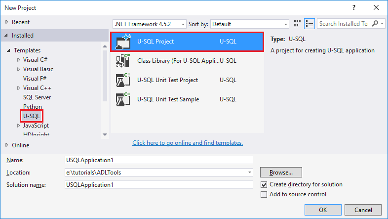
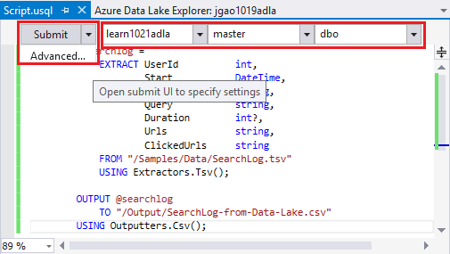
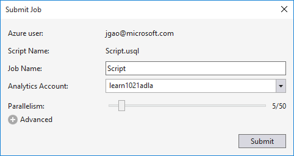
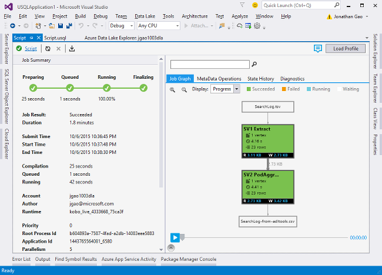
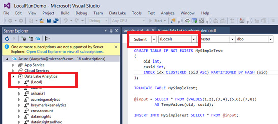
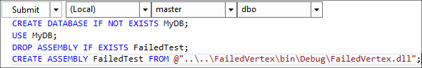

<properties
   pageTitle="Develop U-SQL scripts using Data Lake Tools for Visual Studio | Azure"
   description="Learn how to install Data Lake Tools for Visual Studio, how to develop and test U-SQL scripts. "
   services="data-lake-analytics"
   documentationCenter=""
   authors="edmacauley"
   manager="paulettm"
   editor="cgronlun"/>

<tags
   ms.service="data-lake-analytics"
   ms.devlang="na"
   ms.topic="get-started-article"
   ms.tgt_pltfrm="na"
   ms.workload="big-data"
   ms.date="05/16/2016"
   ms.author="edmaca"/>

# Tutorial: develop U-SQL scripts using Data Lake Tools for Visual Studio

[AZURE.INCLUDE [get-started-selector](../../includes/data-lake-analytics-selector-get-started.md)]

Learn how to install Data Lake Tools for Visual Studio, and use Data Lake Tools for Visual Studio to write and test U-SQL scripts.

U-SQL is a hyper-scalable, highly extensible language for preparing, transforming and analyzing all data in the data lake and beyond. For more information, see [U-SQL Reference] (http://go.microsoft.com/fwlink/p/?LinkId=691348).

###Prerequisites

- **Visual Studio 2015, Visual Studio 2013 update 4, or Visual Studio 2012. Enterprise (Ultimate/Premium), Professional, Community editions are supported; Express edition is not supported. Visual Studio "15" is currently not supported and we are working on that.**
- **Microsoft Azure SDK for .NET version 2.7.1 or above**.  Install it using the [Web platform installer](http://www.microsoft.com/web/downloads/platform.aspx).
- **[Data Lake Tools for Visual Studio](http://aka.ms/adltoolsvs)**.

    Once Data Lake Tools for Visual Studio is installed, you will see a "Data Lake Analytics" node in Server Explorer under the "Azure" node (you can open Server explorer by pressing Ctrl+Alt+S).

- **Go through the following two sections in [Get Started with Azure Data Lake Analytics using Azure Portal](data-lake-analytics-get-started-portal.md)**.

	- [Create an Azure Data Lake Analytics account](data-lake-analytics-get-started-portal.md#create_adl_analytics_account).
	- [Upload SearchLog.tsv to the default Data Lake Storage account](data-lake-analytics-get-started-portal.md#update-data-to-the-default-adl-storage-account).

    For your convenience, a PowerShell sample script for creating a Data Lake Analytic service and uploading source data file can be found in [Appx-A PowerShell sample for preparing the tutorial](data-lake-analytics-data-lake-tools-get-started.md#appx-a-powershell-sample-for-preparing-the-tutorial).

	The Data Lake Tools doesn't support creating Data Lake Analytics accounts. So you have to create it using the Azure Portal, Azure PowerShell, .NET SDK or Azure CLI. To run a Data Lake Analytics job, you will need some data. Even though the Data Lake Tools supports uploading data, you will use the portal to upload the sample data to make this tutorial easier to follow.

## Connect to Azure

**To connect to Data Lake Analytics**

1. Open Visual Studio.
2. From the **View** menu, click **Server Explorer** to open Server Explorer. Or press **[CTRL]+[ALT]+S**.
3. Right-click **Azure**, click "Connect to Microsoft Azure Subscription", and then follow instructions.
4. From **Server Explorer**, expand **Azure**, and then expand **Data Lake Analytics**. You shall see a list of your Data Lake Analytics accounts if there are any. You cannot create Data Lake Analytics accounts from Visual Studio. To create an account, see [Get Started with Azure Data Lake Analytics using Azure Portal](data-lake-analytics-get-started-portal.md) or [Get Started with Azure Data Lake Analytics using Azure PowerShell](data-lake-analytics-get-started-powershell.md).

## Upload source data files

You have uploaded some data in the **Prerequisite** section earlier in the tutorial.  

In case you want to use your own data, here are the procedures for uploading data from the Data Lake Tools.

**To upload files to the dependent Azure Data Lake account**

1. From **Server Explorer**, expand **Azure**, expand **Data Lake Analytics**, expand your Data Lake Analytics account, expand **Storage Accounts**. You shall see the default Data Lake Storage account, and the linked Data Lake Storage accounts, and the linked Azure Storage accounts. The default Data Lake account has a label "Default Storage Account".
2. Right-click the default Data Lake Storage account, and then click **Explorer**.  It opens the Data Lake Tools for Visual Studio Explorer pane.  In the left, it shows a tree view, the content view is on the right.
3. Browse to the folder where you want to upload files,
4. Right-click any blank space, and then click **Upload**.

	

**To upload files to a linked Azure Blob storage account**

1. From **Server Explorer**, expand **Azure**, expand **Data Lake Analytics**, expand your Data Lake Analytics account, expand **Storage Accounts**. You shall see the default Data Lake Storage account, and the linked Data Lake Storage accounts, and the linked Azure Storage accounts.
2. Expand the Azure Storage Account.
3. Right-click the container where you want to upload files, and then click **Explorer**. If you don't have a container, you must first create one using the Azure portal, Azure PowerShell, or other tools.
4. Browse to the folder where you want to upload files,
5. Right-click any blank space, and then click **Upload**.

## Develop U-SQL scripts

The Data Lake Analytics jobs are written in the U-SQL language. To learn more about U-SQL, see [Get started with U-SQL language](data-lake-analytics-u-sql-get-started.md) and [U-SQL language reference](http://go.microsoft.com/fwlink/?LinkId=691348).

**To create and submit a Data Lake Analytics job**

1. From the **File** menu, click **New**, and then click **Project**.
2. Select the **U-SQL Project** type.

	

3. Click **OK**. Visual studio creates a solution with a **Script.usql** file.
4. Enter the following script into **Script.usql**:

        @searchlog =
            EXTRACT UserId          int,
                    Start           DateTime,
                    Region          string,
                    Query           string,
                    Duration        int?,
                    Urls            string,
                    ClickedUrls     string
            FROM "/Samples/Data/SearchLog.tsv"
            USING Extractors.Tsv();

		@res =
		    SELECT *
		    FROM @searchlog;        

        OUTPUT @res   
            TO "/Output/SearchLog-from-Data-Lake.csv"
        USING Outputters.Csv();

	This U-SQL script reads the source data file using **Extractors.Tsv()**, and then creates a csv file using **Outputters.Csv()**.

    Don't modify the two paths unless you copied the source file into a different location.  Data Lake Analytics will create the output folder if it doesn't exist.

	It is simpler to use relative paths for files stored in default data Lake accounts. You can also use absolute paths.  For example

        adl://<Data LakeStorageAccountName>.azuredatalakestore.net:443/Samples/Data/SearchLog.tsv

    You must use absolute paths to access  files in  linked Storage accounts.  The syntax for files stored in linked Azure Storage account is:

        wasb://<BlobContainerName>@<StorageAccountName>.blob.core.windows.net/Samples/Data/SearchLog.tsv

    >[AZURE.NOTE] Azure Blob container with public blobs or public containers access permissions are not currently supported.  

	Notice the following features:

	- **IntelliSense**

		Name auto completed and the members will be shown for Rowset, Classes, Databases, Schemas and User Defined Objects (UDOs).

		IntelliSense for catalog entities (Databases, Schemas, Tables, UDOs etc.) is related to your compute account. You can check the current active compute account, database and schema in the top toolbar, and switch them through the dropdown lists.

    - **Expand * columns**

        Click the right of *, you shall see a blue underline beneath the *. Hover your mouse cursor on the blue underline, and then click the down arrow.
    	

        Click **Expand Columns**, the tool will replace the * with the column names.

	- **Auto Format**

		Users can change the indentation of the Scope script based on the code structure under Edit->Advanced:

		- Format Document (Ctrl+E, D) : Formats the whole document   
		- Format Selection (Ctrl+K, Ctrl+F): Formats the selection. If no selection has been made, this shortcut formats the line the cursor is in.  

		All the formatting rules are configurable under Tools->Options->Text Editor->SIP->Formatting.  
	- **Smart Indent**

		Data Lake Tools for Visual Studio is able to indent expressions automatically while you are writing scripts. This feature is disabled by default, users need to enable it through checking U-SQL->Options and Settings ->Switches->Enable Smart Indent.

	- **Go To Definition and Find All References**

		Right-clicking the name of a RowSet/parameter/column/UDO etc. and clicking Go To Definition (F12) allows you to navigate to its definition. By clicking Find All References (Shift+F12), will show all the references.

	- **Insert Azure Path**

		Rather than remembering Azure file path and type it manually when writing script, Data Lake Tools for Visual Studio provides an easy way: right click in the editor, click Insert Azure Path. Navigate to the file in the Azure Blob Browser dialog. Click **OK**. the file path will be inserted to your code.

5. Specify the Data Lake Analytics account, Database, and Schema. You can select **(local)** to run the script locally for the testing purpose. For more information, see [Run U-SQL locally](#run-u-sql-locally).

	

    For more information, see [Use U-SQL catalog](data-lake-analytics-use-u-sql-catalog.md).

5. From **Solution Explorer**, right click **Script.usql**, and then click **Build Script**. Verify the result in the Output pane.
6. From **Solution Explorer**, right click **Script.usql**, and then click **Submit Script**. Optionally, you can also click **Submit** from Script.usql pane.  See the previous screenshot.  Click the down arrow next to the Submit button to submit using the advance options:
7. Specify **Job Name**, verify the **Analytics Account**, and then click **Submit**. Submission results and job link are available in the Data Lake Tools for Visual Studio Results window when the submission is completed.

	

8. You must click the Refresh button to see the latest job status and refresh the screen. When the job successes, it will show you the **Job Graph**, **Meta Data Operations**, **State History**, **Diagnostics**:

	

	* Job Summary. Show the summary information of current job, e.g.: State, Progress, Execution Time, Runtime Name, Submitter etc.   
	* Job Details. Detailed information on this job is provided, including script, resource, Vertex Execution View.
	* Job Graph. Four graphs are provided to visualize the job’s information: Progress, Data Read, Data Written, Execution Time, Average Execution Time Per Node, Input Throughput, Output Throughput.
	* Metadata Operations. It shows all the metadata operations.
	* State History.
	* Diagnostics. Data Lake Tools for Visual Studio will diagnose job execution automatically. You will receive alerts when there are some errors or performance issues in their jobs. See Job Diagnostics (link TBD) part for more information.

**To check job state**

1. From Server Explorer, expand **Azure**, expand **Data Lake Analytics**, expand the Data Lake Analytics account name
2. Double-click **Jobs** to list the jobs.
2. Click a job to see the status.

**To see the job output**

1. From **Server Explorer**, expand **Azure**, expand **Data Lake Analytics**, expand your Data Lake Analytics account, expand **Storage Accounts**, right-click the default Data Lake Storage account, and then click **Explorer**.
2.  Double-click **output** to open the folder
3.  Double-click **SearchLog-From-adltools.csv**.

###Job Playback

Job playback enables you to watch job execution progress and visually detect out performance anomalies and bottlenecks. This feature can be used before the job completes execution (i.e. during the time the job is actively running) as well as after the execution has completed. Doing playback during job execution will allow the user to play back the progress up to the current time.

**To view job execution progress**  

1. Click **Load Profile** on the upper right corner. See the previous screen shot.
2. Click on the Play button on the bottom left corner to review the job execution progress.
3. During the playback, click **Pause** to stop it or directly drag the progress bar to specific positions.

###Heat Map

Data Lake Tools for Visual Studio provides user-selectable color-overlays on job view to indicate progress, data I/O, execution time, I/O throughput of each stage. Through this, users can figure out potential issues and distribution of job properties directly and intuitively. You can choose a data source to display from the drop-down list.  

## Run U-SQL locally

Using the U-SQL local run experience in Visual Studio, you can:

- Run U-SQL scripts locally, along with C# Assemblies.
- Debug C# assemblies locally.
- Create/delete/view local databases, assemblies, schemas, and tables in Server Explorer just as you can do for Azure Data Lake Analytics service.

You will see a *Local* account in Visual Studio, and the installer creates a *DataRoot* folder located *C:\LocalRunRoot*. The DataRoot folder will be used:

- Store  metadata including tables, DBs, TVFs, etc.
- For a certain script: if a relative path is referenced in input/output paths, we will look up the DataRoot (as well as the script’s path if the it’s input)
- The DataRoot folder will NOT be referenced if you are trying to register an assembly and use a relative path (see “Use assemblies when doing local run” part for more details)

The following video demonstrates the U-SQL local run feature:

>[AZURE.VIDEO usql-localrun]

### Known issues and limitations

- U-SQL Local Run does not support querying filesets locally. See [U-SQL filesets](https://msdn.microsoft.com/library/azure/mt621294.aspx). This will be resolved in the future.
- Slow performance due to low parallelism, because job plans are executed serially in a single process.
- Local run can't show job graphs in Visual Studio. This will be addressed in the future.
- Cannot create table/DB etc. in Server Explorer for the local account.
- When a relative path is referenced:

    - In script input (EXTRACT * FROM “/path/abc”) - both the DataRoot path and the script path will be searched.
    - In script output (OUTPUT TO “path/abc”): the DataRoot path will be used as the output folder.
    - In assembly registration (CREATE ASSEMBLY xyz FROM “/path/abc”): the script path will be searched, but not the DataRoot.
    - In registered TVF/View or other metadata entities: the DataRoot Path will be searched, but not the script path.

    For scripts ran on Data Lake serivce, the default storage account will be used as root folder and will be searched accordingly.

### Test U-SQL scripts locally
For instructions on developing U-SQL scripts, see [Develop U-SQL scripts](#develop-and-test-u-sql-scripts). To build and run U-SQL scripts locally, select **(Local)** in the cluster drop down list, and then click **Submit**. Please make sure you have the right data referenced - either refer to the absolute path or put the data under the DataRoot folder.

You can also right-click a script and then click **Run Local Plan** in the context menu, or press **CTRL+F5** to trigger local run.

### Use assemblies in local run

There are two ways to run the customized C# files:

- Write assemblies in the code behind file and the assemblies will be automatically registered and dropped after the script is done.
- Create a C# assembly project and register the output dll to the local account through a script like below. Please note that the path is relative to the script rather than the DataRoot folder.

### Debug scripts and C# assemblies locally

You can debug C# assemblies without submitting and registering it to the Azure Data Lake Analytics Service. You can set breakpoints in both the code behind file and in a referenced C# project.

**To debug local code in code behind file**
1.	Set breakpoints in the code behind file.
2.	Press **F5** to debug the script locally.

The following procedure only works in Visual Studio 2015. In older Visual Studio you may need to manually add the pdb files.

**To debug local code in a referenced C# project**
1.	Create a C# Assembly project, and build it to generate the output dll.
2.	Register the dll using a U-SQL statement:

        CREATE ASSEMBLY assemblyname FROM @"..\..\path\to\output\.dll";
3.	Set breakpoints in the C# code.
4.	Press **F5** to debug the script with referencing the C# dll locally.  

##See also

To get started with Data Lake Analytics using different tools, see:

- [Get started with Data Lake Analytics using Azure Portal](data-lake-analytics-get-started-portal.md)
- [Get started with Data Lake Analytics using Azure PowerShell](data-lake-analytics-get-started-powershell.md)
- [Get started with Data Lake Analytics using .NET SDK](data-lake-analytics-get-started-net-sdk.md)

To see more development topics:

- [Analyze weblogs using Data Lake Analytics](data-lake-analytics-analyze-weblogs.md)
- [Develop U-SQL scripts using Data Lake Tools for Visual Studio](data-lake-analytics-data-lake-tools-get-started.md)
- [Get started with Azure Data Lake Analytics U-SQL language](data-lake-analytics-u-sql-get-started.md)
- [Develop U-SQL user defined operators for Data Lake Analytics jobs](data-lake-analytics-u-sql-develop-user-defined-operators.md)

##Appx-A PowerShell sample for preparing the tutorial

The following PowerShell script prepares an Azure Data Lake Analytics account and the source data for you, So you can skip to [Develop U-SQL scripts](data-lake-analytics-data-lake-tools-get-started.md#develop-u-sql-scripts).

    #region - used for creating Azure service names
    $nameToken = "<Enter an alias>"
    $namePrefix = $nameToken.ToLower() + (Get-Date -Format "MMdd")
    #endregion

    #region - service names
    $resourceGroupName = $namePrefix + "rg"
    $dataLakeStoreName = $namePrefix + "adas"
    $dataLakeAnalyticsName = $namePrefix + "adla"
    $location = "East US 2"
    #endregion

    # Treat all errors as terminating
    $ErrorActionPreference = "Stop"

    #region - Connect to Azure subscription
    Write-Host "`nConnecting to your Azure subscription ..." -ForegroundColor Green
    try{Get-AzureRmContext}
    catch{Login-AzureRmAccount}
    #endregion

    #region - Create an Azure Data Lake Analytics service account
    Write-Host "Create a resource group ..." -ForegroundColor Green
    New-AzureRmResourceGroup `
        -Name  $resourceGroupName `
        -Location $location

    Write-Host "Create a Data Lake account ..."  -ForegroundColor Green
    New-AzureRmDataLakeStoreAccount `
        -ResourceGroupName $resourceGroupName `
        -Name $dataLakeStoreName `
        -Location $location

    Write-Host "Create a Data Lake Analytics account ..."  -ForegroundColor Green
    New-AzureRmDataLakeAnalyticsAccount `
        -Name $dataLakeAnalyticsName `
        -ResourceGroupName $resourceGroupName `
        -Location $location `
        -DefaultDataLake $dataLakeStoreName

    Write-Host "The newly created Data Lake Analytics account ..."  -ForegroundColor Green
    Get-AzureRmDataLakeAnalyticsAccount `
        -ResourceGroupName $resourceGroupName `
        -Name $dataLakeAnalyticsName  
    #endregion

    #region - prepare the source data
    Write-Host "Import the source data ..."  -ForegroundColor Green
    $localFolder = "C:\Tutorials\Downloads\" # A temp location for the file.
    $storageAccount = "adltutorials"  # Don't modify this value.
    $container = "adls-sample-data"  #Don't modify this value.

    # Create the temp location  
    New-Item -Path $localFolder -ItemType Directory -Force

    # Download the sample file from Azure Blob storage
    $context = New-AzureStorageContext -StorageAccountName $storageAccount -Anonymous
    $blobs = Azure\Get-AzureStorageBlob -Container $container -Context $context
    $blobs | Get-AzureStorageBlobContent -Context $context -Destination $localFolder

    # Upload the file to the default Data Lake Store account    
    Import-AzureRmDataLakeStoreItem -AccountName $dataLakeStoreName -Path $localFolder"SearchLog.tsv" -Destination "/Samples/Data/SearchLog.tsv"

    Write-Host "List the source data ..."  -ForegroundColor Green
    Get-AzureRmDataLakeStoreChildItem -Account $dataLakeStoreName -Path  "/Samples/Data/"
    #endregion
