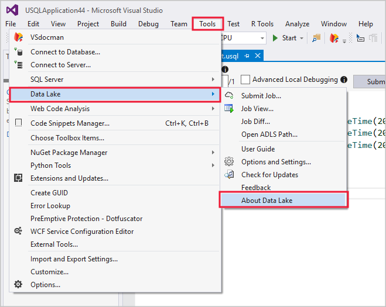

# Develop U-SQL scripts by using Data Lake Tools for Visual Studio
[!INCLUDE [get-started-selector](../../includes/data-lake-analytics-selector-get-started.md)]

Azure Data Lake and Stream Analytics Tools include functionality related to two Azure services, Azure Data Lake Analytics and Azure Stream Analytics. For more information on the Azure Stream Analytics scenarios, see [Azure Stream Analytics tools for Visual Studio](../stream-analytics/stream-analytics-tools-for-visual-studio-install.md).

This article describes how to use Visual Studio to create Azure Data Lake Analytics accounts, define jobs in [U-SQL](data-lake-analytics-u-sql-get-started.md), and submit jobs to the Data Lake Analytics service. For more
information about Data Lake Analytics, see [Azure Data Lake Analytics overview](data-lake-analytics-overview.md).

> [!IMPORTANT]
> Microsoft recommends you upgrade to Azure Data Lake Tools for Visual Studio version 2.3.3000.4 or later. The previous versions are no longer available for download and are now deprecated. 
> 
> **What do I need to do?**
> 
> 1. Check if you are using an earlier version than 2.3.3000.4 of Azure Data Lake Tools for Visual Studio. 
> 
>    
> 
> 2. If your version is an earlier version of 2.3.3000.4, update your Azure Data Lake Tools for Visual Studio by visiting the download center: 
>    - [For Visual Studio 2017](https://marketplace.visualstudio.com/items?itemName=ADLTools.AzureDataLakeandStreamAnalyticsTools)
>    - [For Visual Studio 2013 and 2015](https://www.microsoft.com/en-us/download/details.aspx?id=49504)


## Prerequisites

* **Visual Studio**: All editions except Express are supported.
    * Visual Studio 2017
    * Visual Studio 2015
    * Visual Studio 2013
* **Microsoft Azure SDK for .NET** version 2.7.1 or later.  Install it by using the [Web platform installer](https://www.microsoft.com/web/downloads/platform.aspx).
* A **Data Lake Analytics** account. To create an account, see [Get Started with Azure Data Lake Analytics using Azure portal](data-lake-analytics-get-started-portal.md).

## Install Azure Data Lake Tools for Visual Studio

This tutorial requires that Data Lake Tools for Visual Studio is installed. Follow the [installation instructions](data-lake-analytics-data-lake-tools-install.md).

## Connect to an Azure Data Lake Analytics account

1. Open Visual Studio.

2. Open Server Explorer by selecting **View** > **Server Explorer**.

3. Right-click **Azure**. Then select **Connect to Microsoft Azure Subscription** and follow the instructions.

4. In Server Explorer, select **Azure** > **Data Lake Analytics**. You see a list of your Data Lake Analytics accounts.

## Write your first U-SQL script

The following text is a simple U-SQL script. It defines a small dataset and writes that dataset to the default Data Lake Store as a file called `/data.csv`.

```
USE DATABASE master;
USE SCHEMA dbo;
@a  = 
    SELECT * FROM 
        (VALUES
            ("Contoso", 1500.0),
            ("Woodgrove", 2700.0)
        ) AS 
              D( customer, amount );
OUTPUT @a
    TO "/data.csv"
    USING Outputters.Csv();
```

## Submit a Data Lake Analytics job

1. Select **File** > **New** > **Project**.

2. Select the **U-SQL Project** type, and then click **OK**. Visual Studio creates a solution with a **Script.usql** file.

3. Paste the previous script into the **Script.usql** window.

4. In the upper-left corner of the **Script.usql** window, specify the Data Lake Analytics account.

    

5. In the upper-left corner of the **Script.usql** window, select **Submit**.

6. After the job submission, the **Job view** tab opens to show the job progress. To see the latest job status and refresh the screen, click **Refresh**.

    

   * **Job Summary** shows the summary of the job.   
   * **Job Graph** visualizes the progress of the job.
   * **MetaData Operations** shows all the actions that were taken on the U-SQL catalog.
   * **Data** shows all the inputs and outputs.
   * **State History** shows the timeline and state details.
   * **AU Analysis** shows how many AUs were used in the job and explore simulations of different AUs allocation strategies.
   * **Diagnostics** provides an advanced analysis for job execution and performance optimization.

## Check job status

1. In Server Explorer, select **Azure** > **Data Lake Analytics**.

2. Expand the Data Lake Analytics account name.

3. Double-click **Jobs**.

4. Select the job that you previously submitted.

## See the job output

1. In Server Explorer, browse to the job you submitted.

2. Click the **Data** tab.

3. In the **Job Outputs** tab, select the `"/data.csv"` file.

## Next steps

* [Run U-SQL scripts on your own workstation for testing and debugging](data-lake-analytics-data-lake-tools-local-run.md)
* [Debug C# code in U-SQL jobs using Azure Data Lake Tools for Visual Studio Code](data-lake-tools-for-vscode-local-run-and-debug.md)
* [Use the Azure Data Lake Tools for Visual Studio Code](data-lake-analytics-data-lake-tools-for-vscode.md)
