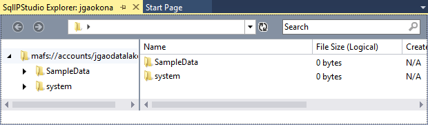

<properties 
   pageTitle="Develop U-SQL scripts using Data Lake Tools for Visual Studio | Azure" 
   description="Learn how to install Data Lake Tools for Visual Studio, how to develop and test U-SQL scripts. " 
   services="data-lake-analytics" 
   documentationCenter="" 
   authors="mumian" 
   manager="paulettm" 
   editor="cgronlun"/>
 
<tags
   ms.service="data-lake-analytics"
   ms.devlang="na"
   ms.topic="article"
   ms.tgt_pltfrm="na"
   ms.workload="big-data" 
   ms.date="10/27/2015"
   ms.author="jgao"/>

# Develop U-SQL scripts using Data Lake Tools for Visual Studio

[jgao: the screenshots needs to be updated after renaming from sqlip to u-sql]

Learn how to install Data Lake Tools for Visual Studio, and use Data Lake Tools for Visual Studio to write and test U-SQL scripts.

U-SQL is a hyper-scalable, highly extensible language for preparing, transforming and analyzing all data in the data lake and beyond. For more information, see [U-SQL Reference]().

**Prerequisites**

- Visual Studio 2015, Visual Studio 2013 update 4, or Visual Studio 2012 with Visual C++ Installed 
- Microsoft Azure SDK for .NET version 2.5 or above.  Install it using the [Web platform installer](http://www.microsoft.com/web/downloads/platform.aspx).
- Go through the following two sections in [Get Started with Azure Data Lake Analytics using Azure Preview Portal](data-lake-analytics-get-started-portal.md).

	- [Create an Azure Data Lake (ADL) Analytics account](data-lake-analytics-get-started-portal.md#create_adl_analytics_account).
	- [Upload SearchLog.tsv to the default ADL Storage account](data-lake-analytics-get-started-portal.md#update-data-to-the-default-adl-storage-account).

	The Data Lake Tools doesn't support creating ADL Analytics accounts.  So you have to create it using the Azure Preview Portal, Azure PowerShell, .NET SDK or Azure CLI. To run an ADL Analytics job, you will need some data. Even though the Data Lake Tools supports uploading data, you will use the portal to upload the sample data to make this tutorial easier to follow. 
	
## Install Data Lake Tools for Visual Studio

Before the product release, download the package from [https://microsoft.sharepoint.com/teams/ProjectKona/Documents/Microsoft.SqlIPStudio.zip](https://microsoft.sharepoint.com/teams/ProjectKona/Documents/Microsoft.SqlIPStudio.zip).
[jgao: The package date is 9/22/2015 when this article is written.]
 
Once Data Lake Tools for Visual Studio is installed, you will see a U-SQL menu in Visual Studio:

[jgao: the menu is still "SqlIP"]

## Connect to Azure

**To connect to ADL Analytics**

1. Open Visual Studio.
2. From the **U-SQL** menu, click **Options and Settings**.
4. Click **Sign In**, or **Change User** if someone has signed in, and follow the instructions to sign in.
5. Click **OK** to close the Options and Settings dialog.

**To browse your ADL Analytics accounts**

1. From Visual Studio, open **Server Explorer** by press **CTRL+ALT+S**.
2. From **Server Explorer**, expand **Azure**, and then expand **Data Lake Analytics**. You shall see a list of your ADL Analytics accounts if there are any. You cannot create Big Analystics accounts from the studio. To create an account, see [Get Started with Azure ADL Analytics using Azure Preview Portal](data-lake-analytics-get-started-portal.md) or [Get Started with Azure Data Lake Analytics using Azure PowerShell](knoa-get-started-powershell.md).

## Upload source data files

You have uploaded some data in the **Prerequisite** section earlier in the tutorial.  

In case you want to use your own data, here are the procedures for uploading data from the Data Lake Tools.

**To upload the file to the dependent Azure Data Lake account**

[jgao: no responses when click Explorer]

1. From **Server Explorer**, expand **Azure**, expand **Data Lake Analytics**, expand your ADL Analytics account, expand **Linked Storage**. You shall see the default ADL Storage account, and the link ADL Storage accounts, and the Blob containers of the linked Azure Storage accounts.
2. Right-click the default ADL Storage account, and then click **Explorer**.  It opens the Data Lake Tools for Visual Studio Explorer pane.  In the left, it shows a tree view, the content view is on the right.

2. Right-click any blank space in the content view, and then click **New Folder** to create a folder called **SampleData**.

	
3. Double-click **SampleData** to open its content in the content view.
4. Right-click any blank space in the content view, click **Upload**, click **As Text**. Follow the instruction to upload OlympicAthletes.tsv.

**To upload the file to a Azure Blob storage account**

[jgao: xiaoyong wants to copy the text here instead of using a link.]
See [Get started with HDInsight Tools for Visual Studio]().
 
## Develop and test U-SQL scripts 

**To create and submit an ADL Analytics job** 

1. From the **File** menu, click **New**, and then click **Project**.
2. Type or select the following:

	- **Templates**: SQL IP
	- **Template**: SQL Information Production Project
	- **Name**: MyFirstUSQLApp
	- **Location**: c:\tutorials\ADLTools

	

	[jgao: rename the .sip extension]
3. Click **OK**. Visual studio creates a solution with a Script.sip file.
4. Enter the following script into the Script.sip file:

        @searchlog =
            EXTRACT UserId          int,
                    Start           DateTime,
                    Region          string,
                    Query           string,
                    Duration        int?,
                    Urls            string,
                    ClickedUrls     string
            FROM "/Samples/Data/SearchLog.tsv"
            USING Extractors.Tsv();
        
        OUTPUT @searchlog   
            TO "/output/SearchLog-from-adltools.csv"
        USING Outputters.Csv();

	This U-SQL script reads the input data file using the Extractors.tsv(), and then creates a csv file using
    theOutputters.csv(). 
    
    Notice the path is a relative path. You can also use absolute path.  For example 
    
        adl://<ADLStorageAccountName>.azuredatalake.net/Samples/Data/SearchLog.tsv
        
    You must use absolute path to access the files in the linked Storage accounts.  The syntax for files stored in linked Azure Storage account is:
    
        wasb://<BlobContainerName>@<StorageAccountName>.blob.core.windows.net/Samples/Data/SearchLog.tsv

    >[AZURE.NOTE] Azure Blob container with public blobs or public containers access permissions are not currently supported.  

	Notice the following features:

	- **IntelliSense**
	 
		Name auto completed and the members will be shown for Rowset, Classes, Databases, Schemas and User Defined Objects (UDOs). 
		 
		IntelliSense for catalog entities (Databases, Schemas, Tables, UDOs etc.) is related to your compute account. You can check the current active compute account, database and schema in the top toolbar, and switch them through the dropdown lists. 
 
	- **Auto Format** 
	
		Users can change the indentation of the Scope script based on the code structure under Edit->Advanced:
  
		- Format Document (Ctrl+E, D) : Formats the whole document   
		- Format Selection (Ctrl+K, Ctrl+F): Formats the selection. If no selection has been made, this shortcut formats the line the cursor is in.  
		
		All the formatting rules are configurable under Tools->Options->Text Editor->SIP->Formatting.  
	- **Smart Indent**
	 
		Data Lake Tools for Visual Studio is able to indent expressions automatically while you are writing scripts. This feature is disabled by default, users need to enable it through checking U-SQL->Options and Settings ->Switches->Enable Smart Indent.

	- **Go To Definition and Find All References**
	
		Right-clicking the name of a RowSet/parameter/column/UDO etc. and clicking Go To Definition (F12) allows you to navigate to its definition. By clicking Find All References (Shift+F12), will show all the references. 

	- **Insert Azure Path**
		
		Rather than remembering Azure file path and type it manually when writing script, Data Lake Tools for Visual Studio provides an easy way: right click in the editor, click Insert Azure Path. Navigate to the file in the Azure Blob Browser dialog. Click OK button the file path will be inserted to your code. 

5. From **Solution Explorer**, right click **Script.sip**, and then click **Build Script**. Verify the result in the Output pane.
6. From **Solution Explorer**, right click **Script.sip**, and then click **Submit Script**.
7. Click **Submit**. Submission results and job link are available in the Data Lake Tools for Visual Studio Results window when the submission is completed.
8. You must click the Refresh button to see the latest job status and refresh the screen. When the job successes, it will show you the Stage connection view, script, state history, and diagnostic information:

	

	* Job Summary. Show the summary information of current job, e.g.: State, Progress, Execution Time, Runtime Name, Submitter etc.   
	* Job Details. Detailed information on this job is provided, including script, algebra, vertexdef, code, resources.
	* Job Graph. Four graphs are provided to visualize the job’s information:  Stage Connection View, Stage Table View, Stage Timing View and Vertex Run Time Stats by Stage View. Tabs are used to switch among them. You can also right click on stage node or row to navigate to other views. [jgao: I don't see four graphs.  is the information merged?]

	* Job script. 
	* Job state history. 
	* Job Diagnostics. Data Lake Tools for Visual Studio will diagnose job execution automatically. You will receive alerts when there are some errors or performance issues in their jobs. See Job Diagnostics (link TBD) part for more information. 
	
**To check job state**

1. From Server Explorer, expand **Azure**, expand **Data Lake Analytics**, expand the ADL Analytics account name, expand **Jobs**. You will see a list of the jobs.
2. Click a job to see the status

**To see the job output**

1. From **Server Explorer**, expand **Azure**, expand **Data Lake Analytics**, expand your ADL Analytics account, expand **Linked Storage**, right-click the dependent Azure Data Lake account, and then click **Explorer**. 
2.  Double-click **SampleData**.
3.  Double-click **OlympicAthletes_copy.tsv**.

###Job Playback 

Job playback enables you to watch job execution progress and visually detect out performance anomalies and bottlenecks. This feature can be used before the job completes execution (i.e. during the time the job is actively running) as well as after the execution has completed. Doing playback during job execution will allow the user to play back the progress up to the current time. 

**To view job execution progress**  

1. Click **Load Profile** on the upper right corner.  See the previous screen shot.
2. Click on the Play button on the bottom left corner to review the job execution progress. 
3. During the playback, click **Pause**  to stop it or directly drag the progress bar to specific positions. 

###Heat Map 

Data Lake Tools for Visual Studio provides user-selectable color-overlays on job view to indicate progress, data I/O, execution time, I/O throughput of each stage. Through this, users can figure out potential issues and distribution of job properties directly and intuitively. You can choose a data source to display from the drop-down list.  

[jgao: information to be provided by xiaoyong]

##See also

- [Get started with Data Lake Analytics using PowerShell](data-lake-analytics-get-started-powershell.md)
- [Get started with Data Lake Analytics using the Azure portal](data-lake-analytics-get-started-portal.md)
- [Define U-SQL user defined operators for Data Lake Analytics](data-lake-analytics-u-sql-develop-user-defined-operators.md)