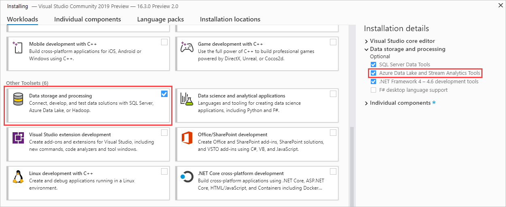
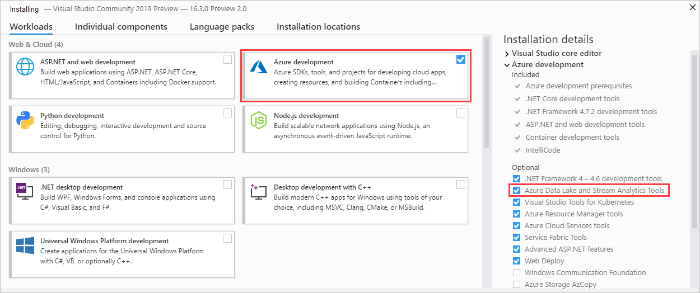

# Install Data Lake Tools for Visual Studio

[!INCLUDE [retirement-flag](includes/retirement-flag.md)]

Learn how to use Visual Studio to create Azure Data Lake Analytics accounts. You can define jobs in [U-SQL](data-lake-analytics-u-sql-get-started.md) and submit jobs to the Data Lake Analytics service. For more
information about Data Lake Analytics, see [Azure Data Lake Analytics overview](data-lake-analytics-overview.md).

## Prerequisites

* **Visual Studio**: All editions except Express are supported.

  * Visual Studio 2019
  * Visual Studio 2017
  * Visual Studio 2015
  * Visual Studio 2013

* **Microsoft Azure SDK for .NET** [version 2.7.1 or later](https://azure.microsoft.com/downloads/).
* A **Data Lake Analytics** account. To create an account, see [Get Started with Azure Data Lake Analytics using Azure portal](data-lake-analytics-get-started-portal.md).

## Install Azure Data Lake Tools for Visual Studio 2017 or Visual Studio 2019

Azure Data Lake Tools for Visual Studio is supported in Visual Studio 2017 15.3 or later. The tool is part of the **Data storage and processing** and **Azure development** workloads. Enable either one of these two workloads as part of your Visual Studio installation.

Enable the **Data storage and processing** workload as shown:

Enable the **Azure development** workload as shown:

## Install Azure Data Lake Tools for Visual Studio 2013 and 2015

Download and install [Microsoft Azure Data Lake and Stream Analytics Tools for Visual Studio ](https://aka.ms/adltoolsvs). After installation, Visual Studio has the following changes:

* The **Server Explorer** > **Azure** node contains a **Data Lake Analytics** node.
* The **Tools** menu has a **Data Lake** item.

## Next steps

* To log diagnostics information, see [Accessing diagnostics logs for Azure Data Lake Analytics](data-lake-analytics-diagnostic-logs.md).
* To see a more complex query, see [Analyze Website logs using Azure Data Lake Analytics](data-lake-analytics-analyze-weblogs.md).
* To use the vertex execution view, see [Use the Vertex Execution View in Data Lake Tools for Visual Studio](data-lake-analytics-data-lake-tools-use-vertex-execution-view.md).
