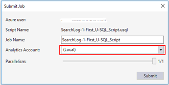

# Test and debug U-SQL jobs by using local run and the Azure Data Lake U-SQL SDK

You can use Azure Data Lake Tools for Visual Studio and the Azure Data Lake U-SQL SDK to run U-SQL jobs on your workstation, just as you can in the Azure Data Lake service. These two local-run features save you time in testing and debugging your U-SQL jobs.

## Understand the data-root folder and the file path

Both local run and the U-SQL SDK require a data-root folder. The data-root folder is a "local store" for the local compute account. It's equivalent to the Azure Data Lake Store account of a Data Lake Analytics account. Switching to a different data-root folder is just like switching to a different store account. If you want to access commonly shared data with different data-root folders, you must use absolute paths in your scripts. Or, create file system symbolic links (for example, **mklink** on NTFS) under the data-root folder to point to the shared data.

The data-root folder is used to:

- Store metadata, including databases, tables, table-valued functions (TVFs), and assemblies.
- Look up the input and output paths that are defined as relative paths in U-SQL. Using relative paths makes it easier to deploy your U-SQL projects to Azure.

You can use both a relative path and a local absolute path in U-SQL scripts. The relative path is relative to the specified data-root folder path. We recommend that you use "/" as the path separator to make your scripts compatible with the server side. Here are some examples of relative paths and their equivalent absolute paths. In these examples, C:\LocalRunDataRoot is the data-root folder.

|Relative path|Absolute path|
|-------------|-------------|
|/abc/def/input.csv |C:\LocalRunDataRoot\abc\def\input.csv|
|abc/def/input.csv  |C:\LocalRunDataRoot\abc\def\input.csv|
|D:/abc/def/input.csv |D:\abc\def\input.csv|

## Use local run from Visual Studio

Data Lake Tools for Visual Studio provides a U-SQL local-run experience in Visual Studio. By using this feature, you can:

- Run a U-SQL script locally, along with C# assemblies.
- Debug a C# assembly locally.
- Create, view, and delete U-SQL catalogs (local databases, assemblies, schemas, and tables) from Server Explorer. You can also find the local catalog also from Server Explorer.

    

The Data Lake Tools installer creates a C:\LocalRunRoot folder to be used as the default data-root folder. The default local-run parallelism is 1.

### To configure local run in Visual Studio

1. Open Visual Studio.
2. Open **Server Explorer**.
3. Expand **Azure** > **Data Lake Analytics**.
4. Click the **Data Lake** menu, and then click **Options and Settings**.
5. In the left tree, expand **Azure Data Lake**, and then expand **General**.

    

A Visual Studio U-SQL project is required for performing local run. This part is different from running U-SQL scripts from Azure.

### To run a U-SQL script locally
1. From Visual Studio, open your U-SQL project.   
2. Right-click a U-SQL script in Solution Explorer, and then click **Submit Script**.
3. Select **(Local)** as the Analytics account to run your script locally.
You can also click the **(Local)** account on the top of script window, and then click **Submit** (or use the Ctrl + F5 keyboard shortcut).

    

### Debug scripts and C# assemblies locally

You can debug C# assemblies without submitting and registering it to Azure Data Lake Analytics Service. You can set breakpoints in both the code behind file and in a referenced C# project.

#### To debug local code in code behind file

1. Set breakpoints in the code behind file.
2. Press F5 to debug the script locally.

> [!NOTE]
   > The following procedure only works in Visual Studio 2015. In older Visual Studio you may need to manually add the pdb files.  
   >
   >

#### To debug local code in a referenced C# project

1. Create a C# Assembly project, and build it to generate the output dll.
2. Register the dll using a U-SQL statement:

        CREATE ASSEMBLY assemblyname FROM @"..\..\path\to\output\.dll";
        
3. Set breakpoints in the C# code.
4. Press F5 to debug the script with referencing the C# dll locally.

## Use local run from the Data Lake U-SQL SDK

In addition to running U-SQL scripts locally by using Visual Studio, you can use the Azure Data Lake U-SQL SDK to run U-SQL scripts locally with command-line and programming interfaces. Through these, you can scale your U-SQL local test.

Learn more about [Azure Data Lake U-SQL SDK](data-lake-analytics-u-sql-sdk.md).

## Next steps

* To see a more complex query, see [Analyze website logs using Azure Data Lake Analytics](data-lake-analytics-analyze-weblogs.md).
* To view job details, see [Use Job Browser and Job View for Azure Data Lake Analytics jobs](data-lake-analytics-data-lake-tools-view-jobs.md).
* To use the vertex execution view, see [Use the Vertex Execution View in Data Lake Tools for Visual Studio](data-lake-analytics-data-lake-tools-use-vertex-execution-view.md).
