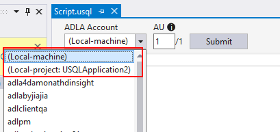
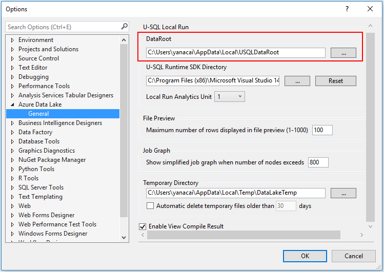

# Run U-SQL scripts on your local machine

[!INCLUDE [retirement-flag](includes/retirement-flag.md)]

When you develop U-SQL scripts, you can save time and expense by running the scripts locally. Azure Data Lake Tools for Visual Studio supports running U-SQL scripts on your local machine. 

## Basic concepts for local runs

The following chart shows the components for local run and how these components map to cloud run.

|Component|Local run|Cloud run|
|---------|---------|---------|
|Storage|Local data root folder|Default Azure Data Lake Store account|
|Compute|U-SQL local run engine|Azure Data Lake Analytics service|
|Run environment|Working directory on local machine|Azure Data Lake Analytics cluster|

The sections that follow provide more information about local run components.

### Local data root folders

A local data root folder is a **local store** for the local compute account. Any folder in the local file system on your local machine can be a local data root folder. It's the same as the default Azure Data Lake Store account of a Data Lake Analytics account. Switching to a different data root folder is just like switching to a different default store account. 

The data root folder is used as follows:
- Store metadata. Examples are databases, tables, table-valued functions, and assemblies.
- Look up the input and output paths that are defined as relative paths in U-SQL scripts. By using relative paths, it's easier to deploy your U-SQL scripts to Azure.

### U-SQL local run engines

A U-SQL local run engine is a **local compute account** for U-SQL jobs. Users can run U-SQL jobs locally through Azure Data Lake Tools for Visual Studio. Local runs are also supported through the Azure Data Lake U-SQL SDK command-line and programming interfaces. Learn more about the [Azure Data Lake U-SQL SDK](https://www.nuget.org/packages/Microsoft.Azure.DataLake.USQL.SDK/).

### Working directories

When you run a U-SQL script, a working directory folder is needed to cache compilation results, run logs, and perform other functions. In Azure Data Lake Tools for Visual Studio, the working directory is the U-SQL project’s working directory. It's located under `<U-SQL project root path>/bin/debug>`. The working directory is cleaned every time a new run is triggered.

## Local runs in Microsoft Visual Studio

Azure Data Lake Tools for Visual Studio have a built-in local run engine. The tools surface the engine as a local compute account. To run a U-SQL script locally, select the **Local-machine** or **Local-project** account in the script’s editor margin drop-down menu. Then select **Submit**.

 
 
## Local runs with a Local-machine account

A **Local-machine** account is a shared local compute account with a single local data root folder as the local store account. By default, the data root folder is located at **C:\Users\<username>\AppData\Local\USQLDataRoot**. It's also configurable through **Tools** > **Data Lake** > **Options and Settings**.

  
A U-SQL project is required for a local run. The U-SQL project’s working directory is used for the U-SQL local run working directory. Compilation results, run logs, and other job run-related files are generated and stored under the working directory folder during the local run. Every time you rerun the script, all the files in the working directory are cleaned and regenerated.

## Local runs with a Local-project account

A **Local-project** account is a project-isolated local compute account for each project with an isolated local data root folder. Every active U-SQL project that opens in Solution Explorer in Visual Studio has a corresponding `(Local-project: <project name>)` account. The accounts are listed in both Server Explorer in Visual Studio and the U-SQL script editor margin.  

The **Local-project** account provides a clean and isolated development environment. A **Local-machine** account has a shared local data root folder that stores metadata and input and output data for all local jobs. But a **Local-project** account creates a temporary local data root folder under a U-SQL project working directory every time a U-SQL script is run. This temporary data root folder is cleaned when a rebuild or rerun happens. 

A U-SQL project manages the isolated local run environment through a project reference and property. You can configure the input data sources for U-SQL scripts in both the project and the referenced database environments.

### Manage the input data source for a Local-project account 

A U-SQL project creates a local data root folder and sets up data for a **Local-project** account. A temporary data root folder is cleaned and recreated under the U-SQL project working directory every time a rebuild and local run happens. All data sources that are configured by the U-SQL project are copied to this temporary local data root folder before the local job runs. 

You can configure the root folder of your data sources. Right-click **U-SQL project** > **Property** > **Test Data Source**. When you run a U-SQL script on a **Local-project** account, all files and subfolders in the **Test Data Source** folder are copied to the temporary local data root folder. Files under subfolders are included. After a local job runs, output results can also be found under the temporary local data root folder in the project working directory. All this output is deleted and cleaned when the project gets rebuilt and cleaned. 

### Manage a referenced database environment for a **Local-project** account 

If a U-SQL query uses or queries with U-SQL database objects, you must make the database environments ready locally before you run the U-SQL script locally. For a **Local-project** account, U-SQL database dependencies can be managed by U-SQL project references. You can add U-SQL database project references to your U-SQL project. Before running U-SQL scripts on a **Local-project** account, all referenced databases are deployed to the temporary local data root folder. And for each run, the temporary data root folder is cleaned as a fresh isolated environment.

See this related article:
* Learn how to manage U-SQL database definitions and references in [U-SQL database projects](data-lake-analytics-data-lake-tools-develop-usql-database.md).

## The difference between **Local-machine** and **Local-project** accounts

A **Local-machine** account simulates an Azure Data Lake Analytics account on users’ local machines. It shares the same experience with an Azure Data Lake Analytics account. A **Local-project** account provides a user-friendly local development environment. This environment helps users deploy database references and input data before they run scripts locally. A **Local-machine** account provides a shared permanent environment that can be accessed through all projects. A **Local-project** account provides an isolated development environment for each project. It's refreshed for each run. A **Local-project** account offers a faster development experience by quickly applying new changes.

More differences between **Local-machine** and **Local-project** accounts are shown in the following table:

|Difference angle|Local-machine|Local-project|
|----------------|---------------|---------------|
|Local access|Can be accessed by all projects.|Only the corresponding project can access this account.|
|Local data root folder|A permanent local folder. Configured through **Tools** > **Data Lake** > **Options and Settings**.|A temporary folder created for each local run under the U-SQL project working directory. The folder gets cleaned when a rebuild or rerun happens.|
|Input data for a U-SQL script|The relative path under the permanent local data root folder.|Set through **U-SQL project property** > **Test Data Source**. All files and subfolders are copied to the temporary data root folder before a local run.|
|Output data for a U-SQL script|Relative path under the permanent local data root folder.|Output to the temporary data root folder. The results are cleaned when a rebuild or rerun happens.|
|Referenced database deployment|Referenced databases aren't deployed automatically when running against a **Local-machine** account. It's the same for submitting to an Azure Data Lake Analytics account.|Referenced databases are deployed to the **Local-project** account automatically before a local run. All database environments are cleaned and redeployed when a rebuild or rerun happens.|

## A local run with the U-SQL SDK

You can run U-SQL scripts locally in Visual Studio and also use the Azure Data Lake U-SQL SDK to run U-SQL scripts locally with command-line and programming interfaces. Through these interfaces, you can automate U-SQL local runs and tests.

Learn more about the [Azure Data Lake U-SQL SDK](data-lake-analytics-u-sql-sdk.md).

## Next steps

- [How to set up a CI/CD pipeline for Azure Data Lake Analytics](data-lake-analytics-cicd-overview.md).
- [How to test your Azure Data Lake Analytics code](data-lake-analytics-cicd-test.md).
