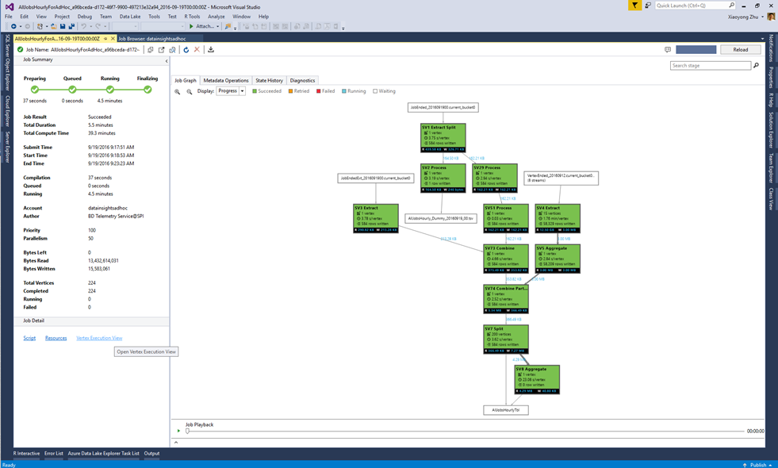
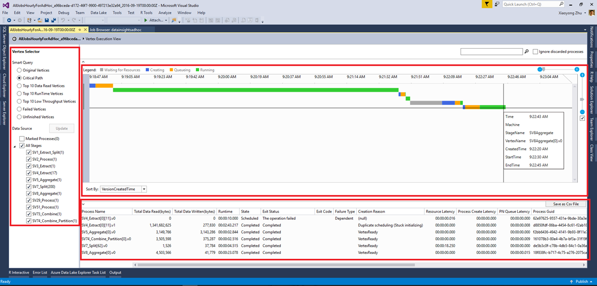
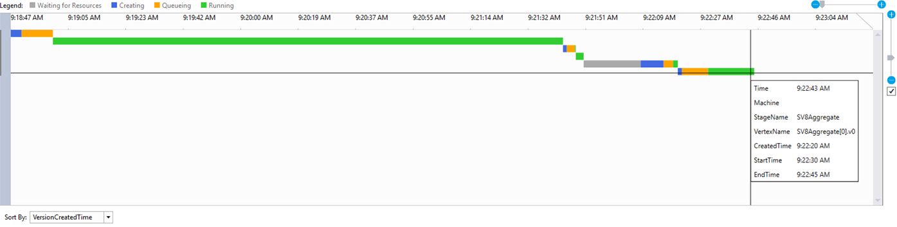
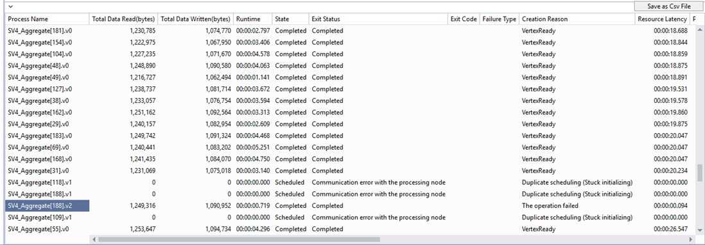

# Use the Vertex Execution View in Data Lake Tools for Visual Studio
Learn how to use the Vertex Execution View to exam Data Lake Analytics jobs.

## Open the Vertex Execution View
Open a U-SQL job in Data Lake Tools for Visual Studio. Click **Vertex Execution View** in the bottom left corner. You may be prompted to load profiles first and it can take some time depending on your network connectivity.

## Understand Vertex Execution View
The Vertex Execution View has three parts:

The **Vertex selector** on the left lets you select vertices by features (such as top 10 data read, or choose by stage). One of the most commonly-used filters is to see the **vertices on critical path**. The **Critical path** is the longest chain of vertices of a U-SQL job. Understanding the critical path is useful for optimizing your jobs by checking which vertex takes the longest time.
  

The top center pane shows the **running status of all the vertices**.
  

The bottom center pane shows information about each vertex:
* Process Name: The name of the vertex instance. It is composed of different parts in StageName|VertexName|VertexRunInstance. For example, the SV7_Split[62].v1 vertex stands for the second running instance (.v1, index starting from 0) of Vertex number 62 in Stage SV7_Split.
* Total Data Read/Written: The data was read/written by this vertex.
* State/Exit Status: The final status when the vertex is ended.
* Exit Code/Failure Type: The error when the vertex failed.
* Creation Reason: Why the vertex was created.
* Resource Latency/Process Latency/PN Queue Latency: the time taken for the vertex to wait for resources, to process data, and to stay in the queue.
* Process/Creator GUID: GUID for the current running vertex or its creator.
* Version: the N-th instance of the running vertex (the system might schedule new instances of a vertex for many reasons, for example failover, compute redundancy, etc.)
* Version Created Time.
* Process Create Start Time/Process Queued Time/Process Start Time/Process Complete Time: when the vertex process starts creation; when the vertex process starts to queue; when the certain vertex process starts; when the certain vertex is completed.

## Next steps
* To log diagnostics information, see [Accessing diagnostics logs for Azure Data Lake Analytics](data-lake-analytics-diagnostic-logs.md)
* To see a more complex query, see [Analyze Website logs using Azure Data Lake Analytics](data-lake-analytics-analyze-weblogs.md).
* To view job details, see [Use Job Browser and Job View for Azure Data lake Analytics jobs](data-lake-analytics-data-lake-tools-view-jobs.md)
