# Use Job Browser and Job View for Azure Data Lake Analytics

[!INCLUDE [retirement-flag](includes/retirement-flag.md)]

The Azure Data Lake Analytics service archives submitted jobs in a query store. In this article, you learn how to use Job Browser and Job View in Azure Data Lake Tools for Visual Studio to find the historical job information. 

By default, the Data Lake Analytics service archives the jobs for 30 days. The expiration period can be configured from the Azure portal by configuring the customized expiration policy. You will not be able to access the job information after expiration. 

## Prerequisites
See [Data Lake Tools for Visual Studio prerequisites](data-lake-analytics-data-lake-tools-get-started.md#prerequisites).

## Open the Job Browser
Access the Job Browser via **Server Explorer>Azure>Data Lake Analytics>Jobs** in Visual Studio.  Using the Job Browser, you can access the query store of a Data Lake Analytics account. Job Browser displays Query Store on the left, showing basic job information, and Job View on the right showing detailed job information.

## Job View
Job View shows the detailed information of a job. To open a job, you can double-click a job in the Job Browser, or open it from the Data Lake menu by clicking Job View. You should see a dialog populated with the job URL.

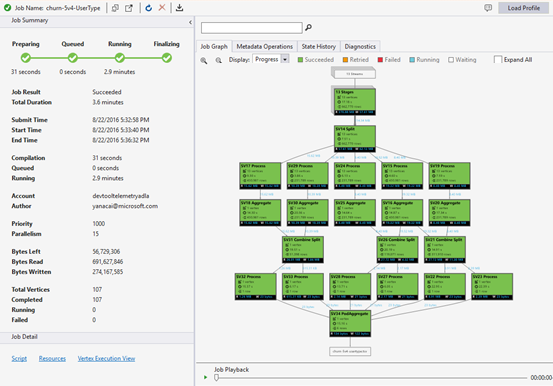

Job View contains:

* Job Summary
  
    Refresh the Job View to see the more recent information of running jobs.
  
  * Job Status (graph):
    
      Job Status outlines the job phases:
    
      
    
    * Preparing: Upload your script to the cloud, compiling and optimizing the script using the compile service.
    * Queued: Jobs are queued when they are waiting for enough resources, or the jobs exceed the max concurrent jobs per account limitation. The priority setting determines the sequence of queued jobs - the lower the number, the higher the priority.
    * Running: The job is actually running in your Data Lake Analytics account.
    * Finalizing: The job is completing (for example, finalizing the file).
      
      The job can fail in every phase. For example, compilation errors in the Preparing phase, timeout errors in the Queued phase, and execution errors in the Running phase, etc.
  * Basic Information
    
      The basic job information shows in the lower part of the Job Summary panel.
    
      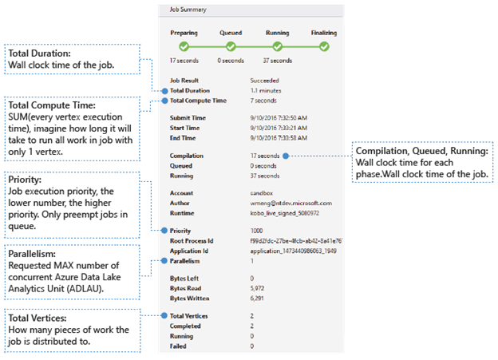
    
    * Job Result: Succeeded or failed. The job may fail in every phase.
    * Total Duration: Wall clock time (duration) between submitting time and ending time.
    * Total Compute Time: The sum of every vertex execution time, you can consider it as the time that the job is executed in only one vertex. Refer to Total Vertices to find more information about vertex.
    * Submit/Start/End Time: The time when the Data Lake Analytics service receives job submission/starts to run the job/ends the job successfully or not.
    * Compilation/Queued/Running: Wall clock time spent during the Preparing/Queued/Running phase.
    * Account: The Data Lake Analytics account used for running the job.
    * Author: The user who submitted the job, it can be a real person’s account or a system account.
    * Priority: The priority of the job. The lower the number, the higher the priority. It only affects the sequence of the jobs in the queue. Setting a higher priority does not preempt running jobs.
    * Parallelism: The requested maximum number of concurrent Azure Data Lake Analytics Units (ADLAUs), also known as vertices. Currently, one vertex is equal to one VM with two virtual core and six GB RAM, though this could be upgraded in future Data Lake Analytics updates.
    * Bytes Left: Bytes that need to be processed until the job completes.
    * Bytes read/written: Bytes that have been read/written since the job started running.
    * Total vertices: The job is broken up into many pieces of work, each piece of work is called a vertex. This value describes how many pieces of work the job consists of. You can consider a vertex as a basic process unit, also known as Azure Data Lake Analytics Unit (ADLAU), and vertices can be run in parallelism. 
    * Completed/Running/Failed: The count of completed/running/failed vertices. Vertices can fail due to both user code and system failures, but the system retries failed vertices automatically a few times. If the vertex is still failed after retrying, the whole job will fail.
* Job Graph
  
    A U-SQL script represents the logic of transforming input data to output data. The script is compiled and optimized to a physical execution plan at the Preparing phase. Job Graph is to show the physical execution plan.  The following diagram illustrates the process:
  
    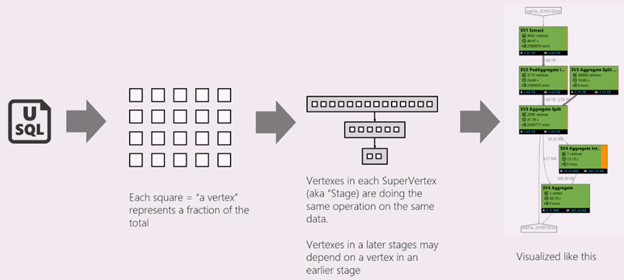
  
    A job is broken up into many pieces of work. Each piece of work is called a Vertex. The vertices are grouped as Super Vertex (also known as stage), and visualized as Job Graph. The green stage placards in the job graph show the stages.
  
    Every vertex in a stage is doing the same kind of work with different pieces of the same data. For example, if you have a file with one TB data, and there are hundreds of vertices reading from it, each of them is reading a chunk. Those vertices are grouped in the same stage and doing same work on different pieces of same input file.
  
  * Stage information
    
      In a particular stage, some numbers are shown in the placard.
    
      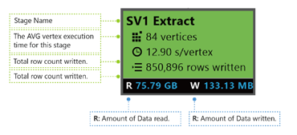
    
    * SV1 Extract: The name of a stage, named by a number and the operation method.
    * 84 vertices: The total count of vertices in this stage. The figure indicates how many pieces of work is divided in this stage.
    * 12.90 s/vertex: The average vertex execution time for this stage. This figure is calculated by SUM (every vertex execution time) / (total Vertex count). Which means if you could assign all the vertices executed in parallelism, the whole stage is completed in 12.90 s. It also means if all the work in this stage is done serially, the cost would be #vertices * AVG time.
    * 850,895 rows written: Total row count written in this stage.
    * R/W: Amount of data read/Written in this stage in bytes.
    * Colors: Colors are used in the stage to indicate different vertex status.
      
      * Green indicates the vertex is succeeded.
      * Orange indicates the vertex is retried. The retried vertex was failed but is retried automatically and successfully by the system, and the overall stage is completed successfully. If the vertex retried but still failed, the color turns red and the whole job failed.
      * Red indicates failed, which means a certain vertex had been retried a few times by the system but still failed. This scenario causes the whole job to fail.
      * Blue means a certain vertex is running.
      * White indicates the vertex is Waiting. The vertex may be waiting to be scheduled once an ADLAU becomes available, or it may be waiting for input since its input data might not be ready.
      
      You can find more details for the stage by hovering your mouse cursor by one state:
      
      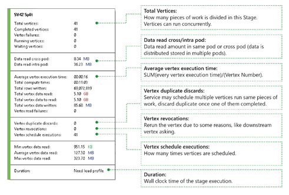
  * Vertices: Describes the vertices details, for example, how many vertices in total, how many vertices have been completed, are they failed or still running/waiting, etc.
  * Data read cross/intra pod: Files and data are stored in multiple pods in distributed file system. The value here describes how much data has been read in the same pod or cross pod.
  * Total compute time: The sum of every vertex execution time in the stage, you can consider it as the time it would take if all work in the stage is executed in only one vertex.
  * Data and rows written/read: Indicates how much data or rows have been read/written, or need to be read.
  * Vertex read failures: Describes how many vertices are failed while read data.
  * Vertex duplicate discards: If a vertex runs too slow, the system may schedule multiple vertices to run the same piece of work. Reductant vertices will be discarded once one of the vertices complete successfully. Vertex duplicate discards records the number of vertices that are discarded as duplications in the stage.
  * Vertex revocations: The vertex was succeeded, but get rerun later due to some reasons. For example, if downstream vertex loses intermediate input data, it will ask the upstream vertex to rerun.
  * Vertex schedule executions: The total time that the vertices have been scheduled.
  * Min/Average/Max Vertex data read: The minimum/average/maximum of every vertex read data.
  * Duration: The wall clock time a stage takes, you need to load profile to see this value.
  * Job Playback
    
      Data Lake Analytics runs jobs and archives the vertices running information of the jobs, such as when the vertices are started, stopped, failed and how they are retried, etc. All of the information is automatically logged in the query store and stored in its Job Profile. You can download the Job Profile through “Load Profile” in Job View, and you can view the Job Playback after downloading the Job Profile.
    
      Job Playback is an epitome visualization of what happened in the cluster. It helps you watch job execution progress and visually detect out performance anomalies and bottlenecks in a very short time (less than 30s usually).
  * Job Heat Map Display 
    
      Job Heat Map can be selected through the Display dropdown in Job Graph. 
    
      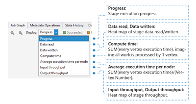
    
      It shows the I/O, time and throughput heat map of a job, through which you can find where the job spends most of the time, or whether your job is an I/O boundary job, and so on.
    
      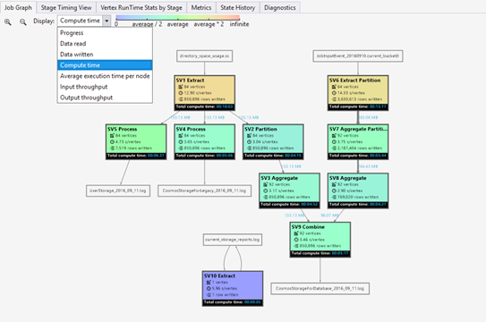
    
    * Progress: The job execution progress, see Information in stage information.
    * Data read/written: The heat map of total data read/written in each stage.
    * Compute time: The heat map of SUM (every vertex execution time), you can consider this as how long it would take if all work in the stage is executed with only 1 vertex.
    * Average execution time per node: The heat map of SUM (every vertex execution time) / (Vertex Number). Which means if you could assign all the vertices executed in parallelism, the whole stage will be done in this time frame.
    * Input/Output throughput: The heat map of input/output throughput of each stage, you can confirm if your job is an I/O bound job through this.
* Metadata Operations
  
    You can perform some metadata operations in your U-SQL script, such as create a database, drop a table, etc. These operations are shown in Metadata Operation after compilation. You may find assertions, create entities, drop entities here.
  
    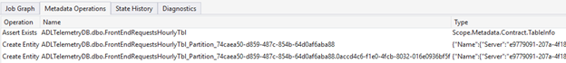
* State History
  
    The State History is also visualized in Job Summary, but you can get more details here. You can find the detailed information such as when the job is prepared, queued, started running, ended. Also you can find how many times the job has been compiled (the CcsAttempts: 1), when is the job dispatched to the cluster actually (the Detail: Dispatching job to cluster), etc.
  
    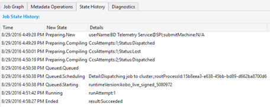
* Diagnostics
  
    The tool diagnoses job execution automatically. You will receive alerts when there are some errors or performance issues in your jobs. Please note that you need to download Profile to get full information here. 
  
    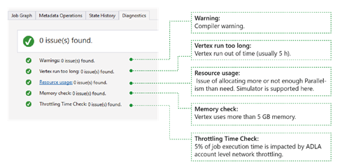
  
  * Warnings: An alert shows up here with compiler warning. You can click “x issue(s)” link to have more details once the alert appears.
  * Vertex run too long: If any vertex runs out of time (say 5 hours), issues will be found here.
  * Resource usage: If you allocated more or not enough Parallelism than need, issues will be found here. Also you can click Resource usage to see more details and perform what-if scenarios to find a better resource allocation (for more details, see this guide).
  * Memory check: If any vertex uses more than 5 GB of memory, issues will be found here. Job execution may get killed by system if it uses more memory than system limitation.

## Job Detail
Job Detail shows the detailed information of the job, including Script, Resources and Vertex Execution View.

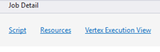

* Script
  
    The U-SQL script of the job is stored in the query store. You can view the original U-SQL script and re-submit it if needed.
* Resources
  
    You can find the job compilation outputs stored in the query store through Resources. For instance, you can find “algebra.xml” which is used to show the Job Graph, the assemblies you registered, etc. here.
* Vertex execution view
  
    It shows vertices execution details. The Job Profile archives every vertex execution log, such as total data read/written, runtime, state, etc. Through this view, you can get more details on how a job ran. For more information, see [Use the Vertex Execution View in Data Lake Tools for Visual Studio](data-lake-analytics-data-lake-tools-use-vertex-execution-view.md).

## Next Steps
* To log diagnostics information, see [Accessing diagnostics logs for Azure Data Lake Analytics](data-lake-analytics-diagnostic-logs.md)
* To see a more complex query, see [Analyze Website logs using Azure Data Lake Analytics](data-lake-analytics-analyze-weblogs.md).
* To use vertex execution view, see [Use the Vertex Execution View in Data Lake Tools for Visual Studio](data-lake-analytics-data-lake-tools-use-vertex-execution-view.md)

