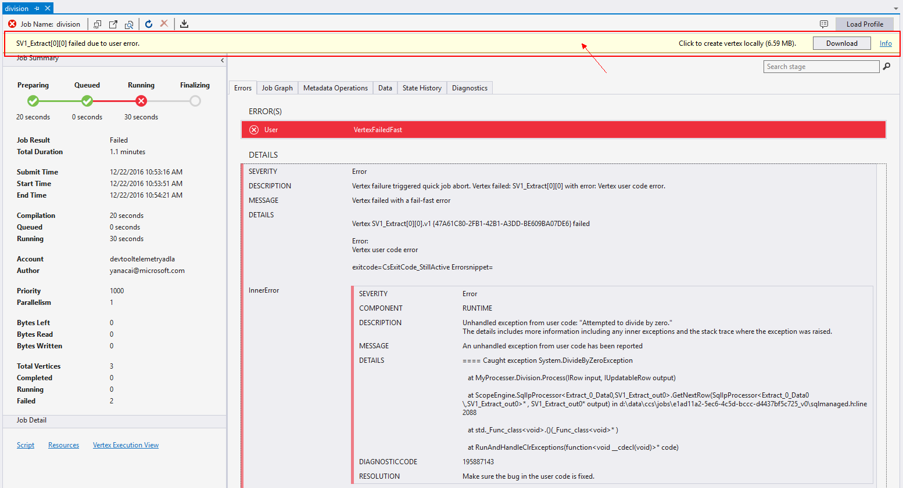

# Debug user defined C# code for failed U-SQL jobs

Learn how to debug failed U-SQL jobs with user defined code bugs using Azure Data Lake Tools for Visual Studio.

## Background

U-SQL provides extensibility model through C#, users can write user defined C# operators, like user defined extractor, reducer, etc. to achieve more extensibility (learn more about [U-SQL Programmability Guide](https://docs.microsoft.com/en-us/azure/data-lake-analytics/data-lake-analytics-u-sql-programmability-guide#user-defined-functions---udf)). No developers can code without making mistakes, but debugging in big data systems is hard since many systems only provide limited runtime debugging information like logs, etc. ADL Tools for Visual Studio offers a feature called **Failed Vertex Debug**, using which you can easily clone failed environment including intermediate input data and user code, etc. from cloud to your local machine to trace and debug failed jobs with the same runtime and exact input data in cloud.

For a video presentation of this feature, see [Debug your custom code in Azure Data Lake Analytics](https://mix.office.com/watch/1bt17ibztohcb).

> [!NOTE]
> Visual Studio may hang or crash if you don’t have the following two windows upgrades: [Microsoft Visual C++ 2015 Redistributable Update 2](https://www.microsoft.com/download/details.aspx?id=51682), 
> [Universal C Runtime for Windows](https://www.microsoft.com/download/details.aspx?id=50410&wa=wsignin1.0).
> 
> 

## Prerequisites
* Have gone through the [Get started](data-lake-analytics-data-lake-tools-get-started.md) article.

## Video tutorial

The following video demonstrates **Failed Vertex Debug** in ADL Tools for Visual Studio.

> [!VIDEO https://mix.office.com/watch/1bt17ibztohcb]
>
>

## Download failed vertex to local

When you open a failed job in ADL Tools for Visual Studio, you will get an alert. The detailed error info will be shown in the error tab and the yellow alert bar on the top of the window.

1. Click **Download** to download all the required resources and input streams. Click **Retry** if the download failed. 
2. Click **Open** after the download is completed to create a local debug project. A new Visual Studio instance with a debugging solution will be created. 
3. Debugging steps are little different between failed jobs with code behind and assembly.

- debug failed job with code behind
- debug failed job with assembly

## Debug failed job with code behind

In the automatically generated debugging project, you can just use Visual Studio based debugging experience (watch, variables, etc.) to troubleshoot the problem.

1. Just press **F5**, the code behind code will run automatically untill it is stopped by an exception.
2. Double click 
After clicking **Open**, a local debug project will be automatically generated and opened. Steps are a little different with code behind and assembly code debugging.

**To download vertex and create a debug solution**

1. Open a failed U-SQL job in Visual Studio.
2. Click **Download** to download all the required resources and input streams. Click **Retry** if the download failed.
3. Click **Open** after the download is completed to create a local debug project. A new Visual Studio solution called **VertexDebug** with an empty project called **LocalVertexHost** will be created.

If user defined operators are used in U-SQL code behind (Script.usql.cs), you must create a Class Library C# project with the user defined operators code, and include the project in the VertexDebug Solution.

If you have registered .dll assemblies to your Data Lake Analytics database, you must add the source code of the assemblies to the VertexDebug Solution.

If you created a separate C# class library for your U-SQL code and registered .dll assemblies to your Data Lake Analytics database, you need to add the source C# project of the assemblies to the VertexDebug Solution.

In some rare cases, you use user defined operators in U-SQL code behind (Script.usql.cs) file in the original solution. If you want to make it work, you need to create a C# library containing the source code and change the assembly name to the one registered in the cluster. You can get the assembly name registered in the cluster by checking the script that got running in the cluster. You can do so by opening the U-SQL job and click “script” in the job panel. 

**To configure the solution**

1. From Solution explorer, right-click the C# project you just created, and then click **Properties**.
2. Set the Output path as LocalVertexHost project working directory path. You can get LocalVertexHost project Working Directory path through LocalVertexHost properties.
3. Build your C# project in order to put the .pdb file into the LocalVertexHost project Working Directory, or you can copy the .pdb file to this folder manually.
4. In **Exception Settings**, check Common Language Runtime Exceptions:

## Debug the job
After you have created a debug solution by downloading the vertex and have configured the environment, you can start debugging your U-SQL code.

1. From Solution Explorer, right-click the **LocalVertexHost** project you just created, point to **Debug**, and then click **Start new instance**. The LocalVertexHost must be set as the Startup project. You may see the following message for the first time which you can ignore. It can take up to one minute to get to the debug screen.
   
   
2. Use Visual Studio based debugging experience (watch, variables, etc.) to troubleshoot the problem. 
3. After you have identified an issue, fix the code, and then rebuild the C# project before testing it again until all the problems are resolved. After the debug has been completed successfully, the output window showing the following message 
   
     The Program ‘LocalVertexHost.exe’ has exited with code 0 (0x0).

## Resubmit the job
After you have completed debugging your U-SQL code, you can resubmit the failed job.

1. Register new .dll assemblies to your ADLA database.
   
   1. From Server Explorer/Cloud Explorer in Data Lake Visual Studio Tool, expand the **Databases** node 
   2. Right-click Assemblies to Register assemblies. 
   3. Register your new .dll assemblies to the ADLA database.
2. Or copy your C# code to script.usql.cs--C# code behind file.
3. Resubmit your job.

## Next Steps
* [Tutorial: Get started with Azure Data Lake Analytics U-SQL language](data-lake-analytics-u-sql-get-started.md)
* [Tutorial: develop U-SQL scripts using Data Lake Tools for Visual Studio](data-lake-analytics-data-lake-tools-get-started.md)
* [Develop U-SQL User defined operators for Azure Data Lake Analytics jobs](data-lake-analytics-u-sql-develop-user-defined-operators.md)

