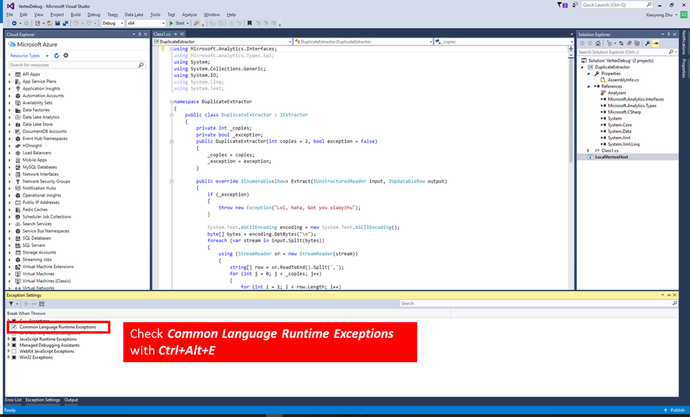
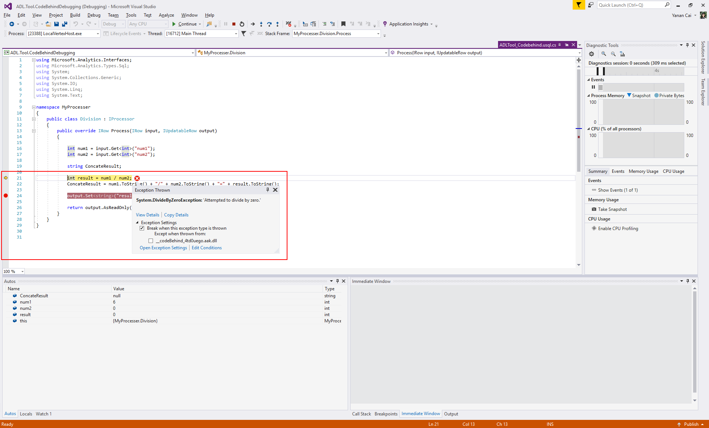
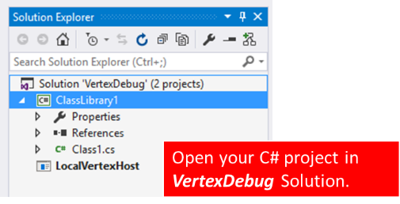
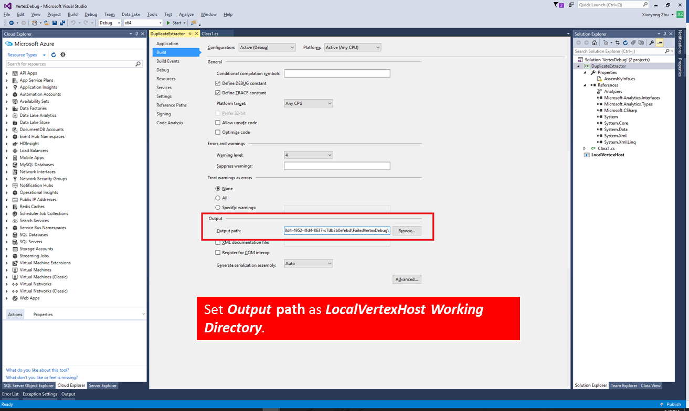
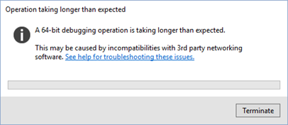
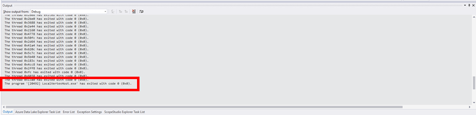
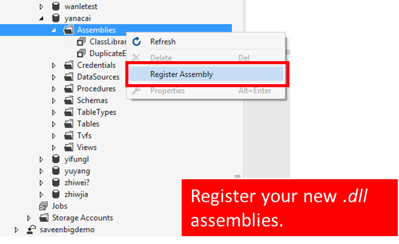

# Debug user defined C# code for failed U-SQL jobs

Learn how to debug U-SQL jobs failed with user defined code bugs using Azure Data Lake Tools for Visual Studio.

## Background

U-SQL provides extensibility model through C#, users can write user defined C# code, like user defined extractor, reducer, etc., to achieve more extensibility (learn more about [U-SQL User Defined Code](https://docs.microsoft.com/en-us/azure/data-lake-analytics/data-lake-analytics-u-sql-programmability-guide#user-defined-functions---udf)). However, no developers can code without making mistakes, and debugging in big data systems is hard since many systems only provide limited runtime debugging information like logs, etc. 

ADL Tools for Visual Studio offers a feature called **Failed Vertex Debug**, using which you can easily clone failed environment (including intermediate input data and user code, etc.) from cloud to your local machine to trace and debug failed jobs with the same runtime and exact input data in cloud.

The following video demonstrates **Failed Vertex Debug** in ADL Tools for Visual Studio.

> [!VIDEO https://e0d1.wpc.azureedge.net/80E0D1/OfficeMixProdMediaBlobStorage/asset-d3aeab42-6149-4ecc-b044-aa624901ab32/b0fc0373c8f94f1bb8cd39da1310adb8.mp4?sv=2012-02-12&sr=c&si=a91fad76-cfdd-4513-9668-483de39e739c&sig=K%2FR%2FdnIi9S6P%2FBlB3iLAEV5pYu6OJFBDlQy%2FQtZ7E7M%3D&se=2116-07-19T09:27:30Z&rscd=attachment%3B%20filename%3DDebugyourcustomcodeinUSQLADLA.mp4]
>
>

> [!NOTE]
> Visual Studio may hang or crash if you don’t have the following two windows upgrades: [Microsoft Visual C++ 2015 Redistributable Update 2](https://www.microsoft.com/download/details.aspx?id=51682), 
> [Universal C Runtime for Windows](https://www.microsoft.com/download/details.aspx?id=50410&wa=wsignin1.0).
> 
> 

## Prerequisites
* Have gone through the [Get started](data-lake-analytics-data-lake-tools-get-started.md) article.

## Download failed vertex to local

When opening a failed job in ADL Tools for Visual Studio, you will get an alert. The detailed error messages will be shown in error tab and the yellow alert bar on the top of the window.

1. Click **Download** to download all the required resources and input streams. Click **Retry** if the download failed. 

2. Click **Open** after the download completed to generate local debugging environment. A new Visual Studio instance with a debugging solution will be created and opened automatically. 

3. Debugging steps are little different between failed jobs with code behind and assemblies.

    - [Debug job failed with code behind](#debug-job-failed-with-code-behind)
    - [Debug job failed with assemblies](#debug-job-failed-with-assemblies)

## Debug job failed with code behind

If you wrote user defined code in code behind file (usually named as "Script.usql.cs" in U-SQL project) and then the U-SQL job failed, the source code will be imported automatically to the generated debugging solution, you can just use Visual Studio based debugging experience (watch, variables, etc.) to troubleshoot the problem. 

Before debugging, make sure you checked **Common Language Runtime Exceptions** in Exception Settings window (**Ctrl + Alt + E**).

1. Press **F5**, the code behind code will run automatically untill it is stopped by an exception.

2. Open **ADLTool_Codebehind.usql.cs** in project, set breakpoints then press F5 to debug code step by step.

    

## Debug job failed with assemblies

If you use registered assemblies in U-SQL script, the system can't get the source code automatically, you need to do some configurations before debugging user defined code, that is, you must add the source code of assemblies to the automatically generated solution.

### Configure the solution

1. Right click **Solution 'VertexDebug'** > **Add** > **Existing Project...** to find the assemblies' source code and add the project to the debugging solution.

    

2. Right click **LocalVertexHost** > **Properties** in solution, copy **Working Directory** path.

3. Right Click **assembly source code project** > **Properties**, select **Build** tab at left, paste the path copied in 2 to **Output** > **Output path**.  

    

4. Press **Ctrl + Alt + E**, check **Common Language Runtime Exceptions** in Exception Settings window.

### Start debug

1. Right click **assembly source code project** > **Rebuild** to output pdb files to LocalVertexHost working directory.

2. Press **F5**, the project will run automatically untill it is stopped by an exception. You may see the following message for the first time which you can ignore. It can take up to one minute to get to the debug screen.

    

3. Open you source code and set breakpoints, then press **F5** to debug code step by step.

You can also use other Visual Studio based debugging experiences (watch, variables, etc.) to debug the problem. 

**Note that** you need to rebuild the assembly source code project every time you modify the code to bring the new pdb files into effect.

After the debug has been completed successfully, the output window shows the following massage:

    The Program ‘LocalVertexHost.exe’ has exited with code 0 (0x0).

## Resubmit the job
After you have completed debugging, you can resubmit the failed job.

1. Register new .dll assemblies to your ADLA database.

    1. From Server Explorer/Cloud Explorer, expand **ADLA account** > **Databases** node.
    2. Right-click **Assemblies** to Register assemblies. 
    3. Register your new .dll assemblies to the ADLA database.
    
2. Or copy your C# code back to script.usql.cs--C# code behind file.
3. Resubmit your job.

## Next Steps

* [U-SQL programmability guide](data-lake-analytics-u-sql-programmability-guide.md)
* [Develop U-SQL User defined operators for Azure Data Lake Analytics jobs](data-lake-analytics-u-sql-develop-user-defined-operators.md)
* [Tutorial: Get started with Azure Data Lake Analytics U-SQL language](data-lake-analytics-u-sql-get-started.md)
* [Tutorial: develop U-SQL scripts using Data Lake Tools for Visual Studio](data-lake-analytics-data-lake-tools-get-started.md)

