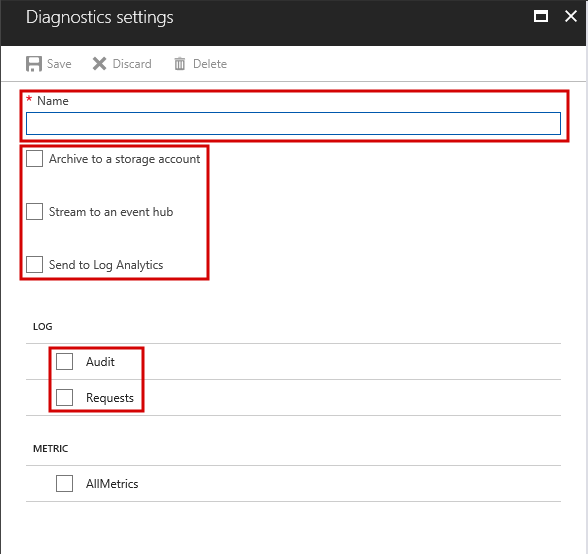
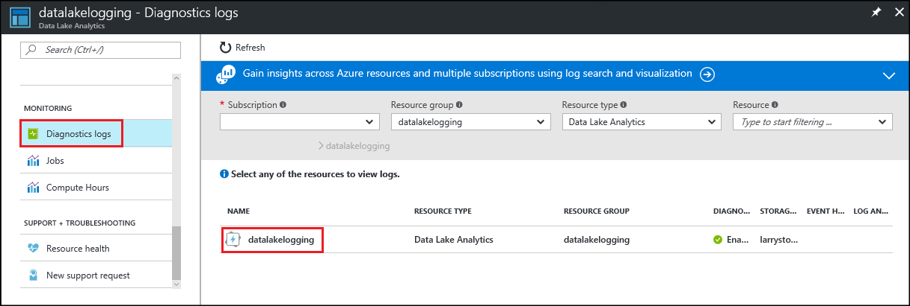

<properties 
   pageTitle="Viewing diagnostic logs for Azure Data Lake Analytics | Microsoft Azure" 
   description="Understand how to setup and access diagnostic logs for Azure Data Lake analytics " 
   services="data-lake-analytics" 
   documentationCenter="" 
   authors="Blackmist" 
   manager="paulettm" 
   editor="cgronlun"/>
 
<tags
   ms.service="data-lake-analytics"
   ms.devlang="na"
   ms.topic="article"
   ms.tgt_pltfrm="na"
   ms.workload="big-data" 
   ms.date="07/29/2016"
   ms.author="larryfr"/>

# Accessing diagnostic logs for Azure Data Lake Analytics

Learn about how to enable diagnostic logging for your Data Lake Analytics account and how to view the logs collected for your account.

Organizations can enable diagnostic logging for their Azure Data Lake Analytics account to collect data access audit trails that provides information such as list of users accessing the data, how frequently the data is accessed, how much data is stored in the account, etc.

## Prerequisites

- **An Azure subscription**. See [Get Azure free trial](https://azure.microsoft.com/pricing/free-trial/).
- **Enable your Azure subscription** for Data Lake Analytics Public Preview. See [instructions](data-lake-analytics-get-started-portal.md#signup).
- **Azure Data Lake Analytics account**. Follow the instructions at [Get started with Azure Data Lake Analytics using the Azure Portal](data-lake-analytics-get-started-portal.md).

## Enable diagnostic logging for your Data Lake Analytics account

1. Sign on to the new [Azure Portal](https://portal.azure.com).

2. Open your Data Lake Analytics account, and from your Data Lake Analytics account blade, click **Settings**, and then click **Diagnostic Settings**.

3. In the **Diagnostic** blade, make the following changes to configure diagnostic logging.

	

	* Set **Status** to **On** to enable diagnostic logging.
	* You can choose to store/process the data in two different ways.
		* Select the option to **Export to Event Hub** to stream log data to an Azure Event Hub. Most likely you will use this option if you have a downstream processing pipeline to analyze incoming logs at real time. If you select this option, you must provide the details for the Azure Event Hub you want to use.
		* Select the option to **Export to Storage Account** to store logs to an Azure Storage account. You use this option if you want to archive the data that will be batch-processed at a later date. If you select this option you must provide an Azure Storage account to save the logs to.
	* Specify whether you want to get audit logs or request logs or both.
	* Specify the number of days for which the data must be retained.
	* Click **Save**.

Once you have enabled diagnostic settings, you can watch the logs in the **Diagnostic Logs** tab.

## View diagnostic logs for your Data Lake Analytics account

There are two ways to view the log data for your Data Lake Analytics account.

* From the Data Lake Analytics account settings view
* From the Azure Storage account where the data is stored

### Using the Data Lake Analytics Settings view

1. From your Data Lake Analytics account **Settings** blade, click **Diagnostic Logs**.

	 

2. In the **Diagnostic Logs** blade, you should see the logs categorized by **Audit Logs** and **Request Logs**.
	* Request logs capture every API request made on the Data Lake Analytics account.
	* Audit Logs are similar to request Logs but provide a much more detailed breakdown of the operations being performed on the Data Lake Analytics account. For example, a single upload API call in request logs might result in multiple "Append" operations in the audit logs.

3. Click the **Download** link against each log entry to download the logs.

### From the Azure Storage account that contains log data

1. Open the Azure Storage account blade associated with Data Lake Analytics for logging, and then click Blobs. The **Blob service** blade lists two containers.

	

	* The container **insights-logs-audit** contains the audit logs.
	* The container **insights-logs-requests** contains the request logs.

2. Within these containers, the logs are stored under the following structure.

        resourceId=/
          SUBSCRIPTIONS/
            <<SUBSCRIPTION_ID>>/
              RESOURCEGROUPS/
                <<RESOURCE_GRP_NAME>>/
                  PROVIDERS/
                    MICROSOFT.DATALAKEANALYTICS/
                      ACCOUNTS/
                        <DATA_LAKE_ANALYTICS_NAME>>/
                          y=####/
                            m=##/
                              d=##/
                                h=##/
                                  m=00/
                                    PT1H.json
    
    > [AZURE.NOTE] The `##` entries in the path will contain the year, month, day, and hour in which the log was created. Data Lake Analytics creates one file every hour, so `m=` will always be set to `00`.

	As an example, the complete path to an audit log could be:
    
        https://adllogs.blob.core.windows.net/insights-logs-audit/resourceId=/SUBSCRIPTIONS/<sub-id>/RESOURCEGROUPS/myresourcegroup/PROVIDERS/MICROSOFT.DATALAKEANALYTICS/ACCOUNTS/mydatalakeanalytics/y=2016/m=07/d=18/h=04/m=00/PT1H.json

	Similary, the complete path to a request log could be:
    
        https://adllogs.blob.core.windows.net/insights-logs-requests/resourceId=/SUBSCRIPTIONS/<sub-id>/RESOURCEGROUPS/myresourcegroup/PROVIDERS/MICROSOFT.DATALAKEANALYTICS/ACCOUNTS/mydatalakeanalytics/y=2016/m=07/d=18/h=14/m=00/PT1H.json

## Understand the structure of the log data

The audit and request logs are in a JSON format. In this section, we look at the structure of JSON for request and audit logs.

### Request logs

Here's a sample entry in the JSON-formatted request log. Each blob has one root object called **records** that contains an array of log objects.

	{
	"records": 
	  [		
		. . . .
		,
		{
			 "time": "2016-07-07T21:02:53.456Z",
			 "resourceId": "/SUBSCRIPTIONS/<subscription_id>/RESOURCEGROUPS/<resource_group_name>/PROVIDERS/MICROSOFT.DATALAKEANALYTICS/ACCOUNTS/<data_lake_analytics_account_name>",
			 "category": "Requests",
			 "operationName": "GetAggregatedJobHistory",
			 "resultType": "200",
			 "callerIpAddress": "::ffff:1.1.1.1",
			 "correlationId": "4a11c709-05f5-417c-a98d-6e81b3e29c58",
			 "identity": "1808bd5f-62af-45f4-89d8-03c5e81bac30",
			 "properties": {
                 "HttpMethod":"POST",
                 "Path":"/JobAggregatedHistory",
                 "RequestContentLength":122,
                 "ClientRequestId":"3b7adbd9-3519-4f28-a61c-bd89506163b8",
                 "StartTime":"2016-07-07T21:02:52.472Z",
                 "EndTime":"2016-07-07T21:02:53.456Z"
                 }
		}
		,
		. . . .
	  ]
	}

#### Request log schema

| Name            | Type   | Description                                                                    |
|-----------------|--------|--------------------------------------------------------------------------------|
| time            | String | The timestamp (in UTC) of the log                                              |
| resourceId      | String | The ID of the resource that operation took place on                            |
| category        | String | The log category. For example, **Requests**.                                   |
| operationName   | String | Name of the operation that is logged. For example, GetAggregatedJobHistory.              |
| resultType      | String | The status of the operation, For example, 200.                                 |
| callerIpAddress | String | The IP address of the client making the request                                |
| correlationId   | String | The id of the log that can used to group together a set of related log entries |
| identity        | Object | The identity that generated the log                                            |
| properties      | JSON   | See below for details                                                          |

#### Request log properties schema

| Name                 | Type   | Description                                               |
|----------------------|--------|-----------------------------------------------------------|
| HttpMethod           | String | The HTTP Method used for the operation. For example, GET. |
| Path                 | String | The path the operation was performed on                   |
| RequestContentLength | int    | The content length of the HTTP request                    |
| ClientRequestId      | String | The Id that uniquely identifies this request              |
| StartTime            | String | The time at which the server received the request         |
| EndTime              | String | The time at which the server sent a response              |

### Audit logs

Here's a sample entry in the JSON-formatted audit log. Each blob has one root object called **records** that contains an array of log objects

	{
	"records": 
	  [		
		. . . .
		,
		{
			 "time": "2016-07-28T19:15:16.245Z",
			 "resourceId": "/SUBSCRIPTIONS/<subscription_id>/RESOURCEGROUPS/<resource_group_name>/PROVIDERS/MICROSOFT.DATALAKEANALYTICS/ACCOUNTS/<data_lake_ANALYTICS_account_name>",
			 "category": "Audit",
			 "operationName": "JobSubmitted",
			 "identity": "user@somewhere.com",
			 "properties": {
                 "JobId":"D74B928F-5194-4E6C-971F-C27026C290E6",
                 "JobName": "New Job", 
                 "JobRuntimeName": "default",
                 "SubmitTime": "7/28/2016 7:14:57 PM"
                 }
		}
		,
		. . . .
	  ]
	}

#### Audit log schema

| Name            | Type   | Description                                                                    |
|-----------------|--------|--------------------------------------------------------------------------------|
| time            | String | The timestamp (in UTC) of the log                                              |
| resourceId      | String | The ID of the resource that operation took place on                            |
| category        | String | The log category. For example, **Audit**.                                      |
| operationName   | String | Name of the operation that is logged. For example, JobSubmitted.              |
| identity      | String | The user that requested the operation. For example, susan@contoso.com.                                 |
| properties      | JSON   | See below for details                                                          |

#### Audit log properties schema

| Name       | Type   | Description                              |
|------------|--------|------------------------------------------|
| JobId | String | The ID assigned to the job  |
| JobName | String | The name that was provided for the job |
| JobRunTime | String | The runtime used to process the job |
| SubmitTime | String | The time (in UTC) that the job was submitted |

## Samples to process the log data

Azure Data Lake Analytics provides a sample on how to process and analyze the log data. You can find the sample at [https://github.com/Azure/AzureDataLake/tree/master/Samples/AzureDiagnosticsSample](https://github.com/Azure/AzureDataLake/tree/master/Samples/AzureDiagnosticsSample). 

## See also

- [Overview of Azure Data Lake Analytics](data-lake-analytics-overview.md)

