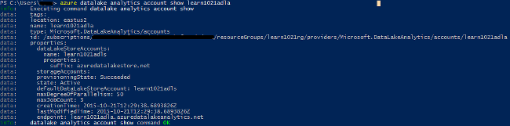

<properties 
   pageTitle="Get started with Azure Data Lake Analytics using Azure Command-line Interface | Microsoft Azure" 
   description="Learn how to use the Azure Command-line Interface to create a Data Lake Store account, create a Data Lake Analytics job using U-SQL, and submit the job. " 
   services="data-lake-analytics" 
   documentationCenter="" 
   authors="edmacauley" 
   manager="paulettm" 
   editor="cgronlun"/>
 
<tags
   ms.service="data-lake-analytics"
   ms.devlang="na"
   ms.topic="hero-article"
   ms.tgt_pltfrm="na"
   ms.workload="big-data" 
   ms.date="05/16/2016"
   ms.author="edmaca"/>

# Tutorial: get started with Azure Data Lake Analytics using Azure Command-line Interface (CLI)

[AZURE.INCLUDE [get-started-selector](../../includes/data-lake-analytics-selector-get-started.md)]

Learn how to use Azure CLI to create Azure Data Lake Analytics accounts, define Data Lake Analytics
jobs in [U-SQL](data-lake-analytics-u-sql-get-started.md), and submit jobs to Data Lake Analytics accounts. For more 
information about Data Lake Analytics, see [Azure Data Lake Analytics overview](data-lake-analytics-overview.md).

In this tutorial, you will develop a job that reads a tab separated values (TSV) file and converts it into a comma 
separated values (CSV) file. To go through the same tutorial using other supported tools, click the tabs on the top of this section.

[AZURE.INCLUDE [basic-process-include](../../includes/data-lake-analytics-basic-process.md)]

##Prerequisites

Before you begin this tutorial, you must have the following:

- **An Azure subscription**. See [Get Azure free trial](https://azure.microsoft.com/pricing/free-trial/).
- **Azure CLI**. See [Install and configure Azure CLI](../xplat-cli-install.md).
	- Download and install the **pre-release** [Azure CLI tools](https://github.com/MicrosoftBigData/AzureDataLake/releases) in order to complete this demo.
- **Authentication**, using the following command:

		azure login
	For more information on authenticating using a work or school account, see [Connect to an Azure subscription from the Azure CLI](../xplat-cli-connect.md).
- **Switch to the Azure Resource Manager mode**, using the following command:

		azure config mode arm
		
## Create Data Lake Analytics account

You must have a Data Lake Analytics account before you can run any jobs. To create a Data Lake Analytics account, you must specify the following:

- **Azure Resource Group**: A Data Lake Analytics account must be created within a Azure Resource group. [Azure Resource Manager](../resource-group-overview.md) enables you to work with the resources in your application as a group. You can deploy, update or delete all of the resources for your application in a single, coordinated operation.  

	To enumerate the resource groups in your subscription:
    
    	azure group list 
    
	To create a new resource group:

		azure group create -n "<Resource Group Name>" -l "<Azure Location>"

- **Data Lake Analytics account name**
- **Location**: one of the Azure data centers that supports Data Lake Analytics.
- **Default Data Lake account**: each Data Lake Analytics account has a default Data Lake account.

	To list the existing Data Lake account:
	
		azure datalake store account list

	To create a new Data Lake account:

		azure datalake store account create "<Data Lake Store Account Name>" "<Azure Location>" "<Resource Group Name>"

	> [AZURE.NOTE] The Data Lake account name must only contain lowercase letters and numbers.

**To create a Data Lake Analytics account**

		azure datalake analytics account create "<Data Lake Analytics Account Name>" "<Azure Location>" "<Resource Group Name>" "<Default Data Lake Account Name>"

		azure datalake analytics account list
		azure datalake analytics account show "<Data Lake Analytics Account Name>"			

> [AZURE.NOTE] The Data Lake Analytics account name must only contain lowercase letters and numbers.

## Upload data to Data Lake Store

In this tutorial, you will process some search logs.  The search log can be stored in either Data Lake store or Azure Blob storage. 

The Azure Portal provides a user interface for copying some sample data files to the default Data Lake account, which include a search log file. See [Prepare source data](data-lake-analytics-get-started-portal.md#prepare-source-data) to upload the data to the default Data Lake Store account.

To upload files using cli, use the following command:

  	azure datalake store filesystem import "<Data Lake Store Account Name>" "<Path>" "<Destination>"
  	azure datalake store filesystem list "<Data Lake Store Account Name>" "<Path>"

Data Lake Analytics can also access Azure Blob storage.  For uploading data to Azure Blob storage, see [Using the Azure CLI with Azure Storage](../storage/storage-azure-cli.md).

## Submit Data Lake Analytics jobs

The Data Lake Analytics jobs are written in the U-SQL language. To learn more about U-SQL, see [Get started with U-SQL language](data-lake-analytics-u-sql-get-started.md) and [U-SQL language reference](http://go.microsoft.com/fwlink/?LinkId=691348).

**To create a Data Lake Analytics job script**

- Create a text file with following U-SQL script, and save the text file to your workstation:

        @searchlog =
            EXTRACT UserId          int,
                    Start           DateTime,
                    Region          string,
                    Query           string,
                    Duration        int?,
                    Urls            string,
                    ClickedUrls     string
            FROM "/Samples/Data/SearchLog.tsv"
            USING Extractors.Tsv();
        
        OUTPUT @searchlog   
            TO "/Output/SearchLog-from-Data-Lake.csv"
        USING Outputters.Csv();

	This U-SQL script reads the source data file using **Extractors.Tsv()**, and then creates a csv file using **Outputters.Csv()**. 
    
    Don't modify the two paths unless you copy the source file into a different location.  Data Lake Analytics will create the output folder if it doesn't exist.
	
	It is simpler to use relative paths for files stored in default data Lake accounts. You can also use absolute paths.  For example 
    
        adl://<Data LakeStorageAccountName>.azuredatalakestore.net:443/Samples/Data/SearchLog.tsv
        
    You must use absolute paths to access files in linked Storage accounts.  The syntax for files stored in linked Azure Storage account is:
    
        wasb://<BlobContainerName>@<StorageAccountName>.blob.core.windows.net/Samples/Data/SearchLog.tsv

    >[AZURE.NOTE] Azure Blob container with public blobs or public containers access permissions are not currently supported.      

	
**To submit the job**

	azure datalake analytics job create  "<Data Lake Analytics Account Name>" "<Job Name>" "<Script>"
    
    
The following commands can be used to list jobs, get job details, and cancel jobs:

  	azure datalake analytics job cancel "<Data Lake Analytics Account Name>" "<Job Id>"
  	azure datalake analytics job list "<Data Lake Analytics Account Name>"
	azure datalake analytics job show "<Data Lake Analytics Account Name>" "<Job Id>"

After the job is completed, you can use the following cmdlets to list the file, and download the file:
	
    azure datalake store filesystem list "<Data Lake Store Account Name>" "/Output"
	azure datalake store filesystem export "<Data Lake Store Account Name>" "/Output/SearchLog-from-Data-Lake.csv" "<Destination>"
	azure datalake store filesystem read "<Data Lake Store Account Name>" "/Output/SearchLog-from-Data-Lake.csv" <Length> <Offset>

## See also

- To see the same tutorial using other tools, click the tab selectors on the top of the page.
- To see a more complex query, see [Analyze Website logs using Azure Data Lake Analytics](data-lake-analytics-analyze-weblogs.md).
- To get started developing U-SQL applications, see [Develop U-SQL scripts using Data Lake Tools for Visual Studio](data-lake-analytics-data-lake-tools-get-started.md).
- To learn U-SQL, see [Get started with Azure Data Lake Analytics U-SQL language](data-lake-analytics-u-sql-get-started.md).
- For management tasks, see [Manage Azure Data Lake Analytics using Azure Portal](data-lake-analytics-manage-use-portal.md).
- To get an overview of Data Lake Analytics, see [Azure Data Lake Analytics overview](data-lake-analytics-overview.md).

