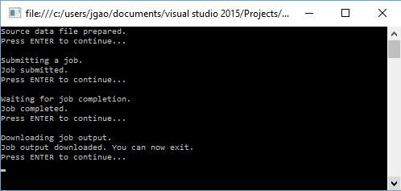

# Get started with Azure Data Lake Analytics using .NET SDK
[!INCLUDE [get-started-selector](../../includes/data-lake-analytics-selector-get-started.md)]

Learn how to use the Azure .NET SDK to submit jobs written in [U-SQL](data-lake-analytics-u-sql-get-started.md) to Data Lake Analytics. For more information about Data Lake Analytics, see [Azure Data Lake Analytics overview](data-lake-analytics-overview.md).

In this tutorial, you will develop a C# console application to submit a U-SQL job that reads a tab separated values (TSV) file and converts it into a comma  separated values (CSV) file. 

## Prerequisites

* **Visual Studio 2015, Visual Studio 2013 update 4, or Visual Studio 2012 with Visual C++ Installed**.
* **Microsoft Azure SDK for .NET version 2.5 or above**.  Install it using the [Web platform installer](http://www.microsoft.com/web/downloads/platform.aspx).
* **An Azure Data Lake Analytics account**. 

## Create a C# console application

A sample search log can be found in a public Azure Blob container. In the application, you will download the file to your workstation, and then upload the file to the default Data Lake Store account of your Data Lake Analytics account.

**To create a U-SQL script**

Create a **SampleUSQLScript.usql** text file with the following U-SQL script, and place the file in the `C:\temp\` path.  The path is hardcoded in the .NET application that you create in the next procedure.  

    @searchlog =
        EXTRACT UserId          int,
                Start           DateTime,
                Region          string,
                Query           string,
                Duration        int?,
                Urls            string,
                ClickedUrls     string
        FROM "/Samples/Data/SearchLog.tsv"
        USING Extractors.Tsv();

    OUTPUT @searchlog   
        TO "/Output/SearchLog-from-Data-Lake.csv"
    USING Outputters.Csv();

This U-SQL script reads the source data file using `Extractors.Tsv()`, and then creates a csv file using `Outputters.Csv()`. 

In the C# program, you need to prepare the `/Samples/Data/SearchLog.tsv` file, and the `/Output/` folder.    

**To create an application**

1. Open Visual Studio.
2. Create a C# console application.
3. Open NuGet Package Management console, and run the following commands:
   
        Install-Package Microsoft.Azure.Management.DataLake.Analytics -Pre
        Install-Package Microsoft.Azure.Management.DataLake.Store -Pre
        Install-Package Microsoft.Rest.ClientRuntime.Azure.Authentication -Pre
        Install-Package WindowsAzure.Storage
4. In Program.cs, paste the following code:
   
        using System;
        using System.IO;
        using System.Collections.Generic;
        using System.Threading;
        using Microsoft.Rest;
        using Microsoft.Rest.Azure.Authentication;
        using Microsoft.Azure.Management.DataLake.Store;
        using Microsoft.Azure.Management.DataLake.Analytics;
        using Microsoft.Azure.Management.DataLake.Analytics.Models;
        using Microsoft.WindowsAzure.Storage.Blob;
   
        namespace SdkSample
        {
          class Program
          {
            private const string SUBSCRIPTIONID = "<Enter Your Azure Subscription ID>";
            private const string CLIENTID = "1950a258-227b-4e31-a9cf-717495945fc2";
            private const string DOMAINNAME = "common"; // Replace this string with the user's Azure Active Directory tenant ID or domain name, if needed.
   
            private static string _adlaAccountName = "<Enter an Existing Data Lake Analytics Account Name>";
            private static string _adlsAccountName = "<Enter the default Data Lake Store Account Name>";
   
            private static DataLakeAnalyticsAccountManagementClient _adlaClient;
            private static DataLakeStoreFileSystemManagementClient _adlsFileSystemClient;
            private static DataLakeAnalyticsJobManagementClient _adlaJobClient;
   
            private static void Main(string[] args)
            {
                string localFolderPath = @"c:\temp\";
   
                // Connect to Azure
                var creds = AuthenticateAzure(DOMAINNAME, CLIENTID);
   
                SetupClients(creds, SUBSCRIPTIONID);
   
                // Transfer the source file from a public Azure Blob container to Data Lake Store.
                CloudBlockBlob blob = new CloudBlockBlob(new Uri("https://adltutorials.blob.core.windows.net/adls-sample-data/SearchLog.tsv"));
                blob.DownloadToFile(localFolderPath + "SearchLog.tsv", FileMode.Create); // from WASB
                UploadFile(localFolderPath + "SearchLog.tsv", "/Samples/Data/SearchLog.tsv"); // to ADLS
                WaitForNewline("Source data file prepared.", "Submitting a job.");

                // Submit the job
                Guid jobId = SubmitJobByPath(localFolderPath + "SampleUSQLScript.txt", "My First ADLA Job");
                WaitForNewline("Job submitted.", "Waiting for job completion.");

                // Wait for job completion
                WaitForJob(jobId);
                WaitForNewline("Job completed.", "Downloading job output.");

                // Download job output
                DownloadFile(@"/Output/SearchLog-from-Data-Lake.csv", localFolderPath + "SearchLog-from-Data-Lake.csv");

                  WaitForNewline("Job output downloaded. You can now exit.");
            }

            public static ServiceClientCredentials AuthenticateAzure(
                string domainName,
                string nativeClientAppCLIENTID)
            {
                // User login via interactive popup
                SynchronizationContext.SetSynchronizationContext(new SynchronizationContext());
                // Use the client ID of an existing AAD "Native Client" application.
                var activeDirectoryClientSettings = ActiveDirectoryClientSettings.UsePromptOnly(nativeClientAppCLIENTID, new Uri("urn:ietf:wg:oauth:2.0:oob"));
                return UserTokenProvider.LoginWithPromptAsync(domainName, activeDirectoryClientSettings).Result;
            }

            public static void SetupClients(ServiceClientCredentials tokenCreds, string subscriptionId)
            {
                _adlaClient = new DataLakeAnalyticsAccountManagementClient(tokenCreds);
                _adlaClient.SubscriptionId = subscriptionId;

                _adlaJobClient = new DataLakeAnalyticsJobManagementClient(tokenCreds);

                _adlsFileSystemClient = new DataLakeStoreFileSystemManagementClient(tokenCreds);
            }

            public static void UploadFile(string srcFilePath, string destFilePath, bool force = true)
            {
                _adlsFileSystemClient.FileSystem.UploadFile(_adlsAccountName, srcFilePath, destFilePath, overwrite = force);
            }

            public static void DownloadFile(string srcPath, string destPath)
            {
                var stream = _adlsFileSystemClient.FileSystem.Open(_adlsAccountName, srcPath);
                var fileStream = new FileStream(destPath, FileMode.Create);

                stream.CopyTo(fileStream);
                fileStream.Close();
                stream.Close();
            }

            // Helper function to show status and wait for user input
            public static void WaitForNewline(string reason, string nextAction = "")
            {
                Console.WriteLine(reason + "\r\nPress ENTER to continue...");

                Console.ReadLine();

                if (!String.IsNullOrWhiteSpace(nextAction))
                    Console.WriteLine(nextAction);
            }

            // List all Data Lake Analytics accounts within the subscription
            public static List<DataLakeAnalyticsAccount> ListADLAAccounts()
            {
                var response = _adlaClient.Account.List();
                var accounts = new List<DataLakeAnalyticsAccount>(response);

                while (response.NextPageLink != null)
                {
                    response = _adlaClient.Account.ListNext(response.NextPageLink);
                    accounts.AddRange(response);
                }

                Console.WriteLine("You have %i Data Lake Analytics account(s).", accounts.Count);
                for (int i = 0; i < accounts.Count; i++)
                {
                    Console.WriteLine(accounts[i].Name);
                }

                return accounts;
            }

            public static Guid SubmitJobByPath(string scriptPath, string jobName)
            {
                var script = File.ReadAllText(scriptPath);

                var jobId = Guid.NewGuid();
                var properties = new USqlJobProperties(script);
                var parameters = new JobInformation(jobName, JobType.USql, properties, priority: 1, degreeOfParallelism: 1, jobId: jobId);
                var jobInfo = _adlaJobClient.Job.Create(_adlaAccountName, jobId, parameters);

                return jobId;
            }

            public static JobResult WaitForJob(Guid jobId)
            {
                var jobInfo = _adlaJobClient.Job.Get(_adlaAccountName, jobId);
                while (jobInfo.State != JobState.Ended)
                {
                    jobInfo = _adlaJobClient.Job.Get(_adlaAccountName, jobId);
                }
                return jobInfo.Result.Value;
            }
          }
        }

5. Press **F5** to run the application. The output is like:
   
    
6. Check the output file.  The default path and file name is c:\Temp\SearchLog-from-Data-Lake.csv.

## See also
* To see the same tutorial using other tools, click the tab selectors on the top of the page.
* To see a more complex query, see [Analyze Website logs using Azure Data Lake Analytics](data-lake-analytics-analyze-weblogs.md).
* To get started developing U-SQL applications, see [Develop U-SQL scripts using Data Lake Tools for Visual Studio](data-lake-analytics-data-lake-tools-get-started.md).
* To learn U-SQL, see [Get started with Azure Data Lake Analytics U-SQL language](data-lake-analytics-u-sql-get-started.md), and [U-SQL language reference](http://go.microsoft.com/fwlink/?LinkId=691348).
* For management tasks, see [Manage Azure Data Lake Analytics using Azure portal](data-lake-analytics-manage-use-portal.md).
* To get an overview of Data Lake Analytics, see [Azure Data Lake Analytics overview](data-lake-analytics-overview.md).

