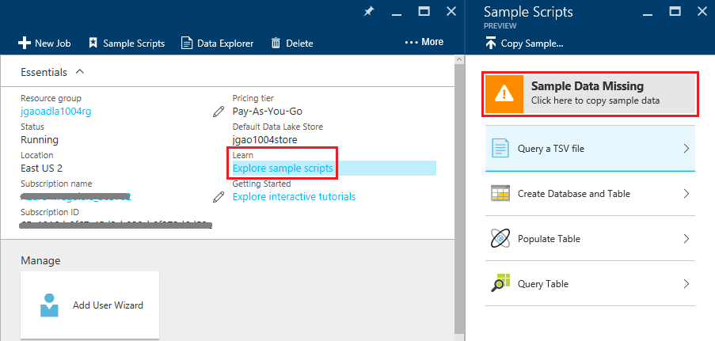

# Tutorial: get started with Azure Data Lake Analytics using Azure portal
[!INCLUDE [get-started-selector](../../includes/data-lake-analytics-selector-get-started.md)]

Learn how to use the Azure portal to create Azure Data Lake Analytics accounts, define jobs in [U-SQL](data-lake-analytics-u-sql-get-started.md), and submit jobs to the Data Lake Analytics service. For more
information about Data Lake Analytics, see [Azure Data Lake Analytics overview](data-lake-analytics-overview.md).

In this tutorial, you will develop a job that reads a tab separated values (TSV) file and converts it into a comma
separated values (CSV) file. To go through the same tutorial using other supported tools, click the tabs on the top of this section. Once your first job succeeds, you can start to write more complex data transformations with U-SQL.

## Prerequisites
Before you begin this tutorial, you must have the following items:

* **An Azure subscription**. See [Get Azure free trial](https://azure.microsoft.com/pricing/free-trial/).

## Create Data Lake Analytics account
You must have a Data Lake Analytics account before you can run any jobs.

Each Data Lake Analytics account has an Azure Data Lake Store account dependency.  This account is referred
as the default Data Lake Store account.  You can create the Data Lake Store account beforehand or when you create
your Data Lake Analytics account. In this tutorial, you will create the Data Lake Store account with the Data Lake Analytics
account.

**Create a Data Lake Analytics account**

1. Sign on to the [Azure portal](https://portal.azure.com).
2. Click **New**, click **Intelligence + analytics**, and then click **Data Lake Analytics**.
3. Type or select the following values:

    

   * **Name**: Name your Data Lake Analytics account (Only lower case letters and numbers allowed).
   * **Subscription**: Choose the Azure subscription used for the Analytics account.
   * **Resource Group**. Select an existing Azure Resource Group or create a new one. Azure Resource Manager enables you to work with the resources in your application as a group. For more information, see [Azure Resource Manager Overview](../azure-resource-manager/resource-group-overview.md).
   * **Location**. Select an Azure data center for the Data Lake Analytics account.
   * **Data Lake Store**: Click *Configure required settings*. Follow the instruction to create a new Data Lake Store account, or select an existing one. Each Data Lake Analytics account has a dependent Data Lake Store account. The Data Lake Analytics account and the dependent Data Lake Store account must be located in the same Azure data center.
4. Select your Pricing Tier  
5. Click **Create**. It returns you to your portal home screen where a new tile appears, showing "Deploying Azure Data Lake Analytics". The deploy process will take several minutes to create a Data Lake Analytics account. When the account is created, the portal opens the account on a new blade.

After a Data Lake Analytics account is created, you can add additional Data Lake Store accounts and Azure Storage
accounts. For instructions, see [Manage Data lake Analytics account data sources](data-lake-analytics-manage-use-portal.md#manage-account-data-sources).

## Prepare source data
In this tutorial, you will process search logs.  The search log can be stored in either Data Lake store or Azure Blob storage.

The Azure portal provides a user interface for copying sample data files to the default Data Lake Store account, which include a search log file.

**Copy sample data files**

1. From the [Azure portal](https://portal.azure.com), open your Data Lake Analytics account.  See [Manage Data Lake Analytics accounts](data-lake-analytics-get-started-portal.md#create-data-lake-analytics-account) to create one and open the account in the portal.
2. Expand the **Essentials** pane, and then click **Explore sample scripts**. It opens another blade called **Sample
   Scripts**.

    
3. Click **Sample Data Missing** to copy the sample data files. When it is done, the portal shows **Sample data updated successfully**.
4. From the Data Lake analytics account blade, click **Data Explorer** on the top.

    

    It opens two blades. One is **Data Explorer**, and the other is the default Data Lake Store account.
5. In the default Data Lake Store account blade, click **Samples** to expand the folder, and the click **Data** to expand the folder. You shall see the following files and folders:

   * AmbulanceData/
   * AdsLog.tsv
   * SearchLog.tsv
   * version.txt
   * WebLog.log

     In this tutorial, you use SearchLog.tsv.

In practice, you either program your applications to write data into a linked storage accounts or upload data. For uploading files, see
[Upload data to Data Lake Store](data-lake-analytics-manage-use-portal.md#upload-data-to-adls) or [Upload data to Blob storage](data-lake-analytics-manage-use-portal.md#upload-data-to-wasb).

## Create and submit Data Lake Analytics jobs
After you have prepared the source data, you can start developing a U-SQL script.  

**To submit a job**

1. From the Data Lake analytics account blade on the portal, click **New Job**.

    

    If you don't see the blade, see [Open a Data Lake Analytics account from portal](data-lake-analytics-manage-use-portal.md#access-adla-account).
2. Enter **Job Name**, and the following U-SQL script:

        @searchlog =
            EXTRACT UserId          int,
                    Start           DateTime,
                    Region          string,
                    Query           string,
                    Duration        int?,
                    Urls            string,
                    ClickedUrls     string
            FROM "/Samples/Data/SearchLog.tsv"
            USING Extractors.Tsv();

        OUTPUT @searchlog   
            TO "/Output/SearchLog-from-Data-Lake.csv"
        USING Outputters.Csv();

    

    This U-SQL script reads the source data file using **Extractors.Tsv()**, and then creates a csv file using **Outputters.Csv()**.

    Don't modify the two paths unless you copy the source file into a different location.  Data Lake Analytics creates the output folder if it doesn't exist.  In this case, we are using simple, relative paths.  

    It is simpler to use relative paths for files stored in default Data Lake accounts. You can also use absolute paths.  For example

        adl://<Data LakeStorageAccountName>.azuredatalakestore.net:443/Samples/Data/SearchLog.tsv

    For more about U-SQL, see [Get started with Azure Data Lake Analytics U-SQL language](data-lake-analytics-u-sql-get-started.md) and [U-SQL language reference](http://go.microsoft.com/fwlink/?LinkId=691348).

1. Click **Submit Job** from the top.   
2. Wait until the job status is changed to **Succeeded**. You can see the job took about one minute to complete.

    In case the job failed, see [Monitor and troubleshoot Data Lake Analytics jobs](data-lake-analytics-monitor-and-troubleshoot-jobs-tutorial.md).
3. At the bottom of the blade, click the **Output** tab, and then click **SearchLog-from-Data-Lake.csv**. You can preview, download, rename, and delete the output file.

    

## See also
* To see a more complex query, see [Analyze Website logs using Azure Data Lake Analytics](data-lake-analytics-analyze-weblogs.md).
* To get started developing U-SQL applications, see [Develop U-SQL scripts using Data Lake Tools for Visual Studio](data-lake-analytics-data-lake-tools-get-started.md).
* To learn U-SQL, see [Get started with Azure Data Lake Analytics U-SQL language](data-lake-analytics-u-sql-get-started.md).
* For management tasks, see [Manage Azure Data Lake Analytics using Azure portal](data-lake-analytics-manage-use-portal.md).
* To get an overview of Data Lake Analytics, see [Azure Data Lake Analytics overview](data-lake-analytics-overview.md).
* To see the same tutorial using other tools, click the tab selectors on the top of the page.
* To log diagnostics information, see [Accessing diagnostics logs for Azure Data Lake Analytics](data-lake-analytics-diagnostic-logs.md)
