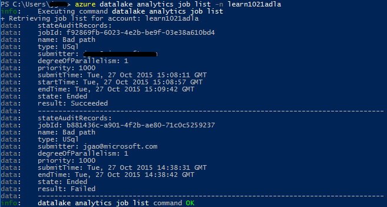

# Manage Azure Data Lake Analytics using Azure Command-line Interface (CLI)

[!INCLUDE [manage-selector](../../includes/data-lake-analytics-selector-manage.md)]

Learn how to manage Azure Data Lake Analytics accounts, data sources, users, and jobs using the Azure CLI. To see management topics using other tools, click the tab select above.


**Prerequisites**

Before you begin this tutorial, you must have the following resources:

* An Azure subscription. See [Get Azure free trial](https://azure.microsoft.com/pricing/free-trial/).

* Azure CLI. See [Install and configure Azure CLI](https://docs.microsoft.com/cli/azure/install-azure-cli?view=azure-cli-latest).

   * Download and install the **pre-release** [Azure CLI tools](https://github.com/MicrosoftBigData/AzureDataLake/releases) in order to complete this demo.

* Authenticate by using the `az login` command and select the subscription that you want to use. For more information on authenticating using a work or school account, see [Connect to an Azure subscription from the Azure CLI](/cli/azure/authenticate-azure-cli).

   ```azurecli
   az login
   az account set --subscription <subscription id>
   ```

   You can now access the Data Lake Analytics and Data Lake Store commands. Run the following command to list the Data Lake Store and Data Lake Analytics commands:

   ```azurecli
   az dls -h
   az dla -h
   ```

## Manage accounts

Before running any Data Lake Analytics jobs, you must have a Data Lake Analytics account. Unlike Azure HDInsight, you don't pay for an Analytics account when it is not 
running a job. You only pay for the time when it is running a job.  For more information, see 
[Azure Data Lake Analytics Overview](data-lake-analytics-overview.md).  

### Create accounts

Run the following command to create a Data Lake account, 

   ```azurecli
   az dla account create --account "<Data Lake Analytics account name>" --location "<Location Name>" --resource-group "<Resource Group Name>" --default-data-lake-store "<Data Lake Store account name>"
   ```

### Update accounts

The following command updates the properties of an existing Data Lake Analytics Account

   ```azurecli
   az dla account update --account "<Data Lake Analytics Account Name>" --firewall-state "Enabled" --query-store-retention 7
   ```

### List accounts

List Data Lake Analytics accounts within a specific resource group

   ```azurecli
   az dla account list "<Resource group name>"
   ```

## Get details of an account

   ```azurecli
   az dla account show --account "<Data Lake Analytics account name>" --resource-group "<Resource group name>"
   ```

### Delete an account

   ```azurecli
   az dla account delete --account "<Data Lake Analytics account name>" --resource-group "<Resource group name>"
   ```

## Manage data sources

Data Lake Analytics currently supports the following two data sources:

* [Azure Data Lake Store](../data-lake-store/data-lake-store-overview.md)
* [Azure Storage](../storage/common/storage-introduction.md)

When you create an Analytics account, you must designate an Azure Data Lake Storage account to be the default 
storage account. The default Data Lake storage account is used to store job metadata and job audit logs. After you have created an Analytics account, you can add additional Data Lake Storage accounts and/or Azure Storage account. 

### Find the default Data Lake Store account

You can view the default Data Lake Store account used by running the `az dla account show` command. Default account name is listed under the defaultDataLakeStoreAccount property.

   ```azurecli
   az dla account show --account "<Data Lake Analytics account name>"
   ```

### Add additional Blob storage accounts

   ```azurecli
   az dla account blob-storage add --access-key "<Azure Storage Account Key>" --account "<Data Lake Analytics account name>" --storage-account-name "<Storage account name>"
   ```

> [!NOTE]
> Only Blob storage short names are supported. Don't use FQDN, for example "myblob.blob.core.windows.net".
> 

### Add additional Data Lake Store accounts

The following command updates the specified Data Lake Analytics account with an additional Data Lake Store account:

   ```azurecli
   az dla account data-lake-store add --account "<Data Lake Analytics account name>" --data-lake-store-account-name "<Data Lake Store account name>"
   ```

### Update existing data source

To update an existing Blob storage account key:

   ```azurecli
   az dla account blob-storage update --access-key "<New Blob Storage Account Key>" --account "<Data Lake Analytics account name>" --storage-account-name "<Data Lake Store account name>"
   ```

### List data sources:

To list the Data Lake Store accounts:

   ```azurecli
   az dla account data-lake-store list --account "<Data Lake Analytics account name>"
   ```

To list the Blob storage account:

   ```azurecli
   az dla account blob-storage list --account "<Data Lake Analytics account name>"
   ```


### Delete data sources:
To delete a Data Lake Store account:

   ```azurecli
   az dla account data-lake-store delete --account "<Data Lake Analytics account name>" --data-lake-store-account-name "<Azure Data Lake Store account name>"
   ```

To delete a Blob storage account:

   ```azurecli
   az dla account blob-storage delete --account "<Data Lake Analytics account name>" --storage-account-name "<Data Lake Store account name>"
   ```

## Manage jobs
You must have a Data Lake Analytics account before you can create a job.  For more information, see [Manage Data Lake Analytics accounts](#manage-accounts).

### List jobs

   ```azurecli
   az dla job list --account "<Data Lake Analytics account name>"
   ```

   

### Get job details

   ```azurecli
   az dla job show --account "<Data Lake Analytics account name>" --job-identity "<Job Id>"
   ```

### Submit jobs

> [!NOTE]
> The default priority of a job is 1000, and the default degree of parallelism for a job is 1.
> 
   ```azurecli
   az dla job submit --account "<Data Lake Analytics account name>" --job-name "<Name of your job>" --script "<Script to submit>"
   ```

### Cancel jobs
Use the list command to find the job id, and then use cancel to cancel the job.

   ```azurecli
   az dla job cancel --account "<Data Lake Analytics account name>" --job-identity "<Job Id>"
   ```

## Use Azure Resource Manager groups
Applications are typically made up of many components, for example a web app, database, database server, storage,
and third party services. Azure Resource Manager enables you to work with the resources in your application 
as a group, referred to as an Azure Resource Group. You can deploy, update, monitor, or delete all of the 
resources for your application in a single, coordinated operation. You use a template for deployment and that 
template can work for different environments such as testing, staging, and production. You can clarify billing 
for your organization by viewing the rolled-up costs for the entire group. For more information, see [Azure 
Resource Manager Overview](../azure-resource-manager/resource-group-overview.md). 

A Data Lake Analytics service can include the following components:

* Azure Data Lake Analytics account
* Required default Azure Data Lake Storage account
* Additional Azure Data Lake Storage accounts
* Additional Azure Storage accounts

You can create all these components under one Resource Manager group to make them easier to manage.


A Data Lake Analytics account and the dependent storage accounts must be placed in the same Azure data center.
The Resource Manager group however can be located in a different data center.  

## See also
* [Overview of Microsoft Azure Data Lake Analytics](data-lake-analytics-overview.md)
* [Get started with Data Lake Analytics using Azure portal](data-lake-analytics-get-started-portal.md)
* [Manage Azure Data Lake Analytics using Azure portal](data-lake-analytics-manage-use-portal.md)
* [Monitor and troubleshoot Azure Data Lake Analytics jobs using Azure portal](data-lake-analytics-monitor-and-troubleshoot-jobs-tutorial.md)

