<properties 
   pageTitle="Manage Azure Data Lake Analytics using the Azure Preview portal | Azure" 
   description="Learn how to manage Data Lake Analytics acounts, data sources, users, and jobs." 
   services="data-lake-analytics" 
   documentationCenter="" 
   authors="mumian" 
   manager="paulettm" 
   editor="cgronlun"/>
 
<tags
   ms.service="data-lake-analytics"
   ms.devlang="na"
   ms.topic="article"
   ms.tgt_pltfrm="na"
   ms.workload="big-data" 
   ms.date="10/14/2015"
   ms.author="jgao"/>

# Manage Azure Data Lake Analytics using Azure Preview portal

Learn how to manage Azure Data Lake Analytics accounts, data sources, users, and jobs using the Azure Preview portal.

Other management articles include:

- [Manage Azure Data Lake Analytics using Azure PowerShell](data-lake-analytics-manage-use-powershell.md)
- [Manage Azure Data Lake Analytics using .NET SDK](data-lake-analytics-manage-use-dotnet-sdk.md)

**Prerequisites**

Before you begin this tutorial, you must have the following:

- **An Azure subscription**. See [Get Azure free trial](http://azure.microsoft.com/documentation/videos/get-azure-free-trial-for-testing-hadoop-in-hdinsight/).

<!-- ################################ -->
<!-- ################################ -->
## Use Azure Resource Manager groups

[jgao: is ADL-Analytics a good usage case of ARM? If no, I can remove this section]

Applications are typically made up of many components, for example a web app, database, database server, storage,
and 3rd party services. Azure Resource Manager (ARM) enables you to work with the resources in your application 
as a group, referred to as an Azure Resource Group. You can deploy, update, monitor or delete all of the 
resources for your application in a single, coordinated operation. You use a template for deployment and that 
template can work for different environments such as testing, staging and production. You can clarify billing 
for your organization by viewing the rolled-up costs for the entire group. For more information, see [Azure 
Resource Manager Overview](resource-group-overview.md). 

A Data Lake Analytics service can include the following components:

- Azure Data Lake Analytics account
- Required default Azure Data Lake Storage account
- Additional Azure Data Lake Storage accounts
- Additional Azure Storage accounts

You can create all these components under one ARM group to make them easier to manage.

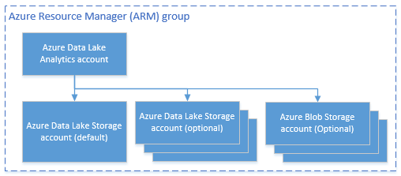

A Data Lake Analytics account and the dependent storage accounts must be placed in the same Azure data center.
The ARM group however can be located in a different data center.  

<!-- ################################ -->
<!-- ################################ -->
## Manage accounts

Before running any Data Lake Analytics jobs, you must have a Data Lake Analytics account. Unlike Azure Data Lake
Managed cluster (Previously known as Azure HDInsight), you don't pay for an Analytics account when it is not 
running a job.  You only pay for the time when it is running a job.  For more information, see 
[Azure Data Lake Analytics Overview](data-lake-analytics-overview.md).  

**To create a Data Lake Analytics accounts**

1. Sign on to the new [Azure portal](https://portal.azure.com/signin/index/?Microsoft_Azure_Kona=true&Microsoft_Azure_DataLake=true&hubsExtension_ItemHideKey=AzureDataLake_BigStorage%2cAzureKona_BigCompute).
2. Click **Microsoft Azure** in the upper left corner to open the home screen.
3. Click the **Marketplace** tile.  
3. Type **Azure Data Lake Analytics** in the search box on the **Everything** blade, and the press **ENTER**. You shall see **Azure Data Lake Analytics** in the list.
4. Click **Azure Data Lake Analytics** from the list.
5. Click **Create** on the bottom of the blade.
6. Type or select the following:

	

	- **Name**: Name the Analytics account.
	- **Data Lake Store**: Each Data Lake Analytics account has a dependent Azure Data Lake storage account. The Data Lake Analytics account and the dependent Data Lake storage account must be located in the same Azure data center. Follow the instruction to create a new Data Lake storage account, or select an existing one.
	- **Subscription**: Choose the Azure subscription used for the Analytics account.
	- **Resource Group**. Select an existing Azure Resource Group or create a new one. Applications are typically made up of many components, for example a web app, database, database server, storage, and 3rd party services. Azure Resource Manager (ARM) enables you to work with the resources in your application as a group, referred to as an Azure Resource Group. You can deploy, update, monitor or delete all of the resources for your application in a single, coordinated operation. You use a template for deployment and that template can work for different environments such as testing, staging and production. You can clarify billing for your organization by viewing the rolled-up costs for the entire group. For more information, see [Azure Resource Manager Overview](resource-group-overview.md). 
	- **Location**. Select an Azure data center for the Data Lake Analytics account. 

8. Click **Create**. It takes you to the portal home screen. A new tile is added to the StartBoard with the label showing "Deploying Azure Data Lake Analytics". It takes a few moments to create a Data Lake Analytics account. When the account is created, the portal opens the account on a new blade.

	

 **To access/open a Data Lake Analytics account**

1. Sign on to the new [Azure portal](https://portal.azure.com/signin/index/?Microsoft_Azure_Kona=true&Microsoft_Azure_DataLake=true&hubsExtension_ItemHideKey=AzureDataLake_BigStorage%2cAzureKona_BigCompute).
2. Click **Browse** on the left menu, and then click **Data Lake Analytics**.
3. Click the Analytics account that you want to delete. It will open the account in a new blade.

**To delete a Data Lake Analytics account**

1. Open the Analytics account that you want to delete. For instructions see [Access Data Lake Analytics accounts](#access-adla-account).
2. Click **Delete** from the button menu on the top of the blade.
3. Type the account name, and then click **Delete**.

Delete a Analytics account will not delete the dependent Data Lake Storage account. For instructions of deleting
ADL Storage accounts, see [nitin's article]().

<!-- ################################ -->
<!-- ################################ -->
## Manage account data sources

Data Lake Analytics currently supports the following data sources:

- [Azure Data Lake Storage](data-lake-storage-overview.md)
- [Azure Storage](storage-introduction.md)

When you create an Analytics account, you must designate an Azure Data Lake Storage account to be the default 
storage account. The default ADL storage account is used to store job metadata and job audit logs. After you have 
created an Analytics account, you can add additional Data Lake Storage accounts and/or Azure Storage account. 

**To find the default ADL storage account**

- Open the Analytics account that you want to manage. For instructions see [Access Data Lake Analytics accounts](#access-adla-account). The default Data Lake store is shown in **Essential**:

	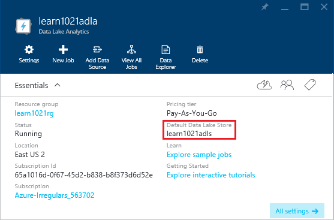

**To add additional data sources**

1. Open the Analytics account that you want to manage. For instructions see [Access Data Lake Analytics accounts](#access-adla-account).
2. Click **Settings** and then click **Data Sources**. You shall see the default Data Lake Storage account listed
there. 
3. Click **Add Data Source**.

	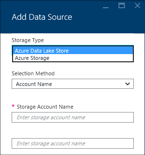

	To add a Azure Data Lake Storage account, you need the account name.
	To add a Azure Blob storage, you need the storage account and the account key.

**To explore data sources**	

1. Open the Analytics account that you want to manage. For instructions see [Access Data Lake Analytics accounts](#access-adla-account).
2. Click **Settings** and then click **Data Explorer**. 
 
	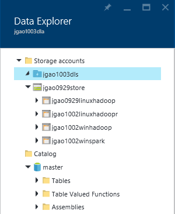
	
3. Click a Data Lake Storage account to open it.

	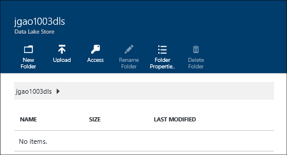
	
	For each Data Lake Storage account, you can
	
	- **New Folder**: Add new folder.
	- **Upload**: Upload files to the Storage account from your workstation.
	- **Access**: Configure access permissions.
	- **Rename Folder**: Rename a folder.
	- **Folder properties**: Show file or folder properties, such as WASB path, WEBHDFS path, last modified time and so on.
	- **Delete Folder**: Delete a folder.

 **To upload files to Data Lake Storage account**

1. From the preview portal, click **Browse ** from the left menu, and then click **Data Lake Store**.
2. Click the Data Lake storage account that you want to upload data to. To find the default ADL Storage account, see [here](#default-adl-account)
3. Click **Data Explorer** from the top menu.
4. Click **New Directory** to create a new folder, or click a folder name to change folder.
6. Click **Upload** from the top menu to upload file.

See [nitin's article]().

 **To upload files to Azure Blob storage account**

See .

## Manage users

ADL Analytics uses role-based access control with Azure active directory. When you create a Data Lake Analytics 
account, a "Subscription admins" is added to the account. You can add additional users and security groups with 
the following roles:

|Role|Description|
|----|-----------|
|Owner|Lets you manage everything, including access to resources.|
|Contributor|Access the portal; submit and monitor jobs. To be able to submit jobs, a contributor also need the read or write permission to the Data Lake storage accounts.|
|Reader|Lets you view everything, but not make any changes.|  
|DevTest Lab User|Lets you view everything, and connect, start, restart, and shutdown virtual machines[jgao: I never seen discussion related to ABA and VM]|  
|User Access Administrator|Lets you manage user access to Azure resources.|  

For information on creating Azure Active Directory users and security groups, See [What is Azure Active Directory](active-directory-whatis.md).

**To add users or security groups to an Analytics account**

1. Open the Analytics account that you want to manage. For instructions see [Access Data Lake Analytics accounts](#access-adla-account).
2. Click **Settings**, and then click **Users**. You can also click **Access** on the **Essentials** title bar as shown in the following screenshot:

	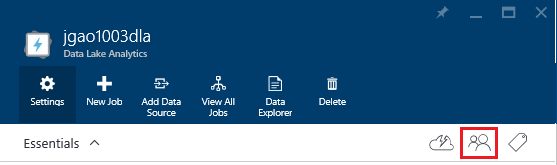
3. From the **User** blade, click **Add**.
4. Select a role and add a users, and then click **OK**.

**To configure job access**

1. Sign on to the new [Azure portal](https://portal.azure.com/signin/index/?Microsoft_Azure_Kona=true&Microsoft_Azure_DataLake=true&hubsExtension_ItemHideKey=AzureDataLake_BigStorage%2cAzureKona_BigCompute).
2. Click **BROWSE ALL** on the left menu, click **Big Data Services**, and the click the account you want to configure the user roles.
3. Click **Access**.

<!-- ################################ -->
<!-- ################################ -->
## Manage jobs

You must have a Data Lake Analytics account before you can create a job.  For more information, see [Manage Data Lake Analytics accounts](#manage-data-lake-analytics-accounts).

**To create a job**

1. Open the Analytics account that you want to manage. For instructions see [Access Data Lake Analytics accounts](#access-adla-account).
2. Click **New Job**.

	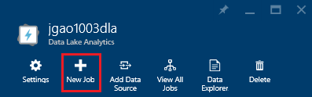

	You will see a new blade similar to:

	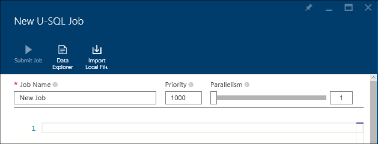

	For each job, you can configure

	|Name|Description|
	|----|-----------|
	|Job Name|Enter the name of the job.|
	|Priority|Lower number is higher priority.|
	|BDU|Max number of compute processes that can happen at the same time. Increasing this number can improve performance but can also increase cost.|
	|Script|Enter the U-SQL script for the job.|

	Using the same interface, you can also explore the link data sources, and add addtional files to the linked data sources. 
3. Click **Submit Job** if you want to submit the job.

** To submit a job**

See [Create Data Lake Analytics jobs](#create-job).

**To monitor jobs**

1. Open the Analytics account that you want to manage. For instructions see 
[Access Data Lake Analytics accounts](#access-adla-account). The Job Management panel shows the basic job 
information:

	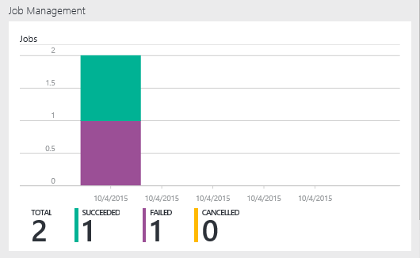

3. Click **Job Management** as shown in the previous screenshot.

	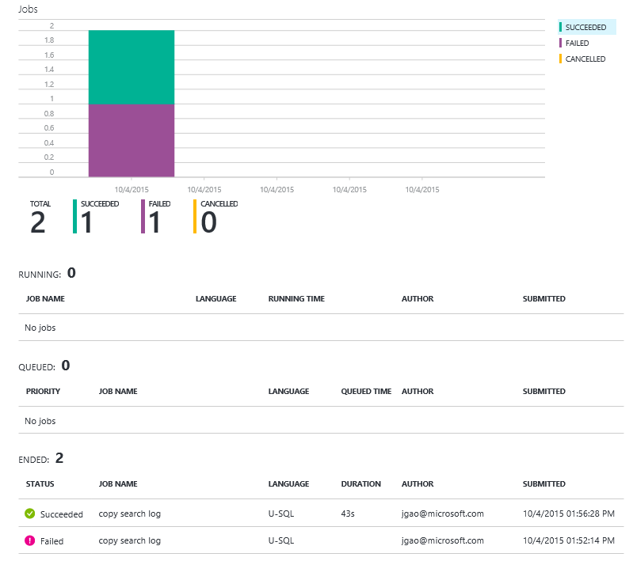

4. Click a job from on of the lists.
5. Click **Resubmit** if you want to resubmit the job.

**To resubmit a job **

See [Monitor Data Lake Analytics jobs](#monitor-jobs).

##Monitor account usage

[introduction - we need to explain the terms, and connect the pieces. ]

**To monitor account usage**
1. Open the Analytics account that you want to manage. For instructions see 
[Access Data Lake Analytics accounts](#access-adla-account). The Usage panel shows the usage:

	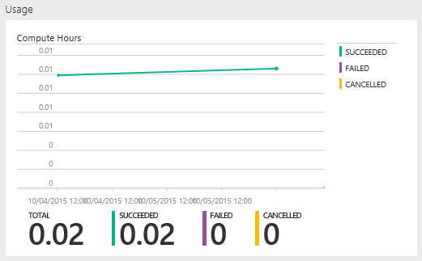

##Manage the catalog

[jgao: do we need this section in this article?]
[Alan: users can only view the catalog from the portal.]
	- tables
	- table valued functions
	- assemblies

##See also 

- [Manage Azure Data Lake Analytics using Azure PowerShell](data-lake-analytics-manage-use-powershell.md)
- [Manage Azure Data Lake Analytics using .NET SDK](data-lake-analytics-manage-use-dotnet-sdk.md)
