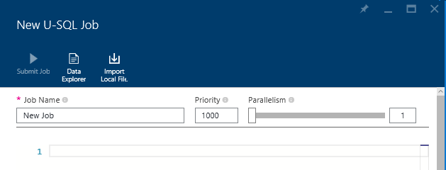

<properties 
   pageTitle="Manage Azure Data Lake Analytics using Azure PowerShell | Azure" 
   description="Learn how to manage Data Lake Analytics jobs, data sources, users. " 
   services="data-lake-analytics" 
   documentationCenter="" 
   authors="mumian" 
   manager="paulettm" 
   editor="cgronlun"/>
 
<tags
   ms.service="data-lake-analytics"
   ms.devlang="na"
   ms.topic="article"
   ms.tgt_pltfrm="na"
   ms.workload="big-data" 
   ms.date="09/29/2015"
   ms.author="jgao"/>

# Manage Azure Data Lake Analytics using Azure Preview portal

[jgao: working in progress -  a general management article for Kona]

Learn how to manage Azure Data Lake Analytics accounts, users, jobs, and data sources.

**Prerequisites**

Before you begin this tutorial, you must have the following:

- **An Azure subscription**. See [Get Azure free trial](http://azure.microsoft.com/documentation/videos/get-azure-free-trial-for-testing-hadoop-in-hdinsight/).

This article includes:

- Use ARM
- Manage accounts
- Manage data sources
- Manage users
- Manage jobs
- Monitor account usage
- Manage catalog
	- tables
	- table valued functions
	- assemblies
	

<!-- ################################ -->
<!-- ################################ -->
## Use Azure Resource Manager groups

[jgao: is Kona a good case of using ARM?]

[jgao: ARM overview]

Components to be added to a ARM group:

- Azure Data Lake Analytics account
- Default Azure Data Lake Storage account
- Additional Azure Data Lake Storage accounts
- Additional Azure Storage accounts

<!-- ################################ -->
<!-- ################################ -->
## Manage accounts

Before running any Data Lake Analytics jobs, you must have an Azure subscription and create a Data Lake Analytics account.

**To create a Data Lake Analytics accounts**

[This procedure will change when the product releases.]

1. Sign on to the new [Azure portal](https://portal.azure.com/signin/index/?Microsoft_Azure_Kona=true&Microsoft_Azure_DataLake=true&hubsExtension_ItemHideKey=AzureDataLake_BigStorage%2cAzureKona_BigCompute).
2. Click **Microsoft Azure** in the upper left corner to open the home screen.
3. Click the **Marketplace** tile.  
3. Type **Azure Data Lake Analytics** in the search box on the **Everything** blade, and the press **ENTER**. You shall see **Azure Data Lake Analytics** in the list.
4. Click **Azure Data Lake Analytics** from the list.
5. Click **Create** on the bottom of the blade.
6. Type or select the following:

	

	- **Name**: Name the Analytics account.
	- **Data Lake Store**: Each Data Lake Analytics account has a dependent Azure Data Lake storage account. The Data Lake Analytics account and the dependent Data Lake storage account must be located in the same Azure data center. Follow the instruction to create a new Data Lake storage account, or select an existing one.
	- **Subscription**: Choose the Azure subscription used for the Analytics account.
	- **Resource Group**. Select an existing Azure Resource Group or create a new one. Applications are typically made up of many components, for example a web app, database, database server, storage, and 3rd party services. Azure Resource Manager (ARM) enables you to work with the resources in your application as a group, referred to as an Azure Resource Group. You can deploy, update, monitor or delete all of the resources for your application in a single, coordinated operation. You use a template for deployment and that template can work for different environments such as testing, staging and production. You can clarify billing for your organization by viewing the rolled-up costs for the entire group. For more information, see [Azure Resource Manager Overview](resource-group-overview.md). 
	- **Location**. Select an Azure data center for the Data Lake Analytics account. 

8. Click **Create**. It takes you to the portal home screen. A new tile is added to the Home page with the label showing "Deploying Azure Data Lake Analytics". It takes a few moments to create a Data Lake Analytics account. When the account is created, the portal opens the account on a new blade.

	

 **To access/open a Data Lake Analytics account**

1. Sign on to the new [Azure portal](https://portal.azure.com/signin/index/?Microsoft_Azure_Kona=true&Microsoft_Azure_DataLake=true&hubsExtension_ItemHideKey=AzureDataLake_BigStorage%2cAzureKona_BigCompute).
2. Click **Browse** on the left menu, and then click **Data Lake Analytics**.
3. Click the Analytics account that you want to delete. It will open the account in a new blade.

**To delete a Data Lake Analytics account**

1. Open the Analtyics account that you want to delete. For instructions see [Access Data Lake Analytics accounts](#access-adla-account).
2. Click **Delete** from the button menu on the top of the blade.

	
3. Type the account name, and then click **Delete**.

Delete a Analytics account will not delete the dependent Data Lake Storage account.

<!-- ################################ -->
<!-- ################################ -->
## Manage account data sources

Data Lake Analytics supports the following data sources:

- Azure Data Lake Storage
- Azure Blob storage (Azure Storage account)

When you create an Analytics account, you must designate an Azure Data Lake Storage account to be the default 
storage.  After you have created an Analytics account, you can add additional Data Lake Storage accounts and/or
Azure Storage account. 

**To add additional data sources**

1. Open the Analtyics account that you want to manage. For instructions see [Access Data Lake Analytics accounts](#access-adla-account).
2. Click **Settings** and then click **Data Sources**. You shall see the default Data Lake Storage account listed
there. 
3. Click **Add Data Source**.

	

	To add a Azure Data Lake Storage account, you need the account name.
	To add a Azure Blob storage, you need the storage account and the account key.

**To explore data sources**	

1. Open the Analtyics account that you want to manage. For instructions see [Access Data Lake Analytics accounts](#access-adla-account).
2. Click **Settings** and then click **Data Explorer**. 
 
	
	
3. Click a Data Lake Storage account to open it.

	
	
	For each Data Lake Storage account, you can
	
	- **New Folder**: Add new folder.
	- **Upload**: Upload files to the Storage account from your workstation.
	- **Access**: Configure access permissions.
	- **Rename Folder**: Rename a folder.
	- **Folder properties**: Show file or folder properties, such as WASB path, WEBHDFS path, last modified time and so on.
	- **Delete Folder**: Delete a folder.

**To upload files to Data Lake Storage account**

See .

**To upload files to Azure Blob storage account**

See .

## Manage users

When you create a Data Lake Analytics account, a "Subscription admins" is added to the account. You can add additional users with the following roles:

|Role|Description|
|----|-----------|
|Owner|Lets you manage everything, including access to resources.|
|Contributor|Access the portal; submit and monitor jobs. To be able to submit jobs, a contributor also need the read or write permission to the Data Lake storage accounts.|
|Reader|Lets you view everything, but not make any changes.|  
|DevTest Lab User|Lets you view everything, and connect, start, restart, and shutdown virtual machines[jgao: I never seen discussion related to ABA and VM]|  
|User Access Administrator|Lets you manage user acess to Azure resources.|  

add a user or a security group as contributor.

###Create users or security groups

[jgao: are these AAD users? Refer to an article from here ]

See .

**To add users or security groups to an Analytics account**

1. Open the Analtyics account that you want to manage. For instructions see [Access Data Lake Analytics accounts](#access-adla-account).
2. Click **Settings**, and then click **Users**. You can also click **Access** on the **Essentials** title bar as shown in the following screenshot:

	
3. From the **User** blade, click **Add**.
4. Select a role and add a users, and then click **OK**.

**To configure job access**

1. Sign on to the new [Azure portal](https://portal.azure.com/signin/index/?Microsoft_Azure_Kona=true&Microsoft_Azure_DataLake=true&hubsExtension_ItemHideKey=AzureDataLake_BigStorage%2cAzureKona_BigCompute).
2. Click **BROWSE ALL** on the left menu, click **Big Data Services**, and the click the account you want to configure the user roles.
3. Click **Access**.

<!-- ################################ -->
<!-- ################################ -->
## Manage jobs

You must have an Data Lake Analytics account before you can create a job.  For more information, see [Manage Data Lake Analytics accounts](#manage-data-lake-analytics-accounts).

**To create a job**

1. Sign on to the new [Azure portal](https://portal.azure.com/signin/index/?Microsoft_Azure_Kona=true&Microsoft_Azure_DataLake=true&hubsExtension_ItemHideKey=AzureDataLake_BigStorage%2cAzureKona_BigCompute).
2. Click **BROWSE ALL** on the left menu, click **Big Data Services**, and the click the account that you want to use to run the job.
3. Click **New Job**.

	

	You will see a new blade similar to:

	

	For each job, you can configure

	|Name|Description|
	|----|-----------|
	|Job Name|Enter the name of the job.|
	|Priority|Lower number is higher priority.|
	|BDU|Max number of compute processes that can happen at the same time. Increasing this number can improve performance but can also increase cost.|
	|Script|Enter the U-SQL script for the job.|

	Using the same interface, you can also explore the link data sources, and add addtional files to the linked data sources. 

**To monitor jobs**

1. Sign on to the new [Azure portal](https://portal.azure.com/signin/index/?Microsoft_Azure_Kona=true&Microsoft_Azure_DataLake=true&hubsExtension_ItemHideKey=AzureDataLake_BigStorage%2cAzureKona_BigCompute).
2. Click **BROWSE ALL** on the left menu, click **Big Data Services**, and the click the account where you used to run the job. The Job Management panel shows the basic job information:

	

3. Click **Job Management** as shown in the previous screenshot.

	

##Monitor account usage

[introduction - we need to explain the terms, and connect the pieces. ]

##See also 

- bla
- bla

## Manage Kona users using PowerShell [jgao: to be moved to a different article]

[**jgao:** If this is not needed to go through the tutorial, then we shall separated it into a management topic]
[saveenr - sounds good - talk to mahi about the correct way to do user management]

To add a user to your Kona Account:

	New-KonaUser –UserEmail user1@aadtenant.onmicrosoft.com –UserRole User 

To list the existing Kona users:

	Get-KonaUser 

The following is a sample output:

	CreationTime                LastModifiedTime            Name                        Roles                      
	------------                ----------------            ----                        -----                      
	Mon, 13 Oct 2014 18:42:3... Mon, 13 Oct 2014 18:42:3... KiwiPublicTest@JianywKiw... {Admin}                    
	Tue, 14 Oct 2014 02:24:3... Tue, 14 Oct 2014 02:24:3... konauser2@test              {Admin}                    
	Tue, 14 Oct 2014 02:26:0... Tue, 14 Oct 2014 02:26:0... konauser1@onboardflow.on... {Admin}                    
	Wed, 15 Oct 2014 00:14:1... Wed, 15 Oct 2014 00:14:1... This Obviously Isn't a user {ReadOnly}  
	               

To remove a Kona user account:

	Remove-KonaUser –UserEmail user1@aadtenant.onmicrosoft.com 

