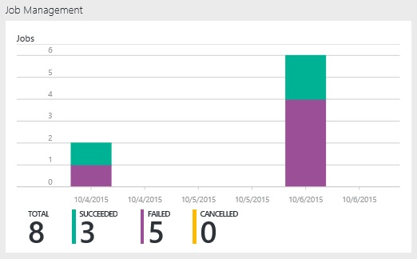
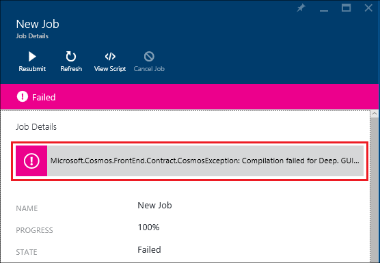
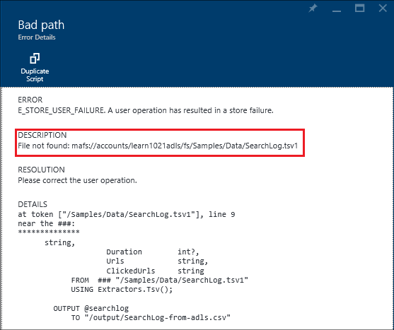

<properties 
   pageTitle="Troubleshoot Azure Data Lake Analytics jobs using Azure Portal | Azure" 
   description="Learn how to use the Azure Portal to troubleshoot Data Lake Analytics jobs. " 
   services="data-lake-analytics" 
   documentationCenter="" 
   authors="edmacauley" 
   manager="paulettm" 
   editor="cgronlun"/>
 
<tags
   ms.service="data-lake-analytics"
   ms.devlang="na"
   ms.topic="article"
   ms.tgt_pltfrm="na"
   ms.workload="big-data" 
   ms.date="05/16/2016"
   ms.author="edmaca"/>

# Troubleshoot Azure Data Lake Analytics jobs using Azure Portal

Learn how to use the Azure Portal to troubleshoot Data Lake Analytics jobs.

In this tutorial, you will setup a missing source file problem, and use the Azure Portal to troubleshoot the problem.

**Prerequisites**

Before you begin this tutorial, you must have the following:

- **Basic knowledge of Data Lake Analytics job process**. See [Get started with Azure Data Lake Analytics using Azure Portal](data-lake-analytics-get-started-portal.md).
- **A Data Lake Analytics account**. See [Get started with Azure Data Lake Analytics using Azure Portal](data-lake-analytics-get-started-portal.md#create-adl-analytics-account).
- **Copy the sample data to the default Data Lake Store account**.  See [Prepare source data](data-lake-analytics-get-started-portal.md#prepare-source-data)

##Submit a Data Lake Analytics job

Now you will create a U-SQL job with a bad source file name.  

**To submit the job**

1. From the Azure Portal, click **Microsoft Azure** in the upper left corner.
2. Click the tile with your Data Lake Analytics account name.  It was pinned here when the account was created.
If the account is not pinned there, see 
[Open an Analytics account from portal](data-lake-analytics-manage-use-portal.md#access-adla-account).
3. Click **New Job** from the top menu.
4. Enter a Job name, and the following U-SQL script:

        @searchlog =
            EXTRACT UserId          int,
                    Start           DateTime,
                    Region          string,
                    Query           string,
                    Duration        int?,
                    Urls            string,
                    ClickedUrls     string
            FROM "/Samples/Data/SearchLog.tsv1"
            USING Extractors.Tsv();
        
        OUTPUT @searchlog   
            TO "/output/SearchLog-from-adls.csv"
        USING Outputters.Csv();

    The source file defined in the script is **/Samples/Data/SearchLog.tsv1**, where it shall be **/Samples/Data/SearchLog.tsv**.
     
5. Click **Submit Job** from the top. A new Job Details pane opens. On the title bar, it shows the job status. It takes a few minutes to finish. You can click **Refresh** to get the latest status.
6. Wait until the job status is changed to **Failed**.  If the job is **Succeeded**, it is because you didn't remove the /Samples folder. See the **Prerequisite** section at the beginning of the tutorial.

You might be wondering - why it takes so long for a small job.  Remember Data Lake Analytics is designed to process big data.  It shines when processing a large amount of data using its distributed system.

Let's assume you submitted the job, and close the portal.  In the next section, you will learn how to troubleshoot the job.

## Troubleshoot the job

In the last section, you have submitted a job, and the job failed.  

**To see all the jobs**

1. From the Azure portal, click **Microsoft Azure** in the upper left corner.
2. Click the tile with your Data Lake Analytics account name.  The job summary is shown on the **Job Management** tile.

    
    
    The job Management gives you a glance of the job status. Notice there is a failed job.
   
3. Click the **Job Management** tile to see the jobs. The jobs are categorized in **Running**, **Queued**, and **Ended**. You shall see your failed job in the **Ended** section. It shall be first one in the list. When you have a lot of jobs, you can click **Filter** to help you to locate jobs.

    

4. Click the failed job from the list to open the job details in a new blade:

    
    
    Notice the **Resubmit** button. After you fix the problem, you can resubmit the job.

5. Click highlighted part from the previous screenshot to open the error details.  You shall see something like:

    

    It tells you the source folder is not found.
    
6. Click **Duplicate Script**.
7. Update the **FROM** path to the following:

    "/Samples/Data/SearchLog.tsv"

8. Click **Submit Job**.

##See also

- [Azure Data Lake Analytics overview](data-lake-analytics-overview.md)
- [Get started with Azure Data Lake Analytics using Azure PowerShell](data-lake-analytics-get-started-powershell.md)
- [Get started with Azure Data Lake Analytics and U-SQL using Visual Studio](data-lake-analytics-u-sql-get-started.md)
- [Manage Azure Data Lake Analytics using Azure Portal](data-lake-analytics-manage-use-portal.md)

