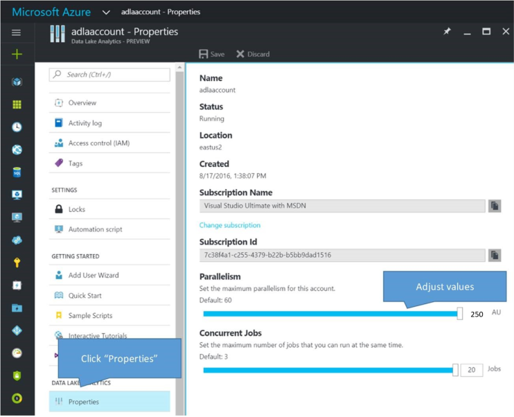

# Azure Data Lake Analytics Quota Limits
Learn how to adjust and increase quota limits in Azure Data Lake Analytics (ADLA) account. Knowing these limits may help you understand your U-SQL job behavior. All these limits are soft and you can always increase the max limits by reaching out to us.

## Quota limits:
The list below outlines the current quota limits of the system:

**Azure Subscriptions limits:**
The following limit applies to Azure subscriptions:
* **Max number of ADLA accounts per subscription:**  5. This is the maximum number of ADLA accounts you can create per subscription. You receive this error “You have reached the maximum number of Data Lake Analytics accounts allowed (5) in region under subscription name” when you try to create the sixth ADLA accounts. You can easily fix this by either deleting used ADLA accounts under your subscription or reaching out to us by opening a support ticket.

**ADLA Account limits:**
* **Max number of Analytics Units (AUs) per account:** 250. This is the maximum number of AUs that can run concurrently in your account. Your total running AUs cross all the jobs can’t go beyond this. Exceeding this value causes newer jobs to be queued automatically. For example:
	* You may have only one job running with 250 AUs, when you submit the second job, this job stands in the job queue until the first one is completed.
    * You may already have 5 jobs running and each submitted with 50 AUs, when you submit the sixth one with say 20 AUs, it waits in the job queue and start to run when 20 AUs are available.
* **Max number of concurrent U-SQL jobs per account:** 20. This is the maximum number of jobs that can run concurrently in your account. Exceeding this value causes newer jobs to be queued automatically.

**To adjust ADLA Quota limits per account:**
1. Sign on to the [Azure portal](https://portal.azure.com).
2. Choose the ADLA account you already created
3. Click **Properties**
4. Adjust **Parallelism** and **Concurrent Jobs** to suit your needs.

    

**To increase the max quota limits:**
1. Open a support request in Azure Portal.

    

    
2. Select the issue type as **Quota**
3. Select your **Subscription** (Make sure it is not a “trial” subscription).
4. Select quota type as **Data Lake Analytics**

    

5.	In the problem blade, please explain your requested increase limit and **Details** of why you need this extra capacity.

    

6.	Verify your contact information and Create the support request.

We review your request and try to accommodate your business needs ASAP.

## See also
* [Overview of Microsoft Azure Data Lake Analytics](data-lake-analytics-overview.md)
* [Manage Azure Data Lake Analytics using Azure PowerShell](data-lake-analytics-manage-use-powershell.md)
* [Monitor and troubleshoot Azure Data Lake Analytics jobs using Azure portal](data-lake-analytics-monitor-and-troubleshoot-jobs-tutorial.md)
