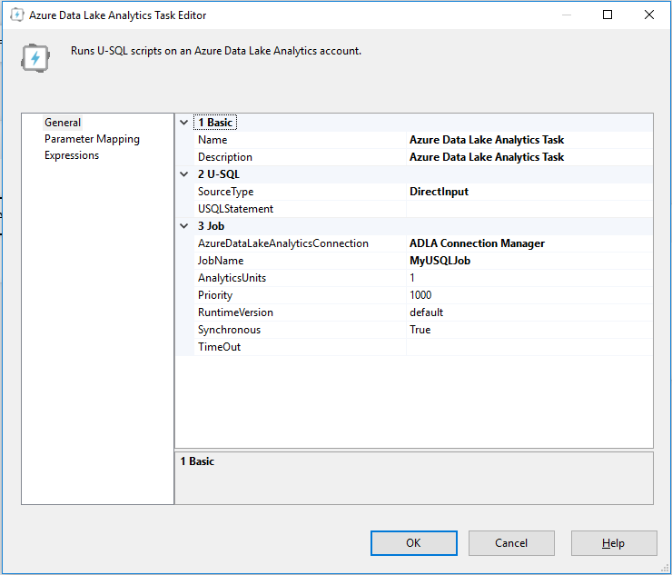
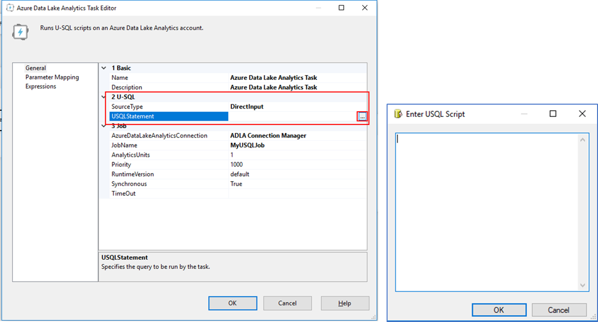
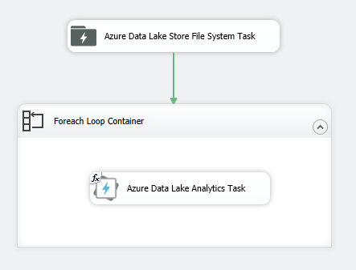
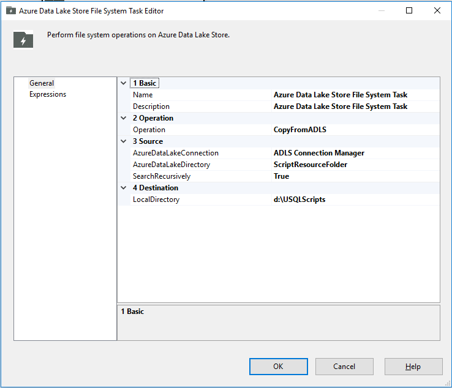
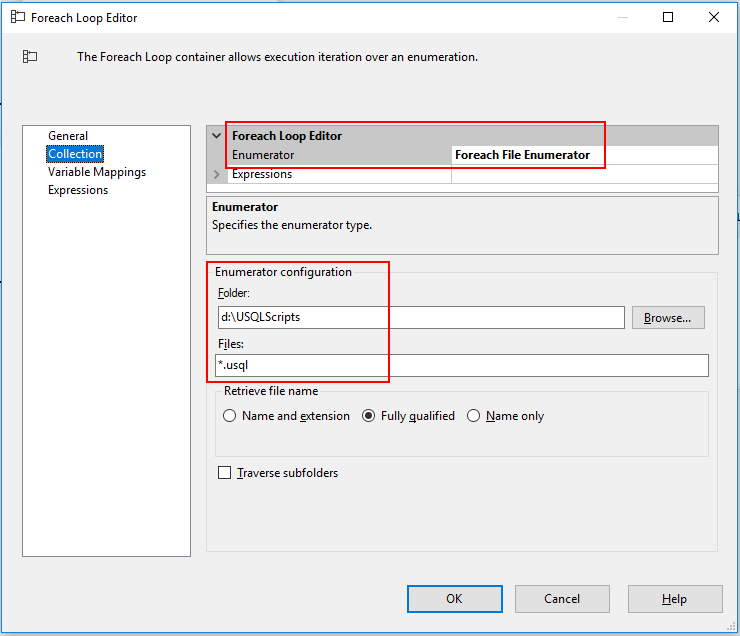
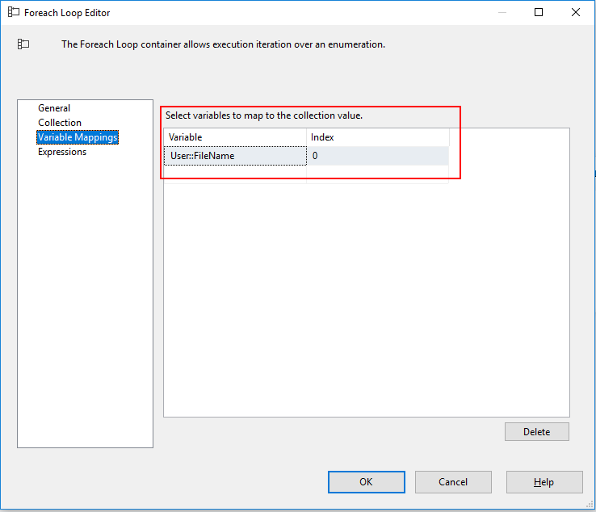
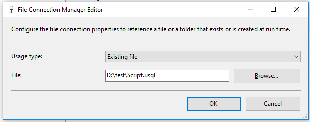
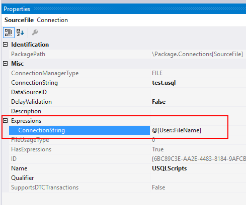
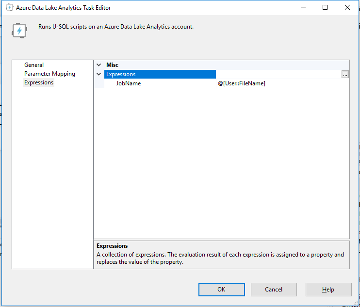
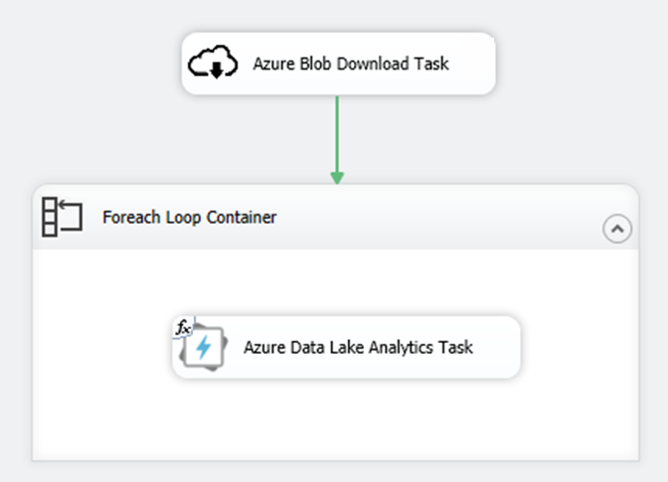

# Schedule U-SQL jobs using SQL Server Integration Services (SSIS)

In this document, you learn how to orchestrate and create U-SQL jobs using SQL Server Integration Service (SSIS). 

## Prerequisites

[Azure Feature Pack for Integration Services](https://docs.microsoft.com/sql/integration-services/azure-feature-pack-for-integration-services-ssis?view=sql-server-2017#scenario-managing-data-in-the-cloud) provides the [Azure Data Lake Analytics task](https://docs.microsoft.com/sql/integration-services/control-flow/azure-data-lake-analytics-task?view=sql-server-2017) and the [Azure Data Lake Analytics Connection Manager](https://docs.microsoft.com/sql/integration-services/connection-manager/azure-data-lake-analytics-connection-manager?view=sql-server-2017) that helps connect to Azure Data Lake Analytics service. To use this task, make sure you install:

- [Download and install SQL Server Data Tools (SSDT) for Visual Studio](https://docs.microsoft.com/sql/ssdt/download-sql-server-data-tools-ssdt?view=sql-server-2017)
- [Install Azure Feature Pack for Integration Services (SSIS)](https://docs.microsoft.com/sql/integration-services/azure-feature-pack-for-integration-services-ssis?view=sql-server-2017)

## Azure Data Lake Analytics task

The Azure Data Lake Analytics task let users submit U-SQL jobs to the Azure Data Lake Analytics account. 

[Learn how to configure Azure Data Lake Analytics task](https://docs.microsoft.com/sql/integration-services/control-flow/azure-data-lake-analytics-task?view=sql-server-2017).

You can get the U-SQL script from different places by using SSIS built-in functions and tasks, below scenarios show how can you configure the U-SQL scripts for different user cases.

## Scenario 1-Use inline script call tvfs and stored procs

In Azure Data Lake Analytics Task Editor, configure **SourceType** as **DirectInput**, and put the U-SQL statements into **USQLStatement**.

For easy maintenance and code management, only put short U-SQL script as inline scripts, for example, you can call existing table valued functions and stored procedures in your U-SQL databases. 

Related article: [How to pass parameter to stored procedures](#scenario-6-pass-parameters-to-u-sql-script)

## Scenario 2-Use U-SQL files in Azure Data Lake Store

You can also use U-SQL files in the Azure Data Lake Store by using **Azure Data Lake Store File System Task** in Azure Feature Pack. This approach enables you to use the scripts stored on cloud.

Follow below steps to set up the connection between Azure Data Lake Store File System Task and Azure Data Lake Analytics Task.

### Set task control flow

In SSIS package design view, add an **Azure Data Lake Store File System Task**, a **Foreach Loop Container** and an **Azure Data Lake Analytics Task** in the Foreach Loop Container. The Azure Data Lake Store File System Task helps to download U-SQL files in your ADLS account to a temporary folder. The Foreach Loop Container and the Azure Data Lake Analytics Task help to submit every U-SQL file under the temporary folder to the Azure Data Lake Analytics account as a U-SQL job.

### Configure Azure Data Lake Store File System Task

1. Set **Operation** to **CopyFromADLS**.
2. Set up **AzureDataLakeConnection**, learn more about [Azure Data Lake Store Connection Manager](https://docs.microsoft.com/sql/integration-services/connection-manager/azure-data-lake-store-connection-manager?view=sql-server-2017).
3. Set **AzureDataLakeDirectory**. Point to the folder storing your U-SQL scripts. Use relative path that is relative to the Azure Data Lake Store account root folder.
4. Set **Destination** to a folder that caches the downloaded U-SQL scripts. This folder path will be used in Foreach Loop Container for U-SQL job submission. 

[Learn more about Azure Data Lake Store File System Task](https://docs.microsoft.com/sql/integration-services/control-flow/azure-data-lake-store-file-system-task?view=sql-server-2017).

### Configure Foreach Loop Container

1. In **Collection** page, set **Enumerator** to **Foreach File Enumerator**.

2. Set **Folder** under **Enumerator configuration** group to the temporary folder that includes the downloaded U-SQL scripts.

3. Set **Files** under **Enumerator configuration** to `*.usql` so that the loop container only catches the files ending with `.usql`.

    

4. In **Variable Mappings** page, add a user defined variable to get the file name for each U-SQL file. Set the **Index** to 0 to get the file name. In this example, define a variable called `User::FileName`. This variable will be used to dynamically get U-SQL script file connection and set U-SQL job name in Azure Data Lake Analytics Task.

    

### Configure Azure Data Lake Analytics Task 

1. Set **SourceType** to **FileConnection**.

2. Set **FileConnection** to the file connection that points to the file objects returned from Foreach Loop Container.
    
    To create this file connection:

   1. Choose **\<New Connection...>** in FileConnection setting.
   2. Set **Usage type** to **Existing file**, and set the **File** to any existing file's file path.

       

   3. In **Connection Managers** view, right-click the file connection created just now, and choose **Properties**.

   4. In the **Properties** window, expand **Expressions**, and set **ConnectionString** to the variable defined in Foreach Loop Container, for example, `@[User::FileName]`.

       

3. Set **AzureDataLakeAnalyticsConnection** to the Azure Data Lake Analytics account that you want to submit jobs to. Learn more about [Azure Data Lake Analytics Connection Manager](https://docs.microsoft.com/sql/integration-services/connection-manager/azure-data-lake-analytics-connection-manager?view=sql-server-2017).

4. Set other job configurations. [Learn More](https://docs.microsoft.com/sql/integration-services/control-flow/azure-data-lake-analytics-task?view=sql-server-2017).

5. Use **Expressions** to dynamically set U-SQL job name:

    1. In **Expressions** page, add a new expression key-value pair for **JobName**.
    2. Set the value for JobName to the variable defined in Foreach Loop Container, for example, `@[User::FileName]`.
    
        

## Scenario 3-Use U-SQL files in Azure Blob Storage

You can use U-SQL files in Azure Blob Storage by using **Azure Blob Download Task** in Azure Feature Pack. This approach enables you using the scripts on cloud.

The steps are similar with [Scenario 2: Use U-SQL files in Azure Data Lake Store](#scenario-2-use-u-sql-files-in-azure-data-lake-store). Change the Azure Data Lake Store File System Task to Azure Blob Download Task. [Learn more about Azure Blob Download Task](https://docs.microsoft.com/sql/integration-services/control-flow/azure-blob-download-task?view=sql-server-2017).

The control flow is like below.

## Scenario 4-Use U-SQL files on the local machine

Besides of using U-SQL files stored on cloud, you can also use files on your local machine or files deployed with your SSIS packages.

1. Right-click **Connection Managers** in SSIS project and choose **New Connection Manager**.

2. Select **File** type and click **Add...**.

3. Set **Usage type** to **Existing file**, and set the **File** to the file on the local machine.

    

4. Add **Azure Data Lake Analytics** Task and:
    1. Set **SourceType** to **FileConnection**.
    2. Set **FileConnection** to the File Connection created just now.

5. Finish other configurations for Azure Data Lake Analytics Task.

## Scenario 5-Use U-SQL statement in SSIS variable

In some cases, you may need to dynamically generate the U-SQL statements. You can use **SSIS Variable** with **SSIS Expression** and other SSIS tasks, like Script Task, to help you generate the U-SQL statement dynamically.

1. Open Variables tool window through **SSIS > Variables** top-level menu.

2. Add an SSIS Variable and set the value directly or use **Expression** to generate the value.

3. Add **Azure Data Lake Analytics Task** and:
    1. Set **SourceType** to **Variable**.
    2. Set **SourceVariable** to the SSIS Variable created just now.

4. Finish other configurations for Azure Data Lake Analytics Task.

## Scenario 6-Pass parameters to U-SQL script

In some cases, you may want to dynamically set the U-SQL variable value in the U-SQL script. **Parameter Mapping** feature in Azure Data Lake Analytics Task help with this scenario. There are usually two typical user cases:

- Set the input and output file path variables dynamically based on current date and time.
- Set the parameter for stored procedures.

[Learn more about how to set parameters for the U-SQL script](https://docs.microsoft.com/sql/integration-services/control-flow/azure-data-lake-analytics-task?view=sql-server-2017#parameter-mapping-page-configuration).

## Next steps

- [Run SSIS packages in Azure](https://docs.microsoft.com/azure/data-factory/how-to-invoke-ssis-package-ssis-activity)
- [Azure Feature Pack for Integration Services (SSIS)](https://docs.microsoft.com/sql/integration-services/azure-feature-pack-for-integration-services-ssis?view=sql-server-2017#scenario-managing-data-in-the-cloud)
- [Schedule U-SQL jobs using Azure Data Factory](https://docs.microsoft.com/azure/data-factory/transform-data-using-data-lake-analytics)

