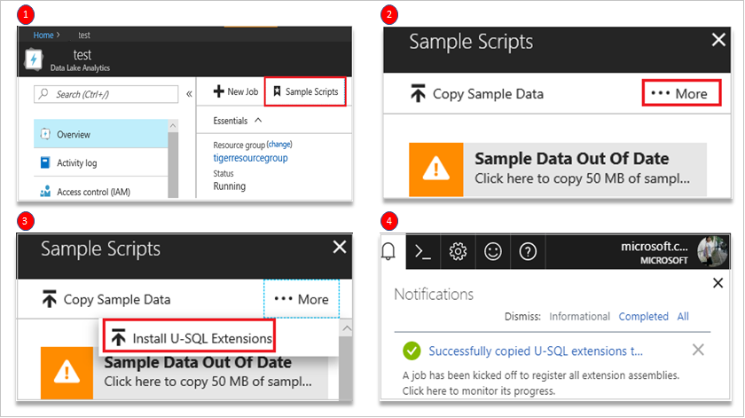

# Develop U-SQL with Python, R, and C# for Azure Data Lake Analytics in Visual Studio Code
Learn how to use Visual Studio Code (VSCode) to write Python, R and C# code behind with U-SQL and submit jobs to Azure Data Lake service. For more information about Azure Data Lake Tools for VSCode, see [Use the Azure Data Lake Tools for Visual Studio Code](data-lake-analytics-data-lake-tools-for-vscode.md).

Before writing code-behind custom code, you need to open a folder or a workspace in VSCode.


## Prerequisites for Python and R
Register Python and, R extensions assemblies for your ADL account. 
1. Open your account in portal.
   - Select **Overview**. 
   - Click **Sample Script**.
2. Click **More**.
3. Select **Install U-SQL Extensions**. 
4. Confirmation message is displayed after the U-SQL extensions are installed. 

   

   > [!Note]
   > For best experiences on Python and R language service, please install VSCode Python and R extension. 

## Develop Python file
1. Click the **New File** in your workspace.
2. Write your code in U-SQL. The following is a code sample.
    ```U-SQL
    REFERENCE ASSEMBLY [ExtPython];
    @t  = 
        SELECT * FROM 
        (VALUES
            ("D1","T1","A1","@foo Hello World @bar"),
            ("D2","T2","A2","@baz Hello World @beer")
        ) AS 
            D( date, time, author, tweet );

    @m  =
        REDUCE @t ON date
        PRODUCE date string, mentions string
        USING new Extension.Python.Reducer("pythonSample.usql.py", pyVersion : "3.5.1");

    OUTPUT @m
        TO "/tweetmentions.csv"
        USING Outputters.Csv();
    ```
    
3. Right-click a script file, and then select **ADL: Generate Python Code Behind File**. 
4. The **xxx.usql.py** file is generated in your working folder. Write your code in Python file. The following is a code sample.

    ```Python
    def get_mentions(tweet):
        return ';'.join( ( w[1:] for w in tweet.split() if w[0]=='@' ) )

    def usqlml_main(df):
        del df['time']
        del df['author']
        df['mentions'] = df.tweet.apply(get_mentions)
        del df['tweet']
        return df
    ```
5. Right-click in **USQL** file, you can click **Compile Script** or **Submit Job** to running job.

## Develop R file
1. Click the **New File** in your workspace.
2. Write your code in U-SQL file. The following is a code sample.
    ```U-SQL
    DEPLOY RESOURCE @"/usqlext/samples/R/my_model_LM_Iris.rda";
    DECLARE @IrisData string = @"/usqlext/samples/R/iris.csv";
    DECLARE @OutputFilePredictions string = @"/my/R/Output/LMPredictionsIris.txt";
    DECLARE @PartitionCount int = 10;

    @InputData =
        EXTRACT SepalLength double,
                SepalWidth double,
                PetalLength double,
                PetalWidth double,
                Species string
        FROM @IrisData
        USING Extractors.Csv();

    @ExtendedData =
        SELECT Extension.R.RandomNumberGenerator.GetRandomNumber(@PartitionCount) AS Par,
            SepalLength,
            SepalWidth,
            PetalLength,
            PetalWidth
        FROM @InputData;

    // Predict Species

    @RScriptOutput =
        REDUCE @ExtendedData
        ON Par
        PRODUCE Par,
                fit double,
                lwr double,
                upr double
        READONLY Par
        USING new Extension.R.Reducer(scriptFile : "RClusterRun.usql.R", rReturnType : "dataframe", stringsAsFactors : false);
    OUTPUT @RScriptOutput
    TO @OutputFilePredictions
    USING Outputters.Tsv();
    ```
3. Right-click in **USQL** file, and then select **ADL: Generate R Code Behind File**. 
4. The **xxx.usql.r** file is generated in your working folder. Write your code in R file. The following is a code sample.

    ```R
    load("my_model_LM_Iris.rda")
    outputToUSQL=data.frame(predict(lm.fit, inputFromUSQL, interval="confidence"))
    ```
5. Right-click in **USQL** file, you can click **Compile Script** or **Submit Job** to running job.

## Develop C# file
A code-behind file is a C# file associated with a single U-SQL script. You can define a script dedicated to UDO, UDA, UDT, and UDF in the code-behind file. The UDO, UDA, UDT, and UDF can be used directly in the script without registering the assembly first. The code-behind file is put in the same folder as its peering U-SQL script file. If the script is named xxx.usql, the code-behind is named as xxx.usql.cs. If you manually delete the code-behind file, the code-behind feature is disabled for its associated U-SQL script. For more information about writing customer code for U-SQL script, see [Writing and Using Custom Code in U-SQL: User-Defined Functions]( https://blogs.msdn.microsoft.com/visualstudio/2015/10/28/writing-and-using-custom-code-in-u-sql-user-defined-functions/).

1. Click the **New File** in your workspace.
2. Write your code in U-SQL file. The following is a code sample.
    ```U-SQL
    @a = 
        EXTRACT 
            Iid int,
        Starts DateTime,
        Region string,
        Query string,
        DwellTime int,
        Results string,
        ClickedUrls string 
        FROM @"/Samples/Data/SearchLog.tsv" 
        USING Extractors.Tsv();

    @d =
        SELECT DISTINCT Region 
        FROM @a;

    @d1 = 
        PROCESS @d
        PRODUCE 
            Region string,
        Mkt string
        USING new USQLApplication_codebehind.MyProcessor();

    OUTPUT @d1 
        TO @"/output/SearchLogtest.txt" 
        USING Outputters.Tsv();
    ```
3. Right-click in **USQL** file, and then select **ADL: Generate CS Code Behind File**. 
4. The **xxx.usql.cs** file is generated in your working folder. Write your code in CS file. The following is a code sample.

    ```CS
    namespace USQLApplication_codebehind
    {
        [SqlUserDefinedProcessor]

        public class MyProcessor : IProcessor
        {
            public override IRow Process(IRow input, IUpdatableRow output)
            {
                output.Set(0, input.Get<string>(0));
                output.Set(1, input.Get<string>(0));
                return output.AsReadOnly();
            } 
        }
    }
    ```
5. Right-click in **USQL** file, you can click **Compile Script** or **Submit Job** to running job.

## Next steps
* [Use the Azure Data Lake Tools for Visual Studio Code](data-lake-analytics-data-lake-tools-for-vscode.md)
* [U-SQL local run and local debug with Visual Studio Code](data-lake-tools-for-vscode-local-run-and-debug.md)
* [Get started with Data Lake Analytics using PowerShell](data-lake-analytics-get-started-powershell.md)
* [Get started with Data Lake Analytics using the Azure portal](data-lake-analytics-get-started-portal.md)
* [Use Data Lake Tools for Visual Studio for developing U-SQL applications](data-lake-analytics-data-lake-tools-get-started.md)
* [Use Data Lake Analytics(U-SQL) catalog](data-lake-analytics-use-u-sql-catalog.md)
