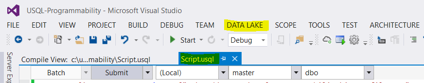
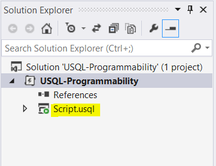
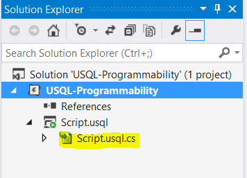
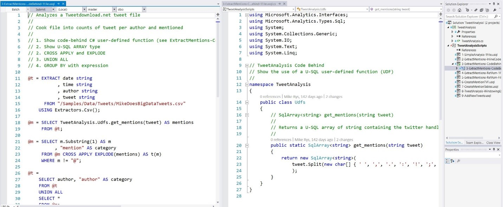
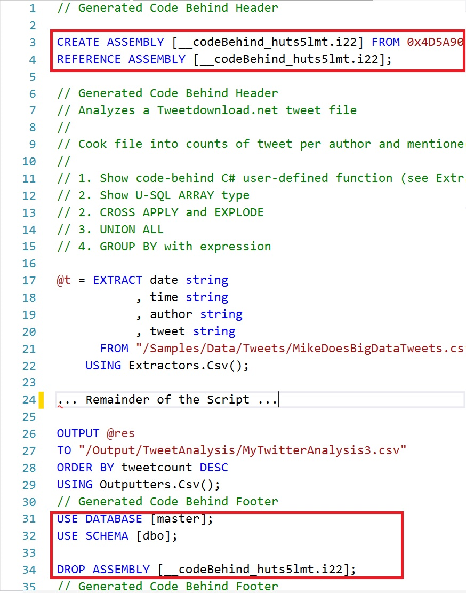
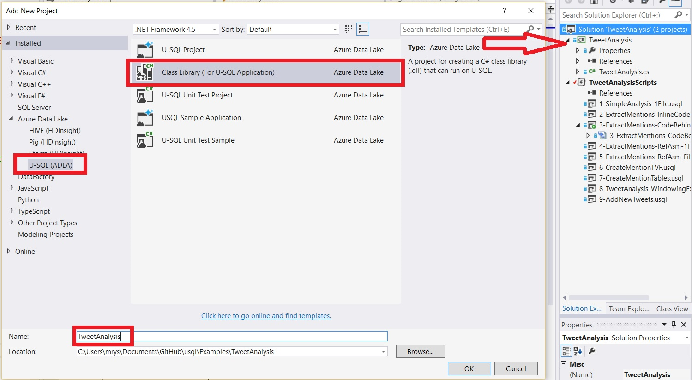
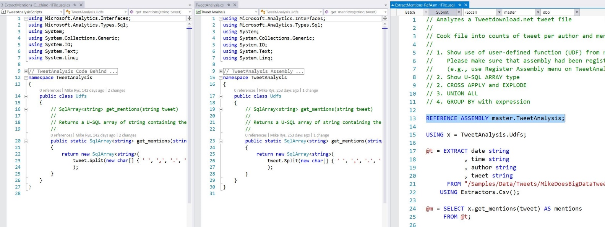
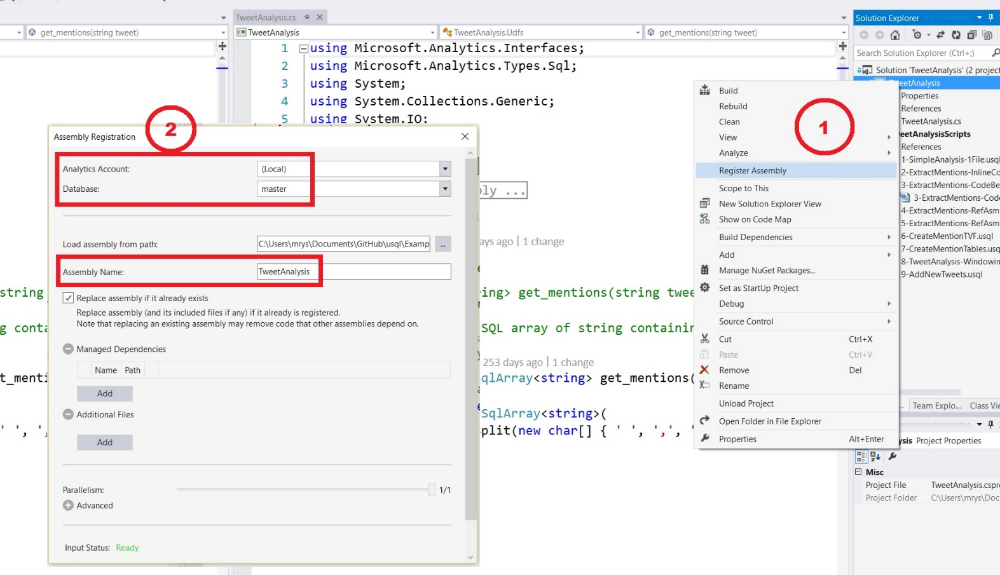
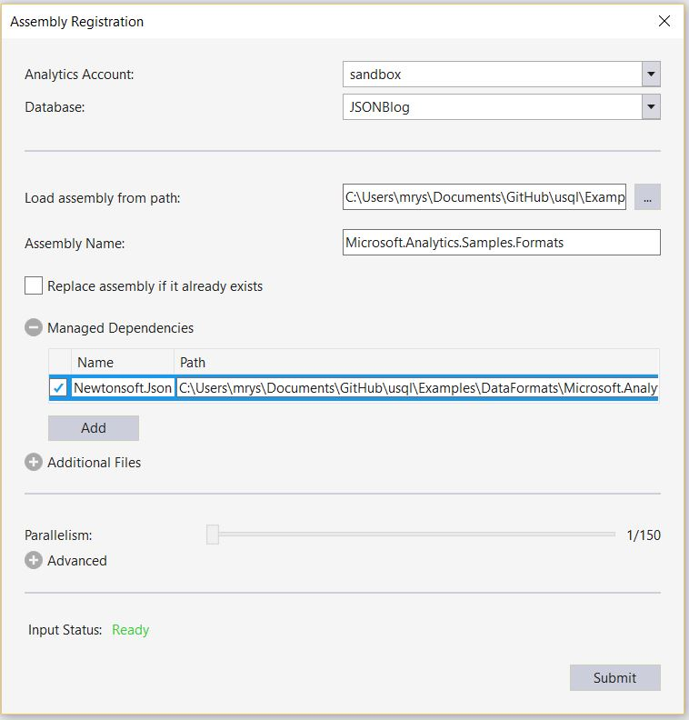

# U-SQL Programmability Guide
## Azure Data Lake
Azure Data Lake includes all the capabilities required to make it easy for developers, data scientists, and analysts to store data of any size, shape and speed, and do all types of processing and analytics across platforms and languages. It removes the complexities of ingesting and storing all your data while making it faster to get up and running with batch, streaming, and interactive analytics.

Azure Data Lake is a set of services that work together to provide a cloud-based Big Data platform:

- HDInsight
- Azure Data Lake Store
- Azure Data Lake Analytics

U-SQL is a query language specifically designed for big data type of workloads. One of the unique features of U-SQL is the combination of the SQL-like declarative language with the extensibility and programmability provided by C#. It also allows the ability to access and manipulate schema metadata, and to create custom components such as data processors and reducers.

In this guide, we concentrate on the U-SQL language’s extensibility and programmability enabled by C#.

## Requirements
To begin with ADL development, you need to download and install [Azure Data Lake Tools for Visual Studio](https://www.microsoft.com/download/details.aspx?id=49504).

## Starting with U-SQL  
The description of U-SQL language is outside of the scope of this document. However we describe a basic U-SQL constructs to gradually introduce U-SQL programmability features. For more information, see the [U-SQL Language Reference](http://aka.ms/usql_reference) guide.

Let’s look at the following example:

```sql
DECLARE @input_file string = @"\usql-programmability\input_file.tsv";
DECLARE @output_file string = @"\usql-programmability\output_file.tsv";

@rs0 =
	EXTRACT
        guid Guid,
	    dt DateTime,
        user String,
        des String
	FROM @input_file USING Extractors.Tsv();

@rs1 =
    SELECT
        MAX(guid) AS start_id,
	    MIN(dt) AS start_time,
        user,
        des
	FROM @rs0
    GROUP BY user, des;

OUTPUT @rs1 TO @output_file USING Outputters.Text();
```

In the example above, we have an **Input File** – file input_file.tsv, defined by **Local Variable** @input_file.

The following actions are performed as a result of execution of the U-SQL script above:

* The initial **EXTRACT** statement loads data to memory by converting Input File to the **Memory RowSet**.
* **SELECT** operates on data Rowset to aggregate data and prepare for exporting.
* **OUTPUT** command - exports data Rowset to **Output File** - external file.

First, let’s look at some options to use a C# expression directly in a U-SQL Script.

## C# types and expressions in U-SQL Script
A U-SQL C# expression, similar to general C#, is a sequence of one or more operators that can be evaluated to a single value, object, method, or namespace. Expressions can consist of a literal value, a method invocation, an operator, or a simple name. Simple names can be the name of a variable, type member, method parameter, namespace, or type.

When we talk about U-SQL C# expressions, we specifically refer to the U-SQL base script C# expressions. The underlying C# Code Behind section, discussed later in this document, can also contain C# expressions as regular C# code-based element.

Expressions can use operators that use other expressions as parameters, or method calls whose parameters are in turn other method calls. Example of an expression:  

```c#
	Convert.ToDateTime(Convert.ToDateTime(dt).ToString("yyyy-MM-dd"))
```

U-SQL language allows usage of standard C# expressions from build-in name spaces.  
 
```c#
	Microsoft.Analytics.Interfaces;  
	Microsoft.Analytics.Types.Sql;  
	System;  
	System.Collections.Generic;  
	System.Linq;  
	System.Text;  
```

General C# expressions can be used in U-SQL SELECT, EXTRACT.

The C# expressions can also be used in DECLARE or IF statements. The example of such expression is:   

```c#
	DateTime.Today.Day   
	Convert.ToDateTime
```

U-SQL base script example:  

```sql
	DECLARE @default_dt DateTime = Convert.ToDateTime("06/01/2016");
```

C# expressions can provide extended functionality when manipulating with columns as part of the rowset. For example, if we want to convert a datetime column to the date with zero hours, we can use the following SELECT part of U-SQL base script:

```sql
@rs1 =
    SELECT
        MAX(guid) AS start_id,
	 MIN(dt) AS start_time,
        MIN(Convert.ToDateTime(Convert.ToDateTime(dt).ToString("yyyy-MM-dd")))
AS start_zero_time,
        user,
        des
	FROM @rs0
    GROUP BY user, des;
```

As we can see, we use `System.Convert.ToDateTime` method to run through the conversion.

A little more complicated use case scenario below demonstrates the usage of some basic C# operators. Look at the expression below.

```sql
@rs1 =
    SELECT
        MAX(guid) AS start_id,
	    MIN(dt) AS start_time,
          MIN(Convert.ToDateTime(Convert.ToDateTime(dt<@default_dt?@default_dt:dt).ToString("yyyy-MM-dd"))) AS start_zero_time,
        user,
        des
	FROM @rs0
    GROUP BY user, des;
```

This shows an example of C# conditional operator expression.

The examples above demonstrates usage of C# expressions in the base U-SQL script. However U-SQL enables more extensible programmability features that are covered further in this document.  

Full script:

```sql
DECLARE @input_file string = @"\usql-programmability\input_file.tsv";
DECLARE @output_file string = @"\usql-programmability\output_file.tsv";

@rs0 =
	EXTRACT
        guid Guid,
	    dt DateTime,
        user String,
        des String
	FROM @input_file USING Extractors.Tsv();

DECLARE @default_dt DateTime = Convert.ToDateTime("06/01/2016");

@rs1 =
    SELECT
        MAX(guid) AS start_id,
	MIN(dt) AS start_time,
        MIN(Convert.ToDateTime(Convert.ToDateTime(dt<@default_dt?@default_dt:dt).ToString("yyyy-MM-dd"))) AS start_zero_time,
        user,
        des
	FROM @rs0
    GROUP BY user, des;

OUTPUT @rs1 TO @output_file USING Outputters.Text();
```

### Using C# expressions for data type conversions
From the above sample, the following example demonstrates the technique of datetime data conversion using C# expressions. In this particular scenario, string datetime data is converted to standard datetime with midnight 00:00:00 time notation.

```sql
DECLARE @dt String = "2016-07-06 10:23:15";
@rs1 =
    SELECT Convert.ToDateTime(Convert.ToDateTime(@dt).ToString("yyyy-MM-dd")) AS dt,
           dt AS olddt
    FROM @rs0;
OUTPUT @rs1 TO @output_file USING Outputters.Text();
```

### Using C# expressions for today’s date
To pull today’s date, we can use the following C# expression

```c#
DateTime.Now.ToString("M/d/yyyy")
```

In a script

```sql
@rs1 =
    SELECT
        MAX(guid) AS start_id,
	    MIN(dt) AS start_time,
        MIN(Convert.ToDateTime(Convert.ToDateTime(dt<@default_dt?@default_dt:dt).ToString("yyyy-MM-dd"))) AS start_zero_time,
        MIN(USQL_Programmability.CustomFunctions.GetFiscalPeriod(dt)) AS start_fiscalperiod,
        DateTime.Now.ToString("M/d/yyyy") AS Nowdate,
        user,
        des
	FROM @rs0
    GROUP BY user, des;
```

## In-line C# Function expressions
U-SQL allows usage of inline Function expressions definition as part of C# expressions. This enables additional possibilities of using C# functions with output reference parameters.

General Inline Function expression definition

```c#
	(Func<type of param1, type of param2>)
	(param1 =>
	     { … return param2}
	) (Rowset Column)
```

Example:

```c#
	(Func<string, DateTime?>)
	(input_p =>
	     {
	        DateTime dt_result;
	        return DateTime.TryParse(input_p, out dt_result)
	               ? (DateTime?) dt_result : (DateTime?) null;
	     }
	)
	) (dt)
```

In this example, we define inline function with string input parameter input_p. Inside this function, we verify if input string is a valid datetime value. If it is, return it, otherwise return null.

The inline function is needed in this scenario since DateTime.TryParse function contains output parameter - `out dt_result`. We define it the as `DateTime dt_result`;


## Verifying data type values
Some C# functions cannot be used directly in U-SQL base script as a C# expression. Specifically functions that require an output reference parameter. However these functions can be defined and used as part of inline function expression as we have discussed above.

### Using inline function expressions
To verify if DateTime value is valid, we can use `DateTime.TryParse`.

Here is the full example of using inline function expression to verify data type value with `DateTime.TryParse`.

In this scenario, we verify DateTime data type value

```sql
DECLARE @input_file string = @"\usql-programmability\input_file.tsv";
DECLARE @output_file string = @"\usql-programmability\output_file.tsv";

@rs0 =
	EXTRACT
        guid Guid,
	    dt string,
        user String,
        des String
	FROM @input_file USING Extractors.Tsv();

@rs1 =
    SELECT
        MAX(guid) AS start_id,
        MIN((
             (Func<string, DateTime?>)
             (input_parameter =>
                { DateTime dt_result;
                  return
                     DateTime.TryParse(input_parameter, out dt_result)
                       ?(DateTime?) dt_result : (DateTime?) null;
                }
             )
             ) (dt)) AS start_time,
        DateTime.Now.ToString("M/d/yyyy") AS Nowdate,
        user,
        des
	FROM @rs0
    GROUP BY user, des;

OUTPUT @rs1 TO @output_file USING Outputters.Text();
```

### Using Code Behind
To use the same functionality in Code Behind section of U-SQL program, we define C# function ToDateTime.

Here is the section of base U-SQL script above that needs to be changed:

```sql
     @rs1 =
    	SELECT
          MAX(guid) AS start_id,
          MIN(USQL_Programmability.CustomFunctions.ToDateTime(dt)) AS start_time,
          DateTime.Now.ToString("M/d/yyyy") AS Nowdate,
          user,
          des
          FROM @rs0
    	GROUP BY user, des;
```

and Code Behind function

```c#
        static public DateTime? ToDateTime(string dt)
        {
            DateTime dtValue;

            if (!DateTime.TryParse(dt, out dtValue))
                return Convert.ToDateTime(dt);
            else
                return null;
        }
```

## Using Code Behind
Code Behind is a C# programmability section of U-SQL project. Conceptually, Code Behind is a compiled assembly (DLL) referenced in U-SQL script. Visual Studio Tools allows you to manage and debug a C# programmability section as part of U-SQL project.

When a typical U-SQL project is created in Visual Studio, there are two parts of the project. Base script – file with extension **.usql**.




Typical Solution Project   



The second part of the project we calls a Code Behind – file Script.usql.cs  


This file contains a default namespace definition for programmability objects.

```c#
using Microsoft.Analytics.Interfaces;
using Microsoft.Analytics.Types.Sql;
using System;
using System.Collections.Generic;
using System.Linq;
using System.Text;

namespace USQL_Programmability
{

}
```

The above Code Behind template is what is generated automatically. This file contains a default namespace definition for programmability objects. During project execution, it is getting compiled and referenced in base U-SQL script.

To start developing programmability objects, we need to create a **public** class.

```c#
namespace USQL_Programmability
{
    public class MyClass
    {
        public static string MyFunction(string param1)
        {
            return "my result";
        }

    }

}
```

The programmability objects can be User-Defined Functions or **UDF**, User-Defined Types or **UDT, PROCESS, REDUCER**, etc.

## Registering U-SQL Assemblies
U-SQL’s extensibility model heavily depends on the ability to add your own custom code. Currently, U-SQL provides you with easy ways to add your own .Net-based code, in particular C#, but you can also add custom code written in other .Net languages, such as VB.Net or F#. You can even deploy your own runtime for other languages, although you need to still provide the interoperability through a .Net layer yourself. If you want us to support a specific language, please file a feature request and/or leave a comment here http://aka.ms/adlfeedback

### Difference between Code behind and Assembly registration through ADL Tools in Visual Studio
The easiest way to make use of custom code is to use the ADL Tools for Visual Studio’s code-behind capabilities.

As we mentioned earlier, you fill in the custom code for the script (for example, Script.usql) into its code-behind file (for example, Script.usql.cs).


**Figure 1**: Code-behind example in ADL Tools in VS (click image to enlarge, sample code is available [here](https://github.com/Azure/usql/tree/master/Examples/TweetAnalysis))
<br />

The advantage of code-behind is, that the tooling is taking care of the following steps for you when you submit your script:  

1. It builds the assembly for the code-behind file  

1. It adds a prologue to the script that uses the [CREATE ASSEMBLY](https://msdn.microsoft.com/library/azure/mt763293.aspx) statement to register the assembly file and uses [REFERENCE ASSEMBLY]  (https://msdn.microsoft.com/library/azure/mt763294.aspx) to load the assembly into the script’s context.

1. It adds an epilogue to the script that uses [DROP ASSEMBLY](https://msdn.microsoft.com/library/azure/mt763295.aspx) to remove the temporarily registered assembly again.

You can see the generated prologue and epilogue when you open the script:


**Figure 2**: Auto-generated prologue and epilogue for code-behind
<br />

Some of the drawbacks of code-behind are

* Code gets uploaded for every script submission
* Functionality cannot be shared with others.

Thus, you can add a separate C# Class Library (for U-SQL) to your solution (see Figure 3), develop the code or copy existing code-behind code over (no changes in the C# code required, see Figure 4), and then use the Register Assembly menu option on the project to register the assembly (see Step 1 in Figure 5).


**Figure 3**: Creating a U-SQL C# code project.  
<br />


**Figure 4**: The U-SQL C# class library next to the code-behind file.  
<br />


**Figure 5**: How to register the U-SQL C# code project
<br />

The registration dialog box (see Step 2 in Figure 5) gives you the option on where to register the assembly (which Data Lake Analytics account, which database) and how to name it (the local assembly path gets filled in by the tool). It also provides an option to re-register an already registered assembly, and it provides two options to add additional dependencies:

* *Managed Dependencies*: Shows the also needed managed assemblies. Each selected assembly is registered individually and becomes referenceable in scripts. You use this for other .Net assemblies

* *Additional Files*: Allows you to add additional resource files that are needed by the assembly. They are registered together with the assembly and automatically loaded when the assembly gets referenced. You use this for config files, native assemblies, other language runtimes, and their resources etc.

We make use of both of these options in the examples below. The [recent blog post on image processing](https://blogs.msdn.microsoft.com/azuredatalake/2016/08/18/introducing-image-processing-in-u-sql/) is another example showing the use of a predefined assembly that can use these options for registration.

Now you can refer to the registered assemblies from any U-SQL script that has permissions to the registered assemblies’ database (see the code in the U-SQL script in Figure 4). You have to add a reference for every separately registered assembly. The additional resource files will automatically be deployed. That script should not have a code-behind file for the code in referenced assemblies anymore, but can still provide other code.

### Registering assemblies via ADL Tools in Visual Studio and in U-SQL scripts
While the ADL Tools in Visual Studio make it easy to register an assembly, you can also do it with a script (in the same way that the tools do it for you) if you are for example developing on a different platform, have already compiled assemblies that you want to upload and register. You basically follow the following steps:

1. You upload your assembly dll and all also required non-system dlls and resource files into a location of you’re choosing in your Azure Data Lake Storage account or even a Microsoft Azure Blob Store account that is linked to your Azure Data Lake account. You can use any of the many upload tools available to you (for example, Powershell commands, Visual Studio’s ADL Tool Data Lake Explorer upload, your favorite SDK’s upload command or through the Azure portal).

1. Once you have uploaded the dlls, you use the [CREATE ASSEMBLY](https://msdn.microsoft.com/library/azure/mt763293.aspx) statements to register them.

We use this approach in the spatial example below.

### Registering assemblies that use other .Net assemblies (based on the JSON and XML sample library)
Our [U-SQL Github site](https://github.com/Azure/usql/) offers a set of shared example assemblies for you to use. One of the assembly, called [Microsoft.Analytics.Samples.Formats](https://github.com/Azure/usql/tree/master/Examples/DataFormats) provides extractors, functions, and outputters to handle both JSON and XML documents. The Microsoft.Analytics.Samples.Formats assembly depends on two existing domain-specific assemblies to do the processing of JSON and XML respectively. It uses the [Newtonsoft Json.Net](http://www.newtonsoft.com/) library for processing the JSON documents, and it uses the [System.Xml](https://msdn.microsoft.com/data/bb291078.aspx) assembly for processing XML. Let us use it to show how to register them and use the assemblies in our scripts.

First we download the [Visual Studio project](https://github.com/Azure/usql/tree/master/Examples/DataFormats) to our local development environment (for example, with making a local copy with the GitHub tool for Windows). Then we open the solution in Visual Studio, right-click the project as explained above to register the assembly. While this assembly has two dependencies, we only have to include the Newtonsoft dependency since System.Xml is available in the Azure Data Lake already (it has to be explicitly referenced though). Figure 6 shows how we name the assembly (note that you can choose a different name without dots as well), and add the Newtonsoft dll as well. Each of the two assemblies will now be individually registered in the specified database (for example, JSONBlog).


**Figure 6**: How to register the Microsoft.Analytics.Samples.Formats assembly from Visual Studio
<br />

If you or others, who you shared the registered assemblies with by giving them read access to the database, now want to use the JSON capability in your own scripts, you add the following two references to your script:

```
REFERENCE ASSEMBLY JSONBlog.[NewtonSoft.Json];
REFERENCE ASSEMBLY JSONBlog.[Microsoft.Analytics.Samples.Formats];
```

And if you want to use the XML functionality, you add a system assembly reference and a reference to the registered assembly:

```
REFERENCE SYSTEM ASSEMBLY [System.Xml];
REFERENCE ASSEMBLY JSONBlog.[Microsoft.Analytics.Samples.Formats];
```

For more information on how to use the JSON functionality, see [this blog post](https://blogs.msdn.microsoft.com/mrys/?p=755).

### Registering assemblies that use native C++ assemblies (using the SQL Server 2016 Spatial Type assembly from the feature pack)
Now let’s look at a slightly different scenario. Let’s assume the assembly that we want to use has a dependency on code that is not .Net based, in particular, the assembly has a dependency on a native C++ assembly. An example of such an assembly is the SQL Server type assembly [Microsoft.SqlServer.Types.dll](https://www.microsoft.com/download/details.aspx?id=52676) that provides .Net based implementations of the SQL Server hierarchyID, geometry, and geography types to be used by SQL Server client-side applications for handling the SQL Server types (it was also originally the assembly providing the implementation for the SQL Server spatial types before the SQL Server 2016 release).

Let’s look at how to register this assembly in U-SQL!

First, we download and install the assembly from the [SQL Server 2016 feature pack](https://www.microsoft.com/download/details.aspx?id=52676). Select the 64-bit version of the installer (ENU\x64\SQLSysClrTypes.msi), since we want to make sure that we have the 64-bit version of the libraries.

The installer installs the managed assembly Microsoft.SqlServer.Types.dll into C:\Program Files (x86)\Microsoft SQL Server\130\SDK\Assemblies and the native assembly SqlServerSpatial130.dll into \Windows\System32\. Now we upload the assemblies into our Azure Data Lake Store (for example, into a folder called /upload/asm/spatial).

Since the installer has installed the native library into the system folder c:\Windows\System32, we have to make sure that we either copy SqlServerSpatial130.dll out from that folder before uploading it, or make sure that the tool we use does not perform the [File System Redirection](https://msdn.microsoft.com/library/windows/desktop/aa384187(v=vs.85).aspx) of system folders. For example, if you want to upload it with the current Visual Studio ADL File Explorer, you have to copy the file into another directory first, otherwise – as of the time of the writing of this blog – you get the 32-bit version uploaded (since Visual Studio is a 32-bit application, which does File System Redirection in its ADL upload file selection window) and when you run a U-SQL script that calls into the native assembly, you get the following (inner) error at runtime:

*Inner exception from user expression: An attempt was made to load a program with an incorrect format. (Exception from HRESULT: 0x8007000B)*

After uploading the two assembly files, we now register them in a database SQLSpatial with the following script:

```sql
DECLARE @ASSEMBLY_PATH string = "/upload/asm/spatial/";
DECLARE @SPATIAL_ASM string = @ASSEMBLY_PATH+"Microsoft.SqlServer.Types.dll";
DECLARE @SPATIAL_NATIVEDLL string = @ASSEMBLY_PATH+"SqlServerSpatial130.dll";

CREATE DATABASE IF NOT EXISTS SQLSpatial;
USE DATABASE SQLSpatial;

DROP ASSEMBLY IF EXISTS SqlSpatial;
CREATE ASSEMBLY SqlSpatial
FROM @SPATIAL_ASM
WITH ADDITIONAL_FILES =
     (
         @SPATIAL_NATIVEDLL
     );
```

In this case, we only register one U-SQL assembly and include the native assembly as a string dependency to the U-SQL assembly. To use the spatial assemblies we only need to reference the U-SQL assembly, and the additional file will automatically be made available for the assembly. Here is a simple sample script using the spatial assembly:

```sql
REFERENCE SYSTEM ASSEMBLY [System.Xml];
REFERENCE ASSEMBLY SQLSpatial.SqlSpatial;

USING Geometry = Microsoft.SqlServer.Types.SqlGeometry;
USING Geography = Microsoft.SqlServer.Types.SqlGeography;
USING SqlChars = System.Data.SqlTypes.SqlChars;

@spatial =
    SELECT * FROM (VALUES
                   // The following expression is not using the native DDL
                   ( Geometry.Point(1.0,1.0,0).ToString()),    
                   // The following expression is using the native DDL
                   ( Geometry.STGeomFromText(new SqlChars("LINESTRING (100 100, 20 180, 180 180)"), 0).ToString())
                  ) AS T(geom);

OUTPUT @spatial
TO "/output/spatial.csv"
USING Outputters.Csv();
```

The SQL Types library has a dependency on the System.XML assembly, so we need to reference it. Also, some of the methods are using the System.Data.SqlTypes types instead of the built-in C# types. Since System.Data is already included by default, I just can reference to the needed SQL type. The code above is available on our [Github site](https://github.com/Azure/usql/tree/master/Examples/SQLSpatialExample).


### Assembly versioning and other points
Currently, U-SQL uses the .Net Framework version 4.5. So please make sure that your own assemblies are compatible with that version of the runtime!

As mentioned above, U-SQL runs code in a 64-bit (x64) format. So please make sure that your code is compiled to run on x64. Otherwise you get the incorrect format error shown above!

Each uploaded assembly dll, resource file such as a different runtime, a native assembly, or config files etc., can be at most 400MB and the total size of deployed resources either via the DEPLOY RESOURCE or via references assemblies and their additional files cannot exceed 3GB.

Finally, please note that each U-SQL database can only contain one version of any given assembly. For example, if you need both the version 7 and version 8 of the NewtonSoft Json.Net library, you need to register them into two different databases. Furthermore, each script can only refer to one version of a given assembly dll. In this respect, U-SQL follows the C# assembly management and versioning semantics!


## User-defined functions - UDF
U-SQL user-defined functions or UDF are programming routines that accept parameters, perform an action, such as a complex calculation, and return the result of that action as a value. The return value of UDF can only be a single scalar. U-SQL UDF can be called in U-SQL base script like any other C# scalar function.

U-SQL User-Defined Functions should be initializes as public and **static**.

```c#
        public static string MyFunction(string param1)
        {
            return "my result";
        }
```

First let’s look at the simple example of creating an UDF.

In this use case scenario, we need to determine the fiscal period – fiscal quarter and fiscal month of the first login for the specific user. First fiscal month of the year in our scenario is June.

To calculate fiscal period, we introduce the following C# function

```c#
        public static string GetFiscalPeriod(DateTime dt)
        {
            int FiscalMonth=0;
            if (dt.Month < 7)
            {
                FiscalMonth = dt.Month + 6;
            }
            else
            {
                FiscalMonth = dt.Month - 6;
            }

            int FiscalQuarter=0;
            if (FiscalMonth >=1 && FiscalMonth<=3)
            {
                FiscalQuarter = 1;
            }
            if (FiscalMonth >= 4 && FiscalMonth <= 6)
            {
                FiscalQuarter = 2;
            }
            if (FiscalMonth >= 7 && FiscalMonth <= 9)
            {
                FiscalQuarter = 3;
            }
            if (FiscalMonth >= 10 && FiscalMonth <= 12)
            {
                FiscalQuarter = 4;
            }

            return "Q" + FiscalQuarter.ToString() + ":P" + FiscalMonth.ToString();
        }
```

It simply calculates fiscal month and quarter and returns a string value. For June – first month of the first fiscal quarter – “Q1:P1”, for July – “Q1:P2”, etc.

This is a regular C# function that we are going to use our U-SQL project.

Here is how Code Behind section looks in this scenario

```c#
using Microsoft.Analytics.Interfaces;
using Microsoft.Analytics.Types.Sql;
using System;
using System.Collections.Generic;
using System.Linq;
using System.Text;

namespace USQL_Programmability
{
    public class CustomFunctions
    {
        public static string GetFiscalPeriod(DateTime dt)
        {
            int FiscalMonth=0;
            if (dt.Month < 7)
            {
                FiscalMonth = dt.Month + 6;
            }
            else
            {
                FiscalMonth = dt.Month - 6;
            }

            int FiscalQuarter=0;
            if (FiscalMonth >=1 && FiscalMonth<=3)
            {
                FiscalQuarter = 1;
            }
            if (FiscalMonth >= 4 && FiscalMonth <= 6)
            {
                FiscalQuarter = 2;
            }
            if (FiscalMonth >= 7 && FiscalMonth <= 9)
            {
                FiscalQuarter = 3;
            }
            if (FiscalMonth >= 10 && FiscalMonth <= 12)
            {
                FiscalQuarter = 4;
            }

            return "Q" + FiscalQuarter.ToString() + ":" + FiscalMonth.ToString();
        }

    }

}
```

Now we are going to call this function from the base U-SQL script. To do this, we have to provide a fully qualified name of the function, including name space – NameSpace.Class.Function(parameter)

```sql
    USQL_Programmability.CustomFunctions.GetFiscalPeriod(dt)
```

Here is the actual U-SQL base script

```sql
DECLARE @input_file string = @"\usql-programmability\input_file.tsv";
DECLARE @output_file string = @"\usql-programmability\output_file.tsv";

@rs0 =
	EXTRACT
        guid Guid,
	    dt DateTime,
        user String,
        des String
	FROM @input_file USING Extractors.Tsv();

DECLARE @default_dt DateTime = Convert.ToDateTime("06/01/2016");

@rs1 =
    SELECT
        MAX(guid) AS start_id,
	    MIN(dt) AS start_time,
        MIN(Convert.ToDateTime(Convert.ToDateTime(dt<@default_dt?@default_dt:dt).ToString("yyyy-MM-dd"))) AS start_zero_time,
        MIN(USQL_Programmability.CustomFunctions.GetFiscalPeriod(dt)) AS start_fiscalperiod,
        user,
        des
	FROM @rs0
    GROUP BY user, des;

OUTPUT @rs1 TO @output_file USING Outputters.Text();
```

Here is the output file of the script execution

```
0d8b9630-d5ca-11e5-8329-251efa3a2941,2016-02-11T07:04:17.2630000-08:00,2016-06-01T00:00:00.0000000,"Q3:8","User1",""

20843640-d771-11e5-b87b-8b7265c75a44,2016-02-11T07:04:17.2630000-08:00,2016-06-01T00:00:00.0000000,"Q3:8","User2",""

301f23d2-d690-11e5-9a98-4b4f60a1836f,2016-02-11T09:01:33.9720000-08:00,2016-06-01T00:00:00.0000000,"Q3:8","User3",""
```

This example demonstrates a simple usage of inline UDF in U-SQL.

### Keeping state between UDF invocations
U-SQL C# programmability objects can be more sophisticated utilizing interactivity through the Code Behind Global Variables. Let’s look at the following business use case scenario:

In large organizations, users can switch between varieties of internal applications. This may include Microsoft Dynamics CRM, PowerBI, etc. Customer wants to apply a telemetry analysis of how users switching between different applications, what is the usage trend and so on. The end goal for business is to optimize application usage. Possibly combine different applications or specific sign-on routines.

To achieve this goal, we have to determine a session IDs and lag time between last occurred sessions.

We need to find a previous logon and then assign this logon to all sessions that being generated to the same application. The first challenge is that U-SQL base script will not allow us to apply calculations over already calculated column with LAG function. The second challenge is that we have to keep the specific session for all sessions within the same time period.

To solve this problem, we are going to use a Global Variable inside Code Behind section - `static public string globalSession;`.

This Global Variable is applied to the entire rowset during our script execution.

Here is the Code Behind section of our U-SQL program

```c#
using Microsoft.Analytics.Interfaces;
using Microsoft.Analytics.Types.Sql;
using System;
using System.Collections.Generic;
using System.Linq;
using System.Text;

namespace USQLApplication21
{
    public class UserSession
    {
        static public string globalSession;
        static public string StampUserSession(string eventTime, string PreviousRow, string Session)
        {

            if (!string.IsNullOrEmpty(PreviousRow))
            {
                double timeGap = Convert.ToDateTime(eventTime).Subtract(Convert.ToDateTime(PreviousRow)).TotalMinutes;
                if (timeGap <= 60)
                    return Session;
                else
                    return Guid.NewGuid().ToString();
            }
            else
                return Guid.NewGuid().ToString();

        }

        static public string getStampUserSession(string Session)
        {
            if (Session != globalSession && !string.IsNullOrEmpty(Session))
            {
                globalSession = Session;
            }
            return globalSession;
        }

    }
}
```

Global variable `static public string globalSession;` used inside `getStampUserSession` function and is getting reinitialized every time when Session parameter is changed.

U-SQL base script

```sql
DECLARE @in string = @"\UserSession\test1.tsv";
DECLARE @out1 string = @"\UserSession\Out1.csv";
DECLARE @out2 string = @"\UserSession\Out2.csv";
DECLARE @out3 string = @"\UserSession\Out3.csv";

@records =
    EXTRACT DataId string,
            EventDateTime string,           
            UserName string,
            UserSessionTimestamp string

    FROM @in
    USING Extractors.Tsv();

@rs1 =
    SELECT EventDateTime,
           UserName,
LAG(EventDateTime, 1) OVER(PARTITION BY UserName ORDER BY EventDateTime ASC) AS prevDateTime,          
           string.IsNullOrEmpty(LAG(EventDateTime, 1) OVER(PARTITION BY UserName ORDER BY EventDateTime ASC)) AS Flag,           
           USQLApplication21.UserSession.StampUserSession
           (
           	EventDateTime,
           	LAG(EventDateTime, 1) OVER(PARTITION BY UserName ORDER BY EventDateTime ASC),
           	LAG(UserSessionTimestamp, 1) OVER(PARTITION BY UserName ORDER BY EventDateTime ASC)
           )
           AS UserSessionTimestamp
    FROM @records;

@rs2 =
    SELECT EventDateTime,
           UserName,
           LAG(EventDateTime, 1) OVER(PARTITION BY UserName ORDER BY EventDateTime ASC) AS prevDateTime,
           string.IsNullOrEmpty(LAG(EventDateTime, 1) OVER(PARTITION BY UserName ORDER BY EventDateTime ASC)) AS Flag,
           USQLApplication21.UserSession.getStampUserSession(UserSessionTimestamp) AS UserSessionTimestamp
    FROM @rs1
    WHERE UserName != "UserName";

OUTPUT @rs2
TO @out2
ORDER BY UserName, EventDateTime ASC
USING Outputters.Csv();
```

Function `USQLApplication21.UserSession.getStampUserSession(UserSessionTimestamp)` is called here during second Memory Rowset calculation. It passes `UserSessionTimestamp` column and returns the value until is `UserSessionTimestamp` changed.

The output file

```
"2016-02-19T07:32:36.8420000-08:00","User1",,True,"72a0660e-22df-428e-b672-e0977007177f"
"2016-02-17T11:52:43.6350000-08:00","User2",,True,"4a0cd19a-6e67-4d95-a119-4eda590226ba"
"2016-02-17T11:59:08.8320000-08:00","User2","2016-02-17T11:52:43.6350000-08:00",False,"4a0cd19a-6e67-4d95-a119-4eda590226ba"
"2016-02-11T07:04:17.2630000-08:00","User3",,True,"51860a7a-1610-4f74-a9ea-69d5eef7cd9c"
"2016-02-11T07:10:33.9720000-08:00","User3","2016-02-11T07:04:17.2630000-08:00",False,"51860a7a-1610-4f74-a9ea-69d5eef7cd9c"
"2016-02-15T21:27:41.8210000-08:00","User3","2016-02-11T07:10:33.9720000-08:00",False,"4d2bc48d-bdf3-4591-a9c1-7b15ceb8e074"
"2016-02-16T05:48:49.6360000-08:00","User3","2016-02-15T21:27:41.8210000-08:00",False,"dd3006d0-2dcd-42d0-b3a2-bc03dd77c8b9"
"2016-02-16T06:22:43.6390000-08:00","User3","2016-02-16T05:48:49.6360000-08:00",False,"dd3006d0-2dcd-42d0-b3a2-bc03dd77c8b9"
"2016-02-17T16:29:53.2280000-08:00","User3","2016-02-16T06:22:43.6390000-08:00",False,"2fa899c7-eecf-4b1b-a8cd-30c5357b4f3a"
"2016-02-17T16:39:07.2430000-08:00","User3","2016-02-17T16:29:53.2280000-08:00",False,"2fa899c7-eecf-4b1b-a8cd-30c5357b4f3a"
"2016-02-17T17:20:39.3220000-08:00","User3","2016-02-17T16:39:07.2430000-08:00",False,"2fa899c7-eecf-4b1b-a8cd-30c5357b4f3a"
"2016-02-19T05:23:54.5710000-08:00","User3","2016-02-17T17:20:39.3220000-08:00",False,"6ca7ed80-c149-4c22-b24b-94ff5b0d824d"
"2016-02-19T05:48:37.7510000-08:00","User3","2016-02-19T05:23:54.5710000-08:00",False,"6ca7ed80-c149-4c22-b24b-94ff5b0d824d"
"2016-02-19T06:40:27.4830000-08:00","User3","2016-02-19T05:48:37.7510000-08:00",False,"6ca7ed80-c149-4c22-b24b-94ff5b0d824d"
"2016-02-19T07:27:37.7550000-08:00","User3","2016-02-19T06:40:27.4830000-08:00",False,"6ca7ed80-c149-4c22-b24b-94ff5b0d824d"
"2016-02-19T19:35:40.9450000-08:00","User3","2016-02-19T07:27:37.7550000-08:00",False,"3f385f0b-3e68-4456-ac74-ff6cef093674"
"2016-02-20T00:07:37.8250000-08:00","User3","2016-02-19T19:35:40.9450000-08:00",False,"685f76d5-ca48-4c58-b77d-bd3a9ddb33da"
"2016-02-11T09:01:33.9720000-08:00","User4",,True,"9f0cf696-c8ba-449a-8d5f-1ca6ed8f2ee8"
"2016-02-17T06:30:38.6210000-08:00","User4","2016-02-11T09:01:33.9720000-08:00",False,"8b11fd2a-01bf-4a5e-a9af-3c92c4e4382a"
"2016-02-17T22:15:26.4020000-08:00","User4","2016-02-17T06:30:38.6210000-08:00",False,"4e1cb707-3b5f-49c1-90c7-9b33b86ca1f4"
"2016-02-18T14:37:27.6560000-08:00","User4","2016-02-17T22:15:26.4020000-08:00",False,"f4e44400-e837-40ed-8dfd-2ea264d4e338"
"2016-02-19T01:20:31.4800000-08:00","User4","2016-02-18T14:37:27.6560000-08:00",False,"2136f4cf-7c7d-43c1-8ae2-08f4ad6a6e08"
```

This example demonstrates a more complicated use case scenario when we use a Global Variable inside Code behind section applied to entire Memory Rowset.

## Using User-Defined Types - UDT
User-Defined Types or UDT is another programmability feature of U-SQL. U-SQL UDT acts like a regular C# user-defined type. C# is a strongly typed language that allows the use of built-in and custom user-defined types.

U-SQL currently cannot implicitly serialize/de-serialize UDT data to/from external files. Because of this, the IFormatter interface has to be defined with Serialize/De-serialize methods as part of the UDT definition. In ADLA V1 only intermediate serialization is supported. This means that while IFormatter is important for internal UDT processing, it cannot be used for persistent serialization in EXTRACTOR or OUTPUTTER. When writing data to file with OUTPUTTER or reading with EXTRACTOR, UDT has to be serialized to string with ToString() method of UDT implementation. As an alternative, custom EXTRACTOR/OUTPUTTER can be used when dealing with UDT.  

If we try to use UDT in EXTRACTOR or OUTPUTTER (out of previous SELECT)

```sql
@rs1 =
    SELECT MyNameSpace.Myfunction_Returning_UDT(filed1) AS myfield
    FROM @rs0;

OUTPUT @rs1 TO @output_file USING Outputters.Text();
```

we receive the following error

```
	Error	1	E_CSC_USER_INVALIDTYPEINOUTPUTTER: Outputters.Text was used to output column myfield of type
	MyNameSpace.Myfunction_Returning_UDT.

	Description:

	Outputters.Text only supports built-in types.

	Resolution:

	Implement a custom outputter that knows how to serialize this type or call a serialization method on the type in
	the preceding SELECT.	C:\Users\sergeypu\Documents\Visual Studio 2013\Projects\USQL-Programmability\
	USQL-Programmability\Types.usql	52	1	USQL-Programmability
```

To work with UDT in Outptutter, we either have to serialize it to string with ToString() method, you create a custom Outputter.

UDTs currently cannot be used in GROUP BY. If UDT is used in GROUP BY, the following error is thrown:

```
	Error	1	E_CSC_USER_INVALIDTYPEINCLAUSE: GROUP BY doesn't support type MyNameSpace.Myfunction_Returning_UDT
	for column myfield

	Description:

	GROUP BY doesn't support UDT or Complex types.

	Resolution:

	Add a SELECT statement where you can project a scalar column that you want to use with GROUP BY.
	C:\Users\sergeypu\Documents\Visual Studio 2013\Projects\USQL-Programmability\USQL-Programmability\Types.usql
	62	5	USQL-Programmability
```

To define a UDT, we have to:

* Add the following name spaces

```c#
	using Microsoft.Analytics.Interfaces
	using System.IO;
```

* `Microsoft.Analytics.Interfaces` required for the UDT interfaces and `System.IO` may be needed to define IFormatter interface

* Define Used Defined Type with SqlUserDefinedType attribute

**SqlUserDefinedType** is used to mark a type definition in an assembly as a user-defined type (UDT) in U-SQL. The properties on the attribute reflect the physical characteristics of the UDT. This class cannot be inherited.

SqlUserDefinedType is a required attribute for UDT definition.

The constructor of the class  

* SqlUserDefinedTypeAttribute(Type formatter)

* Type formatter – required parameter to define an UDT formatter. Specifically type of the `IFormatter` interface
	has to be passed here.

```c#
	[SqlUserDefinedType(typeof(MyTypeFormatter))]
	  public class MyType
       	   {
             …
           }
```

* Typical UDT will also require definition of IFormatter interface

```c#
       public class MyTypeFormatter : IFormatter<MyType>
        {
            public void Serialize(MyType instance, IColumnWriter writer,
                           ISerializationContext context)
            {
		…
            }

            public MyType Deserialize(IColumnReader reader,
                                  ISerializationContext context)
            {
		…
            }
        }
```

`IFormatter` interface to serialize and de-serialize an object graph with the root type of \<typeparamref name="T">.

\<typeparam name="T">The root type for the object graph to serialize and de-serialize.

* Deserialize – de-serialize the data on the provided stream and reconstitutes the graph of objects.

* Serialize – serializes an object, or graph of objects with the given root to the provided stream.

`MyType` instance – instance of the type  
`IColumnWriter` writer / `IColumnReader` reader – the underlying column stream.  
`ISerializationContext` context – enum that defines a set of flags that specifies the source or destination context for the stream during serialization. 
 
   * *Intermediate* - specifies that the source or destination context is not a persisted store

   * *Persistence* - specifies that the source or destination context is a persisted store

As a regular C# type, U-SQL UDT definition may include overrides for operators such as +/==/!=, etc. Can include static methods and so on. For example, if we are going to use this UDT as a parameter to U-SQL MIN aggregate function, we have to define < operator override.

Earlier in this guide we demonstrated an example for fiscal period identification from the specific date in format of Qn:Pn (Q1:P10). The following example shows how to define a custom type for fiscal period values.

Code Behind section with custom UDT and IFormatter interface for it:

```c#
        [SqlUserDefinedType(typeof(FiscalPeriodFormatter))]
        public struct FiscalPeriod
        {
            public int Quarter { get; private set; }

            public int Month { get; private set; }

            public FiscalPeriod(int quarter, int month):this()
            {
                this.Quarter = quarter;
                this.Month = month;
            }

            public override bool Equals(object obj)
            {
                if (ReferenceEquals(null, obj))
                {
                    return false;
                }

                return obj is FiscalPeriod && Equals((FiscalPeriod)obj);
            }

            public bool Equals(FiscalPeriod other)
            {
return this.Quarter.Equals(other.Quarter) && this.Month.Equals(other.Month);
            }

            public bool GreaterThan(FiscalPeriod other)
            {
return this.Quarter.CompareTo(other.Quarter) > 0 || this.Month.CompareTo(other.Month) > 0;
            }

            public bool LessThan(FiscalPeriod other)
            {
return this.Quarter.CompareTo(other.Quarter) < 0 || this.Month.CompareTo(other.Month) < 0;
            }

            public override int GetHashCode()
            {
                unchecked
                {
                    return (this.Quarter.GetHashCode() * 397) ^ this.Month.GetHashCode();
                }
            }

            public static FiscalPeriod operator +(FiscalPeriod c1, FiscalPeriod c2)
            {
return new FiscalPeriod((c1.Quarter + c2.Quarter) > 4 ? (c1.Quarter + c2.Quarter)-4 : (c1.Quarter + c2.Quarter), (c1.Month + c2.Month) > 12 ? (c1.Month + c2.Month) - 12 : (c1.Month + c2.Month));
            }

            public static bool operator ==(FiscalPeriod c1, FiscalPeriod c2)
            {
                return c1.Equals(c2);
            }

            public static bool operator !=(FiscalPeriod c1, FiscalPeriod c2)
            {
                return !c1.Equals(c2);
            }
            public static bool operator >(FiscalPeriod c1, FiscalPeriod c2)
            {
                return c1.GreaterThan(c2);
            }
            public static bool operator <(FiscalPeriod c1, FiscalPeriod c2)
            {
                return c1.LessThan(c2);
            }
            public override string ToString()
            {
                return (String.Format("Q{0}:P{1}", this.Quarter, this.Month));
            }

        }

        public class FiscalPeriodFormatter : IFormatter<FiscalPeriod>
        {
public void Serialize(FiscalPeriod instance, IColumnWriter writer, ISerializationContext context)
            {
                using (var binaryWriter = new BinaryWriter(writer.BaseStream))
                {
                    binaryWriter.Write(instance.Quarter);
                    binaryWriter.Write(instance.Month);
                    binaryWriter.Flush();
                }
            }

public FiscalPeriod Deserialize(IColumnReader reader, ISerializationContext context)
            {
                using (var binaryReader = new BinaryReader(reader.BaseStream))
                {
var result = new FiscalPeriod(binaryReader.ReadInt16(), binaryReader.ReadInt16());
                    return result;
                }
            }
        }
```

The defined type includes two numbers – Quarter and Month. Operators ==/!=/>/< and static method ToString() are defined here.

As mentioned earlier, UDT can be used in SELECT expression, but cannot be used in OUTPUTTER/EXTRACTOR without custom serialization. It either has to be serialized as a string with ToString() or used with custom OUTPUTTER/EXTRACTOR.

Now let’s discuss usage of UDT. In Code Behind section, we changed our GetFiscalPeriod function to

```c#
        public static FiscalPeriod GetFiscalPeriodWithCustomType(DateTime dt)
        {
            int FiscalMonth = 0;
            if (dt.Month < 7)
            {
                FiscalMonth = dt.Month + 6;
            }
            else
            {
                FiscalMonth = dt.Month - 6;
            }

            int FiscalQuarter = 0;
            if (FiscalMonth >= 1 && FiscalMonth <= 3)
            {
                FiscalQuarter = 1;
            }
            if (FiscalMonth >= 4 && FiscalMonth <= 6)
            {
                FiscalQuarter = 2;
            }
            if (FiscalMonth >= 7 && FiscalMonth <= 9)
            {
                FiscalQuarter = 3;
            }
            if (FiscalMonth >= 10 && FiscalMonth <= 12)
            {
                FiscalQuarter = 4;
            }

            return new FiscalPeriod(FiscalQuarter, FiscalMonth);
        }
```

As you can see, it returns value of our FiscalPeriod type.

Here is how we use it further in U-SQL base script. This example demonstrates different ways of UDT invocation from U-SQL script.

```sql
DECLARE @input_file string = @"c:\work\cosmos\usql-programmability\input_file.tsv";
DECLARE @output_file string = @"c:\work\cosmos\usql-programmability\output_file.tsv";

@rs0 =
	EXTRACT
        guid string,
	    dt DateTime,
        user String,
        des String
	FROM @input_file USING Extractors.Tsv();

@rs1 =
    SELECT guid AS start_id,
           dt,
           DateTime.Now.ToString("M/d/yyyy") AS Nowdate,
           USQL_Programmability.CustomFunctions.GetFiscalPeriodWithCustomType(dt).Quarter AS fiscalquarter,
           USQL_Programmability.CustomFunctions.GetFiscalPeriodWithCustomType(dt).Month AS fiscalmonth,
           USQL_Programmability.CustomFunctions.GetFiscalPeriodWithCustomType(dt) + new USQL_Programmability.CustomFunctions.FiscalPeriod(1,7) AS fiscalperiod_adjusted,
           user,
           des
    FROM @rs0;

@rs2 =
    SELECT start_id,
           dt,
           DateTime.Now.ToString("M/d/yyyy") AS Nowdate,
           fiscalquarter,
           fiscalmonth,
           USQL_Programmability.CustomFunctions.GetFiscalPeriodWithCustomType(dt).ToString() AS fiscalperiod,
           fiscalperiod_adjusted.ToString() AS fiscalperiod_adjusted,
           user,
           des
    FROM @rs1;

OUTPUT @rs2 TO @output_file USING Outputters.Text();
```

Full Code behind section:

```c#
using Microsoft.Analytics.Interfaces;
using Microsoft.Analytics.Types.Sql;
using System;
using System.Collections.Generic;
using System.Linq;
using System.Text;
using System.IO;

namespace USQL_Programmability
{
    public class CustomFunctions
    {
        static public DateTime? ToDateTime(string dt)
        {
            DateTime dtValue;

            if (!DateTime.TryParse(dt, out dtValue))
                return Convert.ToDateTime(dt);
            else
                return null;
        }

        public static FiscalPeriod GetFiscalPeriodWithCustomType(DateTime dt)
        {
            int FiscalMonth = 0;
            if (dt.Month < 7)
            {
                FiscalMonth = dt.Month + 6;
            }
            else
            {
                FiscalMonth = dt.Month - 6;
            }

            int FiscalQuarter = 0;
            if (FiscalMonth >= 1 && FiscalMonth <= 3)
            {
                FiscalQuarter = 1;
            }
            if (FiscalMonth >= 4 && FiscalMonth <= 6)
            {
                FiscalQuarter = 2;
            }
            if (FiscalMonth >= 7 && FiscalMonth <= 9)
            {
                FiscalQuarter = 3;
            }
            if (FiscalMonth >= 10 && FiscalMonth <= 12)
            {
                FiscalQuarter = 4;
            }

            return new FiscalPeriod(FiscalQuarter, FiscalMonth);
        }


        [SqlUserDefinedType(typeof(FiscalPeriodFormatter))]
        public struct FiscalPeriod
        {
            public int Quarter { get; private set; }

            public int Month { get; private set; }

            public FiscalPeriod(int quarter, int month):this()
            {
                this.Quarter = quarter;
                this.Month = month;
            }

            public override bool Equals(object obj)
            {
                if (ReferenceEquals(null, obj))
                {
                    return false;
                }

                return obj is FiscalPeriod && Equals((FiscalPeriod)obj);
            }

            public bool Equals(FiscalPeriod other)
            {
return this.Quarter.Equals(other.Quarter) &&    this.Month.Equals(other.Month);
            }

            public bool GreaterThan(FiscalPeriod other)
            {
return this.Quarter.CompareTo(other.Quarter) > 0 || this.Month.CompareTo(other.Month) > 0;
            }

            public bool LessThan(FiscalPeriod other)
            {
return this.Quarter.CompareTo(other.Quarter) < 0 || this.Month.CompareTo(other.Month) < 0;
            }

            public override int GetHashCode()
            {
                unchecked
                {
                    return (this.Quarter.GetHashCode() * 397) ^ this.Month.GetHashCode();
                }
            }

            public static FiscalPeriod operator +(FiscalPeriod c1, FiscalPeriod c2)
            {
return new FiscalPeriod((c1.Quarter + c2.Quarter) > 4 ? (c1.Quarter + c2.Quarter)-4 : (c1.Quarter + c2.Quarter), (c1.Month + c2.Month) > 12 ? (c1.Month + c2.Month) - 12 : (c1.Month + c2.Month));
            }

            public static bool operator ==(FiscalPeriod c1, FiscalPeriod c2)
            {
                return c1.Equals(c2);
            }

            public static bool operator !=(FiscalPeriod c1, FiscalPeriod c2)
            {
                return !c1.Equals(c2);
            }
            public static bool operator >(FiscalPeriod c1, FiscalPeriod c2)
            {
                return c1.GreaterThan(c2);
            }
            public static bool operator <(FiscalPeriod c1, FiscalPeriod c2)
            {
                return c1.LessThan(c2);
            }
            public override string ToString()
            {
                return (String.Format("Q{0}:P{1}", this.Quarter, this.Month));
            }

        }

        public class FiscalPeriodFormatter : IFormatter<FiscalPeriod>
        {
public void Serialize(FiscalPeriod instance, IColumnWriter writer, ISerializationContext context)
            {
                using (var binaryWriter = new BinaryWriter(writer.BaseStream))
                {
                    binaryWriter.Write(instance.Quarter);
                    binaryWriter.Write(instance.Month);
                    binaryWriter.Flush();
                }
            }

public FiscalPeriod Deserialize(IColumnReader reader, ISerializationContext context)
            {
                using (var binaryReader = new BinaryReader(reader.BaseStream))
                {
var result = new FiscalPeriod(binaryReader.ReadInt16(), binaryReader.ReadInt16());
                    return result;
                }
            }
        }

    }
}
```

### UDTs from built-in Types
Coming Soon

## User-defined aggregates – UDAGG
User-defined aggregates are any aggregation-related functions that are not shipped out of the box with U-SQL. The example can be an aggregate to perform a custom math calculation, perform string concatenations or manipulations with strings, etc.

User-defined aggregate base class definition is

```c#
    [SqlUserDefinedAggregate]
    public abstract class IAggregate<T1, T2, TResult> : IAggregate
    {
        protected IAggregate();

        public abstract void Accumulate(T1 t1, T2 t2);
        public abstract void Init();
        public abstract TResult Terminate();
    }
```

**SqlUserDefinedAggregate** indicates that the type should be registered as a user-defined aggregate. This class cannot be inherited.

SqlUserDefinedType attribute is **optional** for UDAGG definition


The base class allows you to pass three abstract parameters – two input ones and one the result. The data types are variable and should be defined during class inheritance.

```c#
    public class GuidAggregate : IAggregate<string, string, string>
    {
        string guid_agg;

        public override void Init()
        {
		…
        }

        public override void Accumulate(string guid, string user)
        {
		…
        }

        public override string Terminate()
        {
		…
        }

    }
```

* Init provides initialization routine for each aggregation group. It invokes once for each group during computation.
* Accumulate – executed once for each value. Provides main functionality for the aggregation algorithm. Can be used to aggregate values with various data types defined during class inheritance. Can accept two parameters of variable data types.
* Terminate - executed once per aggregation group at the end of processing to output the result for each group

To declare a correct input and output data types, use class definition

```c#
	public abstract class IAggregate<T1, T2, TResult> : IAggregate
```

* T1 – first parameter to Accumulate
* T2 – first parameter to Accumulate
* TResult – return type of Terminate

for example

```c#
	public class GuidAggregate : IAggregate<string, int, int>
```

or

```c#
	public class GuidAggregate : IAggregate<string, string, string>
```

### Using UDAGG in U-SQL
To use UDAGG, first define it in code behind or reference it from the existent programmability DLL as discussed earlier.

Then use the following syntax

```c#
    AGG<UDAGG_functionname>(param1,param2)
```

Here is the example of UDAGG

```c#
    public class GuidAggregate : IAggregate<string, string, string>
    {
        string guid_agg;

        public override void Init()
        {
            guid_agg = "";
        }

        public override void Accumulate(string guid, string user)
        {
            if (user.ToUpper()== "USER1")
            {
                guid_agg += "{" + guid + "}";
            }
        }

        public override string Terminate()
        {
            return guid_agg;
        }

    }
```

and base U-SQL script

```sql
DECLARE @input_file string = @"\usql-programmability\input_file.tsv";
DECLARE @output_file string = @" \usql-programmability\output_file.tsv";

@rs0 =
	EXTRACT
        guid string,
	    dt DateTime,
        user String,
        des String
	FROM @input_file USING Extractors.Tsv();

@rs1 =
    SELECT
        user,
        AGG<USQL_Programmability.GuidAggregate>(guid,user) AS guid_list
	FROM @rs0
    GROUP BY user;

OUTPUT @rs1 TO @output_file USING Outputters.Text();
```

In this use case scenario, we concatenate class GUIDs for the specific users.

## User-defined objects – UDO
U-SQL provides an ability to define custom programmability objects, which called User-Defined Objects or UDO.

The following list of UDO in U-SQL

* User-Defined Extractors
	* Extract row by row
	* Used to implement data extraction form custom structured files

* User-Defined Outputters
	* Output row by row
	* Used to Output custom data types or to custom file format

* User-Defined Processors
	* Take one row and produce one row
	* Used to reduce number of columns or produce new column with values derived from existent column set

* User-Defined Appliers
	* Take one row and produce 0 to n rows
	* Used with OUTER/CROSS APPLY

* User-Defined Combiners
	* Combines rowsets – user-defined JOINs

* User-Defined Reducers
	* Take n rows and produce one row
	* Used to reduce number of rows

UDO typically called explicitly in U-SQL script as part of the following U-SQL statements:

* EXTRACT
* OUTPUT
* PROCESS
* COMBINE
* REDUCE

## User-Defined Extractor
U-SQL allows you to import external data by using EXTRACT statement. The EXTRACT statement can use built-in UDO extractors  

* *Extractors.Text()*: Provides extraction from delimited text files of different encodings.

* *Extractors.Csv()*: Provides extraction from comma-separated value (CSV) files of
different encodings.

* *Extractors.Tsv()*: Provides extraction from tab-separated value (TSV) files of different encodings.

However, it can be useful to develop a custom extractor. This can be helpful during data import if we want to

* Modify input data by splitting columns, modifying individual values. Combining columns is better to achieve by using PROCESSOR functionality.
* Parse unstructured such as Web pages/Emails r or semi-unstructured data such as XML/JSON.
* Parse data in unsupported encoding

To define User-Defined Extractor or UDE, we need to create `IExtractor` interface. All input parameters to the extractor, such as column/row delimiters, encoding, etc., needs to be defined in the constructor of the class. The `IExtractor`  interface should also contain definition for `IEnumerable<IRow>` override

```c#
     [SqlUserDefinedExtractor]
     public class SampleExtractor : IExtractor
     {
         public SampleExtractor(string row_delimiter, char col_delimiter)
         {
            …

         }

         public override IEnumerable<IRow> Extract(IUnstructuredReader input, IUpdatableRow output)
         {
             …
         }
     }
```

**SqlUserDefinedExtractor** attribute indicates that the type should be registered as a user-defined extractor. This class cannot be inherited.

SqlUserDefinedExtractor is an optional attribute for UDE definition. It used to define AtomicFileProcessing property for the UDE object.

* bool     AtomicFileProcessing   

* **true**  = Indicates this Extractor requires atomic input files (JSON, XML, ...)
* **false** = Indicates this Extractor can deal with split / distributed files (CSV, SEQ, ...)

The main UDE programmability objects are *input* and *output*. Input object is used to enumerate input data as `IUnstructuredReader` and *output* – to set output data as a result of the extractor activity.

The input data is accessed through the `System.IO.Stream` and `System.IO.StreamReader`.

For input columns enumeration, we first split the input stream using row delimiter

```c#
	foreach (Stream current in input.Split(my_row_delimiter))
	{
	…
	}
```

Then, further split input row into column parts.

```c#
	foreach (Stream current in input.Split(my_row_delimiter))
	{
	…
		string[] parts = line.Split(my_column_delimiter);
       		foreach (string part in parts)
		{
		…
		}
	}
```

To set output data, we use `output.Set` method

It is important to understand that custom extractor will only output columns/values defined with output. Set method call.

```c#
	output.Set<string>(count, part);
```

The actual extractor output is triggered by calling to `yield return output.AsReadOnly();`.

Here is the extractor example

```c#
    [SqlUserDefinedExtractor(AtomicFileProcessing = true)]
    public class FullDescriptionExtractor : IExtractor
    {
         private Encoding _encoding;
         private byte[] _row_delim;
         private char _col_delim;

        public FullDescriptionExtractor(Encoding encoding, string row_delim = "\r\n", char col_delim = '\t')
        {
             this._encoding = ((encoding == null) ? Encoding.UTF8 : encoding);
             this._row_delim = this._encoding.GetBytes(row_delim);
             this._col_delim = col_delim;

        }

        public override IEnumerable<IRow> Extract(IUnstructuredReader input, IUpdatableRow output)
        {
             string line;
             //Read the input line by line
             foreach (Stream current in input.Split(_encoding.GetBytes("\r\n")))
             {
                using (System.IO.StreamReader streamReader = new StreamReader(current, this._encoding))
                 {
                     line = streamReader.ReadToEnd().Trim();
                     //Split the input by the column delimiter
                     string[] parts = line.Split(this._col_delim);
                     int count = 0; // start with first column
                     foreach (string part in parts)
                     {
    if (count == 0)
                         {  // for column “guid”, re-generated guid
                             Guid new_guid = Guid.NewGuid();
                             output.Set<Guid>(count, new_guid);
                         }
                         else if (count == 2)
                         {
                             // for column “user”, convert to UPPER case
                             output.Set<string>(count, part.ToUpper());

                         }
                         else
                         {
                             // keep the rest of the columns as-is
                             output.Set<string>(count, part);
                         }
                         count += 1;
                     }

                 }
                 yield return output.AsReadOnly();
             }
             yield break;
         }
     }
```

In this use case scenario, the extractor regenerates GUID for “guid” column and converts the values of “user” column to UPPER case. Custom extractors can produce more complicated results by parsing input data and manipulating with it.

Base U-SQL script that uses a custom extractor

```sql
DECLARE @input_file string = @"\usql-programmability\input_file.tsv";
DECLARE @output_file string = @"\usql-programmability\output_file.tsv";

@rs0 =
	EXTRACT
        guid Guid,
	    dt String,
        user String,
        des String
	FROM @input_file
    USING new USQL_Programmability.FullDescriptionExtractor(Encoding.UTF8);

OUTPUT @rs0 TO @output_file USING Outputters.Text();
```

## User-Defined Outputter
User-Defined Outputter is another U-SQL UDO that allows to extend a built-in U-SQL functionality. Similar to the extractor, there are several built-in outputters.

* *Outputters.Text()*: Writes data to delimited text files of different encodings.
* *Outputters.Csv()*: Writes data to comma-separated value (CSV) files of
different encodings.
* *Outputters.Tsv()*: Writes data to tab-separated value (TSV) files of different encodings.

Custom outputter allows you to write data in a custom defined format. This can be useful for

* Writing data to semi-structured or unstructured files
* Writing data not supported encodings
* Modifying output data or adding custom attributes

To define User-Defined Outputter, we need to create `IOutputter` interface

Base `IOutputter` class implementation

```c#
    public abstract class IOutputter : IUserDefinedOperator
    {
        protected IOutputter();

        public virtual void Close();
        public abstract void Output(IRow input, IUnstructuredWriter output);
    }
```

All input parameters to the outputter, such as column/row delimiters, encoding, etc., needs to be defined in the constructor of the class. The `IOutputter` interface should also contain definition for `void Output` override. The attribute `[SqlUserDefinedOutputter(AtomicFileProcessing = true)` can be optionally set for atomic file processing – please see the details below.

```c#
        [SqlUserDefinedOutputter(AtomicFileProcessing = true)]
        public class MyOutputter : IOutputter
        {

            public MyOutputter(myparam1, myparam2)
            {
              …
            }

            public override void Close()
            {
              …
            }

            public override void Output(IRow row, IUnstructuredWriter output)
            {
              …
            }
        }
```

* `Output` called for each input row. Returns the `IUnstructuredWriter output` rowset
* Constructor class is used to pass parameters to the User-defined Outputter
* `Close` optionally override to release expensive state or know when the last row has been written

**SqlUserDefinedOutputter** attribute indicates that the type should be registered as a user-defined outputter. This class cannot be inherited.

SqlUserDefinedOutputter is an optional attribute for User-defined Outputter definition. It used to define AtomicFileProcessing property.

* bool     AtomicFileProcessing   

* **true**  = Indicates this Outputter requires atomic output files (JSON, XML, ...)
* **false** = Indicates this Outputter can deal with split / distributed files (CSV, SEQ, ...)

The main programmability objects are *row* and *output*. *row* object is used to enumerate output data as `IRow` interface and *output* – to set output data to the target file.

The output data is accessed through the `IRow` interface. Output data is passed a row at a time.

The individual values are enumerated by calling Get method of IRow interface.

```c#
	row.Get<string>("column_name")
```

Individual column names can be determined by calling to `row.Schema`

```c#
	ISchema schema = row.Schema;
	var col = schema[i];
	string val = row.Get<string>(col.Name)
```

This approach allows you to build a flexible outputter for any metadata schema.

The output data is written to file by using `System.IO.StreamWriter` with stream parameter set to `output.BaseStrea` as part of `IUnstructuredWriter output`

The important note – to flush data buffer to file after each row iteration, `StreamWriter` object must be used with Disposable attribute enabled(default) and *using* keyword

```c#
	using (StreamWriter streamWriter = new StreamWriter(output.BaseStream, this._encoding))
            {
		…
            }
```

Otherwise, call Flush() method explicitly after each iteration – this is demonstrated further in this example:

### Setting header and footer for User-defined Outputter
To set a header, use single iteration execution flow.

```c#
            public override void Output(IRow row, IUnstructuredWriter output)
            {
	         …
                if (isHeaderRow)
                {
                    …                
                }

	         …
                if (isHeaderRow)
                {
                    isHeaderRow = false;
                }
	         …
            }
        }
```

The code in first `if (isHeaderRow)` block is executed only once.

For the footer, use reference to the instance of `System.IO.Stream` object (`output.BaseStream`) and write footer in Close() method of `IOutputter` interface – see example below.

Here is the example of User-defined Outputter

```c#
        [SqlUserDefinedOutputter(AtomicFileProcessing = true)]
        public class HTMLOutputter : IOutputter
        {
            // Local variables initialization
            private string row_delimiter;
            private char col_delimiter;
            private bool isHeaderRow;
            private Encoding encoding;
            private bool IsTableHeader = true;
            private Stream g_writer;

            // Parameters definition            
            public HTMLOutputter(bool isHeader = false, Encoding encoding = null)
            {
                this.isHeaderRow = isHeader;
                this.encoding = ((encoding == null) ? Encoding.UTF8 : encoding);
            }

            // Close method is used to write footer to file - executed only once after all rows
            public override void Close()
            {
                //Reference to IO.Stream object - g_writer
                StreamWriter streamWriter = new StreamWriter(g_writer, this.encoding);
                streamWriter.Write("</table>");
                streamWriter.Flush();
                streamWriter.Close();
            }

            public override void Output(IRow row, IUnstructuredWriter output)
            {
                System.IO.StreamWriter streamWriter = new StreamWriter(output.BaseStream, this.encoding);

                // Metadata schema initialization to enumerate column names
                ISchema schema = row.Schema;

                // This is data independent header - HTML table definition
                if (IsTableHeader)
                {
                    streamWriter.Write("<table border=1>");
                    IsTableHeader = false;
                }

                // HTML table attributes
                string header_wrapper_on = "<th>";
                string header_wrapper_off = "</th>";
                string data_wrapper_on = "<td>";
                string data_wrapper_off = "</td>";

                // Header row output - runs only once
                if (isHeaderRow)
                {
                    streamWriter.Write("<tr>");
                    for (int i = 0; i < schema.Count(); i++)
                    {
                        var col = schema[i];
                        streamWriter.Write(header_wrapper_on + col.Name + header_wrapper_off);
                    }
                    streamWriter.Write("</tr>");
                }

                // Data row output
                streamWriter.Write("<tr>");                
                for (int i = 0; i < schema.Count(); i++)
                {
                    var col = schema[i];
                    string val = "";
                    try
                    {
                        // Data type enumeration - require to match the distinct list of types form OUTPUT statement
                        switch (col.Type.Name.ToString().ToLower())
                        {
                            case "string": val = row.Get<string>(col.Name).ToString(); break;
                            case "guid": val = row.Get<Guid>(col.Name).ToString(); break;
                            default: break;
                        }
                    }
                    // Hnadling NULL values - keeping them empty
                    catch (System.NullReferenceException)
                    {
                    }
                    streamWriter.Write(data_wrapper_on + val + data_wrapper_off);
                }
                streamWriter.Write("</tr>");

                if (isHeaderRow)
                {
                    isHeaderRow = false;
                }
                // Reference to the instance of the IO.Stream object for footer generation
                g_writer = output.BaseStream;
                streamWriter.Flush();
            }
        }

        // Define the factory classes
        public static class Factory
        {
            public static HTMLOutputter HTMLOutputter(bool isHeader = false, Encoding encoding = null)
            {
                return new HTMLOutputter(isHeader, encoding);
            }
        }
```

and U-SQL base script

```sql
DECLARE @input_file string = @"\usql-programmability\input_file.tsv";
DECLARE @output_file string = @"\usql-programmability\output_file.html";

@rs0 =
	EXTRACT
        guid Guid,
	    dt String,
        user String,
        des String
	FROM @input_file
    USING new USQL_Programmability.FullDescriptionExtractor(Encoding.UTF8);

OUTPUT @rs0 TO @output_file USING new USQL_Programmability.HTMLOutputter(isHeader: true);
```

This is an HTML outputter – creates HTML file with table data.

### Calling outputter from U-SQL base script
To call a custom outputter from the base U-SQL script, the new instance of the outputter object has to be created.

```sql
OUTPUT @rs0 TO @output_file USING new USQL_Programmability.HTMLOutputter(isHeader: true);
```

To avoid creating an instance of the object in base script, we can create a function wrapper. From above

```c#
        // Define the factory classes
        public static class Factory
        {
            public static HTMLOutputter HTMLOutputter(bool isHeader = false, Encoding encoding = null)
            {
                return new HTMLOutputter(isHeader, encoding);
            }
        }
```

In this case, the original call looks like

```sql
OUTPUT @rs0 TO @output_file USING USQL_Programmability.Factory.HTMLOutputter(isHeader: true);
```

## User-Defined Processor
User-Defined Processor or UDP is a type of U-SQL UDO that allows to process the incoming rows by applying programmability features. UDP allows you to combine columns, modify values, add new columns if necessary. Basically it helps to process a rowset to produce required data elements.

To define a UDP, we need to create `IProcessor` interface with `SqlUserDefinedProcessor` attribute, which is optional for UDP.

This interface should contain definition for `IRow` interface rowset override

```c#
    [SqlUserDefinedProcessor]
     public class MyProcessor: IProcessor
     {
        public override IRow Process(IRow input, IUpdatableRow output)
         {
			…
         }
     }
```

**SqlUserDefinedProcessor** indicates that the type should be registered as a user-defined processor. This class cannot be inherited.

SqlUserDefinedProcessor attribute is **optional** for UDP definition

The main programmability objects are *input* and *output*. Input object is used to enumerate input columns and Output – to set output data as a result of the processor activity.

For input columns enumeration, we use `input.Get` method

```c#
	string column_name = input.Get<string>("column_name");
```

The parameter to `input.Get` method is a column passed as part of `PRODUCE` clause of` PROCESS` statement of the U-SQL base script. We need to use the correct data type here.

For output – output.Set method

It is important to understand that custom producer will only output columns/values defined with output.Set method call.

```c#
	output.Set<string>("mycolumn", mycolumn);
```

The actual processor output is triggered by calling to `return output.AsReadOnly()`;

Here is a processor example

```c#
     [SqlUserDefinedProcessor]
     public class FullDescriptionProcessor : IProcessor
     {
        public override IRow Process(IRow input, IUpdatableRow output)
         {
             string user = input.Get<string>("user");
             string des = input.Get<string>("des");
             string full_description = user.ToUpper() + "=>" + des;
             output.Set<string>("dt", input.Get<string>("dt"));
             output.Set<string>("full_description", full_description);
             output.Set<Guid>("new_guid", Guid.NewGuid());
             output.Set<Guid>("guid", input.Get<Guid>("guid"));
             return output.AsReadOnly();
         }
     }
```

In this use case scenario, the processor is generating new column “full_description” by combining the existent ones – “user” in upper case and “des”. It also regenerates a guid and returns the original and new guid values.

As you can see from above, you can call on C# methods during output.Set call.

Base U-SQL script that uses a custom processor

```sql
DECLARE @input_file string = @"\usql-programmability\input_file.tsv";
DECLARE @output_file string = @"\usql-programmability\output_file.tsv";

@rs0 =
	EXTRACT
        guid Guid,
	    dt String,
        user String,
        des String
	FROM @input_file USING Extractors.Tsv();

@rs1 =
     PROCESS @rs0
     PRODUCE dt String,
             full_description String,
             guid Guid,
             new_guid Guid
     USING new USQL_Programmability.FullDescriptionProcessor();

OUTPUT @rs1 TO @output_file USING Outputters.Text();
```

## User-Defined Applier
USQL User-defined applier allows you to invoke a custom C# function for each row returned by outer table expression of a query. The right input is evaluated for each row from the left input and the rows produced are combined for the final output. The list of columns produced by the APPLY operator is the combination of the set of columns in the left and the right input.

User-defined Applier is being invoked as part of the USQL SELECT expression.

The typical call to the User-defined Applier looks like

```sql
	SELECT …
	FROM …
	CROSS APPLY
	new MyScript.MyApplier(param1, param2) AS alias(output_param1 string, …);
```

See [U-SQL SELECT Selecting from CROSS APPLY and OUTER APPLY](https://msdn.microsoft.com/library/azure/mt621307.aspx) for more information about using appliers in SELECT expression.

User-defined applier base class definition is

```c#
    public abstract class IApplier : IUserDefinedOperator
    {
        protected IApplier();

        public abstract IEnumerable<IRow> Apply(IRow input, IUpdatableRow output);
    }
```

To define a User-defined Applier, we need to create `IApplier` interface with [`SqlUserDefinedCombiner`] attribute, which is optional for User-defined Applier definition.

```c#
    [SqlUserDefinedApplier]
    public class ParserApplier : IApplier
    {

        public ParserApplier()
        {
		…
        }

        public override IEnumerable<IRow> Apply(IRow input, IUpdatableRow output)
        {
		…
        }
    }
```

* Apply called for each row of the Outer table. Returns the `IUpdatableRow` output rowset
* Constructor class is used to pass parameters to the User-defined Applier

**SqlUserDefinedApplier** indicates that the type should be registered as a user-defined applier. This class cannot be inherited.

SqlUserDefinedApplier attribute is **optional** for User-defined Applier definition


The main programmability objects are

```c#
        public override IEnumerable<IRow> Apply(IRow input, IUpdatableRow output)
```

Input rowsets are passed as `IRow` input. The output rows are generated as `IUpdatableRow` output interface

Individual column names can be determined by calling to `IRow` Schema method.

```c#
	ISchema schema = row.Schema;
	var col = schema[i];
	string val = row.Get<string>(col.Name)
```

To get the actual data values from the incoming `IRow`, we use Get() method of `IRow` interface

```c#
	mycolumn = row.Get<int>("mycolumn")
```

or using schema column name

```c#
	row.Get<int>(row.Schema[0].Name)
```

The output values must be set with `IUpdatableRow` output

```c#
	output.Set<int>("mycolumn", mycolumn)
```

It is important to understand that custom applier will only output columns/values defined with output.Set method call.

The actual output is triggered by calling to `yield return output.AsReadOnly()`;

The User-defined Applier parameters can be passed to the constructor. Applier can return variable number of columns that needs to be defined during Applier call in base U-SQL Script.

```c#
  new USQL_Programmability.ParserApplier ("all") AS properties(make string, model string, year string, type string, millage int);
```

Here is the User-Defined Applier example:

```c#
   [SqlUserDefinedApplier]
    public class ParserApplier : IApplier
    {
        private string parsingPart;

        public ParserApplier(string parsingPart)
        {
            if (parsingPart.ToUpper().Contains("ALL")
                || parsingPart.ToUpper().Contains("MAKE")
                || parsingPart.ToUpper().Contains("MODEL")
                || parsingPart.ToUpper().Contains("YEAR")
                || parsingPart.ToUpper().Contains("TYPE")
                || parsingPart.ToUpper().Contains("MILLAGE")
                )
            {
                this.parsingPart = parsingPart;
            }
            else
            {
                throw new ArgumentException("Incorrect parameter. Please use: 'ALL[MAKE|MODEL|TYPE|MILLAGE]'");
            }
        }

        public override IEnumerable<IRow> Apply(IRow input, IUpdatableRow output)
        {

            string[] properties = input.Get<string>("properties").Split(',');

            //  only process with correct number of properties
            if (properties.Count() == 5)
            {

                string make = properties[0];
                string model = properties[1];
                string year = properties[2];
                string type = properties[3];
                int millage = -1;

                // Only return millage if it is number, otherwise, -1
                if (!int.TryParse(properties[4], out millage))
                {
                    millage = -1;
                }

                if (parsingPart.ToUpper().Contains("MAKE") || parsingPart.ToUpper().Contains("ALL")) output.Set<string>("make", make);
                if (parsingPart.ToUpper().Contains("MODEL") || parsingPart.ToUpper().Contains("ALL")) output.Set<string>("model", model);
                if (parsingPart.ToUpper().Contains("YEAR") || parsingPart.ToUpper().Contains("ALL")) output.Set<string>("year", year);
                if (parsingPart.ToUpper().Contains("TYPE") || parsingPart.ToUpper().Contains("ALL")) output.Set<string>("type", type);
                if (parsingPart.ToUpper().Contains("MILLAGE") || parsingPart.ToUpper().Contains("ALL")) output.Set<int>("millage", millage);
            }
            yield return output.AsReadOnly();            
        }
    }
```

and the base U-SQL script for this User-defined Applier

```sql
DECLARE @input_file string = @"c:\usql-programmability\car_fleet.tsv";
DECLARE @output_file string = @"c:\usql-programmability\output_file.tsv";

@rs0 =
	EXTRACT
        stocknumber int,
	    vin String,
        properties String
	FROM @input_file USING Extractors.Tsv();

@rs1 =
    SELECT
        r.stocknumber,
	    r.vin,
        properties.make,
        properties.model,
        properties.year,
        properties.type,
        properties.millage
	FROM @rs0 AS r
    CROSS APPLY
    new USQL_Programmability.ParserApplier ("all") AS properties(make string, model string, year string, type string, millage int);

OUTPUT @rs1 TO @output_file USING Outputters.Text();
```

In this use case scenario User-defined Applier acts as a comma-delimited value parser for the car fleet properties. The input file rows look like:

```
103	Z1AB2CD123XY45889	Ford,Explorer,2005,SUV,152345
303	Y0AB2CD34XY458890	Shevrolet,Cruise,2010,4Dr,32455
210	X5AB2CD45XY458893	Nissan,Altima,2011,4Dr,74000
```

It is a typical TAB-delimited TSV file with Properties column containing car properties such as Make, Model, etc. Those properties need to be parsed to the table columns. The provided Applier also allows you to generate a dynamic number of properties in result rowset, based on the parameter that passed - ether all or specific set of properties only.

	…USQL_Programmability.ParserApplier ("all")
	…USQL_Programmability.ParserApplier ("make")
	…USQL_Programmability.ParserApplier ("make&model")

User-defined Applier can either be called as a new instance of applier object

```c#
	CROSS APPLY new MyNameSpace.MyApplier (parameter: “value”) AS alias([columns types]…);
```

or with invocation of a wrapper factory method

```c#
	CROSS APPLY MyNameSpace.MyApplier (parameter: “value”) AS alias([columns types]…);
```

## User-Defined Combiner
User-defined Combiner or UDC allows you to combine rows from left and right rowsets, based on a custom logic. User-defined combiner is used with COMBINE expression.

A combiner is being invoked with the COMBINE expression that provides the necessary information about both the input rowsets, the grouping columns, the expected result schema and additional information.

To call a combiner in a base U-SQL script, we use the following syntax

```sql
Combine_Expression :=
	'COMBINE' Combine_Input
	'WITH' Combine_Input
	Join_On_Clause
	Produce_Clause
	[Readonly_Clause]
	[Required_Clause]
	USING_Clause.
```

For more information, see [COMBINE Expression (U-SQL)](https://msdn.microsoft.com/library/azure/mt621339.aspx).

To define a User-Defined Combiner, we need to create `ICombiner` interface with [`SqlUserDefinedCombiner`] attribute, which is optional for User-Defined Combiner definition.

Base `ICombiner` class definition

```c#
    public abstract class ICombiner : IUserDefinedOperator
    {
        protected ICombiner();
        public virtual IEnumerable<IRow> Combine(List<IRowset> inputs,
               IUpdatableRow output);
        public abstract IEnumerable<IRow> Combine(IRowset left, IRowset right,
               IUpdatableRow output);
    }
```

The custom implementation of `ICombiner` interface should contain definition for `IEnumerable<IRow>` Combine override.

```c#
    [SqlUserDefinedCombiner]
    public class MyCombiner : ICombiner
    {

        public override IEnumerable<IRow> Combine(IRowset left, IRowset right,
		IUpdatableRow output)
        {
	    …
        }
    }
```

**SqlUserDefinedCombiner** attribute indicates that the type should be registered as a user-defined combiner. This class cannot be inherited.

SqlUserDefinedCombiner is an optional attribute for User-defined Combiner definition. It used to define Combiner mode property.

CombinerMode     Mode

CombinerMode enum can take the following values:

* Full   (0)	Every output row potentially depends on all the input rows from left and right
		with the same key value

* Left  (1)	Every output row depends on a single input row from the left (and potentially all rows
		from the right with the same key value)

* Right (2)     Every output row depends on a single input row from the right (and potentially all rows
		from the left with the same key value)

* Inner (3)	Every output row depends on a single input row from left and right with the same value

Example: 	[`SqlUserDefinedCombiner(Mode=CombinerMode.Left)`]


The main programmability objects are

```c#
	public override IEnumerable<IRow> Combine(IRowset left, IRowset right,
		IUpdatableRow output
```

Input rowsets are passed as *left* and *right* `IRowset` type of interface. Both rowsets have to be enumerated for processing. It only allowed to enumerate once of each interface, so we have to enumerate and cache it in necessary.

For caching purposes, we can create List\<T\> type of memory structure as a result of LINQ query execution. Specifically List<`IRow`>. The anonymous data type can be used during enumeration as well.

See [Introduction to LINQ Queries (C#)](https://msdn.microsoft.com/library/bb397906.aspx) for more information about LINQ queries and [IEnumerable\<T\> Interface](https://msdn.microsoft.com/library/9eekhta0(v=vs.110).aspx) for more information about IEnumerable\<T\> interface.

To get the actual data values from the incoming `IRowset`, we use Get() method of `IRow` interface

```c#
	mycolumn = row.Get<int>("mycolumn")
```

Individual column names can be determined by calling to `IRow` Schema method.

```c#
	ISchema schema = row.Schema;
	var col = schema[i];
	string val = row.Get<string>(col.Name)
```

or using schema column name

```
	c# row.Get<int>(row.Schema[0].Name)
```

The general enumeration with LINQ looks like:

```c#
var myRowset =
            (from row in left.Rows
                          select new
                          {
                              Mycolumn = row.Get<int>("mycolumn"),
                          }).ToList();
```

After enumerating both rowsets, we are going to loop through all rows and for each row in the left rowset, find all rows that satisfy the condition of our combiner.

The output values must be set with `IUpdatableRow` output

```c#
	output.Set<int>("mycolumn", mycolumn)
```

The actual output is triggered by calling to `yield return output.AsReadOnly()`;

Here is a combiner example

```c#
    [SqlUserDefinedCombiner]
    public class CombineSales : ICombiner
    {

        public override IEnumerable<IRow> Combine(IRowset left, IRowset right,
		IUpdatableRow output)
        {
            var internetSales =
            (from row in left.Rows
                          select new
                          {
                              ProductKey = row.Get<int>("ProductKey"),
                              OrderDateKey = row.Get<int>("OrderDateKey"),
                              SalesAmount = row.Get<decimal>("SalesAmount"),
                              TaxAmt = row.Get<decimal>("TaxAmt")
                          }).ToList();

            var resellerSales =
            (from row in right.Rows
             select new
             {
                 ProductKey = row.Get<int>("ProductKey"),
                 OrderDateKey = row.Get<int>("OrderDateKey"),
                 SalesAmount = row.Get<decimal>("SalesAmount"),
                 TaxAmt = row.Get<decimal>("TaxAmt")
             }).ToList();

            foreach (var row_i in internetSales)
            {
                foreach (var row_r in resellerSales)
                {

                    if (
                        row_i.OrderDateKey > 0
                        && row_i.OrderDateKey < row_r.OrderDateKey
                        && row_i.OrderDateKey == 20010701
                        && (row_r.SalesAmount + row_r.TaxAmt) > 20000)
                    {
                        output.Set<int>("OrderDateKey", row_i.OrderDateKey);
                        output.Set<int>("ProductKey", row_i.ProductKey);
                        output.Set<decimal>("Internet_Sales_Amount", row_i.SalesAmount + row_i.TaxAmt);
                        output.Set<decimal>("Reseller_Sales_Amount", row_r.SalesAmount + row_r.TaxAmt);
                    }

                }
            }
            yield return output.AsReadOnly();
        }
    }
```

In this use case scenario, we are building analytics report for the retailer. The goal is to find all products that cost more than $20000 and sells through the internet Web site faster than through the regular retailer within certain time frame.

Here is the base U-SQL script. You can compare the logic between regular JOIN and a combiner:

```sql
DECLARE @LocalURI string = @"\usql-programmability\";

DECLARE @input_file_internet_sales string = @LocalURI+"FactInternetSales.txt";
DECLARE @input_file_reseller_sales string = @LocalURI+"FactResellerSales.txt";
DECLARE @output_file1 string = @LocalURI+"output_file1.tsv";
DECLARE @output_file2 string = @LocalURI+"output_file2.tsv";

@fact_internet_sales =
EXTRACT
	ProductKey int ,
	OrderDateKey int ,
	DueDateKey int ,
	ShipDateKey int ,
	CustomerKey int ,
	PromotionKey int ,
	CurrencyKey int ,
	SalesTerritoryKey int ,
	SalesOrderNumber String ,
	SalesOrderLineNumber  int ,
	RevisionNumber int ,
	OrderQuantity int ,
	UnitPrice decimal ,
	ExtendedAmount decimal,
	UnitPriceDiscountPct float ,
	DiscountAmount float ,
	ProductStandardCost decimal ,
	TotalProductCost decimal ,
	SalesAmount decimal ,
	TaxAmt decimal ,
	Freight decimal ,
	CarrierTrackingNumber String,
	CustomerPONumber String
FROM @input_file_internet_sales
USING Extractors.Text(delimiter:'|', encoding: Encoding.Unicode);

@fact_reseller_sales =
EXTRACT
	ProductKey int ,
	OrderDateKey int ,
	DueDateKey int ,
	ShipDateKey int ,
	ResellerKey int ,
    EmployeeKey int ,
	PromotionKey int ,
	CurrencyKey int ,
	SalesTerritoryKey int ,
	SalesOrderNumber String ,
	SalesOrderLineNumber  int ,
	RevisionNumber int ,
	OrderQuantity int ,
	UnitPrice decimal ,
	ExtendedAmount decimal,
	UnitPriceDiscountPct float ,
	DiscountAmount float ,
	ProductStandardCost decimal ,
	TotalProductCost decimal ,
	SalesAmount decimal ,
	TaxAmt decimal ,
	Freight decimal ,
	CarrierTrackingNumber String,
	CustomerPONumber String
FROM @input_file_reseller_sales
USING Extractors.Text(delimiter:'|', encoding: Encoding.Unicode);

@rs1 =
SELECT
    fis.OrderDateKey,
    fis.ProductKey,
    fis.SalesAmount+fis.TaxAmt AS Internet_Sales_Amount,
    frs.SalesAmount+frs.TaxAmt AS Reseller_Sales_Amount
FROM @fact_internet_sales AS fis
     INNER JOIN @fact_reseller_sales AS frs
     ON fis.ProductKey == frs.ProductKey
WHERE
    fis.OrderDateKey < frs.OrderDateKey
    AND fis.OrderDateKey == 20010701
    AND frs.SalesAmount+frs.TaxAmt > 20000;

@rs2 =
COMBINE @fact_internet_sales AS fis
WITH @fact_reseller_sales AS frs
ON fis.ProductKey == frs.ProductKey
PRODUCE OrderDateKey int,
        ProductKey int,
        Internet_Sales_Amount decimal,
        Reseller_Sales_Amount decimal
USING new USQL_Programmability.CombineSales();

OUTPUT @rs1 TO @output_file1 USING Outputters.Tsv();
OUTPUT @rs2 TO @output_file2 USING Outputters.Tsv();
```

User-defined Combiner can either be called as a new instance of applier object

```c#
    USING new MyNameSpace.MyCombiner();
```


or with invocation of a wrapper factory method

```c#
    USING MyNameSpace.MyCombiner();
```

## User-Defined Reducer
U-SQL provides the ability to write custom rowset reducers in C# using the user-defined operator extensibility framework by implementing an IReducer interface.

User-Defined Reducer or UDR can be used to eliminate unnecessary rows during data extraction (import). It also can be used to manipulate and evaluate rows/columns and based on programmability logic define which rows need to be extracted.

To define a UDR class, we need create `IReducer` interface with optional `SqlUserDefinedReducer` attribute

This class interface should contain definition for `IEnumerable` interface rowset override

```c#
        [SqlUserDefinedReducer]
        public class EmptyUserReducer : IReducer
        {

            public override IEnumerable<IRow> Reduce(IRowset input, IUpdatableRow output)
            {
		    …
            }

        }
```

**SqlUserDefinedReducer** attribute indicates that the type should be registered as a user-defined reducer. This class cannot be inherited.

SqlUserDefinedReducer is an optional attribute for User-defined Reducer definition. It used to define IsRecursive property.

* bool     IsRecursive    
* **true**  = Indicates whether this Reducer is associative and commutative

The main programmability objects are *input* and *output*. Input object is used to enumerate input rows and Output – to set output rows as a result of reducing activity.

For input rows enumeration, we use `Row.Get` method

```c#
            foreach (IRow row in input.Rows)
            {
                        row.Get<string>("mycolumn");
            }
```

Some important points here. The parameter to `Row.Get` method is a column passed as part of `PRODUCE` class of `REDUCE` statement of U-SQL base script. We need to use the correct data type here as well.

For output – output.Set method

It is important to understand that custom reducer will only output values defined with output.Set method call.

```c#
	output.Set<string>("mycolumn", guid);
```

The actual reducer output is triggered by calling to `yield return output.AsReadOnly()`;

Here is a reducer example

```c#
        [SqlUserDefinedReducer]
        public class EmptyUserReducer : IReducer
        {

            public override IEnumerable<IRow> Reduce(IRowset input, IUpdatableRow output)
            {
                string guid;
                DateTime dt;
                string user;
                string des;

                foreach (IRow row in input.Rows)
                {
                    guid = row.Get<string>("guid");
                    dt = row.Get<DateTime>("dt");
                    user = row.Get<string>("user");
                    des = row.Get<string>("des");

                    if (user.Length > 0)
                    {
                        output.Set<string>("guid", guid);
                        output.Set<DateTime>("dt", dt);
                        output.Set<string>("user", user);
                        output.Set<string>("des", des);

                        yield return output.AsReadOnly();
                    }
                }
            }

        }
```

In this use case scenario, the reducer is skipping rows with empty user name. For each row in row set it reads each required column, then evaluates length of user name and outputs the actual row only if user name value length is more than 0.

Base U-SQL script that uses a custom reducer

```sql
DECLARE @input_file string = @"\usql-programmability\input_file_reducer.tsv";
DECLARE @output_file string = @"\usql-programmability\output_file.tsv";

@rs0 =
	EXTRACT
        guid string,
	    dt DateTime,
        user String,
        des String
	FROM @input_file USING Extractors.Tsv();

@rs1 =
    REDUCE @rs0 PRESORT guid
    ON guid  
    PRODUCE guid string, dt DateTime, user String, des String
    USING new USQL_Programmability.EmptyUserReducer();

@rs2 =
    SELECT guid AS start_id,
           dt AS start_time,
           DateTime.Now.ToString("M/d/yyyy") AS Nowdate,
           USQL_Programmability.CustomFunctions.GetFiscalPeriodWithCustomType(dt).ToString() AS start_fiscalperiod,
           user,
           des
    FROM @rs1;

OUTPUT @rs2 TO @output_file USING Outputters.Text();
```
